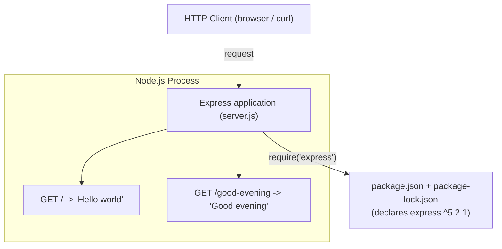

# Technical Specification

# 0. Agent Action Plan

## 0.1 Intent Clarification

This sub-section restates the user's request in precise technical terms, surfaces the implicit requirements the request entails, and maps each requirement to a concrete implementation action. A pivotal repository finding shapes the entire plan and is stated explicitly here so that no downstream agent misinterprets the starting point.

### 0.1.1 Core Feature Objective

Based on the prompt, the Blitzy platform understands that the new feature requirement is to **introduce the Express.js web framework into the project and expose an additional HTTP endpoint that returns the response "Good evening", while preserving the original endpoint that returns "Hello world".**

The feature requirements, restated with enhanced clarity, are:

- **FR-1 — Adopt Express.js:** Add the Express.js framework as a project dependency and use it as the HTTP layer that serves all routes. The user phrased this as "add expressjs into the project".
- **FR-2 — Preserve the existing greeting endpoint:** Continue to serve an HTTP `GET` route whose response body is exactly `Hello world`. The user phrased this as "node js server hosting one endpoint that returns the response 'Hello world'".
- **FR-3 — Add a new greeting endpoint:** Expose a second HTTP `GET` route whose response body is exactly `Good evening`. The user phrased this as "add another endpoint that return the reponse of 'Good evening'".
- **FR-4 — Single application surface:** Both routes are served by a single Express application instance bound to a configurable TCP port.

> **CRITICAL REPOSITORY-STATE FINDING (shapes the whole plan):** The user describes "a tutorial of node js server hosting one endpoint that returns 'Hello world'" as if it already exists. However, the repository at the current commit contains **no application code at all** — its entire tracked tree is a single `README.md` whose only content is the heading `# Artifact1` [README.md:L1], plus Git metadata (single commit `062a0e9` "Initial commit"). This is independently corroborated by the Technical Specification: there is no dependency manifest and no framework configured [Technical Specification §1.2.2.3], the Feature Catalog has zero entries [Technical Specification §2.2.1], and Express is explicitly listed among frameworks that are "Not declared" with "No `package.json`, no framework scaffold" [Technical Specification §3.3.1]. **Therefore the "Hello world" baseline the user references does not yet exist and must be materialized as part of this work.** The Blitzy platform interprets the request as: *create the Node.js + Express server that hosts the original `Hello world` endpoint AND the new `Good evening` endpoint.*

Implicit requirements and prerequisites detected (none stated by the user, all necessary to deliver a working feature):

- **A dependency manifest must be created** — `package.json` is required to declare Express as a dependency and to define a start script; none exists today [Technical Specification §1.2.2.3].
- **A lockfile must be generated** — running `npm install` produces `package-lock.json` and the `node_modules/` tree for reproducible installs.
- **An application entry point must be created** — a `server.js` file to instantiate the Express app, register both route handlers, and start listening.
- **`node_modules/` must be excluded from version control** — a `.gitignore` is required so installed dependencies are not committed.
- **Documentation must be updated** — `README.md` should explain how to install and run the server and list both endpoints.
- **Route paths must be chosen** — the user supplied the response *strings* but not the URL *paths*; the plan adopts reasoned defaults (`GET /` for "Hello world", `GET /good-evening` for "Good evening") and flags them as the one point requiring user confirmation if different paths are preferred.

Feature dependencies and prerequisites: a Node.js runtime (v18 or newer, satisfied by the environment's Node.js v22.22.2) and npm (present at v11.1.0) are the only prerequisites; there are no upstream feature dependencies because this is the project's first feature.

### 0.1.2 Special Instructions and Constraints

- **Exact response strings (verbatim).** The response bodies must be exactly as supplied. These are preserved here without modification:
  - User Example: `Hello world`
  - User Example: `Good evening`
- **Backward compatibility.** The original `Hello world` behavior must remain available after the change; adding Express must not remove or alter the existing greeting.
- **Express as the HTTP layer.** The directive "add expressjs into the project" means Express must own request routing and responses. Where a raw Node `http` server would otherwise be used, the Express application supersedes it so that both endpoints are served through Express.
- **Tutorial simplicity.** The user frames this as a tutorial. The implementation must remain minimal, idiomatic, and beginner-friendly — a single entry-point file with two clearly named route handlers, no premature abstraction, and no unrequested middleware or tooling.
- **Web search requirements.** No external research is required for the core logic (basic Express routing is well-established). The only external lookup needed was confirming the current published Express version and its Node engine requirement, which was performed against the npm registry (see Section 0.2.2).

### 0.1.3 Technical Interpretation

These feature requirements translate to the following technical implementation strategy:

| Requirement | Technical Action |
|-------------|------------------|
| FR-1 — Adopt Express.js | To add Express, we will **create** `package.json` declaring `express` as a dependency and run `npm install`, which **generates** `package-lock.json` and `node_modules/`. |
| FR-2 — Preserve "Hello world" | To preserve the original greeting, we will **create** a `GET /` handler in `server.js` that responds with the plain-text body `Hello world`. |
| FR-3 — Add "Good evening" | To add the new greeting, we will **create** a `GET /good-evening` handler in `server.js` that responds with the plain-text body `Good evening`. |
| FR-4 — Single application surface | To serve both routes from one app, we will **instantiate** a single Express application in `server.js` and bind it with `app.listen(process.env.PORT || 3000)`. |

In narrative form: *To stand up the feature, we will create the Express application entry point (`server.js`), declare and install the Express dependency (`package.json` + `package-lock.json`), exclude installed modules from version control (`.gitignore`), and document the two endpoints (`README.md`).* The canonical route map produced by this strategy is:

| Method | Path | Response Status | Content-Type | Response Body |
|--------|------|-----------------|--------------|---------------|
| GET | `/` | 200 | text/plain | `Hello world` |
| GET | `/good-evening` | 200 | text/plain | `Good evening` |

## 0.2 Repository Scope Discovery

This sub-section catalogs every file relevant to the feature: what exists today, what integration points are present, what external research informed the plan, and what must be newly created.

### 0.2.1 Comprehensive File Analysis

The repository's complete tracked working tree was enumerated directly (`find . -type f` excluding `.git/`) and cross-checked with a semantic file search; both confirm a single tracked file.

| Path | Type | Size / Content | Relevance to Feature | Disposition |
|------|------|----------------|----------------------|-------------|
| `README.md` | Documentation | 11 bytes — `# Artifact1` [README.md:L1] | Project landing page; will document the new server | UPDATE |
| `.git/` | VCS metadata | Single commit `062a0e9` | Not source; never modified | OUT OF SCOPE |

A semantic search for "Node.js server entry point, package.json manifest, or JavaScript HTTP route handlers" returned **zero** results, confirming there is no pre-existing server, manifest, or route handler to extend. This matches the Technical Specification's component inventory of zero services, libraries, and configuration artifacts [Technical Specification §1.2.2.2].

**Integration point discovery.** Because the project is greenfield, there are **no existing integration points to modify**. The conventional touchpoints an ADD FEATURE plan would normally update are all absent:

- API endpoints / route registries — none exist; routes will be defined fresh in `server.js`.
- Database models / migrations — none exist; the feature requires no persistence.
- Service classes / business-logic modules — none exist; greeting responses are static strings.
- Controllers / request handlers — none exist; the two handlers are created inline in `server.js`.
- Middleware / interceptors — none exist and none are required for the two static endpoints.

Consequently, the entire HTTP surface is **new** and self-contained within the application entry point. The target topology after implementation is:



### 0.2.2 Web Search Research Conducted

The core implementation relies on well-established Express routing and does not require best-practice research. The single external verification performed was a version/compatibility lookup against the npm registry to avoid placeholder versions:

- **Express current version:** the npm `latest` dist-tag resolves to `express@5.2.1` (with `latest-4` at `4.22.2`) [npm registry: express dist-tags].
- **Node engine requirement:** `express@5.2.1` declares `engines.node` of `>= 18` [npm registry: express@5.2.1 engines], which is satisfied by the environment's Node.js v22.22.2.
- **License / source of truth:** Express is MIT-licensed; the authoritative API reference is the official documentation at `https://expressjs.com/` [npm registry: express@5.2.1 metadata].

No security-sensitive surface is introduced (two static, unauthenticated `GET` endpoints returning constant strings), so no additional security research was warranted. The basic routing API used here (`app.get`, `res.send`/`res.type`) is identical across Express 4 and 5, so the major-version choice does not affect the implementation.

### 0.2.3 New File Requirements

The following files must be created to deliver the feature. Paths follow the standard single-file Node.js tutorial convention (entry point at the repository root rather than under a `src/` tree, matching the minimal scope).

- **`server.js`** — Express application entry point. Imports Express, instantiates the app, registers the `GET /` ("Hello world") and `GET /good-evening` ("Good evening") handlers, and starts the listener.
- **`package.json`** — npm manifest. Declares project metadata, the `express` dependency, an `engines.node` constraint, and a `start` script (`node server.js`).
- **`package-lock.json`** — generated by `npm install`; pins `express@5.2.1` and its transitive dependency tree for reproducible installs.
- **`.gitignore`** — excludes `node_modules/`, npm debug logs, and `.env` from version control.

New test files (OPTIONAL — not requested by the user; tutorial scope):

- **`test/server.test.js`** — a lightweight smoke test asserting that `GET /` returns `Hello world` and `GET /good-evening` returns `Good evening`. Adopting it would add a dev dependency (e.g., `supertest`) or rely on Node's built-in `node:test` runner.

New configuration files: none beyond `package.json` and `.gitignore`. The feature introduces no environment-specific configuration; the listening port is read from `process.env.PORT` with a default of `3000`, so an `.env` file is unnecessary (though `.env` is pre-emptively git-ignored as good hygiene).

## 0.3 Dependency Inventory and Integration Analysis

This sub-section enumerates the dependency changes the feature introduces and analyzes how the new code integrates with what already exists.

### 0.3.1 Package Registry and Versions

The project currently declares **no dependencies** (no manifest exists) [Technical Specification §1.2.2.3]. This feature introduces exactly one production dependency. Exact names and versions below were verified against the npm registry; no placeholder versions are used.

| Package | Registry | Version | Type | Purpose |
|---------|----------|---------|------|---------|
| `express` | npm (npmjs.com) | `^5.2.1` | Runtime (dependencies) | HTTP web framework providing routing (`app.get`) and response helpers (`res.send` / `res.type`) for the two endpoints |

Supporting version facts:

- The resolved `express` version is `5.2.1` (current npm `latest`); a conservative alternative `4.22.2` is available via the `latest-4` tag if maximum tutorial-era compatibility is preferred. The two-endpoint routing code is identical on both major versions.
- `package.json` will declare `engines.node` of `>=18` to match `express@5`'s own requirement (`engines.node >= 18`); the build environment's Node.js v22.22.2 complies.
- `express` is MIT-licensed.

### 0.3.2 Dependency and Import Updates

**Dependency changes (additions, updates, removals):**

- **Addition:** `express ^5.2.1` is added to `package.json` `dependencies`.
- **Generated artifact:** `package-lock.json` is produced by `npm install`, locking `express@5.2.1` and its transitive tree.
- **Updates / removals:** none — there is no pre-existing manifest, so nothing is upgraded or removed.

**Import updates.** Because the codebase is greenfield, there are **no existing import statements to transform** — the wildcard import-rewrite patterns typical of a refactor do not apply here. The only import introduced by this feature is a single statement in the new entry point:

```javascript
const express = require('express');
```

CommonJS (`require`) is recommended over ES modules for tutorial clarity, which means `package.json` will omit `"type": "module"`. No other source files import the new dependency.

**External reference updates:**

- `README.md` — updated to document installation, the run command, and the two endpoints.
- `package.json` — created as the build manifest (declares the dependency and `start` script).
- CI/CD, Docker, and other config files — none exist and none are added (see Section 0.5.2).

### 0.3.3 Integration Analysis — Existing Code Touchpoints

There are **no existing code touchpoints** to modify. The standard integration targets an ADD FEATURE plan would normally enumerate are confirmed absent in this repository:

| Typical Touchpoint | Present in Repo? | Action |
|--------------------|------------------|--------|
| Application bootstrap (e.g., `src/main.js`, `app.js`) | No | Create `server.js` as the new bootstrap |
| Route registry (e.g., `src/api/routes.js`) | No | Register both routes inline in `server.js` |
| Model exports (e.g., `src/models/index.js`) | No | N/A — feature has no data model |
| Dependency-injection container | No | N/A — no DI needed for static handlers |
| Database schema / migrations | No | N/A — feature requires no persistence |

All integration is therefore **internal to the new `server.js`**, where the wiring sequence is: (a) instantiate the Express app; (b) register the `GET /` handler returning `Hello world`; (c) register the `GET /good-evening` handler returning `Good evening`; (d) bind the listener with `app.listen(process.env.PORT || 3000)`. The only inbound integration with the broader environment is the TCP port the server binds to, which is configurable via the `PORT` environment variable.

## 0.4 Technical Implementation

This sub-section provides the executable, file-by-file plan. Every file listed must be created or modified.

### 0.4.1 File-by-File Execution Plan

| # | Mode | File | Purpose |
|---|------|------|---------|
| 1 | CREATE | `server.js` | Express application entry point: import Express, instantiate app, register both `GET` handlers, start listener |
| 2 | CREATE | `package.json` | npm manifest: metadata, `express ^5.2.1` dependency, `engines.node >=18`, `start` script |
| 3 | CREATE (generated) | `package-lock.json` | Lockfile produced by `npm install`; pins `express@5.2.1` + transitive deps |
| 4 | CREATE | `.gitignore` | Exclude `node_modules/`, npm debug logs, `.env` from version control |
| 5 | UPDATE | `README.md` | Document install/run steps and the two endpoints (preserve the `# Artifact1` identity [README.md:L1]) |
| 6 | CREATE (OPTIONAL) | `test/server.test.js` | Smoke test asserting both endpoint bodies; not requested by the user — include only if test coverage is desired |

Grouped view:

- **Group 1 — Core feature files:** `server.js`, `package.json`
- **Group 2 — Supporting infrastructure:** `package-lock.json` (generated), `.gitignore`
- **Group 3 — Documentation and optional tests:** `README.md`, `test/server.test.js` (optional)

### 0.4.2 Implementation Approach per File

- **`package.json` (CREATE).** Define `name`, `version`, `description`, `main: "server.js"`, a `scripts.start` of `node server.js`, a `dependencies` entry for `express` at `^5.2.1`, and `engines.node` of `>=18`. Omit `"type": "module"` so the entry point uses CommonJS `require`. After authoring, run `npm install` to materialize `node_modules/` and generate the lockfile.

- **`server.js` (CREATE).** Establish the feature foundation in a single idiomatic file. The essential shape (kept deliberately minimal):

```javascript
const express = require('express');
const app = express();
const PORT = process.env.PORT || 3000;
```

Register the preserved baseline route, returning the exact string:

```javascript
app.get('/', (req, res) => res.type('text/plain').send('Hello world'));
```

Register the new feature route, returning the exact string:

```javascript
app.get('/good-evening', (req, res) => res.type('text/plain').send('Good evening'));
```

Finally bind the listener:

```javascript
app.listen(PORT, () => console.log(`Listening on http://localhost:${PORT}`));
```

Using `res.type('text/plain')` guarantees the response body is exactly the user-specified string with an unambiguous content type.

- **`package-lock.json` (CREATE, generated).** Not hand-authored; it is the deterministic output of `npm install` and is committed so installs are reproducible.

- **`.gitignore` (CREATE).** Add `node_modules/`, `npm-debug.log*`, and `.env` so installed dependencies and local environment files are never committed.

- **`README.md` (UPDATE).** Retain the existing `# Artifact1` heading and append: a one-line overview, prerequisites (Node.js v18+), install (`npm install`) and run (`npm start`) instructions, and an endpoint table (`GET /` → `Hello world`; `GET /good-evening` → `Good evening`) with example `curl` invocations.

- **`test/server.test.js` (CREATE, OPTIONAL).** If adopted, export the Express `app` from `server.js` and assert both endpoints return HTTP 200 with the exact bodies using `node:test` + `supertest`.

**Build and validation sequence:** create `package.json` → `npm install` → author `server.js`, `.gitignore` → update `README.md` → start the server (`npm start`) → verify with `curl -s localhost:3000/` (expects `Hello world`) and `curl -s localhost:3000/good-evening` (expects `Good evening`).

**Figma references:** none — the user provided no Figma URLs, so no file references any design source.

### 0.4.3 User Interface Design

**Not applicable.** This feature exposes two HTTP endpoints whose responses are plain-text strings (`Hello world` and `Good evening`). There is no graphical user interface, no HTML/CSS/JavaScript front end, no templating engine, and no component library or design system involved. Accordingly, the Design System Alignment Protocol does not apply and no "Design System Compliance" sub-section is produced. The only "interface" is the HTTP contract documented in the route map (Section 0.1.3), consumable by any HTTP client such as a browser or `curl`.

## 0.5 Scope Boundaries

This sub-section draws an unambiguous boundary around the work, listing every file in scope and explicitly naming what is excluded.

### 0.5.1 Exhaustively In Scope

The complete set of files and changes covered by this plan:

- **Application source:**
  - `server.js` — CREATE (Express app, `GET /`, `GET /good-evening`, listener)
- **Dependency manifest and lockfile:**
  - `package.json` — CREATE (declares `express ^5.2.1`, `start` script, `engines.node >=18`)
  - `package-lock.json` — CREATE (generated by `npm install`)
- **Version-control hygiene:**
  - `.gitignore` — CREATE (`node_modules/`, `npm-debug.log*`, `.env`)
- **Documentation:**
  - `README.md` — UPDATE (install/run instructions and endpoint table; preserves `# Artifact1` [README.md:L1])
- **Dependency change:**
  - Add `express ^5.2.1` from the npm registry
- **Tests (OPTIONAL — only if test coverage is adopted):**
  - `test/server.test.js` and the pattern `test/**/*.test.js` — CREATE; would add a dev dependency such as `supertest`

Wildcard note: the project is intentionally single-file, so few group patterns apply. The only meaningful wildcard is `test/**/*.test.js` for the optional test suite. The application entry point lives at the repository root (`server.js`) per standard minimal Node.js tutorial convention rather than under a `src/` tree.

### 0.5.2 Explicitly Out of Scope

The following are deliberately excluded because they are neither requested nor required to deliver the two endpoints:

- A parallel raw Node `http`-module server kept alongside Express — Express becomes the sole HTTP layer; any raw-`http` baseline is superseded, not retained.
- Databases, ORMs, persistence layers, and migrations — the greetings are static strings.
- Authentication, authorization, sessions, and security middleware (e.g., `helmet`, `cors`) beyond framework defaults.
- Additional endpoints beyond `GET /` and `GET /good-evening`, and any non-`GET` methods.
- Front-end / UI, HTML templating, static asset serving, and any design system.
- CI/CD pipelines, `Dockerfile`, container orchestration, and Infrastructure-as-Code.
- TypeScript migration and linter/formatter configuration (ESLint, Prettier).
- Logging, metrics, and tracing instrumentation.
- Rewriting `README.md` beyond documenting the new server and endpoints; the `# Artifact1` project identity is preserved.
- Git internals and the repository's remote URL (the configured remote embeds an access token and must never be modified, reproduced, or exposed).
- Any unrelated refactoring or performance optimization.

These exclusions are consistent with the Technical Specification's current out-of-scope posture, which lists application source, APIs, testing, and CI/CD as absent rather than permanently excluded [Technical Specification §1.3.3.1] — this feature begins to populate that space only to the extent the two endpoints require.

## 0.6 Rules for Feature Addition

No explicit implementation rules were supplied by the user — the project's rule set was empty and no setup instructions or environments were attached. In the absence of user-mandated rules, no additional files are forced into scope beyond those derived from the feature request itself, and the following constraints — drawn directly from the prompt and the repository's minimal state — govern the implementation:

- **Preserve response strings verbatim.** The endpoints must return exactly `Hello world` and `Good evening`, character-for-character, with no added punctuation, formatting, or wrapping.
- **Maintain backward compatibility.** The original `Hello world` endpoint must remain functional after Express is introduced; the change is additive with respect to existing behavior.
- **Express owns the HTTP layer.** Per the directive "add expressjs into the project", all routing and responses flow through a single Express application instance.
- **Honor the tutorial intent.** Keep the implementation minimal and idiomatic: one entry-point file, two clearly named handlers, no premature abstraction, and no middleware or tooling that the two endpoints do not require.
- **Pin real dependency versions.** Declare `express` at a verified published version (`^5.2.1`) and commit the generated `package-lock.json`; never use placeholder versions such as `latest` or `1.0.0`.
- **Respect the runtime contract.** Declare `engines.node >=18` to match Express 5's requirement; the build environment's Node.js v22.22.2 satisfies it.
- **Do not commit installed modules or secrets.** `node_modules/` and `.env` must be git-ignored.
- **Confirm route paths if different ones are desired.** The user specified response strings but not URL paths; this plan adopts `GET /` and `GET /good-evening` as reasoned defaults and treats a different desired path as the only open clarification.

## 0.7 Attachments

No attachments were provided with this request.

- **File attachments (PDFs, images, documents):** none.
- **Figma screens (frames / URLs):** none.

Because no design files or reference documents accompany the prompt, all design and interface decisions in this plan derive solely from the user's textual request and the verified repository state. The feature also requires no visual design input, as its outputs are plain-text HTTP responses (see Section 0.4.3).

