# Technical Specification

# 1. Introduction

## 1.1 EXECUTIVE SUMMARY

### 1.1.1 Project Overview

This Technical Specification documents the repository identified as **`Artifact1`**, hosted on GitHub under the namespace `ShaliniTest-maker/Artifact1`. As of the most recent verified state of the repository (initial commit `062a0e9480ac957eb1d519f39813240f0798ea86`, dated May 28, 2026), the project exists in a **pre-implementation / initialization state**. The entirety of the tracked codebase consists of a single Markdown file (`README.md`, 11 bytes) containing only a level-1 heading that reads `# Artifact1`.

Accordingly, this Introduction is written as a faithful, evidence-grounded baseline document. It records the current state of the artifact, scopes what is verifiably present, and explicitly identifies the system-level information that is not yet defined in the repository. It does not project, infer, or fabricate business purpose, technical architecture, feature sets, user personas, or scope boundaries beyond what the repository's contents factually support.

| Attribute | Verified Value |
|-----------|----------------|
| Artifact Name | `Artifact1` |
| Repository Host | GitHub |
| Remote Origin | `https://github.com/ShaliniTest-maker/Artifact1.git` |
| Default Branch | `main` |
| Commit History Depth | 1 commit (initial commit only) |
| Tracked File Count | 1 (`README.md`) |
| Initial Commit Date | May 28, 2026 |
| Implementation Status | Pre-implementation / placeholder |

### 1.1.2 Core Business Problem

No business problem, opportunity statement, requirements brief, vision document, or product description has been committed to the repository. The single tracked file (`README.md`) does not contain a project description, purpose statement, motivation, or problem framing of any kind.

As such, the core business problem cannot be authoritatively documented from repository evidence. This information is expected to be supplied through subsequent commits, accompanying product documentation, or a future revision of this specification once the project's product owner provides those inputs.

### 1.1.3 Key Stakeholders and Users

The only stakeholder identifiable from repository evidence is the **initial committer / repository owner**, captured in Git metadata as `ShaliniTest-maker <shaliniguptatest@gmail.com>`. No user personas, target audience definitions, role descriptions, access tiers, or organizational stakeholder lists are present in the repository.

| Stakeholder Role | Identifier | Source of Evidence | Status |
|------------------|------------|--------------------|--------|
| Repository Owner / Initial Committer | `ShaliniTest-maker` | Git commit metadata | Confirmed |
| End Users / Consumer Personas | — | Not defined in repository | Undocumented |
| Operations / Maintenance Stakeholders | — | Not defined in repository | Undocumented |
| Business Sponsors | — | Not defined in repository | Undocumented |

### 1.1.4 Expected Business Impact and Value Proposition

No business case, KPI definition, return-on-investment estimate, value proposition statement, or success narrative has been committed to the repository. The Technical Specification will be updated to reflect the project's intended business impact once the repository advances beyond its current initialization state and the necessary product-level inputs are provided.

## 1.2 SYSTEM OVERVIEW

### 1.2.1 Project Context

#### 1.2.1.1 Business Context and Market Positioning

No business context, market positioning, competitive analysis, target segment definition, or domain-of-application statement is present in the repository as of the current commit. The `README.md` file does not include narrative content beyond the artifact's name heading.

#### 1.2.1.2 Current System Limitations

The repository does not reference any predecessor system, legacy platform, or system being replaced or upgraded. No migration context, deprecation list, or limitations analysis is committed.

Because no operational system exists at this stage, the concept of "current system limitations" does not directly apply. The most accurate statement that can be made is that **the project itself has no implementation**, and consequently has no runtime behavior, no exposed interfaces, and no operational characteristics that could be measured against any baseline.

#### 1.2.1.3 Integration with Existing Enterprise Landscape

No integrations are defined, configured, declared, or implemented in the repository. Specifically, the following categories of integration evidence are confirmed absent:

| Integration Category | Expected Evidence | Status in Repository |
|----------------------|-------------------|----------------------|
| External API Clients | OpenAPI specs, SDK manifests | Not present |
| Database Connections | ORM models, migration files, connection strings | Not present |
| Message Brokers / Queues | Producer/consumer configuration | Not present |
| Identity / Auth Providers | OIDC/SAML configuration, IAM policies | Not present |
| Observability Endpoints | Telemetry exporters, logging sinks | Not present |
| Build / CI Integrations | Pipeline definitions | Not present |

### 1.2.2 High-Level Description

#### 1.2.2.1 Primary System Capabilities

The repository in its current state exposes **no system capabilities**. There is no executable code, no service entry point, no command-line interface, no library API, and no user interface. The only artifact present is documentation scaffolding consisting of the project name heading.

#### 1.2.2.2 Major System Components

No system components exist in the repository. The complete component inventory is summarized below:

| Component Type | Count | Notes |
|----------------|-------|-------|
| Services / Applications | 0 | None implemented |
| Libraries / Modules | 0 | None implemented |
| Configuration Artifacts | 0 | None present |
| Build Artifacts | 0 | None present |
| Documentation Artifacts | 1 | `README.md` (heading only) |

#### 1.2.2.3 Core Technical Approach

No technical approach, architectural pattern, technology stack, programming language, runtime environment, framework selection, or design decision has been declared in the repository. Specifically:

- **No language is established.** No source files in any programming language are tracked.
- **No dependency manifests exist** (no `package.json`, `requirements.txt`, `pom.xml`, `Cargo.toml`, `go.mod`, `pyproject.toml`, `Gemfile`, or equivalent).
- **No build tooling is configured** (no `Makefile`, `Dockerfile`, `docker-compose.yml`, or similar).
- **No CI/CD pipeline definitions are committed** (no `.github/workflows/`, `.gitlab-ci.yml`, `Jenkinsfile`, etc.).

The technical approach is therefore an open decision space to be defined when implementation begins.

#### 1.2.2.4 Current Repository Topology

The entire working tree of the repository is illustrated below for unambiguous reference.

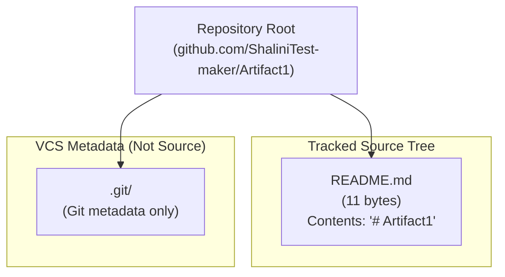

### 1.2.3 Success Criteria

#### 1.2.3.1 Measurable Objectives

No measurable objectives are documented in the repository. This subsection will be populated when product objectives are formally defined and committed as part of the project's evolving documentation.

#### 1.2.3.2 Critical Success Factors

No critical success factors are documented. The only critical factor that can be observed at the current stage is the prerequisite that the repository must be advanced beyond its placeholder state before any meaningful success criteria can be defined or evaluated.

#### 1.2.3.3 Key Performance Indicators (KPIs)

No KPIs, service-level objectives (SLOs), service-level agreements (SLAs), or performance targets have been committed to the repository. The KPI catalog will be defined in a future revision of this specification once the system's purpose and operational targets are established.

| KPI Category | Defined? | Source |
|--------------|----------|--------|
| Functional / Business KPIs | No | Not present in repository |
| Technical / Performance KPIs | No | Not present in repository |
| Reliability / Availability SLOs | No | Not present in repository |
| Quality / Defect KPIs | No | Not present in repository |

## 1.3 SCOPE

### 1.3.1 In-Scope

This subsection enumerates only those elements that are factually present in the repository as of the current commit. No speculative or aspirational items are included.

#### 1.3.1.1 Core Features and Functionalities

The current repository's in-scope content is limited to a single documentation artifact.

| In-Scope Item | Description | Evidence |
|---------------|-------------|----------|
| Project Naming | Establishes the artifact's identifier as "Artifact1" | `README.md` heading |
| Version Control Initialization | Initial Git commit and remote configuration | Single commit on `main` |
| Repository Hosting | Project hosted on GitHub | Remote origin URL |

No primary user workflows are implemented; therefore none can be enumerated as in scope.

#### 1.3.1.2 Primary User Workflows

No user workflows exist at the current commit. The repository does not yet support any interactive, programmatic, or batch workflow.

#### 1.3.1.3 Essential Integrations

No integrations are currently in scope because none are present in the repository (see Section 1.2.1.3).

#### 1.3.1.4 Key Technical Requirements

The only technical requirement that can be derived from current repository evidence is that the project must use **Git** as its version-control system and **GitHub** as its remote hosting platform, as established by the existing repository configuration. All other technical requirements (language, runtime, framework, persistence, deployment target) remain undefined.

### 1.3.2 Implementation Boundaries

Because no system implementation exists, traditional implementation boundaries cannot be drawn against functional or architectural components. The boundary table below captures the boundaries that are defensible from current evidence.

| Boundary Dimension | Current Definition | Notes |
|--------------------|--------------------|-------|
| System Boundary | The Git repository `Artifact1` and its tracked contents | Only `README.md` is tracked |
| User Groups Covered | Repository contributors only (currently one identified) | No end-user roles defined |
| Geographic / Market Coverage | Undefined | No targeting documented |
| Data Domains Included | None | No data model, schema, or data sources defined |
| Deployment Environments | None | No deployment artifacts present |

### 1.3.3 Out-of-Scope

The following categories are explicitly out of scope for the **current** state of this Technical Specification because the underlying artifacts have not been created. They are not necessarily out of scope for the project's future evolution—rather, they cannot be documented here because no evidence exists to support such documentation.

#### 1.3.3.1 Explicitly Excluded Features and Capabilities

| Excluded Category | Reason for Exclusion |
|-------------------|----------------------|
| Application Source Code | No source files tracked in the repository |
| Application Programming Interfaces (APIs) | No API definitions, schemas, or contracts present |
| User Interfaces (Web, Mobile, Desktop, CLI) | No UI assets or framework configuration present |
| Authentication & Authorization Subsystems | No identity, IAM, or session management code present |
| Persistence Layers (Databases, Caches, File Stores) | No schemas, migrations, or storage configuration present |
| Messaging / Event Streaming | No broker configuration or message contracts present |
| Background Processing / Scheduling | No worker, job, or scheduler definitions present |
| Observability (Logging, Metrics, Tracing) | No telemetry instrumentation present |
| Security Controls (Encryption, Secrets Management) | No security configuration or controls present |
| Testing (Unit, Integration, End-to-End, Performance) | No tests or test frameworks present |
| Continuous Integration / Continuous Delivery | No pipeline configuration present |
| Infrastructure-as-Code | No IaC manifests (Terraform, CloudFormation, etc.) present |
| Containerization / Orchestration | No `Dockerfile`, Kubernetes manifests, or Helm charts present |
| Documentation Beyond Project Name | No additional documentation files (`CONTRIBUTING`, `LICENSE`, `CHANGELOG`, `docs/`, etc.) present |

#### 1.3.3.2 Future-Phase Considerations

All functional and non-functional system capabilities are deferred to future phases. Future revisions of this specification, written against subsequent commits that introduce implementation artifacts, will document these capabilities as they become evidence-supported.

#### 1.3.3.3 Integration Points Not Covered

All external integrations are not covered by this Technical Specification because none have been declared in the repository. This includes (but is not limited to) third-party APIs, enterprise systems, identity providers, payment processors, analytics platforms, and inter-service communication channels.

#### 1.3.3.4 Unsupported Use Cases

Because the repository implements no use cases, **all** use cases are presently unsupported. This is a statement of current implementation status, not an architectural decision to exclude any specific use case from the project's eventual scope.

## 1.4 DOCUMENT POSITIONING AND VALIDITY

### 1.4.1 Authoritative Source

This Introduction is grounded exclusively in the verified contents of the `Artifact1` repository at commit `062a0e9480ac957eb1d519f39813240f0798ea86`. Where information is absent from the repository, this document explicitly says so rather than inferring, projecting, or speculating about the project's eventual nature.

### 1.4.2 Maintenance Expectations

This Technical Specification is expected to be revised in lockstep with the repository's evolution. Each subsequent commit that introduces meaningful project content (a product description, a dependency manifest, source files, configuration, etc.) should trigger a corresponding revision of this Introduction so that the document's stated scope and context remain synchronized with reality.

### 1.4.3 Reader Guidance

Stakeholders reading this specification should interpret all "not present" / "not defined" / "undocumented" notations as **current-state observations**, not as permanent product decisions. They reflect the fact that the project has not yet committed the underlying material, and they are expected to be replaced with substantive content as the project develops.

## 1.5 REFERENCES

### 1.5.1 Files Examined

- `README.md` — The single tracked file in the repository. Contents verified to be exactly `# Artifact1` (11 bytes). Used to establish the artifact's name and to confirm the absence of additional project context.

### 1.5.2 Folders Examined

- `/` (repository root) — Confirmed to contain exactly one direct child (`README.md`) and no subfolders. Used to verify the complete absence of source-code directories, configuration directories, documentation directories, and test directories.

### 1.5.3 Version Control Artifacts Inspected

- Git commit history (`git log`) — Confirmed a single commit (`062a0e9480ac957eb1d519f39813240f0798ea86`) on the `main` branch, authored by `ShaliniTest-maker <shaliniguptatest@gmail.com>` on May 28, 2026.
- Git tree listing (`git ls-tree -r HEAD`) — Confirmed `README.md` is the only tracked file.
- Git remote configuration (`git remote -v`) — Confirmed origin points to `https://github.com/ShaliniTest-maker/Artifact1.git`.
- Git reflog (`git reflog`) — Confirmed no hidden branches, tags, or alternative histories exist.

### 1.5.4 Searches Performed

- Semantic file search: `"project configuration manifest package dependencies"` — Empty result; confirmed absence of dependency manifests.
- Semantic file search: `"source code implementation entry point"` — Empty result; confirmed absence of source files.
- Semantic folder search: `"application source modules"` — Empty result; confirmed absence of source directories.
- Filesystem-wide search for `.blitzyignore` — Empty result; confirmed no ignore rules exclude hidden content.

### 1.5.5 Cross-Referenced Technical Specification Sections

No prior sections of this Technical Specification were available for cross-reference at the time of authoring (the available section heading list was empty). This Introduction will need to be reconciled with later sections as they are produced.

# 2. Product Requirements

## 2.1 Authoring Basis for This Section

### 2.1.1 Evidence-Only Posture

This Product Requirements section is authored under the same evidence-only constraints established in Section 1.4.1 ("Authoritative Source"). Every statement below is grounded exclusively in the verified contents of the `Artifact1` repository at commit `062a0e9480ac957eb1d519f39813240f0798ea86`. Where information is absent from the repository, this section explicitly records that absence rather than inferring, projecting, or fabricating product requirements. This is consistent with the reader-guidance principle in Section 1.4.3 that all "not present" / "not defined" notations are **current-state observations**, not permanent product decisions.

### 2.1.2 Scope of Section 2

Section 2 is intended to break the product into discrete, testable features, each with documented metadata, functional requirements, acceptance criteria, dependencies, and implementation considerations. The author of Section 2 has determined—on the basis of the inventory established in Sections 1.1–1.3—that none of the underlying inputs required to populate these subsections have been committed to the repository. The remainder of this section therefore documents the **status of each prescribed subsection** rather than fabricating feature content.

### 2.1.3 Applicability of Prompt-Level Filtering Guidance

The Product Requirements prompt explicitly directs that only sections and items "actually relevant to this system, based on your analysis of its requirements" should be included, and that no features, requirements, or relationships should be invented. Given that the repository's tracked surface area consists of a single 11-byte Markdown file containing only the heading `# Artifact1` (Section 1.1.1, Section 1.5.1), the rigorous application of that filtering guidance results in empty catalogs across all feature-bearing subsections. Those subsections are nonetheless retained below—each with an explicit status, an evidence reference, and a forward-looking note—so that the reader can verify the absence rather than infer it from omission.

### 2.1.4 Inherited Findings from Section 1

The following pre-established findings from Sections 1.1–1.5 are load-bearing for Section 2 and are not re-derived here:

| Source Subsection | Established Finding | Relevance to Section 2 |
|-------------------|---------------------|------------------------|
| 1.1.1 | Repository is in pre-implementation state; only `README.md` (11 bytes) is tracked | No features exist to catalog |
| 1.1.2 | No business problem or product description has been committed | No business value can be ascribed to any feature |
| 1.2.2.1 | Repository exposes no system capabilities (no code, no API, no UI, no CLI) | No functional behavior can be specified |
| 1.2.2.2 | Component inventory: 0 services, 0 libraries, 0 configuration artifacts, 0 build artifacts | No technical context exists for any feature |
| 1.2.2.3 | No language, framework, dependency manifest, or build tooling is established | No implementation considerations can be derived |
| 1.3.1.1 | The only in-scope items are project naming, VCS initialization, and repository hosting | No user-facing features exist |
| 1.3.1.2 | No user workflows exist at the current commit | No interactive requirements can be specified |
| 1.3.3.1 | Application source code, APIs, UIs, authentication, persistence, messaging, observability, security controls, testing, CI/CD, IaC, and containerization are all explicitly out of scope at the current commit | The feature space is uniformly empty |
| 1.4.1 | Document grounded exclusively in commit `062a0e9480ac957eb1d519f39813240f0798ea86` | Anchors Section 2 to the same evidence basis |

## 2.2 Feature Catalog

### 2.2.1 Catalog Status

The Feature Catalog for `Artifact1` at the current commit contains **zero entries**. No business capabilities, user-facing features, system features, or background services exist in the repository. This finding is a direct consequence of Section 1.2.2.1 ("Primary System Capabilities") and Section 1.2.2.2 ("Major System Components"), which together establish that the repository exposes no executable behavior of any kind.

### 2.2.2 Feature Metadata Inventory

The following table is the canonical Feature Catalog for the current repository state. It is intentionally empty, in compliance with the prompt's directive not to invent features. Speculative or placeholder feature IDs (`F-001`, `F-002`, etc.) representing future capabilities have been deliberately omitted because no committed evidence supports them.

| Feature ID | Feature Name | Category | Status |
|------------|--------------|----------|--------|
| *(none)* | *(none)* | *(none)* | No features committed to repository |

### 2.2.3 Per-Feature Description Inventory

Because the catalog above contains no entries, no per-feature Description records (Overview, Business Value, User Benefits, Technical Context) can be authored. Each of these dimensions is constrained as follows by the inherited findings from Section 1:

| Description Dimension | Status | Constraining Evidence |
|------------------------|--------|-----------------------|
| Overview | Not authorable | No feature exists to describe (Section 1.2.2.1) |
| Business Value | Not authorable | No business problem or value proposition is committed (Section 1.1.2, Section 1.1.4) |
| User Benefits | Not authorable | No end-user personas are defined (Section 1.1.3) |
| Technical Context | Not authorable | No language, framework, or technical approach is declared (Section 1.2.2.3) |

### 2.2.4 Per-Feature Dependency Inventory

No feature-level dependencies can be enumerated because no features exist. The four dependency dimensions prescribed by the prompt are addressed below for completeness.

| Dependency Dimension | Status | Constraining Evidence |
|----------------------|--------|-----------------------|
| Prerequisite Features | Not applicable | No features exist to have prerequisites |
| System Dependencies | Not applicable | No runtime, framework, or platform is selected (Section 1.2.2.3) |
| External Dependencies | Not applicable | No third-party services or libraries are referenced (Section 1.2.1.3) |
| Integration Requirements | Not applicable | No integrations are declared (Section 1.2.1.3) |

### 2.2.5 Priority and Status Distribution

Because the catalog is empty, the distribution of priorities (Critical/High/Medium/Low) and lifecycle statuses (Proposed/Approved/In Development/Completed) across features is also empty. No baseline can be established at this commit.

## 2.3 Functional Requirements

### 2.3.1 Functional Requirements Status

No functional requirements are committed to the repository. No requirement descriptions, acceptance criteria, input parameters, output specifications, performance criteria, data requirements, validation rules, business rules, security requirements, or compliance requirements have been documented anywhere in the tracked source tree (Section 1.5.1, Section 1.5.2).

### 2.3.2 Functional Requirements Table

The following is the canonical Functional Requirements Table for the current commit. It is intentionally empty in compliance with the evidence-only posture from Section 1.4.1.

| Requirement ID | Linked Feature | Priority | Status |
|----------------|----------------|----------|--------|
| *(none)* | *(none)* | *(none)* | No requirements committed to repository |

### 2.3.3 Technical Specification Coverage by Dimension

Each technical-specification dimension prescribed by the prompt is enumerated below with its current evidence basis. The intent of this table is to make the absences testable: any future contribution that introduces evidence in any row should trigger a revision of the corresponding row from "Not present" to a substantive specification.

| Specification Dimension | Coverage Status | Constraining Evidence |
|-------------------------|-----------------|-----------------------|
| Input Parameters | Not present | No API, CLI, or UI surface exists (Section 1.2.2.1) |
| Output / Response | Not present | No service or command entry point exists (Section 1.2.2.1) |
| Performance Criteria | Not present | No KPIs, SLOs, or SLAs are committed (Section 1.2.3.3) |
| Data Requirements | Not present | No data domains or persistence layer defined (Section 1.3.2, Section 1.3.3.1) |

### 2.3.4 Validation Rule Coverage by Dimension

| Validation Dimension | Coverage Status | Constraining Evidence |
|----------------------|-----------------|-----------------------|
| Business Rules | Not present | No business problem or rule set is committed (Section 1.1.2) |
| Data Validation | Not present | No data model or schema exists (Section 1.3.2) |
| Security Requirements | Not present | No security controls are configured (Section 1.3.3.1) |
| Compliance Requirements | Not present | No regulatory or compliance context is declared (Section 1.3.3.1) |

### 2.3.5 Acceptance-Criteria Posture

In the absence of features and requirements, acceptance criteria cannot be authored. When feature content is later committed, each requirement introduced under a future revision of Section 2 should adhere to a testable-acceptance posture (Given/When/Then or equivalent), so that traceability from feature → requirement → acceptance test can be established.

## 2.4 Feature Relationships

### 2.4.1 Relationship Status

Because the Feature Catalog (Section 2.2) contains zero entries, no inter-feature relationships of any kind exist at the current commit. This applies uniformly to all four relationship dimensions prescribed by the prompt: feature dependencies, integration points, shared components, and common services.

### 2.4.2 Feature Dependency Map

No feature dependency graph can be drawn because no features exist. The current dependency map is illustrated below for unambiguous reference.

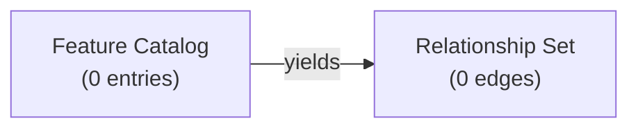

### 2.4.3 Integration Points

No integration points exist between features (none exist to integrate) and no integration points exist between this artifact and any external system. Section 1.2.1.3 has already enumerated, by integration category, the categorical absence of External API Clients, Database Connections, Message Brokers, Identity Providers, Observability Endpoints, and Build/CI Integrations. Section 2 does not re-document those absences; the reader is referred to the table in Section 1.2.1.3.

### 2.4.4 Shared Components

No shared components are tracked in the repository. The component inventory in Section 1.2.2.2 confirms zero services, zero libraries, zero configuration artifacts, and zero build artifacts. The only tracked artifact (`README.md`) is documentation scaffolding, not a reusable component.

### 2.4.5 Common Services

No common services (logging service, authentication service, configuration service, telemetry service, or otherwise) are present in the repository (Section 1.3.3.1).

## 2.5 Implementation Considerations

### 2.5.1 Considerations Status

Per-feature implementation considerations cannot be authored because no features exist. The five consideration dimensions prescribed by the prompt are addressed at the **repository level** below, using only the evidence that is present at the current commit.

### 2.5.2 Technical Constraints

The only technical constraints that can be defended from current repository evidence are those derived from the version-control and hosting configuration recorded in Section 1.3.1.4. All other technical constraints—language, runtime, framework, persistence engine, deployment target—remain undefined.

| Constraint Category | Established Value | Source |
|----------------------|-------------------|--------|
| Version-Control System | Git | Existence of `.git/` and a recorded commit on `main` (Section 1.1.1) |
| Remote Hosting Platform | GitHub | Remote origin `https://github.com/ShaliniTest-maker/Artifact1.git` (Section 1.1.1) |
| Default Branch | `main` | Verified branch configuration (Section 1.1.1) |
| All Other Technical Constraints | Undefined | No language, framework, or platform selected (Section 1.2.2.3) |

### 2.5.3 Performance Requirements

No performance requirements are defined. No latency, throughput, concurrency, or resource-utilization targets have been committed to the repository (Section 1.2.3.3).

### 2.5.4 Scalability Considerations

No scalability considerations are defined. No horizontal-scaling model, vertical-scaling model, sharding strategy, partitioning strategy, or capacity-planning input has been committed to the repository. The system does not yet exist as a runtime, so scalability has no current operational meaning (Section 1.2.1.2).

### 2.5.5 Security Implications

No security implications are defined. No authentication model, authorization model, data-classification scheme, encryption-at-rest configuration, encryption-in-transit configuration, secrets-management strategy, or threat model has been committed to the repository (Section 1.3.3.1). Future Section 2 revisions should populate this subsection as security-relevant features are introduced.

### 2.5.6 Maintenance Requirements

No feature-specific maintenance requirements are defined. The single repository-level maintenance requirement that can be derived from current evidence is consistent with Section 1.4.2: the Technical Specification (including this section) is expected to be revised in lockstep with each commit that introduces meaningful project content. Beyond that, no support model, no on-call expectation, no SLA, and no operational runbook is committed.

## 2.6 Traceability Matrix

### 2.6.1 Matrix Status

The traceability matrix for `Artifact1` at the current commit contains **zero rows**. With zero features (Section 2.2.2) and zero requirements (Section 2.3.2), there is no feature-to-requirement, requirement-to-acceptance-test, or feature-to-component traceability to establish.

### 2.6.2 Empty Traceability Matrix

The empty matrix is presented below as a baseline structure that will be populated when feature material is introduced.

| Requirement ID | Linked Feature ID | Acceptance Evidence | Verification Status |
|----------------|-------------------|---------------------|---------------------|
| *(none)* | *(none)* | *(none)* | Not applicable at current commit |

### 2.6.3 Future Traceability Expectations

When the repository advances beyond its placeholder state, each future row of this matrix should:

- Link a unique requirement (format `F-XXX-RQ-YYY`) to its parent feature (format `F-XXX`).
- Reference the specific acceptance test or verification artifact that exercises the requirement.
- Record the verification status (Not Verified / In Progress / Verified) at the time of each Technical Specification revision.

These expectations are documented here so that the trace structure can be established consistently when features are introduced.

## 2.7 Assumptions, Constraints, and Versioning

### 2.7.1 Assumptions

Section 2 makes no assumptions about the eventual nature of the product. In particular, it does not assume that any specific feature (e.g., a web application, a service, a library, a CLI tool, a data pipeline) will be implemented. It assumes only that:

- The repository will continue to use Git for version control (Section 1.3.1.4).
- The repository will continue to be hosted on GitHub (Section 1.3.1.4).
- Future revisions of this section will be authored against future commits in lockstep with the maintenance expectation in Section 1.4.2.

### 2.7.2 Constraints

The single binding constraint on Section 2 is the evidence-only authoring posture inherited from Section 1.4.1. Any feature, requirement, dependency, relationship, or constraint added to this section in the future must be substantiated by a corresponding repository artifact (source file, configuration file, manifest, or committed documentation).

### 2.7.3 Requirement Versioning

No requirement versions exist at the current commit because no requirements exist. Future revisions of this section should adopt a deterministic versioning scheme (e.g., monotonically increasing `F-XXX-RQ-YYY-vN` suffix or equivalent) so that each requirement can be tracked across edits.

## 2.8 Section 2 Lifecycle and Maintenance Expectations

### 2.8.1 Trigger Conditions for Future Revisions

This section should be revised whenever any of the following events occurs in the repository:

| Trigger Event | Expected Section 2 Update |
|---------------|---------------------------|
| First substantive `README.md` content beyond `# Artifact1` | Populate 2.2 Feature Catalog with feature scaffolding |
| First source-code file committed | Populate 2.3 Functional Requirements for that source surface |
| First dependency manifest committed | Update 2.5.2 Technical Constraints with the selected stack |
| First test artifact committed | Populate 2.3.5 Acceptance-Criteria and 2.6 Traceability Matrix |
| First integration declared (config, env, manifest) | Populate 2.4.3 Integration Points |
| First security control committed | Populate 2.5.5 Security Implications |

### 2.8.2 Relationship to Other Specification Sections

Section 2 is downstream of Sections 1.1–1.3, which establish the system's identity, capabilities, components, and scope. Any subsequent specification section that builds on feature definitions (process flows, data design, integration architecture, etc.) is downstream of Section 2. Those downstream sections should remain consistent with Section 2's empty-catalog finding at the current commit and should adopt the same evidence-only posture.

### 2.8.3 Current-State Summary

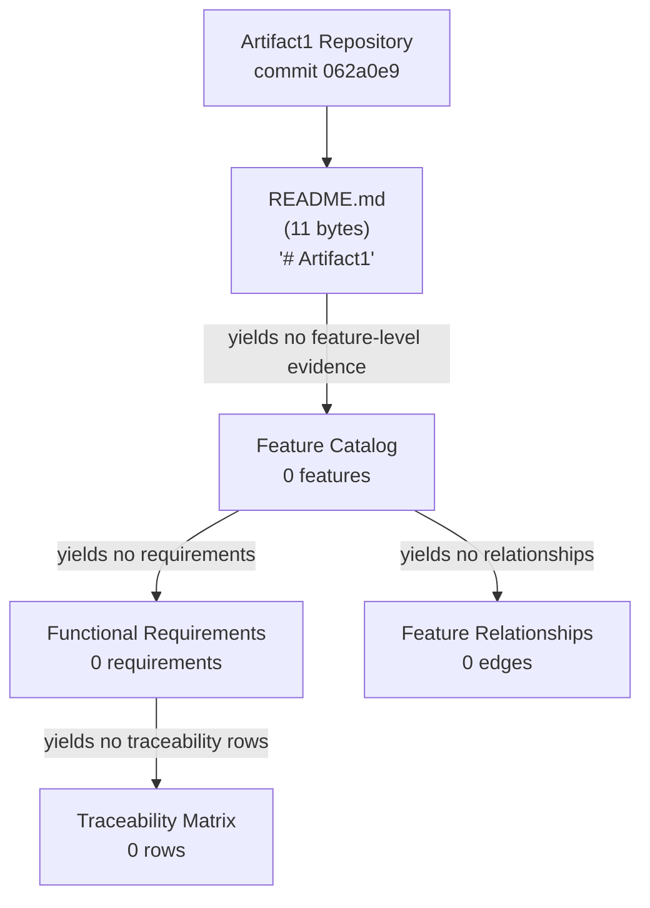

The diagram above captures the deterministic propagation of the repository's pre-implementation state through each prescribed subsection of Section 2. Every downstream node is empty as a direct consequence of the single tracked artifact (`README.md`) carrying no feature-bearing content.

## 2.9 References

### 2.9.1 Files Examined

- `README.md` — The single tracked file in the repository, content `# Artifact1` (11 bytes, no trailing newline). Used to confirm that no feature descriptions, requirement statements, acceptance criteria, or product context have been committed.

### 2.9.2 Folders Examined

- `/` (repository root) — Confirmed to contain exactly one tracked child (`README.md`) and no subfolders. Used to verify the complete absence of source directories, configuration directories, documentation directories, and test directories that could harbor feature or requirement material.

### 2.9.3 Version Control Artifacts Referenced

- Initial Git commit `062a0e9480ac957eb1d519f39813240f0798ea86` on branch `main` — Establishes the single point-in-time evidence basis for Section 2.
- Git remote configuration `https://github.com/ShaliniTest-maker/Artifact1.git` — Establishes the hosting constraint documented in Section 2.5.2.

### 2.9.4 Technical Specification Sections Cross-Referenced

- **Section 1.1 (Executive Summary)** — Pre-implementation state, absence of business problem and stakeholders (anchors Section 2.1.4, 2.2.3).
- **Section 1.2 (System Overview)** — Zero capabilities, zero components, undefined technical approach, integration absences (anchors Section 2.2, 2.3, 2.4, 2.5).
- **Section 1.3 (Scope)** — Minimal in-scope items (project naming, VCS, hosting) and the comprehensive list of out-of-scope categories (anchors Section 2.5.2 and the categorical absences in 2.2–2.4).
- **Section 1.4 (Document Positioning and Validity)** — Authoritative evidence-only posture; current-state interpretation guidance (anchors Section 2.1.1 and 2.7.2).
- **Section 1.5 (References)** — Confirms the exhaustiveness of the prior inspection; supports the assertion that no additional evidence sources were available for Section 2 to consult.

# 3. Technology Stack

## 3.1 AUTHORING BASIS AND TECHNOLOGY STACK STATUS

### 3.1.1 Inheritance of the Evidence-Only Authoring Posture

This Technology Stack section is authored under the same evidence-only posture that governs Sections 1 and 2 of this Technical Specification. As established in Section 1.4.1, this specification "is grounded exclusively in the verified contents of the `Artifact1` repository at commit `062a0e9480ac957eb1d519f39813240f0798ea86`," and "where information is absent from the repository, this document explicitly says so rather than inferring, projecting, or speculating about the project's eventual nature." Section 2.7.2 reinforces this constraint by requiring that any "feature, requirement, dependency, relationship, or constraint added to this section in the future must be substantiated by a corresponding repository artifact."

Consequently, every claim made in Section 3 must trace back to a tracked file, a Git metadata fact, or a previously established cross-reference. No notional, default, or assumed technologies can be enumerated in this section unless and until they appear as committed repository artifacts. Section 1.4.3 instructs readers to "interpret all 'not present' / 'not defined' / 'undocumented' notations as current-state observations, not as permanent product decisions"; that guidance applies in full to the contents of this section.

### 3.1.2 Repository-Wide Technology Status Summary

Section 1.2.2.3 establishes the foundational observation that governs this entire section:

- "**No language is established.** No source files in any programming language are tracked."
- "**No dependency manifests exist** (no `package.json`, `requirements.txt`, `pom.xml`, `Cargo.toml`, `go.mod`, `pyproject.toml`, `Gemfile`, or equivalent)."
- "**No build tooling is configured** (no `Makefile`, `Dockerfile`, `docker-compose.yml`, or similar)."
- "**No CI/CD pipeline definitions are committed** (no `.github/workflows/`, `.gitlab-ci.yml`, `Jenkinsfile`, etc.)."

The component inventory recorded in Section 1.2.2.2 confirms zero services, zero libraries, zero configuration artifacts, and zero build artifacts. The only tracked artifact is a single documentation file: `README.md` (11 bytes, containing the single heading `# Artifact1`). The only technologies established by repository evidence are **Git** (version-control system) and **GitHub** (remote hosting platform), as enumerated in Section 2.5.2's Technical Constraints table.

The table below provides a categorical at-a-glance status for every stack dimension enumerated in the Section 3 prompt:

| Stack Dimension | Status at Current Commit | Authoritative Evidence |
|-----------------|--------------------------|------------------------|
| Programming Languages | Not established | Section 1.2.2.3; no source files of any language tracked |
| Frameworks (Backend, Frontend, Mobile, Native) | Not declared | Section 1.2.2.3; no framework manifests or configuration |
| Supporting Libraries | Not declared | Section 1.2.2.3; no dependency manifests |
| Open-Source Dependencies | Not declared | Section 1.2.2.3; no lock files or package manifests |
| Package Registries (npm, PyPI, Maven, etc.) | Not referenced | No manifests exist that could reference a registry |
| Third-Party External APIs / Integrations | Not integrated | Section 1.2.1.3 absence table |
| Authentication Providers (Auth0, OIDC, SAML) | Not configured | Section 1.2.1.3; Section 1.3.3.1 |
| Monitoring / Observability Tools | Not configured | Section 1.2.1.3; Section 1.3.3.1 |
| Cloud Platform Services (AWS, Azure, GCP) | Not used | Section 1.2.1.3; Section 1.3.3.1 |
| Primary Database | Not configured | Section 1.3.2 Data Domains row; Section 1.3.3.1 |
| Secondary / Specialized Databases | Not configured | Section 1.3.3.1 |
| Caching Solutions (Redis, Memcached) | Not configured | Section 1.3.3.1 |
| Object / File Storage | Not configured | Section 1.3.3.1 |
| Containerization (Docker) | Not configured | Section 1.2.2.3; Section 1.3.3.1 |
| Orchestration (Kubernetes, Helm) | Not configured | Section 1.3.3.1 |
| Infrastructure-as-Code (Terraform, Pulumi) | Not configured | Section 1.3.3.1 |
| CI/CD Pipelines (GitHub Actions, GitLab CI) | Not configured | Section 1.2.2.3; Section 1.3.3.1 |
| Build Tooling (Make, Gradle, webpack, Vite) | Not configured | Section 1.2.2.3 |
| Testing Frameworks | Not configured | Section 1.3.3.1 |
| Version Control System | **Git (established)** | Section 1.1.1; Section 2.5.2 |
| Remote Hosting Platform | **GitHub (established)** | Section 1.1.1; Section 2.5.2 |
| Default Branch | **`main` (established)** | Section 1.1.1; Section 2.5.2 |

### 3.1.3 Relationship to the Prompt's "Default Technology Stack"

The section prompt accompanying this assignment offers a default technology stack (AWS, Docker, Terraform, GitHub Actions, Python/Flask, Auth0, MongoDB, Langchain, React with TypeScript, TailwindCSS, React Native, Swift, Kotlin, Objective-C, ElectronJS). None of these technologies appear in the `Artifact1` repository at the current commit. Adopting any of them as the project's selected stack in this document would violate the binding evidence-only posture inherited from Section 1.4.1 and would directly contradict Section 1.2.2.3's explicit statement that no technical approach, language, framework, or runtime has been declared.

Accordingly, this section does **not** enumerate the default stack as the project's chosen technologies. The default stack remains available as a reference catalog that future revisions of this specification may draw upon when the project's owners commit repository artifacts that select specific technologies. Until then, the only stack items documented as established are Git, GitHub, and the `main` branch convention.

### 3.1.4 Current-State Technology Stack Topology

The following diagram visualizes the repository's current technology surface area, distinguishing established elements (solid edges) from categorically absent elements (dashed "absent" edges). The structure parallels the Section 1.2.2.4 repository topology diagram and the Section 2.8.3 current-state summary style.

```mermaid
flowchart TD
    Repo["Artifact1 Repository<br/>commit 062a0e9 (May 28, 2026)<br/>1 tracked file: README.md (11 bytes)"]

    subgraph Established["Established Technologies (Evidence-Backed)"]
        VCS["Version Control<br/>Git"]
        Host["Remote Hosting<br/>GitHub"]
        Branch["Default Branch<br/>main"]
        Doc["Documentation Format<br/>Markdown (CommonMark)"]
    end

    subgraph Absent["Stack Dimensions Not Yet Established"]
        Lang["Programming Languages<br/>(none declared)"]
        FW["Frameworks & Libraries<br/>(none declared)"]
        Dep["Open Source Dependencies<br/>(no manifests)"]
        TPS["Third-Party Services<br/>(none integrated)"]
        DB["Databases & Storage<br/>(none configured)"]
        DevOps["Build / CI / IaC / Containers<br/>(none configured)"]
        Sec["Security & Auth Providers<br/>(none configured)"]
        Obs["Observability & Monitoring<br/>(none configured)"]
    end

    Repo --> VCS
    Repo --> Host
    Repo --> Branch
    Repo --> Doc
    Repo -.->|"absent"| Lang
    Repo -.->|"absent"| FW
    Repo -.->|"absent"| Dep
    Repo -.->|"absent"| TPS
    Repo -.->|"absent"| DB
    Repo -.->|"absent"| DevOps
    Repo -.->|"absent"| Sec
    Repo -.->|"absent"| Obs
```

---

## 3.2 PROGRAMMING LANGUAGES

### 3.2.1 Language Inventory by Platform/Component

No programming language has been established for any platform or component of the `Artifact1` project. Section 1.2.2.3 records this explicitly: "No language is established. No source files in any programming language are tracked."

| Platform / Component | Selected Language | Version | Evidence |
|----------------------|-------------------|---------|----------|
| Backend / Server-Side Runtime | Not selected | N/A | No `.py`, `.js`, `.ts`, `.java`, `.go`, `.rb`, `.rs`, `.cs`, or `.php` source files tracked |
| Frontend / Browser Runtime | Not selected | N/A | No `.js`, `.ts`, `.jsx`, `.tsx`, `.vue`, `.svelte`, or `.html` source files tracked |
| Mobile / Cross-Platform | Not selected | N/A | No project manifest for iOS, Android, React Native, Flutter, or similar |
| Native iOS | Not selected | N/A | No `.swift`, `.m`, or `.h` source files; no Xcode project |
| Native Android | Not selected | N/A | No `.kt` or `.java` source files; no Gradle/Maven manifest |
| Native macOS / Desktop | Not selected | N/A | No native or Electron project files |
| Data / Scripting | Not selected | N/A | No scripts of any kind tracked |

The only textual format present in the repository is **Markdown**, used solely for the single-line `README.md` file. Markdown is a lightweight markup language for documentation, not a programming language; it does not constitute a runtime, executable, or compilation target.

### 3.2.2 Selection Criteria Status

No language selection criteria have been documented. Because no business problem, functional requirements, performance requirements, scalability requirements, or platform constraints have been committed to the repository (see Sections 1.1.2, 1.2.3, 2.3, 2.5.3, and 2.5.4), there is no basis from which language selection criteria could be defended in this document.

When language selection criteria are eventually committed (as part of an Architecture Decision Record, a design document, or a dependency manifest that implicitly fixes language and version), this subsection should be revised to enumerate those criteria and the resulting choices.

### 3.2.3 Constraints and Dependencies

The only language-relevant constraint that can be defended from current repository evidence is one of negation: there is no language constraint because no language has been selected. Specifically:

- **No runtime version constraint** is published (no `.python-version`, `.nvmrc`, `.tool-versions`, `.ruby-version`, `go.mod` go directive, or equivalent).
- **No compiler/interpreter dependency** is declared (no `package.json` `engines` field, no `pyproject.toml` `requires-python`, no `setup.cfg` `python_requires`).
- **No language-level feature flag** or syntax-level constraint (e.g., TypeScript `strict`, Python `from __future__`, C++ standard version) is committed.

---

## 3.3 FRAMEWORKS & LIBRARIES

### 3.3.1 Core Frameworks

No core framework has been declared for the project. The categorical absence applies across every framework class enumerated in the section prompt and is supported by the Section 1.2.1.3 integration-absence table and Section 1.3.3.1 out-of-scope list.

| Framework Class | Status | Examples That Are Not Configured | Evidence |
|-----------------|--------|----------------------------------|----------|
| Backend Web Framework | Not declared | Flask, Django, FastAPI, Express, NestJS, Spring Boot, Rails, ASP.NET | No backend project files; no framework configuration |
| Frontend Web Framework | Not declared | React, Vue, Angular, Svelte, SolidJS, Preact | No `package.json`, no framework scaffold |
| Mobile / Cross-Platform Framework | Not declared | React Native, Flutter, Ionic, Capacitor | No mobile project files |
| Native iOS Framework | Not declared | SwiftUI, UIKit | No Xcode project, no `Package.swift` |
| Native Android Framework | Not declared | Jetpack Compose, Android SDK | No Gradle scripts, no Android manifest |
| Desktop Framework | Not declared | Electron, Tauri, Qt, .NET MAUI | No desktop project files |
| AI / Agent Framework | Not declared | LangChain, LlamaIndex, Haystack | No AI-orchestration code or manifests |
| Data / Workflow Framework | Not declared | Airflow, Dagster, Prefect | No workflow definitions tracked |

No framework version numbers can be cited because no framework selection has been committed. Per Section 1.2.2.3 the technical approach is "an open decision space to be defined when implementation begins."

### 3.3.2 Supporting Libraries

No supporting libraries have been declared. Section 1.2.2.3 records explicitly that "no dependency manifests exist (no `package.json`, `requirements.txt`, `pom.xml`, `Cargo.toml`, `go.mod`, `pyproject.toml`, `Gemfile`, or equivalent)." Without a dependency manifest there is no machine-readable inventory of supporting libraries to enumerate and no surface from which any library version, transitive dependency, or compatibility statement could be derived.

### 3.3.3 Compatibility Requirements

No framework compatibility matrix exists because no frameworks have been chosen. Specifically, the following compatibility dimensions remain undefined:

- **Framework-to-runtime compatibility** (e.g., "Flask ≥ 3.0 requires Python ≥ 3.8") — undefined because neither framework nor runtime is selected.
- **Cross-framework compatibility** (e.g., "React 18 with TypeScript 5.x and Vite 5.x") — undefined for the same reason.
- **Browser support matrix** for any frontend framework — undefined.
- **Mobile OS support matrix** for any mobile framework — undefined.
- **Container base-image compatibility** — undefined; containerization is itself out of scope per Section 1.3.3.1.

### 3.3.4 Justification of Major Choices

Because no major framework choices have been made, no justifications can be documented in this revision. Future revisions of this section, written against subsequent commits that introduce framework selections, must record both the choice and the trade-off analysis that motivated it, in accordance with the evidence-only posture in Section 1.4.1.

---

## 3.4 OPEN SOURCE DEPENDENCIES

### 3.4.1 Third-Party / Open-Source Library Inventory

No third-party or open-source libraries are declared. The repository does not contain a single dependency manifest of any kind. Per Section 1.2.2.3, the following manifests were specifically verified to be absent: `package.json`, `requirements.txt`, `pom.xml`, `Cargo.toml`, `go.mod`, `pyproject.toml`, and `Gemfile`. The component inventory in Section 1.2.2.2 records zero libraries.

| Dependency Surface | Status | Manifest That Would Provide Evidence |
|--------------------|--------|--------------------------------------|
| JavaScript / TypeScript | None declared | `package.json` |
| Python | None declared | `requirements.txt`, `pyproject.toml`, `setup.py`, `Pipfile` |
| Java / Kotlin | None declared | `pom.xml`, `build.gradle`, `build.gradle.kts` |
| Go | None declared | `go.mod`, `go.sum` |
| Rust | None declared | `Cargo.toml`, `Cargo.lock` |
| Ruby | None declared | `Gemfile`, `Gemfile.lock` |
| .NET | None declared | `*.csproj`, `packages.config` |
| PHP | None declared | `composer.json`, `composer.lock` |
| Swift / iOS | None declared | `Package.swift`, `Podfile` |
| C / C++ | None declared | `conanfile.txt`, `vcpkg.json`, `CMakeLists.txt` |

### 3.4.2 Package Registries Referenced

No package registries are referenced by any tracked file. Because no manifest exists, the repository does not reference npm, PyPI, Maven Central, Gradle Plugin Portal, NuGet, RubyGems, crates.io, pkg.go.dev, Packagist, CocoaPods, Conan Center, or any private/enterprise registry. There is therefore no supply-chain surface to document at this revision.

### 3.4.3 Version Pinning and Lock Files

No lock files are present. The following lock-file variants were specifically considered and verified absent: `package-lock.json`, `yarn.lock`, `pnpm-lock.yaml`, `Pipfile.lock`, `poetry.lock`, `Cargo.lock`, `go.sum`, `composer.lock`, `Gemfile.lock`, and `Podfile.lock`. Without lock files, no deterministic dependency graph can be reconstructed, and no transitive dependencies can be cited.

### 3.4.4 Justification for Dependency Absence

The absence of declared dependencies is consistent with the repository's pre-implementation state established in Section 1.1.1. No business logic is yet implemented (Section 1.2.2.1), no features are catalogued (Section 2.2), and no functional requirements are recorded (Section 2.3); there is therefore no functional driver that would necessitate a dependency at this stage.

---

## 3.5 THIRD-PARTY SERVICES

### 3.5.1 Integration Inventory

No third-party runtime services have been integrated. Section 1.2.1.3 enumerates the categorical absence of every integration class in a dedicated table:

| Integration Category | Expected Evidence | Status |
|----------------------|-------------------|--------|
| External API Clients | OpenAPI specs, SDK manifests | Not present |
| Database Connections | ORM models, migration files, connection strings | Not present |
| Message Brokers / Queues | Producer/consumer configuration | Not present |
| Identity / Auth Providers | OIDC/SAML configuration, IAM policies | Not present |
| Observability Endpoints | Telemetry exporters, logging sinks | Not present |
| Build / CI Integrations | Pipeline definitions | Not present |

### 3.5.2 External APIs and Integrations

No external APIs or third-party API clients are integrated. The repository contains no OpenAPI/Swagger specification, no GraphQL schema, no gRPC `.proto` definition, no SDK installation, and no API-client manifest. Section 1.3.3.3 confirms that "all external integrations are not covered by this Technical Specification because none have been declared in the repository. This includes (but is not limited to) third-party APIs, enterprise systems, identity providers, payment processors, analytics platforms, and inter-service communication channels."

### 3.5.3 Authentication Services

No authentication service is configured. Section 1.3.3.1 lists "Authentication & Authorization Subsystems" as explicitly excluded because "no identity, IAM, or session management code [is] present." Section 2.5.5 reiterates that "no authentication model, authorization model, data-classification scheme, encryption-at-rest configuration, encryption-in-transit configuration, secrets-management strategy, or threat model has been committed to the repository." Concretely, this means:

- No Auth0, Okta, Cognito, Azure AD B2C, Firebase Auth, or comparable identity provider is integrated.
- No SAML, OIDC, OAuth 2.0, or LDAP configuration is present.
- No JWT signing keys, session secrets, or token-validation logic is committed.

### 3.5.4 Monitoring and Observability Tools

No monitoring or observability tool is integrated. There is no Datadog, New Relic, Splunk, Sentry, Honeycomb, Grafana, Prometheus, Elastic Stack, or OpenTelemetry configuration in the repository. Section 1.3.3.1 confirms that "Observability (Logging, Metrics, Tracing)" is out of scope because "no telemetry instrumentation [is] present."

### 3.5.5 Cloud Services

No cloud platform services are referenced. There is no AWS, Microsoft Azure, Google Cloud Platform, IBM Cloud, Oracle Cloud, Alibaba Cloud, or DigitalOcean configuration anywhere in the tracked tree. No cloud SDK is installed, no cloud account identifier is recorded, no service binding or resource manifest is committed, and no Infrastructure-as-Code asset (which would otherwise carry cloud-service references) exists per Section 1.3.3.1.

### 3.5.6 Development-Platform Services (Established)

The single confirmed third-party service in use by the project is **GitHub**, acting as a Git remote and code-hosting platform. This is a *development-platform* service rather than a *runtime* integration, and it is established by the remote-origin URL recorded in Section 1.1.1:

| Service | Role | Evidence | Version |
|---------|------|----------|---------|
| GitHub (github.com) | Remote Git hosting platform | Remote origin `https://github.com/ShaliniTest-maker/Artifact1.git` (Section 1.1.1) | Continuously delivered SaaS (no fixed version) |

GitHub is a managed SaaS product without a customer-pinnable version number; it is operated and updated by GitHub Inc. on a continuous-delivery basis.

---

## 3.6 DATABASES & STORAGE

### 3.6.1 Primary and Secondary Databases

No primary or secondary database is configured. Section 1.3.2 records that "Data Domains Included: None — no data model, schema, or data sources defined," and Section 1.3.3.1 explicitly excludes "Persistence Layers (Databases, Caches, File Stores)" on the basis that "no schemas, migrations, or storage configuration [are] present."

| Database Class | Status | Examples That Are Not Configured |
|----------------|--------|----------------------------------|
| Relational (RDBMS) | Not configured | PostgreSQL, MySQL/MariaDB, Microsoft SQL Server, Oracle, SQLite |
| Document NoSQL | Not configured | MongoDB, Couchbase, Amazon DocumentDB, Azure Cosmos DB |
| Key-Value | Not configured | Redis, DynamoDB, Riak, etcd |
| Column-Family | Not configured | Cassandra, ScyllaDB, HBase |
| Graph | Not configured | Neo4j, Amazon Neptune, JanusGraph |
| Search / Vector | Not configured | Elasticsearch, OpenSearch, Pinecone, Weaviate, Milvus |
| Time-Series | Not configured | InfluxDB, TimescaleDB, Prometheus TSDB |
| Analytical / OLAP | Not configured | Snowflake, BigQuery, Redshift, ClickHouse, DuckDB |

### 3.6.2 Data Persistence Strategies

No data persistence strategy is documented. Because there is no data model, no schema, no migration framework, and no ORM, the project has no current notion of data ownership, durability guarantees, consistency model, or transaction boundaries. Future revisions of this section, triggered by the introduction of persistence-relevant artifacts (schemas, migration scripts, ORM models, connection configuration), must record both the chosen persistence technology and the strategy that motivates it.

### 3.6.3 Caching Solutions

No caching layer is configured. There is no Redis, Memcached, Hazelcast, Apache Ignite, Varnish, or CDN-edge-cache configuration in the repository. No in-process caching library is declared either (because no dependency manifest exists, per Section 3.4.1).

### 3.6.4 Storage Services

No object-storage, file-storage, or block-storage service is integrated. There is no Amazon S3, Azure Blob Storage, Google Cloud Storage, MinIO, or comparable object-store binding, and there is no NFS, EFS, or block-volume configuration. The repository's only persistent surface is the Git object database within `.git/`, which is a developer-facing artifact, not a runtime storage tier.

---

## 3.7 DEVELOPMENT & DEPLOYMENT

### 3.7.1 Version Control and Hosting (Established)

This subsection records the only Technology Stack elements with affirmative evidence in the repository. Section 2.5.2 enumerates them as the technical constraints established for the project:

| Constraint Category | Established Value | Evidence Source |
|---------------------|-------------------|-----------------|
| Version-Control System | **Git** | Existence of `.git/` and a recorded commit on `main` (Section 1.1.1) |
| Remote Hosting Platform | **GitHub** | Remote origin `https://github.com/ShaliniTest-maker/Artifact1.git` (Section 1.1.1) |
| Default Branch | **`main`** | Verified branch configuration (Section 1.1.1) |
| All Other Technical Constraints | **Undefined** | No language, framework, or platform selected (Section 1.2.2.3) |

The repository contains a single recorded commit (`062a0e9480ac957eb1d519f39813240f0798ea86`, dated May 28, 2026) authored by `ShaliniTest-maker <shaliniguptatest@gmail.com>`. No Git submodules, no Git LFS configuration, no `.gitattributes`, and no `.gitignore` are tracked at this commit; only the `.git/` metadata directory and `README.md` are present in the working tree.

Git itself is a content-addressable distributed VCS that supplies SHA-1-based commit integrity by default. This is the only security-relevant control inherent to the current stack and is provided by Git rather than by any application-level configuration (see Section 2.5.5).

### 3.7.2 Development Tools

No development-tool configuration is committed. The repository contains no IDE configuration (`.vscode/`, `.idea/`, `.editorconfig`), no linter configuration (`.eslintrc`, `.flake8`, `pyproject.toml [tool.ruff]`, `.golangci.yml`), no formatter configuration (`.prettierrc`, `.black`), no pre-commit hooks (`.pre-commit-config.yaml`), and no language-server configuration. Future revisions should record these tools as they are introduced.

### 3.7.3 Build System

No build system is configured. Section 1.2.2.3 records this explicitly: "no build tooling is configured (no `Makefile`, `Dockerfile`, `docker-compose.yml`, or similar)." The following build systems were specifically considered and verified absent:

| Build System Class | Status | Representative Files Not Present |
|--------------------|--------|----------------------------------|
| Generic Task Runner | Not configured | `Makefile`, `Taskfile.yml`, `justfile` |
| JavaScript / TypeScript Bundlers | Not configured | `webpack.config.js`, `rollup.config.js`, `vite.config.ts`, `esbuild.config.js` |
| Python Build Backends | Not configured | `pyproject.toml [build-system]`, `setup.py`, `setup.cfg` |
| JVM Build Tools | Not configured | `pom.xml`, `build.gradle`, `build.gradle.kts`, `build.sbt` |
| Go / Rust Build | Not configured | `go.mod` (implicit `go build`), `Cargo.toml` |
| Native Build Systems | Not configured | `CMakeLists.txt`, `Bazel BUILD`, `meson.build` |

### 3.7.4 Containerization

No containerization configuration exists. There is no `Dockerfile`, no `docker-compose.yml`, no `.dockerignore`, no `Containerfile` (Podman), no `buildpacks.toml`, and no OCI image build configuration anywhere in the repository. Section 1.3.3.1 explicitly lists "Containerization / Orchestration" as out of scope because "no `Dockerfile`, Kubernetes manifests, or Helm charts [are] present."

### 3.7.5 Orchestration

No orchestration platform configuration exists. The repository contains no Kubernetes manifests (`*.yaml` with `apiVersion`/`kind` declarations), no Helm chart (`Chart.yaml`, `values.yaml`), no Kustomize overlay, no Nomad job specification, no AWS ECS task definition, no Azure Container Apps configuration, and no Cloud Run configuration.

### 3.7.6 CI/CD Requirements

No CI/CD pipeline definitions are committed. Section 1.2.2.3 records that "no CI/CD pipeline definitions are committed (no `.github/workflows/`, `.gitlab-ci.yml`, `Jenkinsfile`, etc.)." The following pipeline-definition surfaces were specifically considered and verified absent:

| CI/CD Platform | Status | Representative Files Not Present |
|----------------|--------|----------------------------------|
| GitHub Actions | Not configured | `.github/workflows/*.yml`, `.github/workflows/*.yaml` |
| GitLab CI | Not configured | `.gitlab-ci.yml` |
| Jenkins | Not configured | `Jenkinsfile`, `jenkins/` |
| Azure Pipelines | Not configured | `azure-pipelines.yml` |
| CircleCI | Not configured | `.circleci/config.yml` |
| Travis CI | Not configured | `.travis.yml` |
| Bitbucket Pipelines | Not configured | `bitbucket-pipelines.yml` |
| AWS CodeBuild / CodePipeline | Not configured | `buildspec.yml`, pipeline JSON |

Because the repository is hosted on GitHub (Section 3.7.1), GitHub Actions is the most natural future fit; however, no workflow file currently exists, and this section will not preempt that decision until evidence is committed.

### 3.7.7 Infrastructure-as-Code

No Infrastructure-as-Code (IaC) manifests are present. Section 1.3.3.1 confirms that "Infrastructure-as-Code" is out of scope because "no IaC manifests (Terraform, CloudFormation, etc.) [are] present." Specifically, no Terraform (`*.tf`), Pulumi, AWS CloudFormation, AWS CDK, Bicep, Crossplane, or Ansible artifacts are tracked.

### 3.7.8 Testing Frameworks

No testing framework is configured. Section 1.3.3.1 lists "Testing (Unit, Integration, End-to-End, Performance)" as explicitly excluded. No test files, no test-runner configuration (`pytest.ini`, `jest.config.js`, `vitest.config.ts`, `karma.conf.js`, `phpunit.xml`), and no test-coverage tooling are present.

---

## 3.8 VERSION INFORMATION AVAILABLE AT CURRENT COMMIT

### 3.8.1 Repository-Level Version Identifiers

The only version-relevant data points present in the repository derive from Git metadata and from the single tracked file:

| Item | Value | Source |
|------|-------|--------|
| Git commit hash | `062a0e9480ac957eb1d519f39813240f0798ea86` | Git metadata (Section 1.1.1) |
| Commit date | May 28, 2026 | Git metadata (Section 1.1.1) |
| Commit history depth | 1 commit (initial only) | Git history (Section 1.1.1) |
| Default branch | `main` | Git configuration (Section 1.1.1) |
| Tracked-file count | 1 (`README.md`) | Filesystem inspection (Section 1.1.1) |
| `README.md` size | 11 bytes | Filesystem inspection (Section 1.1.1) |
| `README.md` content | Single H1 heading `# Artifact1` | Filesystem inspection (Section 1.2.2.4) |

### 3.8.2 Software Product Versions

No software product or library versions can be cited, because no software product or library is referenced by any tracked artifact (Sections 3.2 through 3.7). When dependency manifests are committed in the future, this subsection should be populated with concrete pinned versions, end-of-life dates, and license identifiers for each direct and transitive dependency.

---

## 3.9 SECURITY AND INTEGRATION IMPLICATIONS OF THE CURRENT STACK STATE

### 3.9.1 Security Implications of Current Choices

The section prompt requires consideration of security implications. Section 2.5.5 records the categorical absence of every security control class: "no authentication model, authorization model, data-classification scheme, encryption-at-rest configuration, encryption-in-transit configuration, secrets-management strategy, or threat model has been committed to the repository." The implications for the current Technology Stack are:

| Security Concern | Status | Implication |
|------------------|--------|-------------|
| Supply-Chain Risk (CVEs in dependencies) | Inapplicable at present | No declared dependencies (Section 3.4); no supply chain to assess until manifests are added |
| Secrets Management | Not configured | No secrets-handling library or vault integration is committed (Section 2.5.5) |
| Encryption in Transit (TLS) | Not configured | No HTTP server, client, or TLS configuration is committed (Section 1.3.3.1) |
| Encryption at Rest | Not configured | No storage system exists to encrypt (Section 3.6) |
| Identity / Access Management | Not configured | No auth provider integration (Section 3.5.3) |
| Container Image Scanning | Inapplicable | No container images are built (Section 3.7.4) |
| IaC Policy Scanning | Inapplicable | No IaC manifests exist (Section 3.7.7) |
| Git-Level Integrity | **Provided by Git** | SHA-based commit integrity is inherent to Git's content-addressable design |

The only security-relevant control currently in force is Git's content-addressable commit integrity. All application-level security controls remain to be designed and committed.

### 3.9.2 Integration Requirements Between Components

The section prompt requires documentation of integration requirements between stack components. Per Section 1.2.2.2 the component inventory is zero across every component class (services, libraries, configuration artifacts, build artifacts), and Section 1.2.1.3 confirms the categorical absence of every external integration class. There are therefore no inter-component integration points to document at this revision. Once components (services, libraries, data stores, message brokers, identity providers, observability sinks) are introduced, this subsection must enumerate:

- Each integration point (caller → callee).
- The contract or interface (REST endpoint, gRPC service, message-broker topic, database schema, etc.).
- The authentication and authorization model that protects the integration.
- The data-classification level transiting the integration.
- Any compatibility, latency, throughput, or availability constraint.

---

## 3.10 SECTION 3 LIFECYCLE AND MAINTENANCE EXPECTATIONS

### 3.10.1 Trigger Events for Section 3 Revision

In keeping with the maintenance expectation in Section 1.4.2 ("this Technical Specification is expected to be revised in lockstep with the repository's evolution"), Section 3 must be revised whenever the repository introduces an artifact that establishes a stack element. The triggering events include, but are not limited to:

- Addition of a dependency manifest (`package.json`, `requirements.txt`, `pyproject.toml`, `go.mod`, `Cargo.toml`, `pom.xml`, `build.gradle`, etc.).
- Addition of a runtime version pin (`.python-version`, `.nvmrc`, `.tool-versions`).
- Addition of source files in any programming language.
- Addition of a `Dockerfile`, `docker-compose.yml`, or other container manifest.
- Addition of a Kubernetes manifest, Helm chart, or other orchestration descriptor.
- Addition of an IaC artifact (Terraform `.tf`, Pulumi, CloudFormation, Bicep, Ansible).
- Addition of a CI/CD pipeline definition (`.github/workflows/`, `.gitlab-ci.yml`, `Jenkinsfile`).
- Addition of a database schema, migration script, or persistence configuration.
- Addition of an authentication, authorization, or observability integration.

Each triggering commit should produce a Section 3 revision that records the newly added element with its version, justification, and compatibility considerations.

### 3.10.2 Forward Compatibility with the Prompt's Default Stack

The prompt's default technology stack (AWS, Docker, Terraform, GitHub Actions, Python/Flask, Auth0, MongoDB, LangChain, React/TypeScript, TailwindCSS, React Native, Swift, Kotlin, Objective-C, ElectronJS) remains a valid candidate catalog from which future implementation choices may be drawn. This section is structured so that, when a future commit introduces any of those technologies, the corresponding subsection (3.2 through 3.7) can be populated with the actual version, configuration evidence, and justification without changing the section's outline.

### 3.10.3 Versioning of This Section

Section 2.7.3 prescribes that future revisions adopt a deterministic versioning scheme. The same expectation applies to Section 3: when stack elements are added, each row in the tables of Sections 3.2 through 3.7 should record both the introducing commit hash and the date of introduction, so that the stack's evolution remains auditable.

---

## 3.11 REFERENCES

### 3.11.1 Repository Artifacts Examined

- `README.md` — Sole tracked file (11 bytes). Verified content is the single heading `# Artifact1`. Provides no technology declarations of any kind.
- Repository root (`/`) — Confirmed to contain only `README.md` and the `.git/` metadata directory; no source, configuration, manifest, build, deployment, test, or documentation subdirectories exist.
- `.git/` directory — Git metadata supporting the version-control and hosting facts cited in Section 3.7.1; not source code.

### 3.11.2 Filesystem Operations and Searches Performed

- Directory listing of the repository root (depth 0) — Confirmed that no manifest, source, configuration, or build artifact is tracked.
- Semantic search for "dependency manifest package configuration requirements" — 0 results; confirms absence of dependency manifests.
- Semantic search for "source code application implementation" — 0 results; confirms absence of source files.
- Semantic search for "Dockerfile container build CI/CD workflow" — 0 results; confirms absence of containerization and CI/CD artifacts.
- Folder search for "application source modules service implementation" — 0 results; confirms absence of source directories.
- Search for `.blitzyignore` — Not present; no hidden content is being excluded from the inspection.

### 3.11.3 Technical Specification Sections Cross-Referenced

- **Section 1.1 EXECUTIVE SUMMARY** — Verified repository identity, commit hash, file inventory, default branch, and pre-implementation status used throughout Section 3.
- **Section 1.2 SYSTEM OVERVIEW** — Subsection 1.2.1.3 supplied the integration-absence table reused in Section 3.5.1; Subsection 1.2.2.2 supplied the zero-component inventory; Subsection 1.2.2.3 supplied the foundational statement that no language, manifest, build tooling, or CI/CD is established; Subsection 1.2.2.4 supplied the repository topology pattern paralleled in Section 3.1.4.
- **Section 1.3 SCOPE** — Subsection 1.3.1.4 established Git + GitHub as the only technical requirements; Subsection 1.3.2 supplied the data-domains row; Subsection 1.3.3.1 supplied the comprehensive out-of-scope list covering every stack category; Subsection 1.3.3.3 supplied the language used for external-integration absence.
- **Section 1.4 DOCUMENT POSITIONING AND VALIDITY** — Subsection 1.4.1 supplied the evidence-only authoring posture that governs this section; Subsection 1.4.2 supplied the lockstep-revision expectation reused in Section 3.10; Subsection 1.4.3 supplied the reader guidance reused in Section 3.1.1.
- **Section 2.5 Implementation Considerations** — Subsection 2.5.2 supplied the Technical Constraints table reused verbatim in Section 3.7.1; Subsection 2.5.5 supplied the security-absence enumeration reused in Section 3.9.1.
- **Section 2.7 Assumptions, Constraints, and Versioning** — Subsection 2.7.2 supplied the binding evidence-only constraint reaffirmed at the start of this section; Subsection 2.7.3 supplied the versioning expectation reused in Section 3.10.3.

# 4. Process Flowchart

## 4.1 AUTHORING BASIS AND PROCESS FLOW STATUS

### 4.1.1 Inheritance of the Evidence-Only Posture

This Process Flowchart section is authored under the same evidence-only posture that governs Sections 1, 2, and 3 of this Technical Specification. As established in Section 1.4.1, the document is "grounded exclusively in the verified contents of the `Artifact1` repository at commit `062a0e9480ac957eb1d519f39813240f0798ea86`," and "where information is absent from the repository, this document explicitly says so rather than inferring, projecting, or speculating about the project's eventual nature." Section 2.7.2 reinforces this constraint by requiring that any "feature, requirement, dependency, relationship, or constraint added to this section in the future must be substantiated by a corresponding repository artifact."

Consequently, every workflow, decision point, validation rule, state transition, integration sequence, error path, and timing constraint documented in Section 4 must trace back to a committed repository artifact. No notional, hypothetical, or default process flows may be authored unless and until they appear in committed source code, configuration files, manifests, or specifications. The reader-guidance principle of Section 1.4.3—that all "not present" / "not defined" / "undocumented" notations be interpreted as **current-state observations** rather than permanent design decisions—applies in full to the contents of this section.

### 4.1.2 Designation as an Explicitly Downstream Section

Section 2.8.2 ("Relationship to Other Specification Sections") explicitly names "process flows" as a downstream artifact that depends on Section 2's Feature Catalog and that "should remain consistent with Section 2's empty-catalog finding at the current commit and should adopt the same evidence-only posture." Section 4 honors that directive: because Section 2.2.1 records that the Feature Catalog contains **zero entries** and Section 2.3.1 records that **zero functional requirements** have been committed, no business processes, user journeys, integration workflows, or system interactions can be derived for this commit.

The same downstream relationship applies to inputs from Section 3 (Technology Stack). Section 3.1.2's repository-wide technology status summary confirms that no programming language, framework, runtime, database, caching layer, identity provider, observability endpoint, or CI/CD pipeline has been established. Without any of these substrates, no executable process exists whose flow could be diagrammed.

### 4.1.3 Process Surface Area Summary at the Current Commit

The table below records the categorical status of each process-flow input prescribed by the Section 4 prompt. The intent of this table is to make the absences testable: any future contribution that introduces evidence in any row must trigger a revision of the corresponding row from "Not present" to a substantive specification.

| Process-Flow Input | Status at Current Commit | Authoritative Evidence |
|--------------------|--------------------------|------------------------|
| End-to-End User Journeys | Not defined | Section 1.3.1.2 ("No user workflows exist at the current commit") |
| System Interactions | Not defined | Section 1.2.2.1 (no executable surface); Section 1.2.2.2 (0 components) |
| Decision Points | Not defined | Section 2.3.4 (no business rules committed) |
| Error Handling Paths | Not defined | Section 2.5.5 (no error model committed); Section 1.2.2.1 (no runtime surface) |
| Data Flow Between Systems | Not defined | Section 1.2.1.3 (no integrations declared) |
| API Interactions | Not defined | Section 1.2.1.3 (no External API Clients); Section 3.3 (no frameworks) |
| Event Processing Flows | Not defined | Section 1.2.1.3 (no Message Brokers / Queues) |
| Batch Processing Sequences | Not defined | Section 1.2.1.3 (no scheduler, no queue, no batch runtime) |
| State Transitions | Not defined | Section 3.6.2 (no data persistence strategy) |
| Data Persistence Points | Not defined | Section 3.6.1 (no primary or secondary database) |
| Caching Requirements | Not defined | Section 3.6.3 (no caching layer configured) |
| Transaction Boundaries | Not defined | Section 3.6.2 (no ORM, no schema, no migration framework) |
| Retry Mechanisms | Not defined | Section 1.2.1.3 (no integration to retry) |
| Fallback Processes | Not defined | Section 1.2.2.1 (no primary flow from which to fall back) |
| Error Notification Flows | Not defined | Section 3.5.4 / 1.2.1.3 (no observability or telemetry sinks) |
| Recovery Procedures | Not defined | Section 1.2.1.2 (no operational system to recover) |
| Authorization Checkpoints | Not defined | Section 2.5.5 / Section 3.9.1 (no auth model committed) |
| Regulatory Compliance Checks | Not defined | Section 2.3.4 (no compliance requirements committed) |
| Timing / SLA Constraints | Not defined | Section 1.2.3.3 (no KPIs, SLOs, or SLAs committed); Section 2.5.3 (no performance requirements) |

Every row above is currently "Not present" by direct consequence of the single-file repository state. The structural completeness of this table is intentional: each row provides a stable insertion point for a future revision once the corresponding repository artifact is committed.

---

## 4.2 SYSTEM WORKFLOWS

### 4.2.1 Core Business Processes

#### End-to-End User Journeys

No end-to-end user journeys exist for `Artifact1` at the current commit. Section 1.3.1.2 records, in unambiguous terms, that "no user workflows exist at the current commit. The repository does not yet support any interactive, programmatic, or batch workflow." This absence is a direct consequence of the inventory established in Section 1.2.2.1 (zero system capabilities), Section 1.2.2.2 (zero services / libraries / configuration artifacts / build artifacts), and Section 2.2.1 (zero feature-catalog entries). Without an executable surface, an actor cannot initiate a journey, traverse process steps, or arrive at a terminal state. No user personas have been defined either (Section 1.1.3), so the actor side of any journey is undefined as well.

#### System Interactions

No system-to-system interactions are documented. The component inventory in Section 1.2.2.2 records zero services, zero libraries, zero configuration artifacts, and zero build artifacts. Section 2.4.4 ("Shared Components") and Section 2.4.5 ("Common Services") confirm that no internal components exist that could call one another. Section 1.2.1.3 confirms the categorical absence of every external integration class (External API Clients, Database Connections, Message Brokers, Identity Providers, Observability Endpoints, Build/CI Integrations), so no cross-boundary interactions exist either. Consequently, the swim-lane decomposition prescribed by the prompt (separate lanes per actor and per system) collapses to a single empty lane that contains the repository itself with no transitions.

#### Decision Points

No decision points are documented. Section 2.3.4 records that **business rules**, **data validation**, **security requirements**, and **compliance requirements** are all "Not present" at the current commit. A decision diamond in a flowchart encodes either a business rule, a data validation check, or a guard condition; because none of those exist in the repository, no decision diamonds can be authored.

#### Error Handling Paths

No error-handling paths exist. Section 1.2.2.1 confirms that the repository contains no executable code, no service entry point, no command-line interface, no library API, and no user interface. Without an executable runtime there are no error conditions to handle, no exception classes to catch, no retry policies to enforce, and no fallback branches to engage. Section 3.9.1 additionally confirms that no error-related security controls (encryption-in-transit failure handling, auth failure handling, secrets-access failure handling) are configured. The error-handling surface is therefore uniformly empty.

### 4.2.2 Integration Workflows

#### Data Flow Between Systems

No inter-system data flows are documented. Section 2.4.3 ("Integration Points") explicitly refers the reader to Section 1.2.1.3's categorical absence table, which confirms that no External API Clients, Database Connections, Message Brokers, Identity Providers, Observability Endpoints, or Build/CI Integrations are declared. With no producing system and no consuming system, no data flow edge can be drawn.

#### API Interactions

No API interactions are documented. No OpenAPI specification, GraphQL schema, gRPC `.proto` file, AsyncAPI specification, RAML, WSDL, or similar interface contract is present in the repository. No HTTP server library, RPC client library, or API gateway configuration is declared, because no dependency manifest of any kind exists (Section 3.4.1). The API interaction inventory is therefore zero.

#### Event Processing Flows

No event-processing flows are documented. Section 1.2.1.3 confirms that no Message Brokers or Queues (Kafka, RabbitMQ, AWS SQS/SNS, Azure Service Bus, Google Pub/Sub, NATS, ActiveMQ, Redis Streams, or comparable) are configured. No producer or consumer code exists, no event schemas (Avro, Protobuf, JSON Schema, CloudEvents) are committed, and no event-router or webhook configuration is present. Both publish-side and subscribe-side surfaces are categorically empty.

#### Batch Processing Sequences

No batch-processing sequences are documented. No scheduler configuration (cron, Airflow DAG, Prefect flow, Dagster pipeline, AWS EventBridge rule, Kubernetes CronJob, GitHub Actions cron trigger) is committed. No batch executor (Spark, Hadoop, Flink, AWS Batch, Azure Batch) is declared in any dependency manifest, because no dependency manifest exists. The batch processing surface is therefore zero across both orchestration and execution dimensions.

---

## 4.3 FLOWCHART REQUIREMENTS

### 4.3.1 Flowchart Element Coverage

The Section 4 prompt prescribes that each major workflow include start and end points, process steps, decision diamonds, system boundaries, user touchpoints, error states and recovery paths, and timing / SLA considerations. Because no workflows exist at the current commit, the per-element coverage table below records the categorical status of each prescribed flowchart element.

| Flowchart Element | Coverage Status | Constraining Evidence |
|-------------------|-----------------|-----------------------|
| Start Points | Not authorable | No entry point exists (Section 1.2.2.1) |
| End Points | Not authorable | No terminal state exists (Section 1.2.2.1) |
| Process Steps | Not authorable | No business logic is committed (Section 2.2.1) |
| Decision Diamonds | Not authorable | No business rules, validations, or guards exist (Section 2.3.4) |
| System Boundaries | Not authorable | Component inventory is zero (Section 1.2.2.2) |
| User Touchpoints | Not authorable | No UI, CLI, or API surface exists (Section 1.2.2.1) |
| Error States | Not authorable | No error model is committed (Section 2.5.5) |
| Recovery Paths | Not authorable | No primary path exists from which to recover (Section 1.2.2.1) |
| Timing Constraints | Not authorable | No SLAs / SLOs / KPIs committed (Section 1.2.3.3) |
| SLA Considerations | Not authorable | No performance requirements committed (Section 2.5.3) |

### 4.3.2 Validation Rules

The Section 4 prompt requires documentation of business rules at each step, data validation requirements, authorization checkpoints, and regulatory compliance checks. Section 2.3.4 already provides the canonical validation-rule absence inventory. That inventory is reproduced below for unambiguous reference and so that future revisions of Section 4 have a stable insertion table.

| Validation Dimension | Coverage Status | Constraining Evidence |
|----------------------|-----------------|-----------------------|
| Business Rules | Not present | No business problem or rule set is committed (Section 1.1.2; Section 2.3.4) |
| Data Validation | Not present | No data model or schema exists (Section 1.3.2; Section 3.6.1) |
| Authorization Checkpoints | Not present | No authentication or authorization model is configured (Section 2.5.5; Section 3.9.1) |
| Regulatory Compliance Checks | Not present | No regulatory or compliance context is declared (Section 1.3.3.1; Section 2.3.4) |

#### Business Rules per Step

No business rules have been committed. Section 2.3.4 records "Business Rules — Not present — No business problem or rule set is committed (Section 1.1.2)." With zero business rules, no rule can be associated with a workflow step (because no workflow steps exist either).

#### Data Validation Requirements

No data validation requirements have been committed. Section 2.3.4 records "Data Validation — Not present — No data model or schema exists (Section 1.3.2)." Section 3.6.1 confirms that no database of any class is configured, and Section 3.6.2 confirms that no persistence strategy, ORM, or migration framework exists. Schema-driven validation, input-shape validation, and referential-integrity validation are therefore all unauthorable.

#### Authorization Checkpoints

No authorization checkpoints have been committed. Section 3.9.1 records "Identity / Access Management — Not configured — No auth provider integration (Section 3.5.3)." Section 2.5.5 confirms the categorical absence of authentication models, authorization models, data-classification schemes, encryption-at-rest configuration, encryption-in-transit configuration, secrets-management strategy, and threat models. No role, scope, permission, claim, policy, or guard can be inserted into a workflow.

#### Regulatory Compliance Checks

No regulatory compliance checks have been committed. Section 1.3.3.1 records compliance context as out of scope at the current commit. No GDPR, HIPAA, PCI-DSS, SOC 2, FedRAMP, ISO 27001, or other regulatory artifact (data-processing agreement, retention policy, audit-log specification) is present in the tracked source tree. No compliance gate can be inserted into a workflow.

---

## 4.4 TECHNICAL IMPLEMENTATION

### 4.4.1 State Management

#### State Transitions

No state transitions can be documented. Section 3.6.2 records that "because there is no data model, no schema, no migration framework, and no ORM, the project has no current notion of data ownership, durability guarantees, consistency model, or transaction boundaries." Without an entity model there is no state to transition. Section 1.2.2.1's confirmation that no executable surface exists also rules out in-memory state machines, ephemeral session state, and request-scoped state.

#### Data Persistence Points

No data persistence points can be documented. Section 3.6.1 confirms that no relational database, document NoSQL store, key-value store, column-family store, graph database, search/vector index, time-series store, or analytical/OLAP store is configured. Section 3.6.4 confirms that no object-storage, file-storage, or block-storage service is integrated. The only persistent surface present in the repository tree is the Git object database within `.git/`, which is a developer-facing artifact rather than a runtime storage tier (Section 3.6.4). No process-level persistence point can therefore be drawn in any flowchart.

#### Caching Requirements

No caching requirements are documented. Section 3.6.3 records that "no caching layer is configured. There is no Redis, Memcached, Hazelcast, Apache Ignite, Varnish, or CDN-edge-cache configuration in the repository. No in-process caching library is declared either (because no dependency manifest exists, per Section 3.4.1)." With no caching layer, no cache-aside, write-through, write-behind, read-through, or refresh-ahead pattern can be inserted into any flow.

#### Transaction Boundaries

No transaction boundaries are documented. Section 3.6.2 confirms that without a schema or ORM the project has no notion of "transaction boundaries." Distributed-transaction patterns (two-phase commit, saga, outbox), single-resource ACID transactions, and optimistic-concurrency control are all categorically inapplicable at this commit.

### 4.4.2 Error Handling

#### Retry Mechanisms

No retry mechanisms are documented. Section 1.2.1.3 confirms the categorical absence of external integrations; without a call to an external system, there is no failure mode to retry. No retry library (e.g., resilience4j, polly, tenacity, retry-axios) is declared in any dependency manifest because no manifest exists (Section 3.4.1). No exponential-backoff, jitter, circuit-breaker, bulkhead, or timeout policy is configured.

#### Fallback Processes

No fallback processes are documented. A fallback presupposes a primary path; because Section 1.2.2.1 confirms that no primary path exists in the repository, no fallback branch can be authored. Patterns such as degraded mode, secondary endpoint failover, cached-response fallback, and static-content fallback are all inapplicable.

#### Error Notification Flows

No error-notification flows are documented. Section 3.5 confirms that no observability third-party services are integrated; no logging sink, metrics endpoint, tracing collector, alerting service (PagerDuty, Opsgenie, VictorOps), or notification channel (email, SMS, Slack, Teams, webhook) is configured. The notification surface is empty across both producer (the application emitting an error) and consumer (the on-call responder) sides.

#### Recovery Procedures

No recovery procedures are documented. Section 1.2.1.2 records that "because no operational system exists at this stage, the concept of 'current system limitations' does not directly apply." The same observation applies to recovery: with no runtime, no infrastructure, no data store, and no integration to recover, no runbook, restore procedure, replay process, or compensating action can be authored.

---

## 4.5 REQUIRED DIAGRAMS

The Section 4 prompt explicitly requires five Mermaid diagrams: a high-level system workflow, detailed process flows for each core feature, error-handling flowcharts, integration sequence diagrams, and state transition diagrams. Each diagram below is rendered as a verifiable **current-state diagram** in keeping with the empty-state diagram patterns established in Section 1.2.2.4 (repository topology), Section 2.4.2 (feature dependency map), Section 2.8.3 (current-state summary), and Section 3.1.4 (technology-stack topology). None of these diagrams fabricate workflow content; each visualizes the categorical absence of its prescribed inputs.

### 4.5.1 High-Level System Workflow Diagram

The high-level workflow inventory at commit `062a0e9` is empty. The diagram below traces the deterministic path from the repository's single tracked artifact to the empty workflow set, mirroring the propagation style used in Section 2.8.3.

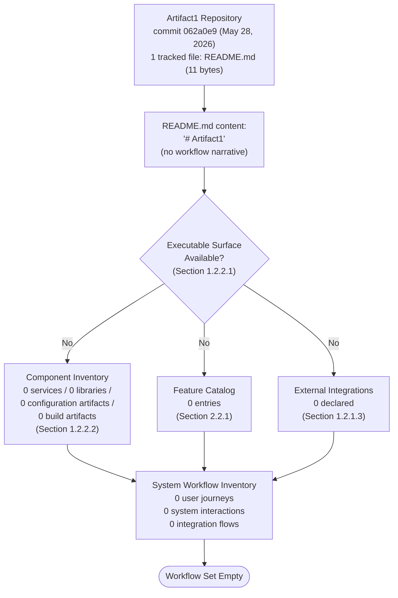

The terminal node ("Workflow Set Empty") is the canonical anchor for this commit. Each input feeding the terminal node is itself anchored to an inherited finding from Sections 1 and 2; any future addition of an executable surface, a feature, or an integration will branch one of these inputs into a populated subtree and trigger a revision of this diagram per Section 4.7.

### 4.5.2 Detailed Process Flow Diagram per Core Feature

The Section 4 prompt requires a detailed process flow for each core feature. Section 2.2.1 records that the Feature Catalog contains zero entries; the per-feature flow inventory is therefore also zero. The diagram below uses the empty-catalog visualization style established in Section 2.4.2.

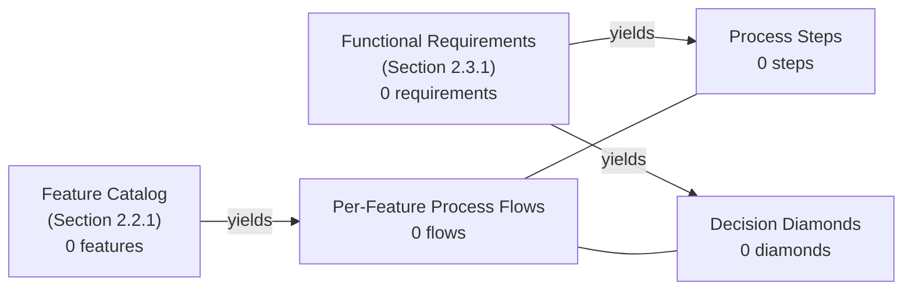

When the Feature Catalog acquires its first entry, this diagram must be replaced by one detailed per-feature flow per catalog entry. The trigger condition for that replacement is enumerated in Section 4.7.1.

### 4.5.3 Error Handling Flowchart

No error-handling paths exist at the current commit. The diagram below visualizes the categorical absence of error-producing surfaces and error-handling controls.

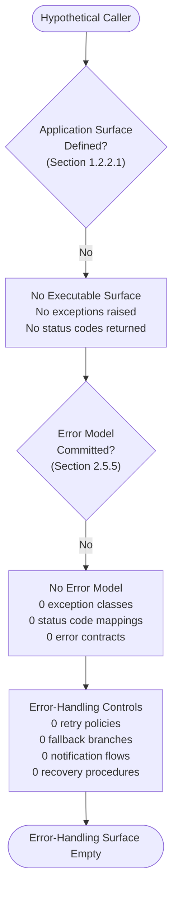

Each "No" branch in this diagram corresponds to a row in the Section 4.4.2 absence inventory and to an inherited finding from Sections 1.2.2.1, 2.5.5, 3.5, 3.6.2, and 3.9.1. When the first error-producing surface is committed, this diagram must be replaced with the standard try / catch / retry / fallback / notify / recover pattern populated with the actual error contracts.

### 4.5.4 Integration Sequence Diagram

No integration sequences are documented at the current commit because Section 1.2.1.3 confirms that all integration categories are empty. The sequence diagram below records that absence in the same notation that future revisions will use once integrations are introduced.

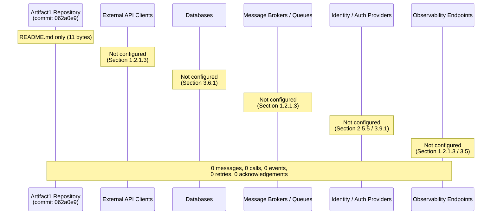

When the first integration is declared—through a dependency manifest, configuration file, or source code—this diagram must be replaced with concrete `Caller ->> Callee` interactions including authentication, request and response payloads, error branches, and SLA annotations as prescribed by Section 3.9.2.

### 4.5.5 State Transition Diagram

No stateful components exist at the current commit. Section 3.6.2 confirms that "because there is no data model, no schema, no migration framework, and no ORM, the project has no current notion of data ownership, durability guarantees, consistency model, or transaction boundaries." The state diagram below reflects that empty state space using the canonical Mermaid `stateDiagram-v2` notation.

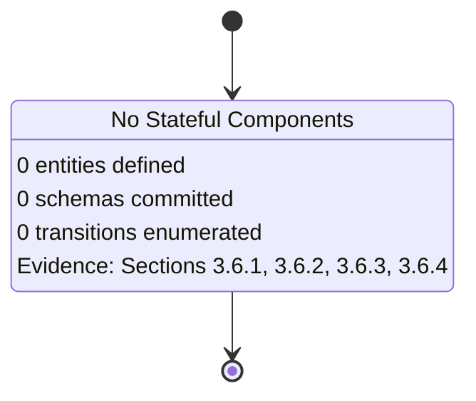

When the first persistence artifact (schema, migration script, ORM model, or state machine definition) is committed, this diagram must be expanded into a concrete state-transition graph per the prescriptions in Section 3.6.2.

---

## 4.6 TIMING, SLA, AND COMPLIANCE CONSIDERATIONS

### 4.6.1 Timing Constraints

No timing constraints are documented. Section 2.5.3 records that "no performance requirements are defined. No latency, throughput, concurrency, or resource-utilization targets have been committed to the repository." Without latency or throughput targets, no step-level timing budget can be inserted into a flowchart. Common timing-related annotations (P50 / P95 / P99 response time, timeout thresholds, deadline propagation, scheduling cadence) are therefore all unauthorable at this commit.

### 4.6.2 SLA Considerations

No SLAs, SLOs, or SLIs are documented. Section 1.2.3.3 records that "no KPIs, service-level objectives (SLOs), service-level agreements (SLAs), or performance targets have been committed to the repository. The KPI catalog will be defined in a future revision of this specification once the system's purpose and operational targets are established." The four KPI categories enumerated in Section 1.2.3.3 (Functional/Business KPIs, Technical/Performance KPIs, Reliability/Availability SLOs, Quality/Defect KPIs) are uniformly empty.

### 4.6.3 Regulatory Compliance Considerations

No regulatory compliance considerations are documented. As recorded in Section 4.3.2's reproduction of the Section 2.3.4 validation-rule table, Compliance Requirements are "Not present." No data-protection regime, financial regulation, healthcare regulation, accessibility standard (WCAG, Section 508, EN 301 549), or industry-specific standard has been committed to the repository. No compliance gate can be inserted into a workflow.

---

## 4.7 LIFECYCLE AND TRIGGER CONDITIONS FOR FUTURE REVISIONS

In keeping with the maintenance expectation in Section 1.4.2 ("this Technical Specification is expected to be revised in lockstep with the repository's evolution"), and in alignment with the lifecycle patterns established in Sections 2.8.1 and 3.10.1, Section 4 must be revised whenever the repository introduces an artifact that establishes a process-relevant input.

### 4.7.1 Trigger Events for Section 4 Revision

| Trigger Event | Expected Section 4 Update |
|---------------|---------------------------|
| First source-code file committed (any language) | Populate Section 4.2.1 with the corresponding process steps; replace the empty diagram in 4.5.1 |
| First feature added to the Section 2.2 Feature Catalog | Generate a detailed process-flow diagram in 4.5.2 for that feature |
| First functional requirement added to Section 2.3 | Populate the decision diamonds and process steps for that requirement |
| First API specification (OpenAPI, GraphQL schema, gRPC `.proto`, AsyncAPI) committed | Populate Section 4.2.2 and replace the integration sequence diagram in 4.5.4 |
| First database schema, migration script, or ORM model committed | Populate Section 4.4.1 (state transitions, persistence points, transaction boundaries) and replace the state diagram in 4.5.5 |
| First caching configuration committed (Redis, Memcached, or in-process cache) | Populate the Caching Requirements subsection under Section 4.4.1 |
| First authentication / authorization configuration committed | Populate the Authorization Checkpoints subsection under Section 4.3.2 |
| First error-handling code (try/catch, error middleware, retry policy) committed | Populate Section 4.4.2 and replace the error-handling diagram in 4.5.3 |
| First observability integration committed (logger, metrics exporter, tracer, alerting webhook) | Populate the Error Notification Flows subsection under Section 4.4.2 |
| First SLA / SLO / SLI committed (in documentation, code, or pipeline configuration) | Populate Section 4.6 with concrete timing constraints |
| First compliance artifact committed (privacy policy, audit-log specification, retention policy) | Populate the Regulatory Compliance Considerations subsection under Section 4.6.3 |
| First scheduler artifact committed (cron expression, Airflow DAG, GitHub Actions cron, Kubernetes CronJob) | Populate the Batch Processing Sequences subsection under Section 4.2.2 |
| First message-broker or queue configuration committed | Populate the Event Processing Flows subsection under Section 4.2.2 |

Each triggering commit must produce a Section 4 revision in which (a) the affected absence row in Section 4.1.3 is replaced with a substantive specification, (b) the corresponding empty-state diagram in Section 4.5 is replaced with a populated diagram, and (c) the introducing commit hash and date are recorded in the section's revision history, consistent with the versioning expectation in Section 3.10.3.

### 4.7.2 Expected Diagram Inventory at Maturity

The table below records the expected post-maturity diagram inventory for Section 4. The intent is to make the future shape of this section explicit so that contributors can plan toward it.

| Diagram | Current Form | Expected Mature Form |
|---------|--------------|----------------------|
| 4.5.1 High-Level System Workflow | Empty-state propagation diagram | One per major actor / system pair with swim lanes |
| 4.5.2 Detailed Process Flow per Feature | Empty-catalog reference diagram | One diagram per Feature Catalog entry |
| 4.5.3 Error Handling Flowchart | Empty error surface diagram | One per error class with retry / fallback / notify / recover branches |
| 4.5.4 Integration Sequence Diagram | Empty participant diagram | One per integration (caller → callee) with auth, payload, error branches |
| 4.5.5 State Transition Diagram | Empty state model | One per stateful entity / aggregate / saga |

### 4.7.3 Relationship to Other Specification Sections

Section 4 is downstream of:

- **Section 1.2 (System Overview)** — Establishes that no system capabilities, no components, and no integrations exist; this finding propagates into the empty workflow inventory in Section 4.1.3 and the empty diagrams in Section 4.5.
- **Section 1.3.1.2 (User Workflows in Scope)** — Provides the load-bearing statement that "no user workflows exist at the current commit."
- **Section 1.4 (Document Positioning and Validity)** — Establishes the evidence-only authoring posture inherited by Section 4.1.1.
- **Section 2.2 (Feature Catalog)** — Provides the zero-feature baseline that constrains Section 4.5.2.
- **Section 2.3 (Functional Requirements)** — Provides the zero-requirement baseline that constrains every decision diamond, every validation rule, and every step-level specification.
- **Section 2.3.4 (Validation Rule Coverage)** — Provides the validation-rule absence table reproduced in Section 4.3.2.
- **Section 2.4.3 (Integration Points)** — Refers to Section 1.2.1.3's integration absence table, which constrains Section 4.5.4.
- **Section 2.5.3 (Performance Requirements)** — Confirms the absence of timing and SLA inputs to Section 4.6.
- **Section 2.5.5 (Security Implications)** — Confirms the absence of authentication, authorization, and error-model inputs to Sections 4.3.2 and 4.5.3.
- **Section 2.8.2 (Relationship to Other Specification Sections)** — Explicitly designates "process flows" as a downstream section that must remain consistent with the empty-catalog finding.
- **Section 3.5 (Third-Party Services)** — Confirms the absence of observability and notification services for Section 4.4.2.
- **Section 3.6 (Databases & Storage)** — Confirms the absence of all state-management inputs for Section 4.4.1.
- **Section 3.9 (Security and Integration Implications)** — Confirms the absence of authentication, authorization, and inter-component integration controls.
- **Section 3.10 (Section 3 Lifecycle and Maintenance Expectations)** — Provides the lifecycle pattern that Section 4.7 mirrors.

Section 4 is itself upstream of any future "Detailed Design" or "Operations Runbook" sections that may be added to this Technical Specification, in the sense that those sections will depend on the flow definitions Section 4 will eventually contain.

### 4.7.4 Versioning of This Section

Per Section 3.10.3 ("when stack elements are added, each row in the tables of Sections 3.2 through 3.7 should record both the introducing commit hash and the date of introduction"), the same expectation applies to Section 4: when workflow elements are added, each entry in the tables of Sections 4.1.3, 4.3.2, and 4.7.1 should record both the introducing commit hash and the date of introduction so that the section's evolution remains auditable. The current revision of Section 4 is anchored to commit `062a0e9480ac957eb1d519f39813240f0798ea86` (May 28, 2026).

---

## 4.8 REFERENCES

### 4.8.1 Files Examined from the Repository

- `README.md` — The sole tracked file in the repository (11 bytes, contents `# Artifact1`). Examined to confirm that no workflow narrative, process description, sequence diagram, or state model is committed. Confirms the empty process-flow baseline that governs all of Section 4.

### 4.8.2 Folders Examined from the Repository

- `/` (repository root, depth 0) — The complete tracked source tree, confirmed to contain exactly one direct child (`README.md`) and no subfolders. No `src/`, `lib/`, `services/`, `api/`, `workflows/`, `flows/`, `models/`, `schemas/`, `migrations/`, `config/`, `docs/`, or `tests/` directory exists; this confirms the categorical absence of every input prescribed by the Section 4 prompt.

### 4.8.3 Technical Specification Sections Cross-Referenced

- **Section 1.1.1 (Repository Identity)** — Source for commit hash `062a0e9480ac957eb1d519f39813240f0798ea86` and the pre-implementation state designation.
- **Section 1.1.2 (Business Problem)** — Source for the absence of business rules.
- **Section 1.1.3 (User Personas)** — Source for the absence of actor definitions.
- **Section 1.2.1.2 (Current System Limitations)** — Source for the absence of an operational system.
- **Section 1.2.1.3 (Integration with Existing Enterprise Landscape)** — Source for the categorical integration absence table reused in Sections 4.2.2 and 4.5.4.
- **Section 1.2.2.1 (Primary System Capabilities)** — Source for the absence of an executable surface.
- **Section 1.2.2.2 (Major System Components)** — Source for the zero-component inventory.
- **Section 1.2.2.3 (Core Technical Approach)** — Source for the absence of language, framework, build tooling, and CI/CD.
- **Section 1.2.2.4 (Current Repository Topology)** — Provided the empty-state diagram pattern paralleled in Section 4.5.1.
- **Section 1.2.3.3 (Key Performance Indicators)** — Source for the absence of SLAs / SLOs / KPIs cited in Section 4.6.2.
- **Section 1.3.1.2 (User Workflows in Scope)** — Provided the load-bearing statement that no user workflows exist.
- **Section 1.3.2 (Data Domains)** — Source for the absence of a data model.
- **Section 1.3.3.1 (Out-of-Scope Elements)** — Source for the categorical out-of-scope inventory.
- **Section 1.4.1 (Authoritative Source)** — Established the evidence-only authoring posture inherited by Section 4.1.1.
- **Section 1.4.2 (Maintenance Expectations)** — Established the lockstep-with-repository-evolution expectation reflected in Section 4.7.
- **Section 1.4.3 (Reader Guidance)** — Established the "current-state observation" interpretation for absence notations.
- **Section 2.2.1 (Catalog Status)** — Source for the zero-feature baseline that constrains Section 4.5.2.
- **Section 2.3.1 (Functional Requirements Status)** — Source for the zero-requirement baseline.
- **Section 2.3.4 (Validation Rule Coverage by Dimension)** — Provided the validation-rule absence table reproduced in Section 4.3.2.
- **Section 2.4.2 (Feature Dependency Map)** — Provided the empty-graph diagram pattern paralleled in Section 4.5.2.
- **Section 2.4.3 (Integration Points)** — Cross-referenced for the absence of inter-feature integrations.
- **Section 2.5.3 (Performance Requirements)** — Source for the absence of latency / throughput / concurrency targets cited in Section 4.6.1.
- **Section 2.5.5 (Security Implications)** — Source for the absence of an authentication / authorization / error model cited in Sections 4.3.2 and 4.5.3.
- **Section 2.7.2 (Constraints)** — Established the no-fabrication rule inherited by Section 4.1.1.
- **Section 2.8.1 (Trigger Conditions for Future Revisions)** — Provided the trigger-events table pattern paralleled in Section 4.7.1.
- **Section 2.8.2 (Relationship to Other Specification Sections)** — Explicitly designated "process flows" as a downstream section subject to the empty-catalog finding.
- **Section 2.8.3 (Current-State Summary)** — Provided the propagation-diagram pattern paralleled in Section 4.5.1.
- **Section 3.1.2 (Repository-Wide Technology Status Summary)** — Source for the categorical absence of every stack dimension required by process-flow authoring.
- **Section 3.1.4 (Current-State Technology Stack Topology)** — Provided the established-versus-absent diagram pattern referenced by Section 4.5.
- **Section 3.4.1 (Dependency Manifests)** — Source for the absence of dependency manifests, which constrains retry libraries, validation libraries, observability libraries, and so on.
- **Section 3.5 (Third-Party Services)** — Source for the absence of observability and notification services cited in Section 4.4.2.
- **Section 3.6.1 (Primary and Secondary Databases)** — Source for the absence of any data persistence point cited in Section 4.4.1.
- **Section 3.6.2 (Data Persistence Strategies)** — Source for the absence of transaction boundaries and consistency model cited in Section 4.4.1.
- **Section 3.6.3 (Caching Solutions)** — Source for the absence of a caching layer cited in Section 4.4.1.
- **Section 3.6.4 (Storage Services)** — Source for the absence of object / file / block storage cited in Section 4.4.1.
- **Section 3.9.1 (Security Implications of Current Choices)** — Source for the absence of authentication / authorization / TLS / secrets / encryption controls cited in Sections 4.3.2 and 4.5.3.
- **Section 3.9.2 (Integration Requirements Between Components)** — Source for the future-state prescription that integration sequences (Section 4.5.4) must enumerate caller, callee, contract, auth model, data classification, and constraints when populated.
- **Section 3.10.1 (Trigger Events for Section 3 Revision)** — Provided the trigger-events pattern paralleled in Section 4.7.1.
- **Section 3.10.3 (Versioning of This Section)** — Provided the commit-hash-and-date versioning pattern paralleled in Section 4.7.4.

# 5. System Architecture

## 5.1 AUTHORING BASIS AND ARCHITECTURE STATUS

### 5.1.1 Inheritance of the Evidence-Only Authoring Posture

This System Architecture section is authored under the same evidence-only posture that governs Sections 1, 2, 3, and 4 of this Technical Specification. As established in Section 1.4.1, this specification is "grounded exclusively in the verified contents of the `Artifact1` repository at commit `062a0e9480ac957eb1d519f39813240f0798ea86`," and "where information is absent from the repository, this document explicitly says so rather than inferring, projecting, or speculating about the project's eventual nature." Section 2.7.2 reinforces this by requiring that any "feature, requirement, dependency, relationship, or constraint added to this section in the future must be substantiated by a corresponding repository artifact." Section 3.1.1 extends the same constraint to the technology stack, and Section 4.1.1 extends it to process flows.

Consequently, every architectural claim made in Section 5—every component, every integration, every data flow, every cross-cutting concern, every architectural decision, every diagrammed interaction—must trace back to a tracked file, a Git metadata fact, or a previously established cross-reference. No notional, hypothetical, or default architectures may be authored unless and until they appear as committed repository artifacts. The reader-guidance principle of Section 1.4.3—that all "not present" / "not defined" / "undocumented" notations be interpreted as **current-state observations** rather than permanent design decisions—applies in full to the contents of this section.

This section explicitly does **not** adopt the prompt's accompanying default technology stack (AWS, Docker, Terraform, GitHub Actions, Python/Flask, Auth0, MongoDB, LangChain, React/TypeScript, TailwindCSS, React Native, Swift, Kotlin, Objective-C, ElectronJS) as the project's chosen architecture. Per Section 3.1.3, none of those technologies appear in the repository at the current commit, and enumerating them as architectural choices would violate the binding evidence-only posture inherited from Section 1.4.1 and directly contradict Section 1.2.2.3's explicit statement that no technical approach, language, framework, or runtime has been declared.

### 5.1.2 Designation as a Downstream Section

Section 5 is downstream of Sections 1, 2, 3, and 4. The empty findings already established in those sections deterministically constrain what Section 5 can author:

- **Section 1.2.2.1** confirms that the repository "exposes no system capabilities" — "There is no executable code, no service entry point, no command-line interface, no library API, and no user interface."
- **Section 1.2.2.2** records that the component inventory is uniformly zero across services, libraries, configuration artifacts, and build artifacts.
- **Section 1.2.1.3** records that every external integration category (External API Clients, Database Connections, Message Brokers/Queues, Identity/Auth Providers, Observability Endpoints, Build/CI Integrations) is "Not present" in the repository.
- **Section 2.2.1** records that the Feature Catalog contains zero entries.
- **Section 3.1.2** records that no programming language, framework, runtime, database, caching layer, identity provider, observability endpoint, or CI/CD pipeline has been established.
- **Section 4.1.3** records that every process-flow input prescribed by the Section 4 prompt is "Not defined."

Because Section 5's architectural inputs are categorically empty, the architecture surface area at the current commit is itself categorically empty—except for the development-platform configuration established in Sections 2.5.2 and 3.7.1 (Git, GitHub, `main` branch, Markdown).

### 5.1.3 Architecture Surface Area Summary at the Current Commit

The table below records the categorical status of each architectural input prescribed by the Section 5 prompt. The structural completeness of this table is intentional: each row provides a stable insertion point for a future revision once the corresponding repository artifact is committed.

| Architectural Input | Status at Current Commit | Authoritative Evidence |
|---------------------|--------------------------|------------------------|
| Architecture Style | Not declared | Section 1.2.2.3 (no technical approach declared) |
| Architectural Patterns | Not declared | Section 1.2.2.3; Section 3.1.2 |
| System Boundaries | Not defined | Section 1.2.2.1 (no executable surface) |
| Major Interfaces | Not defined | Section 1.2.1.3 (no integrations) |
| Core Components | None | Section 1.2.2.2 (0 services / 0 libraries / 0 configs / 0 build artifacts) |
| Data Flows | Not defined | Section 1.2.1.3; Section 3.6.2 (no data model) |
| External Integration Points | None | Section 1.2.1.3 (all categories absent) |
| Data Stores | None | Section 3.6.1 (no database configured) |
| Caches | None | Section 3.6.3 (no caching layer configured) |
| State Transitions | None | Section 3.6.2; Section 4.4.1 |
| Communication Patterns | Not chosen | Section 1.2.2.3; Section 3.5 (no integrations) |
| Storage Solutions | Not chosen | Section 3.6.4 (no storage service integrated) |
| Caching Strategy | Not chosen | Section 3.6.3; Section 4.4.1 |
| Security Mechanisms | Not chosen | Section 2.5.5; Section 3.9.1 |
| Monitoring & Observability | Not configured | Section 3.5.4 (no telemetry tool integrated) |
| Logging & Tracing | Not configured | Section 1.3.3.1; Section 3.5.4 |
| Error Handling Patterns | Not declared | Section 2.5.5; Section 4.4.2 |
| Authentication Framework | Not configured | Section 3.5.3; Section 2.5.5 |
| Performance Requirements & SLAs | Not declared | Section 1.2.3.3; Section 2.5.3; Section 4.6.1, 4.6.2 |
| Disaster Recovery Procedures | Not declared | Section 1.2.1.2; Section 4.4.2 |
| Version Control Architecture | **Established (Git)** | Section 1.1.1; Section 2.5.2; Section 3.7.1 |
| Remote Hosting Architecture | **Established (GitHub)** | Section 1.1.1; Section 2.5.2; Section 3.5.6 |
| Default Branch Convention | **Established (`main`)** | Section 1.1.1; Section 2.5.2; Section 3.7.1 |
| Documentation Format | **Established (Markdown)** | Sole tracked file `README.md` |

Every row marked "Not declared," "Not chosen," "Not configured," or "None" is a direct consequence of the single-file repository state. The four rows marked "Established" represent the entirety of architecturally-relevant evidence available at this commit.

---

## 5.2 HIGH-LEVEL ARCHITECTURE

### 5.2.1 System Overview

#### 5.2.1.1 Overall Architecture Style and Rationale

No overall architecture style has been declared in the repository at commit `062a0e9`. Common styles—monolithic, modular monolith, microservices, service-oriented (SOA), event-driven, serverless, hexagonal/ports-and-adapters, layered (n-tier), CQRS, space-based, pipeline/pipes-and-filters, peer-to-peer—are uniformly inapplicable because:

- Section 1.2.2.1 confirms that there is no executable surface (no service entry point, no CLI, no library API, no UI) against which any style could be evaluated.
- Section 1.2.2.2 confirms that the component inventory is empty across every component class.
- Section 1.2.2.3 records explicitly that "no technical approach, architectural pattern, technology stack, programming language, runtime environment, framework selection, or design decision has been declared in the repository."

The "rationale" required by the prompt is therefore deferred to a future revision. When the first source file, service entry point, or architectural decision is committed, this subsection must record the chosen style and the tradeoffs that motivated it (e.g., simplicity vs. evolvability, operational cost vs. fault isolation, latency vs. throughput, organizational topology vs. system topology).

#### 5.2.1.2 Architectural Principles and Patterns

No architectural principles or patterns are declared at the current commit. Section 3.1.2's repository-wide technology status table records that frameworks (backend, frontend, mobile, native), supporting libraries, package registries, third-party APIs, authentication providers, monitoring tools, cloud platform services, primary databases, secondary databases, caching solutions, object/file storage, containerization, orchestration, Infrastructure-as-Code, CI/CD pipelines, build tooling, and testing frameworks are uniformly "Not established," "Not declared," "Not configured," or "Not referenced." Without any substrate, principles such as single-responsibility, separation of concerns, dependency inversion, idempotency, immutability, eventual consistency, defense-in-depth, least privilege, and graceful degradation cannot be applied to any concrete artifact.

Patterns such as repository, unit-of-work, factory, strategy, observer, command, saga, outbox, anti-corruption layer, sidecar, ambassador, backend-for-frontend, API gateway, service mesh, and database-per-service are likewise inapplicable. Each pattern presupposes the existence of components, communication channels, or data stores that the repository does not yet contain.

#### 5.2.1.3 System Boundaries and Major Interfaces

No system boundaries are defined. A system boundary requires (a) at least one component on the "inside" of the boundary and (b) at least one actor or external system on the "outside." Section 1.2.2.2 confirms that no inside components exist, and Section 1.2.1.3 confirms that no outside integrations are declared. The only boundary that can be objectively drawn from current evidence is the *repository* boundary itself—the perimeter encompassing the single tracked file `README.md` and the Git metadata directory `.git/`—as illustrated in Section 1.2.2.4's Current Repository Topology diagram.

No major interfaces are defined. Interface candidates—REST endpoints, GraphQL schemas, gRPC services, message-broker topics, file-system contracts, database schemas, library APIs, command-line interfaces, user interfaces—are categorically absent per Section 3.5.2 (no API spec or SDK), Section 3.6 (no database), and Section 1.2.2.1 (no executable surface).

### 5.2.2 Core Components Table

The Core Components table prescribed by the Section 5 prompt is empty at the current commit. Per Section 1.2.2.2, the component inventory across all classes (Services / Applications, Libraries / Modules, Configuration Artifacts, Build Artifacts) is zero. The single documentation artifact (`README.md`) is not a system component in the architectural sense; it is documentation scaffolding consisting of the project name heading.

| Component Name | Primary Responsibility | Key Dependencies | Integration Points |
|----------------|------------------------|------------------|--------------------|
| *(none)* | *(no component implemented)* | *(no dependency manifest exists — Section 3.4.1)* | *(no integrations declared — Section 1.2.1.3)* |

**Critical Considerations:** Because no components exist, no critical considerations (operational, performance, security, compatibility) can be authored. When the first component is committed, this table must be replaced with one row per component, and a parallel narrative subsection must enumerate, for each component, its critical considerations using the format established here (operational risk, scaling envelope, security posture, observability requirements).

### 5.2.3 Data Flow Description

No primary data flows can be documented at the current commit:

- **No source-to-sink data paths exist.** Section 1.2.2.1 confirms no executable surface, so no in-memory data movement between modules can be drawn.
- **No integration patterns or protocols are chosen.** Section 1.2.1.3 confirms that no External API Clients, Database Connections, Message Brokers/Queues, Identity/Auth Providers, or Observability Endpoints are configured. Common integration patterns—synchronous request/response, asynchronous publish/subscribe, request/reply over a broker, streaming, polling, webhook callback, file drop, change-data-capture—are all inapplicable because there is no caller and no callee.
- **No data transformation points exist.** Without source data (Section 3.6.1 confirms no database) and without target data (Section 3.6.4 confirms no storage service), no ETL, ELT, mapper, validator, enricher, serializer, or deserializer can be inserted into a flow.
- **No data stores or caches exist.** Section 3.6.1 confirms zero databases across every class (relational, document NoSQL, key-value, column-family, graph, search/vector, time-series, analytical/OLAP). Section 3.6.3 confirms no caching layer (Redis, Memcached, Hazelcast, Apache Ignite, Varnish, CDN-edge-cache, in-process cache). Section 3.6.4 confirms no object-storage, file-storage, or block-storage service.

The only persistent surface present in the repository tree is the Git object database within `.git/`, which Section 3.6.4 explicitly classifies as a developer-facing artifact rather than a runtime storage tier. Future revisions of this subsection must enumerate, for each declared data flow, (a) the source component, (b) the destination component, (c) the transformation applied, (d) the protocol/format used, and (e) the persistence or cache touched along the way.

### 5.2.4 External Integration Points

The External Integration Points table prescribed by the Section 5 prompt is empty at the current commit. Per Section 1.2.1.3, every category of external integration is "Not present" in the repository.

| System Name | Integration Type | Data Exchange Pattern | Protocol / Format |
|-------------|------------------|-----------------------|-------------------|
| *(none — runtime)* | *(no External API Clients)* | *(no synchronous or asynchronous flow)* | *(no OpenAPI / GraphQL / gRPC / AsyncAPI / SDK manifest)* |
| *(none — persistence)* | *(no Database Connections)* | *(no read / write / replication flow)* | *(no JDBC / ODBC / native driver configuration)* |
| *(none — messaging)* | *(no Message Brokers / Queues)* | *(no publish / subscribe / request-reply)* | *(no AMQP / MQTT / Kafka / SQS / SNS configuration)* |
| *(none — identity)* | *(no Identity / Auth Providers)* | *(no token issuance / validation)* | *(no OIDC / SAML / OAuth 2.0 / LDAP configuration)* |
| *(none — telemetry)* | *(no Observability Endpoints)* | *(no log / metric / trace export)* | *(no OpenTelemetry / Prometheus / OTLP / syslog configuration)* |
| GitHub (github.com) | Development-platform service | Git push / pull / fetch (developer workflow) | Git Smart HTTP (HTTPS) |

**SLA Requirements:** No SLA requirements are committed for any integration. Per Section 4.6.2, "no SLAs, SLOs, or SLIs are documented," and Section 1.2.3.3's four KPI categories (Functional/Business KPIs, Technical/Performance KPIs, Reliability/Availability SLOs, Quality/Defect KPIs) are uniformly empty. The single development-platform service in use (GitHub, per Section 3.5.6) is operated by GitHub Inc. under its own publicly stated service-level commitments; no project-specific SLA has been negotiated or recorded in the repository.

The GitHub row is included because Section 3.5.6 identifies GitHub as "the single confirmed third-party service in use by the project," acting as a Git remote and code-hosting platform. As Section 3.5.6 emphasizes, this is a *development-platform* service rather than a *runtime* integration, and it is bound to the project by the remote-origin URL `https://github.com/ShaliniTest-maker/Artifact1.git` recorded in Section 1.1.1.

---

## 5.3 COMPONENT DETAILS

### 5.3.1 Component Inventory Status

The Section 5 prompt requires that, "for each major component," the specification document purpose, responsibilities, technologies used, key interfaces, data persistence requirements, and scaling considerations. The component inventory at commit `062a0e9` is empty per Section 1.2.2.2. Consequently, no per-component specification can be authored. The table below records the categorical absence of every component class:

| Component Class | Components Present | Per-Component Detail Status |
|-----------------|--------------------|-----------------------------|
| Services / Applications | 0 | Not authorable |
| Libraries / Modules | 0 | Not authorable |
| Configuration Artifacts | 0 | Not authorable |
| Build Artifacts | 0 | Not authorable |

### 5.3.2 Per-Component Specification Template

The following template is provided so that, when the first component is committed, the per-component specification can be inserted without restructuring this section. The template enumerates each subitem prescribed by the Section 5 prompt.

| Specification Item | Status | Source of Future Content |
|--------------------|--------|--------------------------|
| Purpose and responsibilities | Not authorable | Component README, source-file docstrings, ADR |
| Technologies and frameworks used | Not authorable | Dependency manifest (Section 3.4 trigger) |
| Key interfaces and APIs | Not authorable | API specification (Section 4.7.1 trigger) |
| Data persistence requirements | Not authorable | Schema or ORM model (Section 4.7.1 trigger) |
| Scaling considerations | Not authorable | Capacity-planning input (Section 2.5.4 trigger) |

### 5.3.3 Component Interaction Diagram

The Component Interaction Diagram prescribed by the Section 5 prompt is empty at the current commit because no components exist (Section 1.2.2.2) and no integration channels exist (Section 1.2.1.3). The diagram below records that categorical absence using the empty-state convention established in Sections 1.2.2.4, 2.4.2, 2.8.3, 3.1.4, 4.5.1, and 4.5.4.

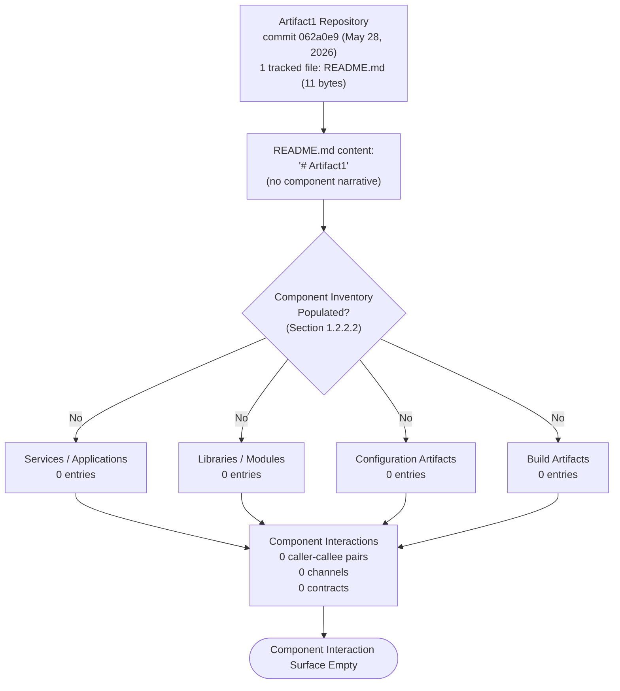

When the first component is committed, this diagram must be replaced with a populated component interaction diagram showing each component as a node and each integration channel as a labeled edge (with protocol and direction annotations).

### 5.3.4 State Transition Diagram

The State Transition Diagram prescribed by the Section 5 prompt is empty at the current commit. Section 3.6.2 confirms that "because there is no data model, no schema, no migration framework, and no ORM, the project has no current notion of data ownership, durability guarantees, consistency model, or transaction boundaries." Without an entity model there is no state to transition. Section 1.2.2.1's confirmation that no executable surface exists also rules out in-memory state machines, ephemeral session state, and request-scoped state. The diagram below mirrors the empty-state notation established in Section 4.5.5.

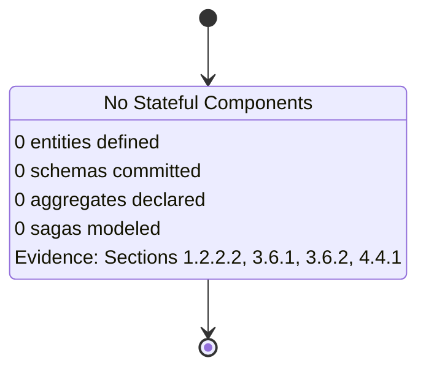

When the first persistence artifact (schema, migration script, ORM model, or state machine definition) is committed, this diagram must be expanded into a concrete state-transition graph showing each entity's lifecycle states and the events that drive transitions between them.

### 5.3.5 Sequence Diagram for Key Flows

The Sequence Diagram prescribed by the Section 5 prompt is empty at the current commit. Per Section 4.5.4, "no integration sequences are documented at the current commit because Section 1.2.1.3 confirms that all integration categories are empty." The diagram below records that absence in the same notation that future revisions will use once flows are introduced.

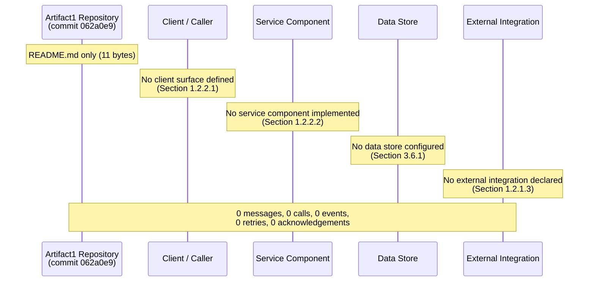

When the first key flow is committed (request handler, batch job, scheduled task, event consumer), this diagram must be replaced with one sequence diagram per key flow, showing concrete `Caller ->> Callee` interactions with authentication, request/response payloads, error branches, and timing annotations per the prescription in Section 3.9.2.

---

## 5.4 TECHNICAL DECISIONS

### 5.4.1 Decisions Status

The Section 5 prompt requires that technical decisions be documented and justified across five dimensions: architecture style, communication patterns, data storage solution, caching strategy, and security mechanism. No such decisions have been recorded in the repository at commit `062a0e9`. The table below records the status of each decision dimension:

| Decision Dimension | Status at Current Commit | Authoritative Evidence |
|--------------------|--------------------------|------------------------|
| Architecture Style | Not made | Section 1.2.2.3 (no technical approach declared) |
| Communication Pattern | Not made | Section 1.2.1.3 (no integrations); Section 3.5.2 (no API spec) |
| Data Storage Solution | Not made | Section 3.6.1 (no database configured) |
| Caching Strategy | Not made | Section 3.6.3 (no caching layer configured) |
| Security Mechanism | Not made | Section 2.5.5; Section 3.9.1 |

### 5.4.2 Architecture Style Decisions and Tradeoffs

No architecture style decision has been made. The tradeoff space for this decision—when it is eventually addressed—commonly involves balancing:

- **Operational simplicity vs. fault isolation** (monolith vs. microservices)
- **Team autonomy vs. system coherence** (federated services vs. centralized control)
- **Latency vs. throughput** (synchronous vs. asynchronous)
- **Cost vs. elasticity** (always-on vs. serverless)
- **Evolvability vs. consistency** (decoupled vs. tightly integrated)

Per Section 3.1.3, the prompt's default stack must not be enumerated as the chosen style. When the first source file or service entry point is committed, this subsection must record the chosen style, the tradeoffs evaluated, and the evidence (commit hash, file path) that establishes the decision.

### 5.4.3 Communication Pattern Choices

No communication pattern choice has been made. Section 1.2.1.3 confirms the categorical absence of External API Clients, Database Connections, Message Brokers/Queues, Identity/Auth Providers, and Observability Endpoints. Common communication patterns—synchronous RPC, REST over HTTP, GraphQL, gRPC, asynchronous messaging (publish/subscribe, point-to-point, request/reply), event streaming, file-based exchange, shared database, callback/webhook—are all inapplicable because there is no caller and no callee.

When the first integration channel is committed (e.g., an OpenAPI specification, an AsyncAPI specification, a gRPC `.proto` file, a message-broker configuration), this subsection must record the chosen pattern, the alternatives considered, and the criteria that drove the selection (e.g., latency budget, throughput requirement, ordering guarantee, delivery guarantee, schema-evolution strategy).

### 5.4.4 Data Storage Solution Rationale

No data storage solution has been chosen. Section 3.6.1 confirms that no primary or secondary database is configured across any class—relational, document NoSQL, key-value, column-family, graph, search/vector, time-series, or analytical/OLAP. Section 3.6.4 confirms that no object-storage, file-storage, or block-storage service is integrated.

When the first persistence artifact is committed, this subsection must record:

- The chosen database class and product (e.g., PostgreSQL, MongoDB, Redis, S3)
- The data model paradigm (relational, document, key-value, columnar, graph)
- The consistency model (strong, eventual, causal, monotonic)
- The durability and availability guarantees
- The reasons the chosen solution was preferred over the alternatives within its class

### 5.4.5 Caching Strategy Justification

No caching strategy has been chosen. Section 3.6.3 confirms that "no caching layer is configured. There is no Redis, Memcached, Hazelcast, Apache Ignite, Varnish, or CDN-edge-cache configuration in the repository. No in-process caching library is declared either (because no dependency manifest exists, per Section 3.4.1)." Without a caching layer, no cache-aside, write-through, write-behind, read-through, or refresh-ahead pattern can be inserted into any flow (per Section 4.4.1).

When the first caching configuration is committed, this subsection must record the chosen pattern, the cache topology (in-process, distributed, edge), the invalidation strategy, and the consistency tradeoff (stale-read tolerance vs. cache-miss latency).

### 5.4.6 Security Mechanism Selection

No security mechanisms have been selected at the application level. Section 2.5.5 records that "no authentication model, authorization model, data-classification scheme, encryption-at-rest configuration, encryption-in-transit configuration, secrets-management strategy, or threat model has been committed to the repository." Section 3.9.1 reiterates this with a per-control absence table.

The single security control currently in force is provided by Git itself rather than by any application-level configuration:

| Security Control | Status | Provided By |
|------------------|--------|-------------|
| Commit Integrity (SHA-based) | **In force** | Git (content-addressable storage; Section 3.7.1, Section 3.9.1) |
| Authentication & Authorization | Not selected | Pending future commit (Section 2.5.5, Section 3.5.3) |
| Encryption in Transit (TLS) | Not selected | Pending future commit (Section 3.9.1) |
| Encryption at Rest | Not selected | Pending future commit (Section 3.9.1) |
| Secrets Management | Not selected | Pending future commit (Section 2.5.5, Section 3.9.1) |
| Supply-Chain Risk Controls | Inapplicable today | No declared dependencies (Section 3.4) |
| Container Image Scanning | Inapplicable today | No container images built (Section 3.7.4) |
| IaC Policy Scanning | Inapplicable today | No IaC manifests committed (Section 3.7.7) |

When the first application-level security artifact is committed, this subsection must record the chosen mechanism (e.g., OIDC via Auth0, JWT with rotating signing keys, mTLS, Vault-based secret retrieval), the threat model it addresses, and the residual risks.

### 5.4.7 Architecture Decision Records (ADRs)

No Architecture Decision Records (ADRs) have been committed to the repository. The conventional ADR locations—`docs/adr/`, `docs/architecture/decisions/`, `architecture/decisions/`—do not exist (Section 1.5.2 confirms no `docs/` subdirectory of any form). The ADR catalog is therefore empty:

| ADR ID | Title | Status | Decision Date |
|--------|-------|--------|---------------|
| *(none committed)* | *(no ADR file present)* | *(no ADR file present)* | *(no ADR file present)* |

When the first ADR is committed, this table must record one row per ADR with its identifier, title, status (Proposed, Accepted, Deprecated, Superseded), and decision date, with the introducing commit hash recorded per the versioning convention in Section 3.10.3.

### 5.4.8 Technical Decision Tree Diagram

Because no technical decisions have been made, the decision tree prescribed by the Section 5 prompt has no branches to populate. The diagram below records that categorical absence using the empty-state convention.

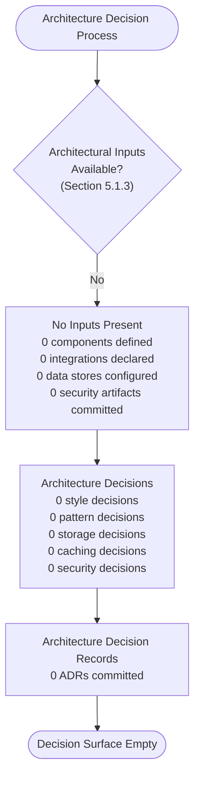

When the first architectural decision is made, this diagram must be replaced with a decision tree showing the alternatives considered at each branch and the criteria that selected the chosen path.

---

## 5.5 CROSS-CUTTING CONCERNS

### 5.5.1 Monitoring and Observability Approach

No monitoring or observability approach has been adopted at the current commit. Per Section 3.5.4, "no monitoring or observability tool is integrated. There is no Datadog, New Relic, Splunk, Sentry, Honeycomb, Grafana, Prometheus, Elastic Stack, or OpenTelemetry configuration in the repository." Section 1.3.3.1 confirms that "Observability (Logging, Metrics, Tracing)" is out of scope because "no telemetry instrumentation [is] present."

The three classical observability pillars are uniformly empty:

| Observability Pillar | Status | Future-Source Trigger |
|----------------------|--------|----------------------|
| Metrics | Not configured | First metrics exporter or instrumented endpoint committed |
| Logs | Not configured | First logging library or log sink configuration committed |
| Traces | Not configured | First tracer or OTLP exporter committed |
| Events / Audit | Not configured | First audit-event emitter or audit-log specification committed |

When the first observability integration is committed, this subsection must record the chosen platform, the instrumentation library, the export protocol (OTLP, StatsD, Prometheus scrape, syslog, JSON-over-HTTP), the sampling strategy, and the retention policy.

### 5.5.2 Logging and Tracing Strategy

No logging or tracing strategy is documented. Because no executable surface exists (Section 1.2.2.1), there is no process from which logs could be emitted or traces could originate. Because no dependency manifest exists (Section 3.4.1), no logging library (e.g., `logback`, `log4j`, `winston`, `bunyan`, `pino`, `structlog`, `zap`, `tracing-rs`) and no tracing library (e.g., `opentelemetry-sdk`, `jaeger-client`, `zipkin-reporter`) is declared. The log-format decision (plain text, JSON, key-value, syslog), the log-level taxonomy (TRACE / DEBUG / INFO / WARN / ERROR / FATAL), the trace-propagation model (W3C Trace Context, B3, Jaeger, AWS X-Ray), and the correlation-ID strategy are all deferred to future revisions.

### 5.5.3 Error Handling Patterns

No error-handling patterns have been declared. Section 2.5.5 records that no error model is committed, and Section 4.4.2 enumerates the categorical absence of each error-handling control class:

| Error-Handling Control | Status | Evidence |
|------------------------|--------|----------|
| Retry Mechanisms | Not declared | Section 4.4.2 (no retry library, no backoff/jitter, no circuit breaker, no bulkhead, no timeout policy) |
| Fallback Processes | Not declared | Section 4.4.2 (no primary path from which to fall back) |
| Error Notification Flows | Not declared | Section 4.4.2 (no logging sink, metrics endpoint, tracing collector, alerting service, notification channel) |
| Recovery Procedures | Not declared | Section 4.4.2 (no runtime, infrastructure, data store, or integration to recover) |
| Exception Class Hierarchy | Not declared | Section 1.2.2.1 (no executable surface); Section 2.5.5 |
| Status-Code Mapping | Not declared | Section 1.2.1.3 (no API surface) |
| Error Contracts | Not declared | Section 3.5.2 (no API specification) |

When the first error-handling code (try/catch block, error middleware, retry policy, circuit-breaker configuration) is committed, this subsection must record the chosen patterns by error class (transient vs. terminal, recoverable vs. unrecoverable, expected vs. unexpected) and the corresponding handling strategies (retry with backoff, fallback to cache, degrade to a default response, notify on-call, fail closed).

### 5.5.4 Authentication and Authorization Framework

No authentication or authorization framework has been adopted. Per Section 3.5.3, "no authentication service is configured." Concretely:

- No identity provider integration exists (no Auth0, Okta, Cognito, Azure AD B2C, Firebase Auth).
- No federation protocol is configured (no SAML, OIDC, OAuth 2.0, LDAP).
- No token-signing or session-validation logic is committed (no JWT signing keys, no session secrets).
- No authorization model is committed (no role-based access control, no attribute-based access control, no policy-as-code).

The authentication / authorization framework selection is therefore an open decision space. When the first auth artifact is committed, this subsection must record the chosen protocol, the identity provider, the token format and lifetime, the authorization model, and the corresponding policy-enforcement points.

### 5.5.5 Performance Requirements and SLAs

No performance requirements or SLAs are committed. Per Section 2.5.3, "no performance requirements are defined. No latency, throughput, concurrency, or resource-utilization targets have been committed to the repository." Per Section 4.6.2, "no SLAs, SLOs, or SLIs are documented." Per Section 1.2.3.3, the four KPI categories (Functional/Business KPIs, Technical/Performance KPIs, Reliability/Availability SLOs, Quality/Defect KPIs) are uniformly empty.

| Performance Dimension | Status | Future-Source Trigger |
|-----------------------|--------|----------------------|
| Latency Target (P50 / P95 / P99) | Not declared | First SLI / SLO committed |
| Throughput Target (RPS, EPS) | Not declared | First capacity-planning artifact committed |
| Concurrency Target | Not declared | First concurrency model declared in code or config |
| Resource Utilization Cap | Not declared | First resource-request / resource-limit committed |
| Availability SLO | Not declared | First availability target documented |
| Error-Budget Policy | Not declared | First SRE policy document committed |

Section 2.5.4 confirms that "no scalability considerations are defined. No horizontal-scaling model, vertical-scaling model, sharding strategy, partitioning strategy, or capacity-planning input has been committed to the repository. The system does not yet exist as a runtime, so scalability has no current operational meaning."

### 5.5.6 Disaster Recovery Procedures

No disaster recovery procedures are documented. Section 1.2.1.2 records that "because no operational system exists at this stage, the concept of 'current system limitations' does not directly apply." Section 4.4.2 extends the same reasoning to recovery: "with no runtime, no infrastructure, no data store, and no integration to recover, no runbook, restore procedure, replay process, or compensating action can be authored."

| DR Dimension | Status | Evidence |
|--------------|--------|----------|
| Recovery Point Objective (RPO) | Not declared | Section 4.4.2; no data store to recover (Section 3.6.1) |
| Recovery Time Objective (RTO) | Not declared | Section 4.4.2; no runtime to restore (Section 1.2.1.2) |
| Backup Strategy | Not declared | Section 3.6.4 (no storage tier to back up beyond Git) |
| Restore Procedure | Not declared | Section 4.4.2 (no data store, no runbook) |
| Failover Topology | Not declared | Section 2.5.4 (no scalability or topology declared) |
| Business-Continuity Plan | Not declared | Section 1.2.1.2 (no operational system) |
| Source-Code Recovery | Provided by Git/GitHub | Distributed VCS replication via clones; SHA-based integrity (Section 3.7.1, Section 3.9.1) |

The single recovery-relevant property currently in force is the inherent redundancy of Git as a distributed VCS: any developer with a recent clone of the repository holds a complete copy of the source tree and the full commit history, and Git's content-addressable design (Section 3.9.1) guarantees that any byte-level corruption is detectable on checkout. This property protects source-code availability but does not constitute disaster recovery for a runtime system, because no runtime system exists.

### 5.5.7 Error Handling Flow Diagram

The Error Handling Flow Diagram prescribed by the Section 5 prompt is empty at the current commit, in keeping with the empty-error-surface diagram established in Section 4.5.3.


When the first error-producing surface and the first error-handling control are committed, this diagram must be replaced with the standard try / catch / classify / retry / fallback / notify / recover pattern populated with the actual error contracts. The trigger condition for this replacement is enumerated in Section 5.7.1.

---

## 5.6 ESTABLISHED ARCHITECTURE ELEMENTS

This subsection records the only architectural elements with affirmative evidence in the repository. All four elements are *development-platform* concerns rather than *runtime* concerns, and none of them imply, require, or preempt any particular runtime architecture.

### 5.6.1 Version Control and Hosting Architecture

| Element | Established Value | Architectural Role |
|---------|-------------------|--------------------|
| Version-Control System | **Git** (content-addressable distributed VCS) | Source-of-truth for all repository contents; SHA-1 commit integrity (Section 3.7.1, Section 3.9.1) |
| Remote Hosting Platform | **GitHub** (`github.com/ShaliniTest-maker/Artifact1`) | Centralized remote; collaboration surface; the single confirmed third-party service (Section 3.5.6) |
| Default Branch | **`main`** | Canonical integration line for the repository (Section 2.5.2, Section 3.7.1) |
| Commit History | 1 commit (`062a0e9`, May 28, 2026) | Authored by `ShaliniTest-maker <shaliniguptatest@gmail.com>` (Section 3.7.1) |

Section 3.7.1 records additionally that "no Git submodules, no Git LFS configuration, no `.gitattributes`, and no `.gitignore` are tracked at this commit; only the `.git/` metadata directory and `README.md` are present in the working tree."

### 5.6.2 Documentation Architecture

| Element | Established Value | Architectural Role |
|---------|-------------------|--------------------|
| Documentation Format | **Markdown (CommonMark)** | Format of the sole tracked file (`README.md`) |
| Documentation Surface | **1 file (`README.md`, 11 bytes)** | Project-name heading only |
| Content Inventory | `# Artifact1` (a single H1 heading) | No narrative content beyond the artifact's name (Section 1.2.1.1) |

The documentation surface is intentionally minimal at this commit. Section 2.8.1's first trigger event ("First substantive `README.md` content beyond `# Artifact1`") will eventually expand the documentation architecture; the trigger condition for the Section 5 revision that follows from that event is enumerated in Section 5.7.1.

### 5.6.3 Architecture Topology Diagram

The diagram below visualizes the entirety of the architecturally-relevant evidence at commit `062a0e9`, distinguishing established elements (solid edges) from categorically absent elements (dashed "absent" edges). The structure parallels the technology-stack topology in Section 3.1.4 and the repository topology in Section 1.2.2.4.

```mermaid
flowchart TD
    Repo["Artifact1 Repository<br/>commit 062a0e9 (May 28, 2026)<br/>1 tracked file: README.md (11 bytes)"]

    subgraph Established["Established Architecture Elements"]
        VCS["Version Control<br/>Git (SHA-1 integrity)"]
        Host["Remote Hosting<br/>GitHub (SaaS)"]
        Branch["Default Branch<br/>main"]
        Doc["Documentation Format<br/>Markdown (CommonMark)"]
    end

    subgraph Absent["Architectural Dimensions Not Yet Established"]
        Style["Architecture Style<br/>(none chosen)"]
        Comp["Core Components<br/>(0 services / 0 libs / 0 configs)"]
        Flow["Data Flows<br/>(no source-sink paths)"]
        Integ["External Integrations<br/>(0 declared)"]
        Store["Data Stores & Caches<br/>(none configured)"]
        Sec["Security Mechanisms<br/>(none selected)"]
        Obs["Monitoring & Observability<br/>(none configured)"]
        Err["Error Handling Patterns<br/>(none declared)"]
        Perf["Performance & SLAs<br/>(none declared)"]
        DR["Disaster Recovery<br/>(no runtime to recover)"]
    end

    Repo --> VCS
    Repo --> Host
    Repo --> Branch
    Repo --> Doc
    Repo -.->|"absent"| Style
    Repo -.->|"absent"| Comp
    Repo -.->|"absent"| Flow
    Repo -.->|"absent"| Integ
    Repo -.->|"absent"| Store
    Repo -.->|"absent"| Sec
    Repo -.->|"absent"| Obs
    Repo -.->|"absent"| Err
    Repo -.->|"absent"| Perf
    Repo -.->|"absent"| DR
```

---

## 5.7 LIFECYCLE AND TRIGGER CONDITIONS FOR FUTURE REVISIONS

In keeping with the maintenance expectation in Section 1.4.2 ("this Technical Specification is expected to be revised in lockstep with the repository's evolution") and the lifecycle patterns established in Sections 2.8.1, 3.10.1, and 4.7.1, Section 5 must be revised whenever the repository introduces an artifact that establishes an architecturally-relevant element.

### 5.7.1 Trigger Events for Section 5 Revision

| Trigger Event | Expected Section 5 Update |
|---------------|---------------------------|
| First source-code file committed (any language) | Populate Section 5.2.2 Core Components Table; replace empty Component Interaction Diagram in 5.3.3 |
| First dependency manifest committed | Populate Section 5.3.2 (Technologies and Frameworks per component) |
| First API specification committed (OpenAPI, GraphQL, gRPC, AsyncAPI) | Populate Section 5.2.4 External Integration Points; replace Sequence Diagram in 5.3.5 |
| First database schema, migration, or ORM model committed | Populate Section 5.2.3 Data Flow Description (data stores); replace State Transition Diagram in 5.3.4 |
| First caching configuration committed | Populate Section 5.4.5 Caching Strategy Justification |
| First message-broker or queue configuration committed | Populate Section 5.4.3 Communication Pattern Choices; add publish/subscribe sequence to 5.3.5 |
| First authentication / authorization configuration committed | Populate Section 5.5.4 Authentication and Authorization Framework; update 5.4.6 Security Mechanism Selection |
| First error-handling code committed (try/catch, middleware, retry policy) | Populate Section 5.5.3 Error Handling Patterns; replace Error Handling Flow Diagram in 5.5.7 |
| First observability integration committed (logger, metrics exporter, tracer) | Populate Section 5.5.1 Monitoring and Observability Approach and 5.5.2 Logging and Tracing Strategy |
| First SLA / SLO / SLI committed (in docs, code, or pipeline config) | Populate Section 5.5.5 Performance Requirements and SLAs |
| First container / IaC / CI-CD manifest committed | Populate deployment-relevant architecture under 5.6; reconsider DR posture in 5.5.6 |
| First Architecture Decision Record committed | Populate Section 5.4.7 Architecture Decision Records table |
| First scalability or capacity-planning artifact committed | Populate Section 5.3.2 Scaling Considerations |
| First DR runbook, backup configuration, or failover topology committed | Populate Section 5.5.6 Disaster Recovery Procedures |

Each triggering commit must produce a Section 5 revision in which (a) the affected absence row in Section 5.1.3 is replaced with a substantive specification, (b) the corresponding empty-state diagram in Sections 5.3, 5.4.8, 5.5.7, or 5.6.3 is replaced with a populated diagram, and (c) the introducing commit hash and date are recorded in the section's revision history, consistent with the versioning expectations in Sections 3.10.3 and 4.7.4.

### 5.7.2 Expected Diagram Inventory at Maturity

The table below records the expected post-maturity diagram inventory for Section 5. The intent is to make the future shape of this section explicit so that contributors can plan toward it.

| Diagram | Current Form | Expected Mature Form |
|---------|--------------|----------------------|
| 5.3.3 Component Interaction | Empty-state propagation diagram | Components as nodes, integration channels as labeled edges |
| 5.3.4 State Transition | Empty state model | One per stateful entity / aggregate / saga |
| 5.3.5 Sequence Diagram | Empty participant diagram | One per key flow with auth, payload, error branches |
| 5.4.8 Decision Tree | Empty decision-process diagram | One tree per major decision with criteria-labeled branches |
| 5.5.7 Error Handling Flow | Empty error-surface diagram | One per error class with retry / fallback / notify / recover branches |
| 5.6.3 Architecture Topology | Established vs. absent split | Established-elements-only topology with runtime + infra layers |

### 5.7.3 Relationship to Other Specification Sections

Section 5 is downstream of:

- **Section 1.2 (System Overview)** — Establishes that no system capabilities, no components, and no integrations exist; this finding propagates into the empty component inventory in Section 5.2.2 and the empty diagrams in Section 5.3.
- **Section 1.3 (Scope)** — Establishes that every architectural concern (auth, persistence, messaging, observability, CI/CD, IaC, containerization) is explicitly out of scope at the current commit.
- **Section 1.4 (Document Positioning and Validity)** — Establishes the evidence-only authoring posture inherited by Section 5.1.1.
- **Section 2.4 (Feature Relationships)** — Provides the zero-relationship baseline that constrains Section 5.2.3 (Data Flow Description).
- **Section 2.5 (Implementation Considerations)** — Establishes the only technical constraints in force (Git, GitHub, `main`) and the absence of performance, scalability, and security implications inherited by Section 5.5.
- **Section 3.5 (Third-Party Services)** — Confirms the absence of every runtime integration class; identifies GitHub as the sole development-platform service.
- **Section 3.6 (Databases & Storage)** — Confirms the absence of all data-store and caching inputs to Sections 5.2.3, 5.3.4, and 5.4.4.
- **Section 3.7 (Development & Deployment)** — Establishes the Git / GitHub / `main` architecture inherited by Section 5.6.1.
- **Section 3.9 (Security and Integration Implications)** — Confirms Git's SHA-based integrity as the only currently-in-force security control.
- **Section 4.4 (Technical Implementation)** — Confirms the absence of state management, error handling, and transaction-boundary inputs to Sections 5.5.3 and 5.5.6.
- **Section 4.5 (Required Diagrams)** — Establishes the empty-state diagram conventions reused in Sections 5.3.3, 5.3.4, 5.3.5, and 5.5.7.
- **Section 4.6 (Timing, SLA, and Compliance Considerations)** — Confirms the absence of performance and SLA inputs to Section 5.5.5.
- **Section 4.7 (Lifecycle and Trigger Conditions)** — Provides the lifecycle pattern that Section 5.7 mirrors.

Section 5 is itself upstream of any future "Detailed Design," "Deployment Architecture," "Operations Runbook," or "Security Architecture" sections that may be added to this Technical Specification, in the sense that those sections will depend on the architectural definitions Section 5 will eventually contain.

### 5.7.4 Versioning of This Section

Per Sections 3.10.3 and 4.7.4, the same versioning expectation applies to Section 5: when architectural elements are added, each row in the tables of Sections 5.1.3, 5.2.2, 5.2.4, 5.4.1, 5.4.7, 5.5.1, 5.5.3, 5.5.5, and 5.5.6 should record both the introducing commit hash and the date of introduction, so that the architecture's evolution remains auditable. The current revision of Section 5 is anchored to commit **`062a0e9480ac957eb1d519f39813240f0798ea86`** (May 28, 2026).

---

## 5.8 REFERENCES

### 5.8.1 Files Examined

- `README.md` — The sole tracked file in the repository (11 bytes); contains exactly the heading `# Artifact1` and no architectural narrative; confirms the empty component inventory, empty integration set, and empty cross-cutting-concerns set documented throughout Section 5.

### 5.8.2 Folders Explored

- `/` (repository root, depth 0) — Confirmed to contain only `README.md` as a direct tracked child; no `src/`, `lib/`, `services/`, `api/`, `workflows/`, `flows/`, `models/`, `schemas/`, `migrations/`, `config/`, `docs/`, `tests/`, `.github/`, `architecture/`, or similar subdirectory exists. The absence of these directories is the structural basis for the empty component, integration, and decision-record tables in Sections 5.2.2, 5.2.4, and 5.4.7.

### 5.8.3 Version-Control Artifacts Examined

- Commit `062a0e9480ac957eb1d519f39813240f0798ea86` on branch `main` — Authored by `ShaliniTest-maker <shaliniguptatest@gmail.com>` on May 28, 2026; the sole commit in the repository's history. Establishes Git as the version-control system, GitHub as the remote host, and `main` as the default branch (Section 5.6.1).
- Git remote origin `https://github.com/ShaliniTest-maker/Artifact1.git` — Establishes GitHub as the single confirmed third-party service in use (Sections 5.2.4 and 5.6.1).

### 5.8.4 Technical Specification Sections Cross-Referenced

- **Section 1.2 (System Overview)** — Component inventory (all zero), integration absences, repository topology baseline informing Sections 5.2.2, 5.2.4, and 5.6.3.
- **Section 1.3 (Scope)** — Categorical out-of-scope architectural elements informing Sections 5.5.1–5.5.6.
- **Section 1.4 (Document Positioning and Validity)** — Authoritative evidence-only posture inherited by Section 5.1.1.
- **Section 2.5 (Implementation Considerations)** — Technical constraints (Git/GitHub/`main`) and absences for performance, scalability, security informing Section 5.6.1 and 5.5.5.
- **Section 2.7 (Assumptions, Constraints, and Versioning)** — Binding evidence-only constraint inherited by Section 5.1.1.
- **Section 2.8 (Section 2 Lifecycle and Maintenance Expectations)** — Lifecycle-pattern precedent for Section 5.7.
- **Section 3.1 (Authoring Basis and Technology Stack Status)** — Inheritance pattern, repository-wide stack status, explicit rejection of the prompt's default stack reused in Section 5.1.1 and 5.4.2.
- **Section 3.5 (Third-Party Services)** — Zero runtime integrations; GitHub as the sole development-platform service informing Sections 5.2.4 and 5.6.1.
- **Section 3.6 (Databases & Storage)** — Zero databases, zero caching, zero storage informing Sections 5.2.3 and 5.4.4.
- **Section 3.7 (Development & Deployment)** — Establishment of Git/GitHub/`main` informing Section 5.6.1.
- **Section 3.9 (Security and Integration Implications of the Current Stack State)** — Security-control absence inventory and Git SHA-integrity as the only in-force control informing Sections 5.4.6 and 5.5.6.
- **Section 3.10 (Section 3 Lifecycle and Maintenance Expectations)** — Versioning convention reused in Section 5.7.4.
- **Section 4.1 (Authoring Basis and Process Flow Status)** — Evidence-only inheritance pattern reused in Section 5.1.1; process-flow input status precedent for Section 5.1.3.
- **Section 4.4 (Technical Implementation)** — State management, error handling, and transaction-boundary absences informing Sections 5.3.4, 5.5.3, and 5.5.6.
- **Section 4.5 (Required Diagrams)** — Empty-state diagram conventions reused in Sections 5.3.3, 5.3.4, 5.3.5, and 5.5.7.
- **Section 4.6 (Timing, SLA, and Compliance Considerations)** — Empty timing / SLA / compliance findings informing Section 5.5.5.
- **Section 4.7 (Lifecycle and Trigger Conditions for Future Revisions)** — Trigger-event pattern reused in Section 5.7.1; diagram-inventory-at-maturity precedent reused in Section 5.7.2.

# 6. SYSTEM COMPONENTS DESIGN

## 6.1 Core Services Architecture

### 6.1.1 Applicability Determination

**Core Services Architecture is not applicable for this system at commit `062a0e9480ac957eb1d519f39813240f0798ea86` (May 28, 2026).**

The `Artifact1` repository at the current commit contains exactly one tracked file — `README.md` (11 bytes) holding the single H1 heading `# Artifact1` — and no other source, configuration, deployment, or infrastructure artifacts. As the Section 5 prompt's "Core Services Architecture" topic presupposes the existence of microservices, distributed components, or distinct service boundaries, none of those preconditions is present in the repository. The system does not yet require, and has not yet adopted, any service-oriented decomposition that would warrant a populated Core Services Architecture specification.

This determination is binding for the current revision of Section 6.1. It is anchored in the evidence-only authoring posture established in Section 1.4.1 — that this specification is "grounded exclusively in the verified contents of the `Artifact1` repository at commit `062a0e9480ac957eb1d519f39813240f0798ea86`," and "where information is absent from the repository, this document explicitly says so rather than inferring, projecting, or speculating about the project's eventual nature" — and reinforced by Section 5.1.1, which constrains every architectural claim to trace back "to a tracked file, a Git metadata fact, or a previously established cross-reference." Per Section 1.4.3, all "not applicable" notations in this section must be interpreted as **current-state observations**, not as permanent product decisions.

#### 6.1.1.1 Preconditions for Core Services Architecture That Are Not Met

The table below enumerates the structural preconditions for a Core Services Architecture and confirms, with primary-source citations, that each precondition is absent at the current commit.

| Precondition | Required For | Current-Commit Status |
|--------------|--------------|------------------------|
| At least one runtime service or application | Service boundaries; service responsibilities | Absent — 0 services / 0 applications (Section 1.2.2.2) |
| At least one inter-component communication channel | Inter-service communication; service discovery | Absent — 0 integrations across all classes (Section 1.2.1.3) |
| At least one declared architecture style or pattern | Decomposition strategy; pattern selection | Not declared (Section 1.2.2.3; Section 5.2.1.1) |
| At least one scalability or capacity-planning artifact | Horizontal/vertical scaling; auto-scaling rules | Not declared (Section 2.5.4) |
| At least one fault-tolerance or DR artifact | Resilience patterns; failover; recovery | Not declared (Section 5.5.6) |

Because every precondition is categorically absent, no Service Components dimension, no Scalability Design dimension, and no Resilience Patterns dimension prescribed by the Section 6.1 prompt can be substantively populated. The remainder of this section documents, for each prompt-required topic, the empty-state evidence and the trigger condition that will reverse the determination.

#### 6.1.1.2 Non-Adoption of the Default Technology Stack

Per Section 3.1.3 and Section 5.1.1, the prompt's accompanying default technology stack (AWS, Docker, Kubernetes, Terraform, GitHub Actions, Python/Flask, Auth0, MongoDB, LangChain, React/TypeScript, TailwindCSS, React Native, Swift, Kotlin, Objective-C, ElectronJS) is explicitly **not** adopted as this project's chosen architecture. Enumerating those technologies as service-architecture choices in Section 6.1 would directly violate the binding evidence-only posture inherited from Section 1.4.1 and would contradict Section 1.2.2.3's explicit statement that no technical approach, language, framework, or runtime has been declared. Section 6.1 therefore documents the empty service-architecture surface area as it actually exists at commit `062a0e9`, rather than as it might appear if the default stack were assumed.

#### 6.1.1.3 The Only Established Architecture Elements (Development Platform, Not Runtime Services)

Section 5.6 records that the entirety of architecturally-relevant evidence at this commit consists of four development-platform elements, none of which are runtime service concerns:

| Element | Established Value | Architectural Role |
|---------|-------------------|--------------------|
| Version-Control System | Git (SHA-1 content-addressable) | Source-of-truth integrity (Section 3.7.1) |
| Remote Hosting Platform | GitHub | Centralized remote at `github.com/ShaliniTest-maker/Artifact1` (Section 3.5.6) |
| Default Branch | `main` | Canonical integration line (Section 2.5.2) |
| Documentation Format | Markdown (CommonMark) | Format of sole tracked file `README.md` |

These four elements describe how source code is versioned and hosted; they do not constitute a service architecture, do not define service boundaries, and do not imply or preempt any particular runtime topology. They are noted here for completeness so that the reader can distinguish "the repository has nothing" (incorrect — Git/GitHub/main/Markdown are established) from "the repository has no service architecture" (correct, per Section 5.1.3).

---

### 6.1.2 Service Components

#### 6.1.2.1 Service Boundaries and Responsibilities

No service boundaries are defined and no service responsibilities are documented at commit `062a0e9`. Section 5.2.1.3 establishes that a system boundary requires (a) at least one component on the inside of the boundary and (b) at least one actor or external system on the outside, and confirms that "no inside components exist" (Section 1.2.2.2) and "no outside integrations are declared" (Section 1.2.1.3). The only boundary objectively defensible from current evidence is the *repository* boundary itself — the perimeter encompassing the single tracked file `README.md` and the Git metadata directory `.git/` — which is not a service boundary in the architectural sense.

The Core Components table prescribed by the Section 5 prompt and re-prescribed by the Section 6.1 prompt is therefore empty:

| Service Name | Primary Responsibility | Key Dependencies | Integration Points |
|--------------|------------------------|------------------|--------------------|
| *(none — 0 services defined)* | *(no responsibility allocated)* | *(no dependency manifest exists — Section 3.4.1)* | *(no integrations declared — Section 1.2.1.3)* |

When the first source file or service entry point is committed, this table must be replaced by one row per service, recording the service name, the bounded context it owns, the dependencies it requires, and the interfaces it exposes.

#### 6.1.2.2 Inter-Service Communication Patterns

No inter-service communication patterns have been chosen. Section 5.4.3 records that "no communication pattern choice has been made" and that "common communication patterns — synchronous RPC, REST over HTTP, GraphQL, gRPC, asynchronous messaging (publish/subscribe, point-to-point, request/reply), event streaming, file-based exchange, shared database, callback/webhook — are all inapplicable because there is no caller and no callee."

The categorical absence is recorded below using the empty-state convention established in Section 5.2.4:

| Communication Class | Pattern Family | Status at Current Commit |
|---------------------|----------------|--------------------------|
| Synchronous | REST, GraphQL, gRPC, RPC | Not chosen (Section 5.4.3) |
| Asynchronous | Pub/sub, point-to-point queue, event stream | Not chosen (Section 5.4.3) |
| Hybrid | Request/reply over broker, webhook, polling | Not chosen (Section 5.4.3) |
| Data-Exchange | Shared database, file drop, change-data-capture | Not chosen (Section 5.4.3; Section 3.6.1) |

#### 6.1.2.3 Service Discovery Mechanisms

No service discovery mechanism is configured. Service discovery presupposes the existence of multiple service instances whose locations must be resolved at runtime; per Section 1.2.2.2 (0 services / 0 applications) and Section 5.2.1.3 ("No major interfaces are defined"), neither the discoverers nor the discoverable services exist. Common discovery substrates (DNS-based service discovery, Consul, etcd, ZooKeeper, Eureka, Kubernetes Services, AWS Cloud Map, Istio service registry) are uniformly inapplicable because no orchestration platform, no service mesh, and no DNS-managed environment is configured at this commit (Section 3.7.5; Section 3.7.7).

#### 6.1.2.4 Load Balancing Strategy

No load balancing strategy is configured. Load balancing presupposes (a) at least one service with more than one runnable instance and (b) at least one traffic source whose requests must be distributed across those instances. Neither condition is met:

- No services exist to be load-balanced (Section 1.2.2.2).
- No deployment artifacts are committed (Section 3.7.7); no container images are built (Section 3.7.4); no orchestration manifests are present (Section 3.7.5).
- No reverse proxy, API gateway, ingress controller, or layer-4/layer-7 load balancer is configured (Section 1.2.1.3; Section 3.5).

Common load-balancing algorithms (round-robin, weighted round-robin, least-connections, least-response-time, IP-hash, consistent-hash, random) and common balancer products (NGINX, HAProxy, Envoy, AWS ALB/NLB, Azure Load Balancer, GCP Cloud Load Balancing) are therefore uniformly inapplicable at this commit.

#### 6.1.2.5 Circuit Breaker Patterns

No circuit breaker pattern is declared. Per Section 4.4.2 and Section 5.5.3, the repository contains "no retry library, no backoff/jitter, no circuit breaker, no bulkhead, no timeout policy." A circuit breaker requires a primary path that can fail (which presupposes a service surface — absent per Section 1.2.2.1) and a fallback or fail-fast policy to engage on threshold breach (which presupposes a chosen error model — absent per Section 2.5.5). Both prerequisites are categorically empty at this commit.

When a circuit breaker is eventually introduced, the specification must record the breaker's failure threshold, sliding-window size, half-open probe policy, fallback action, and instrumentation/alerting hooks.

#### 6.1.2.6 Retry and Fallback Mechanisms

No retry mechanisms and no fallback processes are declared. Section 5.5.3 enumerates this absence in primary-source detail:

| Error-Handling Control | Status at Current Commit | Primary-Source Evidence |
|------------------------|--------------------------|------------------------|
| Retry Mechanisms | Not declared | Section 4.4.2; Section 5.5.3 |
| Fallback Processes | Not declared | Section 4.4.2 (no primary path from which to fall back) |
| Error Notification Flows | Not declared | Section 4.4.2; Section 5.5.1 (no observability sink) |
| Recovery Procedures | Not declared | Section 4.4.2 (no runtime to recover) |

The dependency-manifest absence (Section 3.4.1) means that no resilience libraries — e.g., Polly, Resilience4j, Hystrix, `tenacity`, `retry`, `backoff`, `failsafe-go`, `opossum` — are declared in the repository. The future-source trigger for populating this subsection is enumerated in Section 5.7.1 ("First error-handling code committed — try/catch, middleware, retry policy").

#### 6.1.2.7 Service Interaction Diagram (Empty-State)

The Service Interaction Diagram prescribed by the Section 6.1 prompt is empty at the current commit, in keeping with the empty-state convention established in Sections 5.3.3, 5.3.5, 5.4.8, 5.5.7, and 5.6.3. The diagram below visualizes the categorical absence of services, communication channels, discovery, and load balancing.

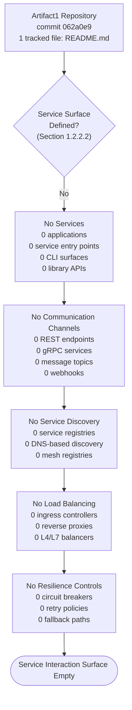

When the first source file, service entry point, or integration channel is committed, this diagram must be replaced with a populated service interaction diagram showing each service as a node and each communication channel as a labeled edge, consistent with the Expected Mature Form specified in Section 5.7.2.

---

### 6.1.3 Scalability Design

#### 6.1.3.1 Horizontal and Vertical Scaling Approach

No scaling approach is defined. Section 2.5.4 records categorically that "no scalability considerations are defined. No horizontal-scaling model, vertical-scaling model, sharding strategy, partitioning strategy, or capacity-planning input has been committed to the repository. The system does not yet exist as a runtime, so scalability has no current operational meaning."

The two scaling axes prescribed by the Section 6.1 prompt are uniformly empty:

| Scaling Axis | Pattern Family | Status at Current Commit |
|--------------|----------------|--------------------------|
| Horizontal | Stateless replication; sharded stateful sets; cell-based isolation | Not defined (Section 2.5.4) |
| Vertical | CPU/memory uplift; instance-class upgrade | Not defined (Section 2.5.4) |
| Data | Sharding, partitioning, read-replicas, CQRS read sides | Not defined (Section 2.5.4; Section 3.6.1) |
| Read-Path | Caching, CDN, replicas | Not defined (Section 3.6.3; Section 5.4.5) |

#### 6.1.3.2 Auto-Scaling Triggers and Rules

No auto-scaling triggers or rules are defined. Auto-scaling presupposes (a) an orchestration platform or managed-service control plane that can observe load signals and adjust capacity, and (b) committed scaling policies (CPU/memory utilization thresholds, queue depth thresholds, request-rate thresholds, scheduled scaling windows). Neither condition is satisfied:

- No orchestration platform is configured (Section 3.7.5).
- No infrastructure-as-code manifests are committed (Section 3.7.7).
- No observability signals exist from which scaling triggers could be derived (Section 5.5.1).
- No service exists whose capacity could be adjusted (Section 1.2.2.2).

Common auto-scaling primitives (Kubernetes Horizontal Pod Autoscaler, Vertical Pod Autoscaler, Cluster Autoscaler, AWS Auto Scaling Groups, AWS Application Auto Scaling, Azure VM Scale Sets, GCP Managed Instance Groups, serverless concurrency controls) are therefore uniformly inapplicable at this commit.

#### 6.1.3.3 Resource Allocation Strategy

No resource allocation strategy is defined. Section 5.5.5 records that the "Resource Utilization Cap" performance dimension is "Not declared" and that its future-source trigger is the "First resource-request / resource-limit committed." Because no container manifests exist (Section 3.7.4) and no orchestration manifests exist (Section 3.7.5), no resource-request, resource-limit, quality-of-service class, priority class, or eviction policy is committed at this commit. Common resource-allocation models (best-effort, burstable, guaranteed; reserved instances vs. on-demand; spot/preemptible vs. on-demand) are therefore not yet selected.

#### 6.1.3.4 Performance Optimization Techniques

No performance optimization techniques are documented because no performance targets have been declared against which optimization could be measured. Section 5.5.5 records the categorical absence:

| Performance Dimension | Current Status | Future-Source Trigger |
|-----------------------|----------------|----------------------|
| Latency Target (P50 / P95 / P99) | Not declared | First SLI / SLO committed |
| Throughput Target (RPS, EPS) | Not declared | First capacity-planning artifact committed |
| Concurrency Target | Not declared | First concurrency model declared in code or config |
| Resource Utilization Cap | Not declared | First resource-request / resource-limit committed |

Without latency, throughput, concurrency, or utilization targets, classical optimization techniques (algorithmic complexity reduction, caching, connection pooling, batching, asynchronous I/O, request collapsing, payload compression, query optimization, indexing, prepared statements, JIT/AOT tuning, garbage-collector tuning, CDN offload) cannot be ranked or selected. They are deferred until the first performance target is committed.

#### 6.1.3.5 Capacity Planning Guidelines

No capacity planning guidelines are committed. Section 2.5.4 confirms that no "capacity-planning input has been committed to the repository," and Section 5.5.5 confirms that no "throughput target" and no "concurrency target" are declared. Conventional capacity-planning inputs — peak-traffic forecasts, growth curves, seasonality models, headroom budgets, error-budget policies, queue-depth ceilings — are categorically absent. The future-source trigger for this subsection, per Section 5.7.1, is the "First scalability or capacity-planning artifact committed."

#### 6.1.3.6 Scalability Architecture Diagram (Empty-State)

The Scalability Architecture diagram prescribed by the Section 6.1 prompt is empty at the current commit, consistent with the empty-state convention established in Section 5.6.3.

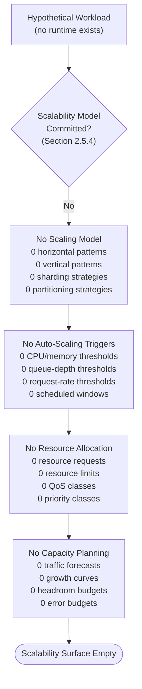

When the first scalability or capacity-planning artifact is committed, this diagram must be replaced with a populated scalability architecture diagram showing the scaling axis (horizontal/vertical), the trigger signals, the resource-allocation policies, and the capacity envelope, consistent with the Expected Mature Form specified in Section 5.7.2.

---

### 6.1.4 Resilience Patterns

#### 6.1.4.1 Fault Tolerance Mechanisms

No fault tolerance mechanisms are declared. Section 5.5.3 records that every error-handling control class — retry mechanisms, fallback processes, error notification flows, recovery procedures, exception class hierarchies, status-code mappings, and error contracts — is "Not declared" at the current commit. Common fault-tolerance patterns (circuit breaker, bulkhead, timeout, retry-with-exponential-backoff-and-jitter, hedged requests, request collapsing, idempotency tokens, dead-letter queues, compensating transactions, saga orchestration) are categorically absent because the prerequisite executable surface (Section 1.2.2.1), error model (Section 2.5.5), and integration substrate (Section 1.2.1.3) are themselves absent.

#### 6.1.4.2 Disaster Recovery Procedures

No disaster recovery procedures are documented. Section 5.5.6 records the categorical absence with primary-source citations:

| DR Dimension | Current Status | Authoritative Evidence |
|--------------|----------------|------------------------|
| Recovery Point Objective (RPO) | Not declared | Section 4.4.2; no data store to recover (Section 3.6.1) |
| Recovery Time Objective (RTO) | Not declared | Section 4.4.2; no runtime to restore (Section 1.2.1.2) |
| Backup Strategy | Not declared | Section 3.6.4 (no storage tier beyond Git) |
| Restore Procedure | Not declared | Section 4.4.2 (no data store, no runbook) |
| Failover Topology | Not declared | Section 2.5.4 (no topology declared) |
| Business-Continuity Plan | Not declared | Section 1.2.1.2 (no operational system) |

Per Section 5.5.6 and Section 4.4.2: "with no runtime, no infrastructure, no data store, and no integration to recover, no runbook, restore procedure, replay process, or compensating action can be authored."

#### 6.1.4.3 Data Redundancy Approach

No application-data redundancy approach is committed because no application data store exists. Section 3.6.1 confirms that "no primary or secondary database is configured across any class — relational, document NoSQL, key-value, column-family, graph, search/vector, time-series, or analytical/OLAP." Section 3.6.4 confirms that no object-storage, file-storage, or block-storage service is integrated. Without a data plane, no replication factor, no quorum policy, no multi-AZ or multi-region replication, no cross-region read-replica, no synchronous-vs.-asynchronous replication choice, and no consistency model selection (strong, causal, monotonic, eventual) can be authored.

The single redundancy-relevant property currently in force is inherent to Git itself, as recorded in Section 5.5.6:

| Asset Class | Redundancy Mechanism | Provided By |
|-------------|----------------------|-------------|
| Source code & commit history | Distributed VCS replication via clones | Git (any clone holds the complete tree and history) |
| Repository content integrity | Content-addressable SHA-1 verification | Git (Section 3.9.1) |
| Remote availability | GitHub-operated hosting | GitHub Inc. (Section 3.5.6) |
| Application data | *(none — no data store exists)* | *(no provider — Section 3.6.1)* |

This property protects **source-code availability**; it does not constitute application-data redundancy, because the application and its data plane do not yet exist.

#### 6.1.4.4 Failover Configurations

No failover configuration is declared. Failover requires (a) a primary instance whose health is monitored and (b) at least one standby (active-passive) or peer (active-active) instance to which traffic can be redirected on primary failure. Per Section 1.2.2.2 (0 services / 0 applications) and Section 5.5.6 ("Failover Topology: Not declared"), neither role is currently filled. Common failover topologies (active-active across availability zones, active-passive cross-region, leader-follower with automatic promotion, DNS-based failover, anycast routing) are uniformly inapplicable at this commit.

#### 6.1.4.5 Service Degradation Policies

No service degradation policies are declared. Graceful degradation presupposes (a) a primary path that can be downgraded and (b) a fallback path or reduced-feature mode that can be served. Per Section 5.5.3, no "fallback processes" are declared because there is "no primary path from which to fall back," and no error-handling controls are committed. Common degradation patterns (feature flags driving brown-out, stale-cache responses, read-only mode under write failure, sampled responses, queue-shed under load, default-response fallback, dependency-failure isolation via bulkhead) are categorically inapplicable until the prerequisite primary path is committed.

#### 6.1.4.6 Resilience Pattern Implementation Diagram (Empty-State)

The Resilience Pattern Implementation diagram prescribed by the Section 6.1 prompt is empty at the current commit, consistent with the empty-error-surface diagram established in Section 5.5.7.

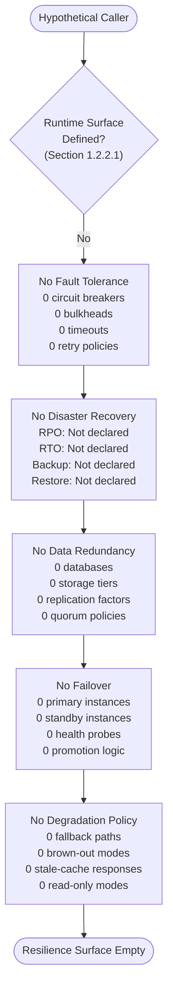

When the first resilience artifact is committed — e.g., a retry policy, a circuit-breaker configuration, a backup configuration, a failover topology, a runbook — this diagram must be replaced with the standard try / classify / retry / fallback / failover / notify / recover pattern populated with the actual controls.

---

### 6.1.5 Lifecycle and Trigger Conditions for Future Revisions

This section will be revised in lockstep with the repository's evolution, in keeping with the lifecycle expectations established in Section 1.4.2 and the trigger conditions catalogued in Section 5.7.1. The table below maps each Section 6.1 prompt-required topic to the specific repository event that, when committed, will require this section's corresponding subsection to be populated.

#### 6.1.5.1 Service Components Triggers

| Section 6.1 Topic | Triggering Repository Event | Resulting Update |
|-------------------|----------------------------|------------------|
| Service Boundaries & Responsibilities | First source-code file committed (any language) | Populate 6.1.2.1 with bounded contexts and responsibilities |
| Inter-Service Communication | First API spec (OpenAPI / GraphQL / gRPC / AsyncAPI) or broker config committed | Populate 6.1.2.2 with chosen pattern and protocol |
| Service Discovery | First service-registry or DNS-based discovery config committed | Populate 6.1.2.3 with discovery substrate |
| Load Balancing | First reverse-proxy, ingress, or LB config committed | Populate 6.1.2.4 with algorithm and topology |
| Circuit Breakers | First circuit-breaker library or configuration committed | Populate 6.1.2.5 with thresholds and fallback action |
| Retry & Fallback | First retry policy or fallback handler committed | Populate 6.1.2.6 with backoff/jitter and fallback path |

#### 6.1.5.2 Scalability Design Triggers

| Section 6.1 Topic | Triggering Repository Event | Resulting Update |
|-------------------|----------------------------|------------------|
| Horizontal/Vertical Scaling | First scalability or capacity-planning artifact committed | Populate 6.1.3.1 with scaling axis and policy |
| Auto-Scaling Triggers | First orchestration manifest with auto-scaling policy committed | Populate 6.1.3.2 with trigger signals and rules |
| Resource Allocation | First container or orchestration manifest with resource requests/limits committed | Populate 6.1.3.3 with QoS class and limits |
| Performance Optimization | First SLI / SLO / performance target committed | Populate 6.1.3.4 with optimization techniques |
| Capacity Planning | First traffic forecast, growth curve, or headroom budget committed | Populate 6.1.3.5 with capacity-planning guidelines |

#### 6.1.5.3 Resilience Patterns Triggers

| Section 6.1 Topic | Triggering Repository Event | Resulting Update |
|-------------------|----------------------------|------------------|
| Fault Tolerance | First retry, bulkhead, timeout, or circuit-breaker artifact committed | Populate 6.1.4.1 with mechanisms by error class |
| Disaster Recovery | First DR runbook, RPO/RTO declaration, or backup configuration committed | Populate 6.1.4.2 with DR objectives and procedures |
| Data Redundancy | First database schema or replication configuration committed | Populate 6.1.4.3 with replication factor and consistency model |
| Failover | First failover topology or health-probe configuration committed | Populate 6.1.4.4 with active-active or active-passive design |
| Service Degradation | First feature flag, brown-out mode, or fallback handler committed | Populate 6.1.4.5 with degradation tiers |

#### 6.1.5.4 Revision Recording Convention

Per the versioning conventions in Sections 3.10.3, 4.7.4, and 5.7.4, each triggering commit that populates a row in any Section 6.1 table must record the introducing commit hash and the date of introduction, so that the evolution of the Core Services Architecture remains auditable. The current revision of Section 6.1 is anchored to commit **`062a0e9480ac957eb1d519f39813240f0798ea86`** (May 28, 2026), at which the Core Services Architecture surface area is documented as **categorically not applicable**, in conformance with the Section 6.1 prompt directive ("If the system does not require microservices, distributed architecture, or distinct service components, clearly state 'Core Services Architecture is not applicable for this system' and explain why").

---

### 6.1.6 References

#### 6.1.6.1 Repository Artifacts Examined

- `README.md` — Sole tracked file (11 bytes); content is the single H1 heading `# Artifact1`. Confirms the pre-implementation state that drives the not-applicable determination.
- `/` (repository root) — Verified via folder enumeration to contain only `README.md`. No source folders, no configuration directories, no build manifests, no test suites, no deployment artifacts, no orchestration manifests, no infrastructure-as-code artifacts.
- `.git/` — Git metadata directory; established as the Version-Control System per Section 5.6.1. Not a runtime service component.

#### 6.1.6.2 Technical Specification Sections Cross-Referenced

- **Section 1.1.1** — Repository identity, commit hash, default branch, single-commit history establishing pre-implementation state.
- **Section 1.2.1.2** — Confirms no operational system exists; "current system limitations" inapplicable.
- **Section 1.2.1.3** — Confirms all external-integration categories ("External API Clients", "Database Connections", "Message Brokers/Queues", "Identity/Auth Providers", "Observability Endpoints", "Build/CI Integrations") are "Not present."
- **Section 1.2.2.1** — Confirms no executable surface (no service entry point, no CLI, no library API, no UI).
- **Section 1.2.2.2** — Confirms zero components across all classes (Services, Libraries, Configuration Artifacts, Build Artifacts).
- **Section 1.2.2.3** — Confirms no technical approach, language, framework, runtime, or design decision declared.
- **Section 1.2.3.3** — Confirms all four KPI categories (Functional/Business, Technical/Performance, Reliability/Availability SLOs, Quality/Defect) are empty.
- **Section 1.4.1** — Binding evidence-only authoring posture grounding all of Section 6.1.
- **Section 1.4.2** — Lifecycle expectation requiring revision on each meaningful commit.
- **Section 1.4.3** — Reader guidance that "not present"/"not applicable" notations are current-state observations.
- **Section 2.5.2** — Established constraints: Git, GitHub, `main` (the four established elements).
- **Section 2.5.3** — Confirms no latency, throughput, concurrency, or resource-utilization targets.
- **Section 2.5.4** — Confirms no horizontal-scaling model, vertical-scaling model, sharding strategy, partitioning strategy, or capacity-planning input.
- **Section 2.5.5** — Confirms no authentication, authorization, encryption, secrets-management, or threat-model artifacts.
- **Section 3.1.3** — Binding non-adoption of the prompt's default technology stack.
- **Section 3.4.1** — Confirms no dependency manifest exists; no resilience or retry libraries declared.
- **Section 3.5** — Confirms no runtime integrations of any class.
- **Section 3.5.2** — Confirms no API specification.
- **Section 3.5.3** — Confirms no authentication service configured.
- **Section 3.5.4** — Confirms no monitoring/observability tool integrated.
- **Section 3.5.6** — GitHub identified as the sole development-platform service (not a runtime integration).
- **Section 3.6.1** — Confirms no database configured across any class.
- **Section 3.6.3** — Confirms no caching layer configured.
- **Section 3.6.4** — Confirms no object/file/block-storage service integrated.
- **Section 3.7.1** — Establishes Git/GitHub/`main` development-platform configuration.
- **Section 3.7.4** — Confirms no container images built.
- **Section 3.7.5** — Confirms no orchestration platform configured.
- **Section 3.7.7** — Confirms no infrastructure-as-code manifests committed.
- **Section 3.9.1** — Confirms Git SHA-based commit integrity is the only in-force security control.
- **Section 4.4.1** — Confirms no state-management substrate, no caching pattern in force.
- **Section 4.4.2** — Authoritative enumeration of categorical absence of retry, fallback, circuit breaker, bulkhead, timeout, error notification, and recovery procedures.
- **Section 4.6.2** — Confirms no SLAs, SLOs, or SLIs documented.
- **Section 5.1.1** — Binding evidence-only posture for Section 5 (and inherited by Section 6).
- **Section 5.1.3** — Architecture Surface Area Summary documenting all 24 architectural inputs as Not declared/defined/chosen/configured (with four established development-platform exceptions).
- **Section 5.2.1.1** — Confirms no overall architecture style declared.
- **Section 5.2.1.2** — Confirms no architectural principles or patterns declared.
- **Section 5.2.1.3** — Confirms no system boundaries or major interfaces defined.
- **Section 5.2.2** — Empty Core Components table convention reused in Section 6.1.2.1.
- **Section 5.2.4** — Empty External Integration Points table convention reused in Section 6.1.2.2.
- **Section 5.4.3** — Confirms no communication pattern chosen.
- **Section 5.4.5** — Confirms no caching strategy chosen.
- **Section 5.4.8** — Empty Decision Tree Diagram convention reused in Section 6.1.2.7.
- **Section 5.5.1** — Confirms no monitoring/observability approach adopted; no metrics, logs, traces, or audit events.
- **Section 5.5.3** — Authoritative table of error-handling control absence (retry, fallback, notification, recovery, exceptions, status codes, error contracts).
- **Section 5.5.5** — Authoritative table of performance-dimension absence (latency, throughput, concurrency, resource utilization, availability SLO, error-budget policy).
- **Section 5.5.6** — Authoritative DR table (RPO, RTO, backup, restore, failover, BCP) all "Not declared"; Git/GitHub as source-code redundancy only.
- **Section 5.5.7** — Empty Error Handling Flow Diagram convention reused in Section 6.1.4.6.
- **Section 5.6** — Established Architecture Elements (Git, GitHub, `main`, Markdown) — development-platform only, not runtime services.
- **Section 5.6.3** — Empty-state Architecture Topology Diagram convention reused in Section 6.1.2.7, 6.1.3.6, and 6.1.4.6.
- **Section 5.7.1** — Authoritative catalogue of trigger conditions for future revisions of Section 5 and (by inheritance) Section 6.
- **Section 5.7.2** — Expected Mature Form specification for diagrams that Section 6.1 must populate when the prerequisite artifacts are committed.
- **Section 5.7.4** — Versioning convention requiring introducing commit hash and date on each populated row.

## 6.2 Database Design

### 6.2.1 Applicability Determination

**Database Design is not applicable to this system at commit `062a0e9480ac957eb1d519f39813240f0798ea86` (May 28, 2026).**

The `Artifact1` repository at the current commit contains exactly one tracked file — `README.md` (11 bytes) holding the single H1 heading `# Artifact1` — and no other source, configuration, schema, migration, ORM, or storage artifact. The Section 6.2 prompt's "Database Design" topic presupposes the existence of at least one persistence tier (relational, NoSQL, key-value, column-family, graph, search, time-series, analytical, or object-storage), a data model that requires entity-relationship description, and a set of operational concerns (indexing, partitioning, replication, backup, migration, caching, compliance, optimization) that derive from that persistence tier. Section 3.6 categorically establishes that none of these preconditions is present in the repository, and the system does not yet require — and has not yet adopted — any persistent storage interaction that would warrant a populated Database Design specification.

This determination is binding for the current revision of Section 6.2. It is anchored in the evidence-only authoring posture established in Section 1.4.1 — that this specification is grounded exclusively in the verified contents of the `Artifact1` repository at commit `062a0e9480ac957eb1d519f39813240f0798ea86`, and where information is absent from the repository, this document explicitly says so rather than inferring, projecting, or speculating about the project's eventual nature. Per Section 1.4.3, all "not applicable" / "not configured" / "not declared" notations in this section must be interpreted as **current-state observations**, not as permanent product decisions. The section mirrors the structural precedent set by Section 6.1.1 (Core Services Architecture not-applicable determination), which was anchored to the same commit and adopted the same empty-state documentation convention.

#### 6.2.1.1 Preconditions for Database Design That Are Not Met

The table below enumerates the structural preconditions for a Database Design specification and confirms, with primary-source citations, that each precondition is absent at the current commit.

| Precondition | Required For | Current-Commit Status |
|--------------|--------------|-----------------------|
| At least one configured database (any class) | Schema design; entity relationships; indexing | Absent — 0 databases configured (Section 3.6.1) |
| At least one data model, schema, or ORM declaration | Data structures; entity relationships; migrations | Absent — no data model declared (Section 3.6.2) |
| At least one caching layer or in-process cache | Caching policies; cache invalidation; read-through | Absent — no caching layer configured (Section 3.6.3) |
| At least one storage service (object/file/block) | Backup architecture; archival; binary persistence | Absent — no storage service integrated (Section 3.6.4) |
| At least one performance target or capacity envelope | Query optimization; connection pooling; batch sizing | Absent — no performance targets declared (Section 5.5.5) |
| At least one compliance, retention, or privacy artifact | Data-retention rules; access controls; audit hooks | Absent — no compliance regime documented (Section 4.6.3) |

Because every precondition is categorically absent, no schema-design dimension, no data-management dimension, no compliance dimension, and no performance-optimization dimension prescribed by the Section 6.2 prompt can be substantively populated. The remainder of Section 6.2 documents, for each prompt-required topic, the empty-state evidence and the trigger condition that will reverse the determination.

#### 6.2.1.2 Non-Adoption of the Default Technology Stack

Per Section 3.1.3 and Section 5.1.1, the prompt's accompanying default technology stack (which includes MongoDB as a candidate document-database technology) is explicitly **not** adopted as this project's chosen persistence layer. Enumerating MongoDB — or any other database product — as the project's selected data store in Section 6.2 would directly violate the binding evidence-only posture inherited from Section 1.4.1 and would contradict Section 1.2.2.3's explicit statement that no technical approach, language, framework, or runtime has been declared. The same constraint applies symmetrically to every other candidate persistence technology, including but not limited to PostgreSQL, MySQL, Redis, DynamoDB, Cassandra, Neo4j, Elasticsearch, InfluxDB, and Snowflake. Section 6.2 therefore documents the empty database-design surface area as it actually exists at commit `062a0e9`, rather than as it might appear if any default stack were assumed.

#### 6.2.1.3 The Only Established Persistent Surface (Git Object Database — Developer Artifact, Not Runtime Database)

Section 5.6.1 records that the entirety of architecturally-relevant evidence at this commit consists of four development-platform elements, of which only one has any "persistent" character — and that one is the Git object database, which is a developer-facing source-control artifact rather than a runtime application database. The table below clarifies this distinction explicitly so that the reader does not conflate source-code versioning with application persistence.

| Element | Established Value | Architectural Role |
|---------|-------------------|--------------------|
| Git object database (`.git/`) | SHA-1 content-addressable file store | Source-of-truth integrity for tracked files; **not** a runtime database |
| Remote Git hosting | GitHub | Centralized remote at `github.com/ShaliniTest-maker/Artifact1`; **not** a runtime database |
| Default branch | `main` | Canonical integration line for source code; **not** a data partition |
| Sole tracked file | `README.md` (11 bytes) | Single Markdown file; **not** a schema, migration, or model |

The Git object database stores blobs, trees, commits, and tags addressed by SHA-1 hashes; it does not expose query interfaces, transactional semantics, indexing strategies, or replication topologies in the sense that the Section 6.2 prompt requires. Per Section 6.1.1.3, these four elements describe how source code is versioned and hosted; they do not constitute a database, a data store, or a persistence tier in the runtime sense.

---

## 6.2 Schema Design

The Schema Design dimension prescribed by the Section 6.2 prompt — entity relationships, data models and structures, indexing strategy, partitioning approach, replication configuration, and backup architecture — is uniformly empty at the current commit. Each subsection below documents the categorical absence with primary-source citations and identifies the future repository event that will populate the corresponding subsection.

#### 6.2.2.1 Entity Relationships

No entity relationships are defined. Section 3.6.2 records that "because there is no data model, no schema, no migration framework, and no ORM, the project has no current notion of data ownership, durability guarantees, consistency model, or transaction boundaries." Section 1.3.2 establishes "Data Domains Included: None — no data model, schema, or data sources defined." Section 5.3.4's State Transition Diagram (empty-state form) catalogs zero entities, zero schemas, zero aggregates, and zero sagas at the current commit.

Because no entities exist, no one-to-one, one-to-many, many-to-many, or self-referential relationships can be authored. No referential integrity constraints, no foreign-key declarations, no cascading rules (CASCADE, RESTRICT, SET NULL, SET DEFAULT, NO ACTION), and no entity-lifecycle ownership rules are committed.

#### 6.2.2.2 Data Models and Structures

No data models or data structures are documented. Section 3.6.1's primary-source enumeration confirms that no database is configured across any class — relational, document NoSQL, key-value, column-family, graph, search/vector, time-series, or analytical/OLAP — and therefore no normalized schema, denormalized document shape, key-value tuple structure, wide-row column-family layout, property-graph node/edge type, search index mapping, time-series measurement schema, or columnar table definition is present.

| Data-Model Family | Representative Modeling Artifact | Status at Current Commit |
|-------------------|----------------------------------|--------------------------|
| Relational | Tables, columns, constraints (3NF/BCNF/Star/Snowflake) | Not defined (Section 3.6.1) |
| Document | JSON/BSON document shapes, embedded vs. referenced | Not defined (Section 3.6.1) |
| Key-Value | Key namespaces, value serialization formats | Not defined (Section 3.6.1) |
| Column-Family | Partition keys, clustering keys, wide-row layout | Not defined (Section 3.6.1) |

#### 6.2.2.3 Indexing Strategy

No indexing strategy is declared. Indexing presupposes both a data store in which indexes are created and a query workload against which index utility can be reasoned. Per Section 3.6.1, no database is configured; per Section 5.5.5, no latency, throughput, or concurrency target is declared from which an index-coverage requirement could be derived. The full catalog of index types (B-tree, hash, bitmap, GIN, GiST, BRIN, R-tree, full-text, geospatial, vector ANN/HNSW/IVF, covering, partial, expression, unique, primary, composite, descending) is therefore uniformly inapplicable at this commit.

The Documented Indexes and Constraints table prescribed by the Section 6.2 prompt is empty:

| Index / Constraint Name | Target Entity / Field | Type | Status |
|--------------------------|------------------------|------|--------|
| *(none — 0 indexes defined)* | *(no entity exists — Section 3.6.2)* | *(no index type chosen)* | Not configured |
| *(none — 0 constraints defined)* | *(no schema exists — Section 3.6.1)* | *(no constraint type chosen)* | Not configured |

When the first schema artifact is committed, this table must be populated with one row per index and one row per constraint, recording the index/constraint name, the target column(s), the index type or constraint class (UNIQUE, CHECK, NOT NULL, FOREIGN KEY, PRIMARY KEY, EXCLUSION), and the rationale for inclusion.

#### 6.2.2.4 Partitioning Approach

No partitioning approach is declared. Section 2.5.4 records categorically that "no horizontal-scaling model, vertical-scaling model, sharding strategy, partitioning strategy, or capacity-planning input has been committed to the repository." Common partitioning patterns (range partitioning, hash partitioning, list partitioning, composite partitioning, geographic/region-based sharding, tenant-based isolation, time-based partitioning, consistent-hashing rings, virtual-bucket schemes) are therefore uniformly inapplicable at this commit because (a) no database exists in which partitions could be defined and (b) no workload characteristics exist from which a partitioning key could be derived.

#### 6.2.2.5 Replication Configuration

No replication configuration is declared. Section 6.1.4.3 establishes that "without a data plane, no replication factor, no quorum policy, no multi-AZ or multi-region replication, no cross-region read-replica, no synchronous-vs.-asynchronous replication choice, and no consistency model selection (strong, causal, monotonic, eventual) can be authored."

| Replication Dimension | Current-Commit Status | Primary-Source Evidence |
|------------------------|----------------------|-------------------------|
| Replication factor (N) | Not declared | Section 6.1.4.3 |
| Write quorum (W) / Read quorum (R) | Not declared | Section 6.1.4.3 |
| Replication topology (primary-replica, multi-primary, leaderless) | Not declared | Section 6.1.4.3 |
| Consistency model (strong, causal, monotonic, eventual) | Not declared | Section 3.6.2 |

The single redundancy-relevant property currently in force is inherent to Git itself and protects source-code availability, **not** application data, as documented in Section 6.1.4.3.

#### 6.2.2.6 Backup Architecture

No backup architecture is declared. Section 5.5.6 records the categorical absence:

| Backup Dimension | Current-Commit Status | Primary-Source Evidence |
|------------------|----------------------|-------------------------|
| Backup Strategy (full/incremental/differential) | Not declared | Section 5.5.6 |
| Recovery Point Objective (RPO) | Not declared | Section 5.5.6; no data store to recover (Section 3.6.1) |
| Restore Procedure | Not declared | Section 4.4.2; no data store, no runbook |
| Backup Storage Target (object store, tape, snapshot) | Not declared | Section 3.6.4 (no storage tier beyond Git) |

Because there is no data store from which a backup could be taken (Section 3.6.1) and no storage tier into which a backup artifact could be written (Section 3.6.4), the full spectrum of backup techniques (logical dumps, physical block snapshots, continuous WAL streaming, point-in-time recovery, cross-region snapshot replication, backup encryption, retention tiers, lifecycle policies) is uniformly inapplicable at this commit.

#### 6.2.2.7 Entity-Relationship Diagram (Empty-State)

The Entity-Relationship Diagram prescribed by the Section 6.2 prompt is empty at the current commit, in keeping with the empty-state diagram convention established in Sections 5.3.3, 5.3.4, 5.3.5, 5.4.8, 5.5.7, 5.6.3, 6.1.2.7, 6.1.3.6, and 6.1.4.6.

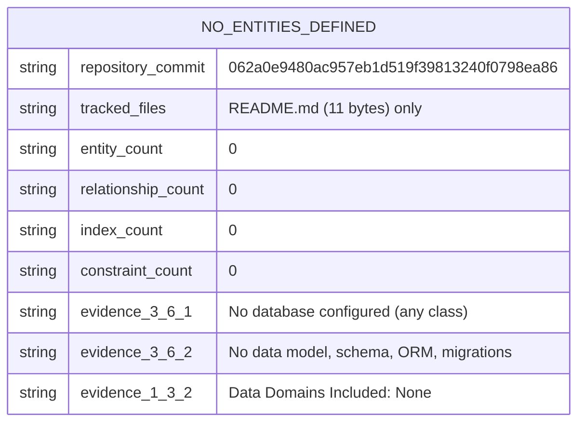

When the first schema artifact (DDL file, ORM model, migration script, schema-as-code definition, JSON Schema document, Avro/Protobuf message, or equivalent) is committed, this diagram must be replaced with a populated ERD showing each entity as a node, each relationship as a labeled edge with cardinality annotations (1:1, 1:N, N:M), and each attribute with its data type and constraint flags, consistent with the Expected Mature Form pattern documented in Section 5.7.2.

---

### 6.2.3 Data Management

The Data Management dimension prescribed by the Section 6.2 prompt — migration procedures, versioning strategy, archival policies, data storage and retrieval mechanisms, and caching policies — is uniformly empty at the current commit. Each subsection below documents the categorical absence with primary-source citations.

#### 6.2.3.1 Migration Procedures

No migration procedures are documented. Section 3.6.2 establishes that "there is no data model, no schema, no migration framework, and no ORM." Because no schema exists to migrate from, no migration tool is configured (Alembic, Flyway, Liquibase, Knex migrations, Sequelize migrations, Prisma Migrate, EF Core Migrations, Django Migrations, Rails ActiveRecord Migrations, Atlas, sqitch, golang-migrate, mongo-migrate). No forward-migration, no rollback, no zero-downtime migration pattern (expand-contract, parallel-change, dual-write, shadow-table, online schema change), and no migration-orchestration policy is committed at this commit.

#### 6.2.3.2 Versioning Strategy

No schema versioning strategy is declared. Schema versioning presupposes a schema to version; per Section 3.6.2, none exists. Common schema-versioning techniques (monotonic version-number columns, schema-history tables, content-hash schema fingerprints, semantic version tags on migration scripts, contract-versioning headers for API-bound schemas) are uniformly inapplicable at this commit. The only versioning mechanism in force at the repository level is Git's commit history (Section 5.6.1), which versions source-code state — not application-data schemas.

#### 6.2.3.3 Archival Policies

No archival policies are documented. Archival presupposes (a) a primary data store from which records age out, (b) a secondary storage tier into which archived records are written, and (c) a retention regime that motivates the archival schedule. Per Section 3.6.1 (no database), Section 3.6.4 (no storage service), and Section 4.6.3 (no compliance/retention regime documented), none of these prerequisites is satisfied. Common archival patterns (cold-storage promotion, table partitioning with old-partition detachment, S3/Glacier lifecycle policies, tiered storage with hot/warm/cold layers, logical archival via flag columns, write-once-read-many compliance archives) are therefore uniformly inapplicable at this commit.

#### 6.2.3.4 Data Storage and Retrieval Mechanisms

No data storage or retrieval mechanisms are configured. Per Sections 3.6.1 and 3.6.4:

| Storage / Retrieval Class | Status at Current Commit | Primary-Source Evidence |
|----------------------------|--------------------------|-------------------------|
| Relational storage / SQL retrieval | Not configured | Section 3.6.1 |
| Document storage / document query (MQL, AQL, N1QL) | Not configured | Section 3.6.1 |
| Key-value storage / GET-SET retrieval | Not configured | Section 3.6.1 |
| Object/file/block storage and retrieval | Not configured | Section 3.6.4 |

Because no data plane exists, no driver, no client library, no DSN string, no connection pool, no prepared-statement cache, no query builder, no ODM/ORM session, and no streaming-result-set pattern is committed. The retrieval surface is categorically empty.

#### 6.2.3.5 Caching Policies

No caching policies are documented. Section 3.6.3 records that "no caching layer is configured. There is no Redis, Memcached, Hazelcast, Apache Ignite, Varnish, or CDN-edge-cache configuration in the repository. No in-process caching library is declared either (because no dependency manifest exists, per Section 3.4.1)." Section 5.4.5 confirms that "no caching strategy has been chosen." Per Section 4.4.1, no cache-aside, write-through, write-behind, read-through, or refresh-ahead pattern can apply because there is no source-of-truth from which to populate a cache and no consumer that would read from one.

| Cache Pattern | Status at Current Commit | Reason for Inapplicability |
|---------------|--------------------------|-----------------------------|
| Cache-Aside (Lazy Loading) | Not applicable | No source-of-truth data store (Section 3.6.1) |
| Read-Through | Not applicable | No cache provider configured (Section 3.6.3) |
| Write-Through | Not applicable | No writer surface exists (Section 1.2.2.1) |
| Write-Behind (Write-Back) | Not applicable | No queue or worker substrate exists (Section 1.2.1.3) |
| Refresh-Ahead | Not applicable | No predictive workload profile (Section 5.5.5) |

#### 6.2.3.6 Data Flow Diagram (Empty-State)

The Data Flow Diagram prescribed by the Section 6.2 prompt is empty at the current commit. Section 5.2.3 establishes the categorical absence in primary-source terms: no source-to-sink data paths exist, no integration patterns or protocols are chosen, no data transformation points exist, and no data stores or caches exist.

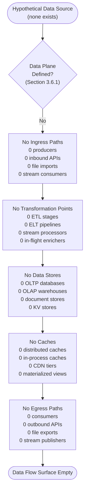

When the first data-plane artifact (schema, migration, ORM model, cache configuration, or storage binding) is committed, this diagram must be replaced with a populated data-flow diagram showing each producer, each transformation, each store, each cache, and each consumer with labeled edges denoting protocol and payload class.

---

### 6.2.4 Compliance Considerations

The Compliance Considerations dimension prescribed by the Section 6.2 prompt — data retention rules, backup and fault tolerance policies, privacy controls, audit mechanisms, and access controls — is uniformly empty at the current commit. Each subsection below documents the categorical absence with primary-source citations.

#### 6.2.4.1 Data Retention Rules

No data retention rules are documented. Section 4.6.3 records that "no regulatory compliance considerations are documented... No data-protection regime, financial regulation, healthcare regulation, accessibility standard (WCAG, Section 508, EN 301 549), or industry-specific standard has been committed to the repository." Common retention regimes (GDPR Article 5(1)(e) storage-limitation periods, CCPA/CPRA disclosure-window retention, HIPAA six-year retention, SOX seven-year retention, PCI-DSS one-year retention with three-month immediate availability, FERPA, GLBA, FCRA-derived retention windows) are therefore uniformly inapplicable at this commit. Because no data store exists (Section 3.6.1), no record could currently exceed any retention boundary even if one were declared.

#### 6.2.4.2 Backup and Fault Tolerance Policies

No backup or fault-tolerance policies are declared. Section 5.5.6 records the categorical absence of all six DR dimensions (RPO, RTO, Backup Strategy, Restore Procedure, Failover Topology, Business-Continuity Plan), and Section 5.5.3 records the categorical absence of every error-handling control class (retry, fallback, error notification, recovery procedures). Per Section 6.1.4.1, common fault-tolerance patterns (circuit breaker, bulkhead, timeout, retry-with-exponential-backoff-and-jitter, hedged requests, request collapsing, idempotency tokens, dead-letter queues, compensating transactions, saga orchestration) are categorically absent because the prerequisite executable surface (Section 1.2.2.1) and error model (Section 2.5.5) are themselves absent. For data-specific fault tolerance — synchronous replication, write-ahead-log shipping, multi-region active-active, snapshot-and-restore, geo-redundant backup — the prerequisite data store is itself absent (Section 3.6.1).

#### 6.2.4.3 Privacy Controls

No privacy controls are configured. Section 3.9.1 records the categorical absence of data-protection primitives:

| Privacy Control | Status at Current Commit | Implication |
|-----------------|--------------------------|-------------|
| Encryption at Rest | Not configured | No storage system exists to encrypt (Section 3.6) |
| Encryption in Transit (TLS) | Not configured | No HTTP server, client, or TLS configuration committed |
| Identity / Access Management | Not configured | No auth provider integration (Section 3.5.3) |
| Secrets Management | Not configured | No secrets-handling library or vault integration (Section 2.5.5) |

Common privacy primitives that operate on data — column-level encryption, transparent data encryption (TDE), tokenization, format-preserving encryption, deterministic vs. probabilistic encryption, k-anonymity, l-diversity, t-closeness, differential privacy, data masking, dynamic data masking, row-level security, attribute-based access control on PII columns, data-subject-access-request (DSAR) workflows, right-to-erasure pipelines, cross-border data residency controls — are uniformly inapplicable at this commit because no data exists to protect (Section 3.6.1) and no privacy regime has been adopted (Section 4.6.3).

The only integrity-relevant property currently in force is the Git SHA-based commit integrity (Section 3.9.1), which protects source-code authenticity rather than application data privacy.

#### 6.2.4.4 Audit Mechanisms

No audit mechanisms are configured. Section 5.5.1 records that all four observability pillars (Metrics, Logs, Traces, Events/Audit) are "Not configured" at the current commit. Common database-audit primitives (audit-log tables, system_audit views, pgAudit-style extension hooks, MongoDB audit log filters, MySQL audit plugin output, SQL Server SQL Audit specifications, AWS CloudTrail data events, GCP Cloud Audit Logs Data Access, Azure SQL Auditing, change-data-capture (CDC) streams routed to immutable sinks, write-once-read-many (WORM) compliance archives, append-only ledger constructs) are uniformly inapplicable at this commit because no database exists to instrument (Section 3.6.1) and no audit-event sink is configured (Section 5.5.1).

#### 6.2.4.5 Access Controls

No access controls are declared. Section 5.5.4 records that no authentication and authorization framework has been adopted, and Section 3.5.3 records that no authentication service is configured. Database-level access-control primitives (GRANT/REVOKE statements, role-based access control via database roles, attribute-based access control via row-level security predicates, column-level privileges, schema-level privileges, fine-grained access control through views, proxy-user mapping, database firewall rules, IP allow-listing on the database listener, mutual-TLS client-certificate authentication to the database, IAM-database-authentication via cloud-provider tokens, secrets-rotation policies for database credentials) are uniformly inapplicable at this commit because no database exists against which access could be authorized (Section 3.6.1) and no identity substrate exists from which subjects could be enumerated (Section 3.5.3).

---

### 6.2.5 Performance Optimization

The Performance Optimization dimension prescribed by the Section 6.2 prompt — query optimization patterns, caching strategy, connection pooling, read/write splitting, and batch processing approach — is uniformly empty at the current commit. Each subsection below documents the categorical absence with primary-source citations.

#### 6.2.5.1 Query Optimization Patterns

No query optimization patterns are documented. Query optimization presupposes (a) a database against which queries are executed and (b) a workload from which hot paths can be identified. Per Section 3.6.1, no database is configured; per Section 5.5.5, no latency, throughput, concurrency, or resource-utilization target is declared. Common optimization techniques (EXPLAIN-plan-driven index addition, query rewriting, predicate pushdown, join-order tuning, materialized views, denormalization, covering indexes, partial indexes, query hints, statistics refresh, prepared-statement caching, plan-cache pinning, parallel-query directives, vectorized execution, columnar projection pruning) are uniformly inapplicable at this commit.

#### 6.2.5.2 Caching Strategy

No caching strategy is chosen. Section 5.4.5 records categorically that "no caching strategy has been chosen," and Section 3.6.3 confirms that no caching layer is configured. Section 4.4.1 documents that "no cache-aside/write-through/write-behind/read-through/refresh-ahead patterns can apply" because there is no source-of-truth data store and no consumer of cached data. Common caching topologies (client-side cache, gateway cache, distributed in-memory cache cluster, CDN edge cache, application-tier in-process cache, materialized-view cache, query-result cache, denormalized read-model cache, near-cache for hot keys, cache hierarchies with TTL/LRU/LFU eviction policies) are uniformly inapplicable at this commit.

#### 6.2.5.3 Connection Pooling

No connection pooling is configured. Connection pooling presupposes (a) a connection target (database listener, broker, service endpoint) and (b) a client library or pool manager that maintains a bounded set of long-lived connections. Per Section 3.6.1, no database listener exists; per Section 3.4.1, no dependency manifest exists in which a pool library could be declared. Common pooling implementations (HikariCP, c3p0, DBCP2, Tomcat JDBC Pool, PgBouncer, PgPool-II, ProxySQL, ConnectionPool in Node `pg`/`mysql2`, SQLAlchemy pool, Django CONN_MAX_AGE, ADO.NET connection pooling, R2DBC connection factories) are therefore uniformly inapplicable at this commit. No pool sizing parameters (minimum idle, maximum size, connection timeout, idle timeout, leak detection threshold, validation query) are committed.

#### 6.2.5.4 Read/Write Splitting

No read/write splitting is configured. Read/write splitting presupposes (a) a primary database that handles writes, (b) one or more read replicas that serve reads, and (c) a routing layer (driver-side, proxy-side, or application-side) that directs each statement to the appropriate target. Per Section 6.1.4.3, no replication factor, no quorum policy, no multi-AZ or multi-region replication, no cross-region read-replica, and no consistency model selection is committed; per Section 3.6.1, no database exists in any form. Common splitting topologies (driver-side primary/replica DSN pairs, proxy-side routing through ProxySQL/HAProxy/Vitess, application-side routing through query-tagging hints, eventually-consistent read replicas with stale-read tolerance windows, geographically distributed read replicas with latency-aware routing) are uniformly inapplicable at this commit.

#### 6.2.5.5 Batch Processing Approach

No batch processing approach is documented. Batch processing presupposes (a) an executable surface that can run a batch job and (b) a data plane against which batch operations are performed. Per Section 1.2.2.1, no executable surface exists (no service entry point, no CLI, no scheduled job, no scheduler binding); per Section 3.6.1, no data plane exists. Common batch-processing patterns (bulk INSERT/COPY with batched payloads, chunked UPSERT, fan-out/fan-in via worker pools, scheduled ETL jobs, micro-batch stream processing, change-data-capture batch propagation, snapshot-and-replay re-materialization, idempotent upsert with deterministic keys, two-phase commit batch coordination, saga-coordinated batch workflows) are uniformly inapplicable at this commit. No transaction boundaries (Section 4.4.1) are defined within which a batch could be scoped.

#### 6.2.5.6 Replication Architecture Diagram (Empty-State)

The Replication Architecture Diagram prescribed by the Section 6.2 prompt is empty at the current commit, in keeping with the empty-state convention established in Sections 5.3.3, 5.5.7, 5.6.3, 6.1.2.7, 6.1.3.6, and 6.1.4.6.

```mermaid
flowchart TD
    Client(["Hypothetical Client<br/>(no caller exists — Section 1.2.2.1)"])
    Eval{"Replication Topology<br/>Declared?<br/>(Section 6.1.4.3)"}
    NoPrimary["No Primary Node<br/>0 write masters<br/>0 leader instances<br/>0 source-of-truth nodes<br/>0 write quorums"]
    NoReplica["No Replica Nodes<br/>0 read replicas<br/>0 standby instances<br/>0 follower nodes<br/>0 read quorums"]
    NoTopology["No Topology<br/>0 primary-replica pairs<br/>0 multi-primary rings<br/>0 leaderless clusters<br/>0 chain-replication links"]
    NoConsistency["No Consistency Model<br/>0 strong-consistency guarantees<br/>0 causal-consistency markers<br/>0 monotonic-read guarantees<br/>0 eventual-consistency windows"]
    NoSplit["No Read/Write Splitting<br/>0 routing proxies<br/>0 driver-side splits<br/>0 query-tagging policies<br/>0 stale-read tolerances"]
    NoBackup["No Backup Pipeline<br/>0 snapshot schedules<br/>0 WAL-shipping links<br/>0 PITR archives<br/>0 cross-region copies"]
    Terminal(["Replication Architecture Empty"])

    Client --> Eval
    Eval -->|"No"| NoPrimary
    NoPrimary --> NoReplica
    NoReplica --> NoTopology
    NoTopology --> NoConsistency
    NoConsistency --> NoSplit
    NoSplit --> NoBackup
    NoBackup --> Terminal
```

When the first replication-relevant artifact is committed — a database connection string with replica hosts, a cluster manifest declaring primary/replica roles, a topology specification (e.g., Patroni configuration, RDS read-replica association, MongoDB replica-set configuration, Cassandra topology file, CockroachDB locality flags) — this diagram must be replaced with a populated replication-architecture diagram showing each node, the direction and synchronicity of replication edges, the quorum policies, and the consistency model in force.

---

### 6.2.6 Lifecycle and Trigger Conditions for Future Revisions

Section 6.2 will be revised in lockstep with the repository's evolution, in keeping with the lifecycle expectations established in Section 1.4.2 and the trigger conditions catalogued in Section 5.7.1. The table below maps each Section 6.2 prompt-required topic to the specific repository event that, when committed, will require this section's corresponding subsection to be populated.

#### 6.2.6.1 Schema Design Triggers

| Section 6.2 Topic | Triggering Repository Event | Resulting Update |
|-------------------|----------------------------|------------------|
| Entity Relationships | First schema, ORM model, or DDL file committed | Populate 6.2.2.1 with entities and relationship cardinalities |
| Data Models & Structures | First schema-as-code or JSON-Schema / Avro / Protobuf committed | Populate 6.2.2.2 with the chosen data model family |
| Indexing Strategy | First index DDL or ORM index declaration committed | Populate 6.2.2.3 indexes-and-constraints table |
| Partitioning Approach | First partitioning DDL or sharding configuration committed | Populate 6.2.2.4 with partition keys and strategy |
| Replication Configuration | First replica/cluster topology configuration committed | Populate 6.2.2.5 with replication factor and consistency model |
| Backup Architecture | First backup schedule, retention policy, or snapshot config committed | Populate 6.2.2.6 with RPO and backup mechanism |

#### 6.2.6.2 Data Management Triggers

| Section 6.2 Topic | Triggering Repository Event | Resulting Update |
|-------------------|----------------------------|------------------|
| Migration Procedures | First migration framework binding committed | Populate 6.2.3.1 with migration tool and policy |
| Versioning Strategy | First schema-version table, history table, or migration sequence committed | Populate 6.2.3.2 with versioning convention |
| Archival Policies | First archival or lifecycle policy artifact committed | Populate 6.2.3.3 with archival tiers and schedule |
| Storage & Retrieval | First database driver / client / DSN configuration committed | Populate 6.2.3.4 with access path inventory |
| Caching Policies | First cache configuration or cache-binding library committed | Populate 6.2.3.5 with cache patterns and TTLs |

#### 6.2.6.3 Compliance Triggers

| Section 6.2 Topic | Triggering Repository Event | Resulting Update |
|-------------------|----------------------------|------------------|
| Data Retention Rules | First retention or data-classification policy committed | Populate 6.2.4.1 with retention windows by data class |
| Backup & Fault Tolerance | First DR runbook, RPO/RTO declaration, or failover topology committed | Populate 6.2.4.2 with DR objectives and procedures |
| Privacy Controls | First encryption / IAM / secrets-management configuration committed | Populate 6.2.4.3 with privacy primitives by data class |
| Audit Mechanisms | First audit-event emitter or audit-log specification committed | Populate 6.2.4.4 with audit-event taxonomy |
| Access Controls | First database GRANT/REVOKE or RBAC/ABAC policy committed | Populate 6.2.4.5 with role/permission matrix |

#### 6.2.6.4 Performance Optimization Triggers

| Section 6.2 Topic | Triggering Repository Event | Resulting Update |
|-------------------|----------------------------|------------------|
| Query Optimization | First SLI / SLO / query-performance target committed | Populate 6.2.5.1 with hot-path optimization patterns |
| Caching Strategy | First caching configuration committed | Populate 6.2.5.2 with chosen cache pattern and policy |
| Connection Pooling | First pool-library binding or pool-sizing configuration committed | Populate 6.2.5.3 with pool parameters |
| Read/Write Splitting | First replica-aware DSN or routing-proxy configuration committed | Populate 6.2.5.4 with routing rules |
| Batch Processing | First batch-job, scheduled-task, or ETL/ELT artifact committed | Populate 6.2.5.5 with batch boundaries and idempotency strategy |

#### 6.2.6.5 Revision Recording Convention

Per the versioning convention established in Sections 3.10.3, 4.7.4, and 5.7.4, each triggering commit that populates a row in any Section 6.2 table must record the introducing commit hash and the date of introduction, so that the evolution of the Database Design remains auditable. The current revision of Section 6.2 is anchored to commit **`062a0e9480ac957eb1d519f39813240f0798ea86`** (May 28, 2026), at which the Database Design surface area is documented as **categorically not applicable**, in conformance with the Section 6.2 prompt directive ("If the system does not require or direct database or persistent storage interactions are not clearly evident, clearly state 'Database Design is not applicable to this system' and explain why").

---

### 6.2.7 References

#### 6.2.7.1 Repository Artifacts Examined

- `README.md` — Sole tracked file (11 bytes); content is the single H1 heading `# Artifact1`. Confirms the pre-implementation state that drives the not-applicable determination for Database Design. Contains no schema, no migration, no model, no DDL, no JSON-Schema, no Avro/Protobuf, no DSN, and no storage configuration.
- `/` (repository root) — Verified via folder enumeration to contain only `README.md`. No `schemas/`, `migrations/`, `db/`, `models/`, `orm/`, `entities/`, `data/`, `cache/`, `storage/`, `seeds/`, or comparable persistence directory exists.
- `.git/` — Git metadata directory; established as the Version-Control System per Section 5.6.1. Contains the SHA-1 content-addressable object database; is a source-control artifact, **not** a runtime application database, per Section 6.1.1.3.

#### 6.2.7.2 Technical Specification Sections Cross-Referenced

- **Section 1.1.1** — Repository identity, commit hash, default branch, single-commit history establishing pre-implementation state for Section 6.2.
- **Section 1.2.1.2** — Confirms no operational system exists; confirms there is no runtime against which a database could be bound.
- **Section 1.2.1.3** — Confirms "Database Connections" integration category is "Not present."
- **Section 1.2.2.1** — Confirms no executable surface from which database queries could be issued.
- **Section 1.2.2.2** — Confirms zero components across all classes (Services, Libraries, Configuration Artifacts, Build Artifacts).
- **Section 1.2.2.3** — Confirms no technical approach, language, framework, or runtime declared.
- **Section 1.3.2** — Establishes "Data Domains Included: None — no data model, schema, or data sources defined."
- **Section 1.3.3.1** — Explicitly excludes "Persistence Layers (Databases, Caches, File Stores)" from scope.
- **Section 1.4.1** — Binding evidence-only authoring posture grounding all of Section 6.2.
- **Section 1.4.2** — Lifecycle expectation requiring revision on each meaningful commit.
- **Section 1.4.3** — Reader guidance that "not present" / "not applicable" notations are current-state observations.
- **Section 2.5.4** — Authoritative source confirming no horizontal-scaling, vertical-scaling, sharding, partitioning, or capacity-planning input committed.
- **Section 2.5.5** — Confirms no encryption, secrets-management, or threat-model artifacts; informs the Privacy Controls subsection.
- **Section 3.1.3** — Binding non-adoption of the prompt's default technology stack, including MongoDB.
- **Section 3.4.1** — Confirms no dependency manifest exists; no database drivers, ORMs, or migration tools declared.
- **Section 3.5.3** — Confirms no authentication service configured; informs the Access Controls subsection.
- **Section 3.6.1** — **Primary authoritative source** — confirms no primary or secondary database is configured across any class (relational, document NoSQL, key-value, column-family, graph, search/vector, time-series, analytical/OLAP).
- **Section 3.6.2** — Authoritative source confirming no data persistence strategy, no data model, no schema, no migration framework, and no ORM.
- **Section 3.6.3** — Authoritative source confirming no caching layer is configured (no Redis, Memcached, Hazelcast, Apache Ignite, Varnish, CDN edge cache, or in-process cache).
- **Section 3.6.4** — Authoritative source confirming no object-storage, file-storage, or block-storage service is integrated; identifies `.git/` as a developer-facing artifact rather than a runtime storage tier.
- **Section 3.9.1** — Confirms no encryption at rest, no encryption in transit, no IAM, and no secrets management; informs the Privacy Controls subsection.
- **Section 4.4.1** — Confirms no state transitions, no data persistence points, no caching requirements, and no transaction boundaries.
- **Section 4.4.2** — Confirms no retry, no fallback, no error notification, and no recovery procedures; informs the Backup & Fault Tolerance subsection.
- **Section 4.6.3** — Confirms no regulatory compliance, no data-protection regime, and no retention policy documented; informs the Data Retention Rules subsection.
- **Section 5.1.3** — Architecture Surface Area Summary documenting Data Stores=None, Caches=None.
- **Section 5.2.3** — Confirms no primary data flows, no source-to-sink data paths, no integration patterns/protocols chosen, no data transformation points, and no data stores/caches; informs the Data Flow Diagram empty-state form.
- **Section 5.3.4** — Provides the empty-state State Transition Diagram pattern (zero entities, schemas, aggregates, sagas) directly applicable to Section 6.2's ERD empty-state form.
- **Section 5.4.4** — Confirms no data storage solution has been chosen; reinforces the empty Schema Design surface.
- **Section 5.4.5** — Confirms no caching strategy has been chosen; informs the Caching Policies and Caching Strategy subsections.
- **Section 5.5.1** — Confirms no observability — no metrics, no logs, no traces, no audit events; informs the Audit Mechanisms subsection.
- **Section 5.5.3** — Authoritative table of error-handling control absence; informs the Backup & Fault Tolerance subsection.
- **Section 5.5.4** — Confirms no authentication and authorization framework adopted; informs the Access Controls subsection.
- **Section 5.5.5** — Authoritative table of performance-dimension absence (latency, throughput, concurrency, resource utilization); informs the Performance Optimization dimension.
- **Section 5.5.6** — Authoritative DR table (RPO, RTO, backup, restore, failover, BCP) all "Not declared"; Git/GitHub as source-code redundancy only.
- **Section 5.6.1** — Established Architecture Elements (Git, GitHub, `main`, Markdown) — development-platform only; confirms `.git/` is not a runtime database.
- **Section 5.7.1** — Authoritative catalogue of trigger conditions for future revisions, including database schema, caching configuration, DR runbook, and connection-pooling triggers.
- **Section 5.7.2** — Expected Mature Form specification for diagrams that Section 6.2 must populate when prerequisite artifacts are committed.
- **Section 5.7.4** — Versioning convention requiring introducing commit hash and date on each populated row.
- **Section 6.1.1** — **Authoritative precedent** — the immediately preceding section made an identical "not applicable" determination, providing the binding template for Section 6.2's structure, tone, and citation patterns.
- **Section 6.1.1.3** — Provides the explicit caveat distinguishing the Git object database (developer artifact) from a runtime database (absent).
- **Section 6.1.4.3** — Authoritative source for the Data Redundancy absence (no replication factor, no quorum policy, no multi-AZ/region replication, no consistency model) directly inherited by Section 6.2.2.5 and 6.2.5.4.

## 6.3 Integration Architecture

### 6.3.1 Applicability Determination

**Integration Architecture is not applicable for this system at commit `062a0e9480ac957eb1d519f39813240f0798ea86` (May 28, 2026).**

The `Artifact1` repository at the current commit contains exactly one tracked file — `README.md` (11 bytes) holding the single H1 heading `# Artifact1` — and no other source, configuration, deployment, or infrastructure artifacts. As the Section 6.3 prompt's "Integration Architecture" topic presupposes the existence of caller-callee pairs, communication protocols, message-passing infrastructure, or external-system dependencies, none of those preconditions is present in the repository. The system does not yet require, and has not yet adopted, any integration surface that would warrant a populated Integration Architecture specification.

This determination is binding for the current revision of Section 6.3. It is anchored in the evidence-only authoring posture established in Section 1.4.1 — that this specification is "grounded exclusively in the verified contents of the `Artifact1` repository at commit `062a0e9480ac957eb1d519f39813240f0798ea86`," and "where information is absent from the repository, this document explicitly says so rather than inferring, projecting, or speculating about the project's eventual nature." Per Section 1.4.3, all "not applicable" notations in this section must be interpreted as **current-state observations**, not as permanent product decisions. This determination directly inherits the structural precedents established in Section 6.1.1 (Core Services Architecture not applicable) and Section 6.2.1 (Database Design not applicable), both of which are anchored to the same commit.

#### 6.3.1.1 Preconditions for Integration Architecture That Are Not Met

The table below enumerates the structural preconditions for an Integration Architecture and confirms, with primary-source citations, that each precondition is absent at the current commit.

| Precondition | Required For | Current-Commit Status |
|--------------|--------------|------------------------|
| At least one inbound or outbound interface | API design; protocol selection; contract authoring | Absent — 0 interfaces defined (Section 5.2.1.3) |
| At least one external system or service | Third-party integration; legacy adapters; service contracts | Absent — 0 integrations declared (Section 1.2.1.3) |
| At least one message-passing substrate | Event processing; queueing; streaming; batch processing | Absent — no broker/queue/stream configured (Section 1.2.1.3) |
| At least one identity / authorization artifact | Authentication methods; authorization framework | Absent — no IdP, no token logic, no policy (Section 5.5.4) |
| At least one error-handling control | Error handling strategy; retry; DLQ; compensating action | Absent — no retry, fallback, or recovery (Section 4.4.2) |

Because every precondition is categorically absent, no API Design dimension, no Message Processing dimension, and no External Systems dimension prescribed by the Section 6.3 prompt can be substantively populated. The remainder of this section documents, for each prompt-required topic, the empty-state evidence and the trigger condition that will reverse the determination.

#### 6.3.1.2 Non-Adoption of the Default Technology Stack

Per Section 3.1.3 and Section 5.1.1, the prompt's accompanying default technology stack (AWS, Docker, Kubernetes, Terraform, GitHub Actions, Python/Flask, Auth0, MongoDB, LangChain, React/TypeScript, TailwindCSS, React Native, Swift, Kotlin, Objective-C, ElectronJS) is explicitly **not** adopted as this project's chosen integration substrate. Enumerating those technologies as integration-architecture choices in Section 6.3 — for instance, naming AWS API Gateway as the gateway, Auth0 as the identity provider, or Amazon SQS/SNS as the message broker — would directly violate the binding evidence-only posture inherited from Section 1.4.1, would contradict Section 1.2.2.3's explicit statement that no technical approach has been declared, and would mirror the same non-adoption posture already enforced in Sections 6.1.1.2 and 6.2.1.2 (by inference from those sections' identical non-adoption clauses).

Section 6.3 therefore documents the empty integration surface area as it actually exists at commit `062a0e9`, rather than as it might appear if the default stack were assumed.

#### 6.3.1.3 The Only Established Integration Element (Development Platform, Not Runtime Integration)

Section 5.2.4's External Integration Points table records that the entirety of integration-relevant evidence at this commit consists of a single development-platform element — GitHub — which is not a runtime integration concern:

| Element | Established Value | Architectural Role |
|---------|-------------------|--------------------|
| Remote Hosting Platform | GitHub (github.com) | Centralized Git remote at `github.com/ShaliniTest-maker/Artifact1` |
| Transport Protocol | Git Smart HTTP over HTTPS | Source-code distribution only (push/pull/fetch) |
| Interaction Model | Developer workflow | Not initiated by the application; no runtime callers exist |

As Section 3.5.6 emphasizes, GitHub is a *development-platform* service rather than a *runtime* integration, and per Section 5.6.1 the Git protocol exchange transports source-code state — it does not constitute an application-layer API, a message-broker channel, an identity-provider federation, or any other category of integration prescribed by the Section 6.3 prompt. This element is noted here for completeness so that the reader can distinguish "the repository has no integration of any kind" (incorrect — Git/GitHub is established as the development platform) from "the repository has no runtime integration architecture" (correct, per Section 5.2.4 and Section 1.2.1.3).

---

### 6.3.2 API Design

The API Design dimension prescribed by the Section 6.3 prompt — protocol specifications, authentication methods, authorization framework, rate limiting strategy, versioning approach, and documentation standards — is uniformly empty at the current commit. Each subsection below documents the categorical absence with primary-source citations and identifies the future repository event that will populate the corresponding subsection.

#### 6.3.2.1 Protocol Specifications

No API protocol specification is committed. Section 3.5.2 records categorically that "no external APIs or third-party API clients are integrated. The repository contains no OpenAPI/Swagger specification, no GraphQL schema, no gRPC `.proto` definition, no SDK installation, and no API-client manifest." Section 5.4.3 reinforces this with the binding statement that "no communication pattern choice has been made... common communication patterns — synchronous RPC, REST over HTTP, GraphQL, gRPC, asynchronous messaging (publish/subscribe, point-to-point, request/reply), event streaming, file-based exchange, shared database, callback/webhook — are all inapplicable because there is no caller and no callee."

The Protocol Specification table prescribed by the Section 6.3 prompt is therefore empty:

| Protocol Family | Representative Specifications | Status at Current Commit |
|-----------------|-------------------------------|--------------------------|
| Synchronous HTTP | REST, OpenAPI 3.x, JSON:API, HAL, HATEOAS | Not specified (Section 3.5.2) |
| Strongly-Typed RPC | gRPC + Protocol Buffers, Apache Thrift, Cap'n Proto | Not specified (Section 3.5.2) |
| Query-Based | GraphQL (SDL + introspection), OData | Not specified (Section 3.5.2) |
| Asynchronous / Real-Time | AsyncAPI, WebSocket, Server-Sent Events, MQTT, AMQP | Not specified (Section 1.2.1.3) |

When the first interface-definition artifact is committed (an OpenAPI YAML, a GraphQL `.graphql` SDL file, a `.proto` definition, an AsyncAPI document, or equivalent), this subsection must record the chosen protocol family, the wire format, the schema-evolution policy, and the rationale for the selection.

#### 6.3.2.2 Authentication Methods

No authentication method is configured. Section 5.5.4 records that "no authentication or authorization framework has been adopted" and that concretely:

- No identity provider integration exists (no Auth0, Okta, Cognito, Azure AD B2C, Firebase Auth).
- No federation protocol is configured (no SAML, OIDC, OAuth 2.0, LDAP).
- No token-signing or session-validation logic is committed (no JWT signing keys, no session secrets).

Section 3.5.3 reinforces this with the binding statement that "no authentication service is configured" and Section 2.5.5 confirms that "no authentication model, authorization model, data-classification scheme, encryption-at-rest configuration, encryption-in-transit configuration, secrets-management strategy, or threat model has been committed to the repository."

| Authentication Family | Representative Mechanism | Status at Current Commit |
|-----------------------|--------------------------|--------------------------|
| Bearer-Token | OAuth 2.0 Access Tokens, JWT, PASETO | Not configured (Section 5.5.4) |
| Federated Identity | OIDC, SAML 2.0, WS-Federation | Not configured (Section 3.5.3) |
| Credential-Based | HTTP Basic, HTTP Digest, mTLS client certificates | Not configured (Section 5.5.4) |
| API-Key Based | API keys, HMAC-signed requests (e.g., AWS SigV4) | Not configured (Section 5.5.4) |

When the first authentication artifact is committed (a JWT validator middleware, an OIDC client registration, an Auth0/Okta tenant binding, an mTLS truststore, or equivalent), this subsection must record the chosen mechanism, the identity provider, the token format and lifetime, the rotation policy, and the corresponding policy-enforcement points.

#### 6.3.2.3 Authorization Framework

No authorization framework is configured. Section 5.5.4 records that "no authorization model is committed (no role-based access control, no attribute-based access control, no policy-as-code)." The authorization decision substrate is therefore categorically empty:

| Authorization Family | Representative Mechanism | Status at Current Commit |
|----------------------|--------------------------|--------------------------|
| Role-Based (RBAC) | Static role tables, group membership claims | Not configured (Section 5.5.4) |
| Attribute-Based (ABAC) | XACML, AWS IAM conditions, attribute claims | Not configured (Section 5.5.4) |
| Policy-as-Code | OPA/Rego, Cedar, Casbin, Zanzibar relations | Not configured (Section 5.5.4) |
| Relationship-Based (ReBAC) | Google Zanzibar, AuthZed/SpiceDB, OpenFGA | Not configured (Section 5.5.4) |

Common policy-enforcement points (PEPs) — API-gateway authorizers, middleware filters, service-mesh sidecars, library-level decorators, database row-level-security predicates — are uniformly inapplicable at this commit because (a) no executable surface exists in which to embed a PEP per Section 1.2.2.1, and (b) no authentication substrate exists from which to enumerate subjects per Section 5.5.4. When the first authorization artifact is committed, this subsection must record the chosen model, the policy-decision point (PDP) location, the policy-enforcement-point locations, and the policy evaluation latency budget.

#### 6.3.2.4 Rate Limiting Strategy

No rate limiting strategy is configured. Rate limiting presupposes (a) an interface surface from which requests originate and (b) a quota-enforcement substrate (API gateway, ingress controller, in-process middleware, or reverse-proxy filter) that observes and meters those requests. Neither condition is satisfied:

- No interface surface exists (Section 1.2.1.3 confirms zero External API Clients; Section 5.2.1.3 confirms "No major interfaces are defined").
- No API gateway, no reverse proxy, no ingress controller is configured (Section 6.1.2.4 records that "no reverse proxy, API gateway, ingress controller, or layer-4/layer-7 load balancer is configured").
- No dependency manifest exists in which a rate-limiting library could be declared (Section 3.4.1).

| Rate-Limiting Algorithm | Representative Implementation | Status at Current Commit |
|-------------------------|-------------------------------|--------------------------|
| Token Bucket | NGINX `limit_req`, Envoy local rate limit, Redis-backed buckets | Not configured (Section 6.1.2.4) |
| Leaky Bucket | HAProxy stick tables, gateway plugins | Not configured (Section 6.1.2.4) |
| Fixed / Sliding Window | API Gateway usage plans, sliding-log counters | Not configured (Section 6.1.2.4) |
| Concurrency / In-Flight Limit | Bulkhead pattern, semaphore-bounded executors | Not configured (Section 6.1.2.5) |

When the first rate-limiting configuration is committed (a gateway throttling rule, a middleware quota config, a Redis-backed token-bucket implementation, or equivalent), this subsection must record the algorithm, the quota dimensions (per-IP, per-API-key, per-tenant, per-endpoint), the burst tolerance, the rejection contract (HTTP 429 vs. queue-then-drop), and the back-pressure behavior.

#### 6.3.2.5 Versioning Approach

No API versioning approach is declared. API versioning presupposes (a) at least one published API specification that has reached a stable contract boundary and (b) a strategy for evolving that contract without breaking consumers. Per Section 3.5.2 (no API specification exists in any form), neither condition is satisfied. Common versioning strategies are therefore uniformly inapplicable at this commit:

| Versioning Strategy | Representative Mechanism | Status at Current Commit |
|---------------------|--------------------------|--------------------------|
| URL Path Versioning | `/v1/`, `/v2/` prefixes in route definitions | Not adopted (Section 3.5.2) |
| Media-Type / Header Versioning | `Accept: application/vnd.example.v2+json` | Not adopted (Section 3.5.2) |
| Query-Parameter Versioning | `?version=2`, `?api-version=2024-01` | Not adopted (Section 3.5.2) |
| Semantic Versioning of Contract | SemVer on OpenAPI/AsyncAPI/gRPC contract files | Not adopted (Section 3.5.2) |

When the first API specification is committed, this subsection must record the chosen versioning strategy, the deprecation policy (how long old versions are supported), the sunset-header convention, and the breaking-change classification rules (what constitutes a major-version bump vs. a backward-compatible addition).

#### 6.3.2.6 Documentation Standards

No API documentation standards are adopted. API documentation presupposes the existence of an API to document; per Section 3.5.2, no API specification of any kind has been committed. The standard documentation toolchain options are uniformly inapplicable at this commit:

| Documentation Toolchain | Representative Tools | Status at Current Commit |
|-------------------------|----------------------|--------------------------|
| OpenAPI-Driven Rendering | Swagger UI, Redoc, Redocly, Stoplight Elements | Not adopted (Section 3.5.2) |
| GraphQL Documentation | GraphQL Voyager, GraphiQL, SpectaQL | Not adopted (Section 3.5.2) |
| gRPC / Protobuf Documentation | `protoc-gen-doc`, Buf Schema Registry | Not adopted (Section 3.5.2) |
| Collection / Workspace Tools | Postman, Insomnia, Bruno, ReadMe.com | Not adopted (Section 3.5.2) |

The only documentation artifact currently in the repository is `README.md` (11 bytes containing the single H1 heading `# Artifact1`); per the analysis in Section 5.2.2, this is documentation scaffolding rather than an API documentation artifact. When the first API specification is committed, this subsection must record the chosen documentation toolchain, the hosting strategy (developer portal, GitHub Pages, static site, integrated dev environment), the freshness-enforcement mechanism (spec-driven CI checks, contract-test linkages), and the audience tier structure (internal API consumers vs. external partners).

#### 6.3.2.7 API Architecture Diagram (Empty-State)

The API Architecture Diagram prescribed by the Section 6.3 prompt is empty at the current commit, in keeping with the empty-state diagram convention established in Sections 4.5.4, 5.3.5, 6.1.2.7, 6.1.3.6, 6.1.4.6, 6.2.2.7, and 6.2.5.6. The diagram below visualizes the categorical absence of every API-architecture dimension prescribed by the Section 6.3 prompt.

```mermaid
flowchart TD
    Client([Hypothetical API Client])
    Eval{"API Surface<br/>Defined?<br/>(Section 3.5.2)"}
    NoProto["No Protocol Specification<br/>0 OpenAPI specs<br/>0 GraphQL schemas<br/>0 gRPC .proto files<br/>0 AsyncAPI specs"]
    NoAuth["No Authentication Method<br/>0 OIDC bindings<br/>0 OAuth 2.0 flows<br/>0 JWT signing keys<br/>0 mTLS truststores"]
    NoAuthz["No Authorization Framework<br/>0 RBAC policies<br/>0 ABAC rules<br/>0 policy-as-code artifacts<br/>0 enforcement points"]
    NoRate["No Rate Limiting<br/>0 quota policies<br/>0 throttling configurations<br/>0 token-bucket rules<br/>0 burst tolerances"]
    NoVer["No Versioning Approach<br/>0 URL prefixes<br/>0 version headers<br/>0 media-type strategies<br/>0 deprecation policies"]
    NoDoc["No Documentation Standards<br/>0 Swagger UI deployments<br/>0 Redoc deployments<br/>0 Postman collections<br/>0 developer portals"]
    Terminal([API Architecture Surface Empty])

    Client --> Eval
    Eval -->|"No"| NoProto
    NoProto --> NoAuth
    NoAuth --> NoAuthz
    NoAuthz --> NoRate
    NoRate --> NoVer
    NoVer --> NoDoc
    NoDoc --> Terminal
```

When the first API specification is committed (an OpenAPI document, a GraphQL SDL, a gRPC `.proto`, or an AsyncAPI document), this diagram must be replaced with a populated API architecture diagram showing each API as a node, each protocol as a labeled edge, and the auth/authz/rate-limit/versioning stack as a vertical pipeline through which requests are processed, consistent with the Expected Mature Form specified in Section 5.7.2.

---

### 6.3.3 Message Processing

The Message Processing dimension prescribed by the Section 6.3 prompt — event processing patterns, message queue architecture, stream processing design, batch processing flows, and error handling strategy — is uniformly empty at the current commit. Each subsection below documents the categorical absence with primary-source citations and identifies the future repository event that will populate the corresponding subsection.

#### 6.3.3.1 Event Processing Patterns

No event processing patterns are declared. Event processing presupposes (a) at least one event producer that emits events into a substrate and (b) at least one event consumer that reacts to those events. Per Section 1.2.1.3, the integration category "Message Brokers / Queues" is "Not present" and "Identity / Auth Providers" is "Not present," confirming that no producer and no consumer exists. Per Section 5.4.3, "common communication patterns — synchronous RPC, REST over HTTP, GraphQL, gRPC, asynchronous messaging (publish/subscribe, point-to-point, request/reply), event streaming, file-based exchange, shared database, callback/webhook — are all inapplicable because there is no caller and no callee."

| Event Processing Pattern | Representative Implementation | Status at Current Commit |
|--------------------------|-------------------------------|--------------------------|
| Publish-Subscribe (Pub/Sub) | Topic-based fan-out to N subscribers | Not declared (Section 5.4.3) |
| Event Sourcing | Append-only event log as source of truth | Not declared (Section 5.4.3) |
| CQRS Read-Model Projection | Event-driven materialized views | Not declared (Section 5.4.3) |
| Saga / Choreography | Distributed transaction via event chains | Not declared (Section 6.1.2.6) |

When the first event-handler binding or pub/sub configuration is committed, this subsection must record the chosen pattern, the event-schema registry, the ordering and delivery guarantees (at-most-once, at-least-once, exactly-once), the idempotency strategy, and the consumer-group semantics.

#### 6.3.3.2 Message Queue Architecture

No message queue architecture is configured. Section 1.2.1.3's Integration Inventory confirms that "Message Brokers / Queues" — for which the expected evidence would be "Producer/consumer configuration" — is "Not present." Concretely, this means that no broker product is bound to the project, no queue topology is declared, and no producer/consumer client library is committed.

| Message-Broker Family | Representative Product | Status at Current Commit |
|-----------------------|------------------------|--------------------------|
| AMQP-Based Brokers | RabbitMQ, ActiveMQ, Azure Service Bus | Not configured (Section 1.2.1.3) |
| Log-Based Streams | Apache Kafka, AWS Kinesis, Azure Event Hubs, Redpanda | Not configured (Section 1.2.1.3) |
| Cloud-Native Queues | AWS SQS, AWS SNS, GCP Pub/Sub, Azure Storage Queues | Not configured (Section 1.2.1.3) |
| Lightweight Brokers | NATS, MQTT brokers, Redis Streams, ZeroMQ | Not configured (Section 1.2.1.3) |

When the first message-broker configuration is committed — a connection string, a producer/consumer client binding, a topic/queue/exchange manifest, or equivalent — this subsection must record the broker product, the topology (single broker vs. cluster vs. mesh), the exchange/topic taxonomy, the partitioning strategy, the durability and replication parameters, and the consumer-group binding contracts.

#### 6.3.3.3 Stream Processing Design

No stream processing design is documented. Stream processing presupposes (a) a continuous event-stream substrate from which to consume and (b) a stream-processor runtime that performs windowed aggregations, joins, transformations, or stateful computations. Per Section 1.2.1.3 (no message brokers/queues configured) and Section 3.6.1 (no time-series, no analytical/OLAP store configured), neither prerequisite is satisfied.

| Stream-Processor Family | Representative Product | Status at Current Commit |
|-------------------------|------------------------|--------------------------|
| JVM-Based Stream Processors | Apache Flink, Kafka Streams, Apache Storm, Apache Beam | Not configured (Section 1.2.1.3) |
| Polyglot Distributed Processors | Apache Spark Structured Streaming, Apache Pulsar Functions | Not configured (Section 1.2.1.3) |
| Cloud-Native Stream Processors | AWS Kinesis Data Analytics, Azure Stream Analytics, GCP Dataflow | Not configured (Section 1.2.1.3) |
| Lightweight In-Process | Faust, Bytewax, RxJS, Reactor, Akka Streams | Not configured (Section 3.4.1) |

When the first stream-processor framework binding is committed, this subsection must record the chosen runtime, the windowing strategy (tumbling, hopping, session, custom), the watermark policy for late-arriving events, the checkpointing/state-backend configuration, the exactly-once semantics enforcement, and the back-pressure handling.

#### 6.3.3.4 Batch Processing Flows

No batch processing flows are documented. Per Section 6.2.5.5, "no batch processing approach is documented. Batch processing presupposes (a) an executable surface that can run a batch job and (b) a data plane against which batch operations are performed. Per Section 1.2.2.1, no executable surface exists (no service entry point, no CLI, no scheduled job, no scheduler binding); per Section 3.6.1, no data plane exists." Per Section 4.4.1, no transaction boundaries are defined within which a batch could be scoped.

| Batch / Scheduling Family | Representative Product | Status at Current Commit |
|---------------------------|------------------------|--------------------------|
| Cron-Based Schedulers | Unix cron, systemd timers, GitHub Actions schedule, Kubernetes CronJobs | Not configured (Section 1.2.2.1) |
| Workflow Orchestrators | Apache Airflow, Prefect, Dagster, Argo Workflows, Temporal | Not configured (Section 1.2.2.1) |
| Cloud Batch Services | AWS Batch, AWS Step Functions, Azure Batch, GCP Dataflow Batch | Not configured (Section 3.5.5) |
| ETL/ELT Frameworks | dbt, Apache Spark Batch, Apache NiFi, Talend, Informatica | Not configured (Section 3.4.1) |

When the first batch-job, scheduled-task, or ETL/ELT artifact is committed, this subsection must record the orchestrator, the schedule expression, the job-level idempotency strategy, the failure-and-restart semantics, the data-volume envelope per run, the resource-allocation parameters, and the downstream-consumer notification contract.

#### 6.3.3.5 Error Handling Strategy

No error handling strategy for message processing is declared. Section 5.5.3 records the categorical absence of every error-handling control class — retry mechanisms, fallback processes, error notification flows, recovery procedures, exception class hierarchies, status-code mappings, and error contracts. Section 4.4.2 enumerates this absence in primary-source detail and confirms that no retry library, no exponential-backoff/jitter logic, no circuit breaker, no bulkhead, and no timeout policy is configured. Section 6.1.2.6 reiterates that no retry mechanisms and no fallback processes are declared at the current commit.

| Message-Processing Error Control | Representative Mechanism | Status at Current Commit |
|----------------------------------|--------------------------|--------------------------|
| Dead-Letter Queues (DLQ) | Broker-native DLQ, parking-lot queues, error-sink topics | Not configured (Section 4.4.2) |
| Retry with Backoff | Exponential backoff + jitter, retry-with-budget, retry-after | Not configured (Section 5.5.3) |
| Poison-Message Detection | Bounded retry counters, redelivery-count headers | Not configured (Section 5.5.3) |
| Compensating Actions | Saga compensations, outbox-pattern reversal, idempotent rollback | Not configured (Section 6.1.2.6) |

When the first error-handling artifact for message processing is committed — a DLQ binding, a retry policy with backoff, a poison-message handler, a compensating-action handler, or equivalent — this subsection must record the strategy by failure class (transient transport failure, schema-validation failure, business-rule violation, downstream-dependency outage), the redelivery policy, the alerting hooks, and the operator-intervention runbook references.

#### 6.3.3.6 Message Flow Diagram (Empty-State)

The Message Flow Diagram prescribed by the Section 6.3 prompt is empty at the current commit, in keeping with the empty-state diagram convention established in Sections 4.5.4, 5.5.7, 6.1.2.7, 6.2.2.7, and 6.2.3.6. The diagram below visualizes the categorical absence of every message-processing dimension prescribed by the Section 6.3 prompt.

```mermaid
flowchart TD
    Producer([Hypothetical Producer])
    Eval{"Messaging Substrate<br/>Configured?<br/>(Section 1.2.1.3)"}
    NoBroker["No Message Broker<br/>0 Kafka clusters<br/>0 RabbitMQ exchanges<br/>0 SQS queues<br/>0 NATS subjects"]
    NoEvent["No Event Processing<br/>0 event handlers<br/>0 pub/sub channels<br/>0 webhook endpoints<br/>0 saga choreographies"]
    NoStream["No Stream Processing<br/>0 Kafka Streams jobs<br/>0 Flink pipelines<br/>0 Spark Streaming jobs<br/>0 windowing operators"]
    NoBatch["No Batch Processing<br/>0 scheduled jobs<br/>0 cron triggers<br/>0 workflow DAGs<br/>0 ETL pipelines"]
    NoError["No Error Handling Strategy<br/>0 dead-letter queues<br/>0 retry policies<br/>0 compensating actions<br/>0 poison-message handlers"]
    Terminal([Message Flow Surface Empty])

    Producer --> Eval
    Eval -->|"No"| NoBroker
    NoBroker --> NoEvent
    NoEvent --> NoStream
    NoStream --> NoBatch
    NoBatch --> NoError
    NoError --> Terminal
```

When the first message-broker configuration is committed, this diagram must be replaced with a populated message-flow diagram showing each producer, each broker/topic/queue, each consumer group, each stream operator, and each error sink (DLQ, parking lot, alert channel) with labeled edges denoting protocol, payload schema, and delivery guarantee.

---

### 6.3.4 External Systems

The External Systems dimension prescribed by the Section 6.3 prompt — third-party integration patterns, legacy system interfaces, API gateway configuration, and external service contracts — is uniformly empty at the current commit. Each subsection below documents the categorical absence with primary-source citations and identifies the future repository event that will populate the corresponding subsection.

#### 6.3.4.1 Third-Party Integration Patterns

No third-party integration patterns are declared. Section 3.5.1's Integration Inventory confirms that every category of third-party integration — External API Clients, Database Connections, Message Brokers/Queues, Identity/Auth Providers, Observability Endpoints, Build/CI Integrations — is "Not present." Section 1.3.3.3 reinforces this with the binding statement that "all external integrations are not covered by this Technical Specification because none have been declared in the repository. This includes (but is not limited to) third-party APIs, enterprise systems, identity providers, payment processors, analytics platforms, and inter-service communication channels."

| Integration Pattern | Representative Implementation | Status at Current Commit |
|---------------------|-------------------------------|--------------------------|
| Direct SDK Binding | Vendor SDK installation, API client library | Not configured (Section 3.5.2) |
| Webhook Consumer / Emitter | Inbound webhook receivers, outbound webhook publishers | Not configured (Section 1.2.1.3) |
| Backend-for-Frontend (BFF) | Aggregation layer over multiple third-party APIs | Not configured (Section 5.2.1.3) |
| Anti-Corruption Layer (ACL) | Domain-translating adapter for external bounded context | Not configured (Section 5.2.1.2) |

The single confirmed third-party service in use by the project is GitHub (per Section 3.5.6), acting as a Git remote and code-hosting platform; as Section 5.2.4 emphasizes, this is a *development-platform* service rather than a *runtime* integration. When the first third-party SDK manifest or API-client binding is committed, this subsection must record the integration pattern (direct SDK, gateway-mediated, webhook, ACL), the vendor and contract version, the failure-isolation strategy (timeout, circuit breaker, bulkhead), and the credential-management approach.

#### 6.3.4.2 Legacy System Interfaces

No legacy system interfaces are defined. Per Section 1.2.1.2, "the repository does not reference any predecessor system, legacy platform, or system being replaced or upgraded. No migration context, deprecation list, or limitations analysis is committed. Because no operational system exists at this stage, the concept of 'current system limitations' does not directly apply." Consequently, none of the canonical legacy-integration patterns is applicable at this commit:

| Legacy-Integration Pattern | Representative Implementation | Status at Current Commit |
|----------------------------|-------------------------------|--------------------------|
| Strangler Fig Pattern | Incremental migration façade routing to legacy + new | Not applicable (Section 1.2.1.2) |
| Anti-Corruption Layer (ACL) | Domain-translating adapter shielding new from legacy semantics | Not applicable (Section 1.2.1.2) |
| Change-Data-Capture Bridge | CDC stream from legacy DB to new event log | Not applicable (Section 1.2.1.2) |
| File-Drop / Batch Bridge | Scheduled file exchange (CSV, fixed-width, XML, EDI) | Not applicable (Section 1.2.1.2) |

When (and only if) a legacy system enters scope, this subsection must record the legacy-system inventory, the migration strategy, the bidirectional-consistency policy during the transition, the cutover plan, and the post-cutover decommissioning timeline.

#### 6.3.4.3 API Gateway Configuration

No API gateway is configured. Per Section 6.1.2.4, "no reverse proxy, API gateway, ingress controller, or layer-4/layer-7 load balancer is configured." The full inventory of common gateway products is therefore inapplicable at this commit:

| Gateway Class | Representative Product | Status at Current Commit |
|---------------|------------------------|--------------------------|
| Cloud-Managed Gateways | AWS API Gateway, Azure API Management, GCP API Gateway, Apigee | Not configured (Section 3.5.5) |
| Self-Hosted Gateways | Kong, Tyk, KrakenD, WSO2 API Manager, Gravitee | Not configured (Section 6.1.2.4) |
| Service-Mesh Ingress | Istio Gateway, Linkerd ingress, Consul API Gateway | Not configured (Section 6.1.2.4) |
| Reverse Proxies / Ingress Controllers | NGINX, HAProxy, Envoy, Traefik, NGINX Ingress, Istio Ingress | Not configured (Section 6.1.2.4) |

Gateway-mediated concerns — TLS termination, request authentication, request authorization, request transformation, response transformation, rate limiting, caching, request/response logging, traffic mirroring, A/B routing, canary deployment, blue/green deployment, retry/timeout policy, observability fan-out — are uniformly inapplicable at this commit because no gateway exists in which to configure them and no upstream services exist for the gateway to front. When the first gateway or ingress-controller config is committed, this subsection must record the product, the topology (single gateway, multi-gateway active-active, hierarchical edge-and-internal), the policy-attachment model, the upstream-service registry binding, and the observability-export configuration.

#### 6.3.4.4 External Service Contracts

No external service contracts are committed. Section 1.3.3.3's "Integration Points Not Covered" enumeration and Section 5.2.4's empty External Integration Points table jointly confirm that no service contract of any kind — request schema, response schema, error schema, SLA terms, security expectations, data-classification annotations — has been recorded against any external party.

| Contract Type | Representative Artifact | Status at Current Commit |
|---------------|--------------------------|--------------------------|
| Interface Contracts | OpenAPI spec, GraphQL SDL, gRPC `.proto`, AsyncAPI document | Not committed (Section 3.5.2) |
| Behavioral Contracts | Pact files, Spring Cloud Contract DSL, consumer-driven contracts | Not committed (Section 3.5.2) |
| Service-Level Agreements | Latency SLOs, availability SLOs, throughput envelopes | Not committed (Section 5.5.5) |
| Data-Exchange Contracts | Avro schemas, JSON Schema, Protobuf messages, schema-registry bindings | Not committed (Section 3.5.2) |

Section 5.2.4 records that "no SLA requirements are committed for any integration. Per Section 4.6.2, 'no SLAs, SLOs, or SLIs are documented'." When the first external service contract is committed, this subsection must record the contract type, the producing and consuming parties, the contract-evolution policy (forward compatibility, backward compatibility, full compatibility), the verification mechanism (consumer-driven contract test, schema-registry-enforced compatibility check), and the SLA dimensions agreed with each counterparty.

#### 6.3.4.5 Integration Flow Diagram (Empty-State)

The Integration Flow Diagram prescribed by the Section 6.3 prompt is empty at the current commit, in keeping with the empty-state diagram convention established in Sections 4.5.4, 5.3.5, 6.1.2.7, 6.2.2.7, and 6.2.3.6. The diagram below visualizes the categorical absence of every external-systems dimension prescribed by the Section 6.3 prompt, while explicitly recording the single development-platform exception (GitHub) per Section 3.5.6 and Section 5.2.4.

```mermaid
flowchart TD
    Boundary(["Repository Boundary<br/>commit 062a0e9<br/>1 tracked file: README.md"])
    Eval{"External Integration<br/>Declared?<br/>(Section 1.2.1.3)"}
    NoThird["No Third-Party Integrations<br/>0 SDK manifests<br/>0 API client bindings<br/>0 webhook subscriptions<br/>0 partner endpoints"]
    NoLegacy["No Legacy Interfaces<br/>0 anti-corruption layers<br/>0 strangler facades<br/>0 CDC bridges<br/>0 file-drop adapters"]
    NoGateway["No API Gateway<br/>0 ingress controllers<br/>0 managed gateways<br/>0 self-hosted gateways<br/>0 service-mesh edges"]
    NoContract["No Service Contracts<br/>0 OpenAPI contracts<br/>0 consumer-driven contracts<br/>0 schema registries<br/>0 SLA documents"]
    GitHubNote["GitHub<br/>(development-platform service<br/>per Section 3.5.6)<br/>Git Smart HTTP over HTTPS<br/>Not a runtime integration"]
    Terminal([External Integration Surface Empty])

    Boundary --> Eval
    Eval -->|"No"| NoThird
    NoThird --> NoLegacy
    NoLegacy --> NoGateway
    NoGateway --> NoContract
    NoContract --> Terminal
    Boundary -.->|"developer workflow only"| GitHubNote
```

When the first external-systems artifact is committed (a third-party SDK manifest, a legacy-adapter module, an API-gateway configuration, or a service contract), this diagram must be replaced with a populated integration flow diagram showing the repository's runtime as a node, each external party as a node, each integration channel as a labeled edge with protocol and direction, and the gateway (if any) as a mediating node in the request path, consistent with the Expected Mature Form specified in Section 5.7.2.

#### 6.3.4.6 Integration Sequence Diagram (Empty-State)

The integration sequence diagram for key flows prescribed by the Section 6.3 prompt is empty at the current commit. The diagram below mirrors the participant convention established in Section 4.5.4 — recording the absence of every integration counterparty using the same notation that future revisions will use once integrations are introduced.

```mermaid
sequenceDiagram
    participant Repo as Artifact1 Repository<br/>(commit 062a0e9)
    participant Gw as API Gateway / Ingress
    participant Api as External API Clients
    participant Mq as Message Brokers / Queues
    participant Idp as Identity / Auth Providers
    participant Ext as Third-Party / Legacy Systems

    Note over Repo: README.md only (11 bytes)
    Note over Gw: Not configured<br/>(Section 6.1.2.4)
    Note over Api: Not configured<br/>(Section 1.2.1.3)
    Note over Mq: Not configured<br/>(Section 1.2.1.3)
    Note over Idp: Not configured<br/>(Section 5.5.4)
    Note over Ext: Not configured<br/>(Section 3.5)
    Note over Repo,Ext: 0 protocol negotiations,<br/>0 auth handshakes,<br/>0 messages exchanged,<br/>0 acknowledgements,<br/>0 retries
```

When the first integration is declared — through a dependency manifest, configuration file, or source code — this diagram must be replaced with concrete `Caller ->> Callee` interactions including authentication handshakes, request and response payloads, error branches, retry sequences, and SLA annotations as prescribed by Section 3.9.2.

---

### 6.3.5 Lifecycle and Trigger Conditions for Future Revisions

Section 6.3 will be revised in lockstep with the repository's evolution, in keeping with the lifecycle expectations established in Section 1.4.2 and the trigger conditions catalogued in Section 5.7.1. The table set below maps each Section 6.3 prompt-required topic to the specific repository event that, when committed, will require this section's corresponding subsection to be populated. This convention directly mirrors the lifecycle structures established in Sections 6.1.5 and 6.2.6.

#### 6.3.5.1 API Design Triggers

| Section 6.3 Topic | Triggering Repository Event | Resulting Update |
|-------------------|-----------------------------|------------------|
| Protocol Specifications | First OpenAPI / GraphQL SDL / gRPC `.proto` / AsyncAPI document committed | Populate 6.3.2.1 with chosen protocol and wire format |
| Authentication Methods | First IdP binding, JWT validator, OIDC client config, or mTLS truststore committed | Populate 6.3.2.2 with mechanism, token format, and rotation policy |
| Authorization Framework | First RBAC table, ABAC policy, or policy-as-code module (OPA/Rego/Cedar/Casbin) committed | Populate 6.3.2.3 with PDP/PEP topology and policy taxonomy |
| Rate Limiting Strategy | First gateway throttling rule, middleware quota config, or token-bucket binding committed | Populate 6.3.2.4 with algorithm, quota dimensions, and rejection contract |
| Versioning Approach | First versioning artifact (URL prefix, version header, media-type, ADR) committed | Populate 6.3.2.5 with strategy, deprecation policy, and sunset convention |
| Documentation Standards | First documentation toolchain artifact (Swagger UI, Redoc, Postman, etc.) committed | Populate 6.3.2.6 with toolchain, hosting, and freshness-enforcement strategy |

#### 6.3.5.2 Message Processing Triggers

| Section 6.3 Topic | Triggering Repository Event | Resulting Update |
|-------------------|-----------------------------|------------------|
| Event Processing Patterns | First event-handler binding or pub/sub configuration committed | Populate 6.3.3.1 with chosen pattern, ordering, and delivery guarantees |
| Message Queue Architecture | First broker connection string, producer/consumer binding, or topology manifest committed | Populate 6.3.3.2 with broker product, topology, and durability parameters |
| Stream Processing Design | First stream-processor framework (Kafka Streams, Flink, Spark Streaming, etc.) committed | Populate 6.3.3.3 with windowing, watermark, and checkpoint configuration |
| Batch Processing Flows | First batch-job, scheduled-task, or ETL/ELT artifact committed | Populate 6.3.3.4 with orchestrator, schedule, and idempotency strategy |
| Error Handling Strategy | First DLQ binding, retry policy with backoff, or compensating-action handler committed | Populate 6.3.3.5 with strategy by failure class and operator runbook references |

#### 6.3.5.3 External Systems Triggers

| Section 6.3 Topic | Triggering Repository Event | Resulting Update |
|-------------------|-----------------------------|------------------|
| Third-Party Integration Patterns | First third-party SDK manifest or API-client binding committed | Populate 6.3.4.1 with vendor, contract version, and failure-isolation strategy |
| Legacy System Interfaces | First legacy-adapter, anti-corruption layer, strangler facade, or migration bridge committed | Populate 6.3.4.2 with legacy inventory, migration strategy, and cutover plan |
| API Gateway Configuration | First API-gateway or ingress-controller configuration committed | Populate 6.3.4.3 with product, topology, and policy-attachment model |
| External Service Contracts | First interface contract, behavioral contract, or SLA document committed | Populate 6.3.4.4 with contract type, counterparties, and verification mechanism |

#### 6.3.5.4 Revision Recording Convention

Per the versioning conventions in Sections 3.10.3, 4.7.4, 5.7.4, 6.1.5.4, and 6.2.6.5, each triggering commit that populates a row in any Section 6.3 table must record the introducing commit hash and the date of introduction, so that the evolution of the Integration Architecture remains auditable. The current revision of Section 6.3 is anchored to commit **`062a0e9480ac957eb1d519f39813240f0798ea86`** (May 28, 2026), at which the Integration Architecture surface area is documented as **categorically not applicable**, in conformance with the Section 6.3 prompt directive ("If the system does not require integration with external systems or services, clearly state 'Integration Architecture is not applicable for this system' and explain why").

---

### 6.3.6 References

#### 6.3.6.1 Repository Artifacts Examined

- `README.md` — Sole tracked file (11 bytes); content is the single H1 heading `# Artifact1`. Confirms the pre-implementation state that drives the not-applicable determination for Integration Architecture. Contains no protocol specification, no authentication configuration, no authorization policy, no rate-limit binding, no versioning artifact, no API documentation toolchain, no message-broker configuration, no event handler, no stream-processor binding, no batch-job artifact, no DLQ binding, no third-party SDK manifest, no legacy adapter, no API gateway configuration, and no external service contract.
- `/` (repository root) — Verified via folder enumeration to contain only `README.md`. No `api/`, `apis/`, `openapi/`, `proto/`, `schemas/`, `graphql/`, `gateway/`, `ingress/`, `events/`, `messaging/`, `queues/`, `streams/`, `batch/`, `jobs/`, `workers/`, `consumers/`, `producers/`, `integrations/`, `clients/`, `sdks/`, `adapters/`, `webhooks/`, or comparable integration-relevant directory exists.
- `.git/` — Git metadata directory; established as the Version-Control System per Section 5.6.1. Holds the Git Smart HTTP exchange surface with GitHub (per Section 3.5.6) as a development-platform service, **not** as a runtime integration per Section 6.1.1.3.

#### 6.3.6.2 Technical Specification Sections Cross-Referenced

- **Section 1.1.1** — Repository identity, commit hash, default branch, single-commit history establishing the pre-implementation state for Section 6.3.
- **Section 1.2.1.2** — Confirms no operational system exists; underpins the not-applicable determination for Legacy System Interfaces (6.3.4.2).
- **Section 1.2.1.3** — Authoritative Integration Inventory confirming "External API Clients," "Database Connections," "Message Brokers / Queues," "Identity / Auth Providers," "Observability Endpoints," and "Build / CI Integrations" are all "Not present"; drives the categorical absence across all of Section 6.3.
- **Section 1.2.2.1** — Confirms no executable surface from which API endpoints, message producers/consumers, or batch jobs could originate.
- **Section 1.2.2.2** — Confirms zero components across all classes (Services, Libraries, Configuration Artifacts, Build Artifacts).
- **Section 1.2.2.3** — Confirms no technical approach, language, framework, or runtime declared.
- **Section 1.3.3.1** — Explicitly excludes APIs, Authentication & Authorization Subsystems, Messaging/Event Streaming, Background Processing/Scheduling, Observability, and Security Controls from scope.
- **Section 1.3.3.3** — Authoritative source for the absence of all external integrations (third-party APIs, enterprise systems, identity providers, payment processors, analytics platforms, inter-service communication channels).
- **Section 1.4.1** — Binding evidence-only authoring posture grounding all of Section 6.3.
- **Section 1.4.2** — Lifecycle expectation requiring revision on each meaningful commit.
- **Section 1.4.3** — Reader guidance that "not applicable" notations are current-state observations.
- **Section 2.5.5** — Confirms no authentication, authorization, encryption, secrets-management, or threat-model artifacts.
- **Section 3.1.3** — Binding non-adoption of the prompt's default technology stack, including the integration-adjacent components (AWS API Gateway, Auth0, etc.).
- **Section 3.4.1** — Confirms no dependency manifest exists; no integration libraries, SDKs, broker clients, or stream-processor frameworks declared.
- **Section 3.5** — Confirms no runtime third-party services integrated; informs every subsection of Section 6.3.
- **Section 3.5.1** — Integration Inventory cross-confirming categorical absence.
- **Section 3.5.2** — **Primary authoritative source** confirming no external APIs, no OpenAPI/Swagger, no GraphQL schema, no gRPC `.proto`, no SDK installation, and no API-client manifest; drives Sections 6.3.2.1, 6.3.2.5, 6.3.2.6, 6.3.4.1, and 6.3.4.4.
- **Section 3.5.3** — **Primary authoritative source** confirming no authentication service configured; drives Section 6.3.2.2.
- **Section 3.5.4** — Confirms no monitoring/observability tool integrated; informs the absence of integration-observability backplane.
- **Section 3.5.5** — Confirms no cloud platform services referenced; rules out cloud-native gateway/broker/IdP products.
- **Section 3.5.6** — Identifies GitHub as the single confirmed third-party service in use as a *development-platform* (not runtime) integration.
- **Section 4.4.1** — Confirms no state management substrate, no transaction boundaries; informs Section 6.3.3.4 (Batch Processing) and 6.3.3.5 (Error Handling).
- **Section 4.4.2** — Authoritative enumeration of the categorical absence of retry, fallback, circuit breaker, bulkhead, timeout, error-notification, and recovery procedures; drives Section 6.3.3.5.
- **Section 4.5.4** — Empty-state Integration Sequence Diagram pattern directly reused in Section 6.3.4.6.
- **Section 4.6.2** — Confirms no SLAs, SLOs, or SLIs are documented; informs Section 6.3.4.4 (External Service Contracts).
- **Section 5.1.1** — Binding evidence-only posture for Section 5 (and inherited by Section 6.3).
- **Section 5.2.1.2** — Confirms no architectural principles or patterns declared; rules out integration patterns (ACL, BFF, sidecar, etc.) at this commit.
- **Section 5.2.1.3** — Confirms no system boundaries or major interfaces defined; underpins the empty API surface in Section 6.3.2.
- **Section 5.2.4** — **Authoritative** empty External Integration Points table; identifies GitHub as the sole development-platform service entry, directly reused in Section 6.3.4.5.
- **Section 5.4.3** — **Authoritative** confirmation that no communication pattern has been chosen; drives Sections 6.3.2.1 and 6.3.3.1.
- **Section 5.4.6** — Records that no security mechanisms have been selected at the application level; informs the Authentication/Authorization subsections.
- **Section 5.5.1** — Confirms no observability approach adopted; informs the absence of integration-observability instrumentation.
- **Section 5.5.3** — **Authoritative** table of error-handling control absence (retry, fallback, notification, recovery, exceptions, status codes, error contracts); directly drives Section 6.3.3.5.
- **Section 5.5.4** — **Authoritative** confirmation that no authentication and authorization framework has been adopted; drives Sections 6.3.2.2 and 6.3.2.3.
- **Section 5.5.5** — Authoritative table of performance-dimension absence; informs the absence of SLA dimensions in Section 6.3.4.4.
- **Section 5.5.7** — Empty Error Handling Flow Diagram convention extended in Section 6.3.3.6.
- **Section 5.6.1** — Established Architecture Elements (Git, GitHub, `main`, Markdown) — development-platform only; confirms the dev-platform-vs-runtime distinction central to Section 6.3.1.3.
- **Section 5.7.1** — Authoritative catalogue of trigger conditions for future revisions, including API-spec, broker-config, auth/authz, error-handling, and observability triggers; directly maps to Section 6.3.5.
- **Section 5.7.2** — Expected Mature Form specification for diagrams that Section 6.3 must populate when prerequisite artifacts are committed.
- **Section 5.7.4** — Versioning convention requiring introducing commit hash and date on each populated row.
- **Section 6.1.1** — **Authoritative precedent** — established the "not applicable" determination pattern for Section 6 (Core Services Architecture); provides the binding template for Section 6.3's structure, tone, and citation conventions.
- **Section 6.1.1.3** — Provides the explicit caveat distinguishing GitHub (development-platform) from a runtime integration; directly reused in Section 6.3.1.3.
- **Section 6.1.2.2** — Empty Inter-Service Communication Patterns table convention reused throughout Sections 6.3.2 and 6.3.3.
- **Section 6.1.2.4** — **Authoritative** confirmation that no reverse proxy, API gateway, ingress controller, or layer-4/layer-7 load balancer is configured; directly drives Sections 6.3.2.4 and 6.3.4.3.
- **Section 6.1.2.5** — Authoritative confirmation of no circuit-breaker pattern; informs Section 6.3.3.5.
- **Section 6.1.2.6** — Authoritative enumeration of no retry mechanisms and no fallback processes; informs Section 6.3.3.5.
- **Section 6.1.5** — Lifecycle and Trigger Conditions structure directly mirrored in Section 6.3.5.
- **Section 6.2.1** — **Authoritative precedent** — established the "not applicable" determination pattern for Database Design; reinforces the binding template for Section 6.3.
- **Section 6.2.5.5** — Authoritative confirmation that no batch processing approach is documented; directly drives Section 6.3.3.4.
- **Section 6.2.6** — Lifecycle and Trigger Conditions structure directly mirrored in Section 6.3.5.

## 6.4 Security Architecture

### 6.4.1 Applicability Determination

**Detailed Security Architecture is not applicable for this system at commit `062a0e9480ac957eb1d519f39813240f0798ea86` (May 28, 2026).**

The `Artifact1` repository at the current commit contains exactly one tracked file — `README.md` (11 bytes) holding the single H1 heading `# Artifact1` — and no other source, configuration, deployment, infrastructure, or security artifact. Section 2.5.5 records the categorical absence of every security control class: "no authentication model, authorization model, data-classification scheme, encryption-at-rest configuration, encryption-in-transit configuration, secrets-management strategy, or threat model has been committed to the repository." As the Section 6.4 prompt's three pillars — Authentication Framework, Authorization System, and Data Protection — each presuppose the existence of an executable surface, an identity substrate, a data plane, and a configured set of cryptographic and policy controls, and as none of those preconditions is present in the repository, the system does not yet require, and has not yet adopted, any application-level security architecture that would warrant a populated Security Architecture specification.

In conformance with the Section 6.4 prompt directive ("If the system does not require specific security considerations beyond standard practices, clearly state 'Detailed Security Architecture is not applicable for this system' and explain which standard security practices will be followed instead"), this section documents (a) the categorical absence of every prompt-prescribed dimension, (b) the single standard security practice currently in force — Git's content-addressable commit integrity — and (c) the lifecycle trigger conditions that will require this section to be populated in future revisions.

This determination is binding for the current revision of Section 6.4. It is anchored in the evidence-only authoring posture established in Section 1.4.1 — that this specification is grounded exclusively in the verified contents of the `Artifact1` repository at commit `062a0e9480ac957eb1d519f39813240f0798ea86`, and where information is absent from the repository, this document explicitly says so rather than inferring, projecting, or speculating about the project's eventual nature. All "not applicable" / "not configured" / "not declared" notations in this section must be interpreted as **current-state observations**, not as permanent product decisions. This determination directly inherits the structural precedents established in Section 6.1.1 (Core Services Architecture not applicable), Section 6.2.1 (Database Design not applicable), and Section 6.3.1 (Integration Architecture not applicable), all of which are anchored to the same commit.

#### 6.4.1.1 Preconditions for Security Architecture That Are Not Met

The table below enumerates the structural preconditions for a Security Architecture and confirms, with primary-source citations, that each precondition is absent at the current commit.

| Precondition | Required For | Current-Commit Status |
|--------------|--------------|------------------------|
| At least one executable surface | Authenticatable subjects; authorization decision points | Absent — no service entry point, no CLI, no API surface (Section 1.2.2.1) |
| At least one identity substrate | Authentication; session management; token handling | Absent — no IdP integration, no JWT validator, no session secret (Section 5.5.4) |
| At least one authorization artifact | RBAC; ABAC; permission management; policy enforcement | Absent — no policy file, no role table, no policy-as-code (Section 5.5.4) |
| At least one data store or transport channel | Encryption at rest; encryption in transit; data masking | Absent — no database; no HTTP/TLS configuration (Section 3.6.1; Section 3.9.1) |
| At least one compliance regime declaration | Compliance controls; audit logging; retention policies | Absent — no regulatory regime documented (Section 4.6.3) |
| At least one secrets-management binding | Key management; credential rotation | Absent — no secrets-handling library or vault integration (Section 2.5.5; Section 3.9.1) |

Because every precondition is categorically absent, no Authentication Framework dimension, no Authorization System dimension, and no Data Protection dimension prescribed by the Section 6.4 prompt can be substantively populated. The remainder of this section documents, for each prompt-required topic, the empty-state evidence and the trigger condition that will reverse the determination.

#### 6.4.1.2 Non-Adoption of the Default Technology Stack

Per Section 3.1.3 and Section 5.1.1, the prompt's accompanying default technology stack (AWS, Docker, Kubernetes, Terraform, GitHub Actions, Python/Flask, Auth0, MongoDB, LangChain, React/TypeScript, TailwindCSS, React Native, Swift, Kotlin, Objective-C, ElectronJS) is explicitly **not** adopted as this project's chosen security substrate. Enumerating security-relevant components of that stack — for instance, naming Auth0 as the identity provider, AWS KMS as the key-management system, AWS Secrets Manager as the secrets vault, AWS IAM as the access-control plane, GitHub Actions secret scanning as the CI security control, or Kubernetes Pod Security Policies as the container security control — would directly violate the binding evidence-only posture inherited from Section 1.4.1, would contradict Section 1.2.2.3's explicit statement that no technical approach has been declared, and would mirror the same non-adoption posture already enforced in Sections 6.1.1.2, 6.2.1.2, and 6.3.1.2 (each of which explicitly declines to assume any specific security technology). Section 6.4 therefore documents the empty security surface area as it actually exists at commit `062a0e9`, rather than as it might appear if the default stack were assumed.

#### 6.4.1.3 Standard Security Practices Currently in Force

The Section 6.4 prompt directs that, in the absence of specific security considerations, the section must "explain which standard security practices will be followed instead." Only one such practice is currently in force at the current commit, and it derives entirely from the chosen Version-Control System rather than from any application-level configuration. "The only security-relevant control currently in force is Git's content-addressable commit integrity. All application-level security controls remain to be designed and committed."

| Standard Practice | Status | Provided By |
|-------------------|--------|-------------|
| SHA-1 Content-Addressable Commit Integrity | **In force** | Git itself (Section 3.7.1; Section 3.9.1; Section 5.4.6) |
| Distributed VCS Replication of Source Code | **In force** | Git itself (any clone holds the full tree and history; Section 5.5.6) |
| GitHub-Operated Platform Security (Account, Network, Storage) | Inherited from SaaS | GitHub Inc. (Section 3.5.6); no project-specific policy negotiated |
| Single-Author Commit Provenance | **In force** | Git author/committer metadata (`ShaliniTest-maker <shaliniguptatest@gmail.com>`; Section 5.6.1) |

These four properties are *development-platform* concerns rather than *runtime* security concerns; they protect the source-of-truth of the repository content but they do not constitute application-level authentication, authorization, encryption, or compliance controls. They are noted here so that the reader can distinguish "the repository has no security control of any kind" (incorrect — Git supplies commit integrity by default) from "the repository has no application security architecture" (correct, per Section 3.9.1 and Section 5.4.6).

---

### 6.4.2 Authentication Framework

The Authentication Framework dimension prescribed by the Section 6.4 prompt — identity management, multi-factor authentication, session management, token handling, and password policies — is uniformly empty at the current commit. "No authentication or authorization framework has been adopted" at the application level. Each subsection below documents the categorical absence with primary-source citations and identifies the future repository event that will populate the corresponding subsection.

#### 6.4.2.1 Identity Management

No identity management substrate is configured. "No identity provider integration exists (no Auth0, Okta, Cognito, Azure AD B2C, Firebase Auth). No federation protocol is configured (no SAML, OIDC, OAuth 2.0, LDAP). No token-signing or session-validation logic is committed (no JWT signing keys, no session secrets)." Section 3.5.3 reinforces this with the binding statement that no authentication service is configured. Section 1.2.1.3's Integration Inventory confirms that "Identity / Auth Providers" — for which the expected evidence would be OIDC/SAML configuration or IAM policies — is "Not present."

The identity-management substrate is therefore categorically empty:

| Identity Provider Family | Representative Product | Status at Current Commit |
|--------------------------|------------------------|--------------------------|
| Hosted Identity-as-a-Service | Auth0, Okta, Azure AD B2C, AWS Cognito, Firebase Auth | Not configured (Section 5.5.4) |
| Federation Protocols | OIDC, SAML 2.0, WS-Federation, OAuth 2.0 | Not configured (Section 5.5.4) |
| Self-Hosted Identity | Keycloak, Authentik, Authelia, Gluu, FreeIPA | Not configured (Section 3.5.3) |
| Directory Services | LDAP, Active Directory, OpenLDAP, FreeIPA Directory | Not configured (Section 5.5.4) |

When the first identity-management artifact is committed (an IdP tenant binding, an OIDC client registration, a SAML metadata file, a directory connection string, or equivalent), this subsection must record the chosen provider, the federation protocol, the user-attribute schema, the lifecycle-event handling (provisioning, deprovisioning, attribute updates), and the corresponding deprovisioning-on-revocation policy.

#### 6.4.2.2 Multi-Factor Authentication

No multi-factor authentication mechanism is configured. MFA presupposes (a) a first-factor authentication substrate from which a second factor can be challenged, and (b) at least one second-factor channel (TOTP, push notification, hardware token, WebAuthn, biometric, SMS, email). Per Section 5.5.4 (no IdP integration, no federation protocol, no token-signing logic) and Section 1.2.1.3 (no Identity / Auth Providers present), neither prerequisite is satisfied at the current commit.

| MFA Factor Class | Representative Mechanism | Status at Current Commit |
|------------------|--------------------------|--------------------------|
| Time-Based One-Time Password | RFC 6238 TOTP (Google Authenticator, Authy, 1Password) | Not configured (Section 5.5.4) |
| Push-Notification Approval | Auth0 Guardian, Duo Push, Okta Verify | Not configured (Section 5.5.4) |
| Hardware-Bound / WebAuthn | FIDO2 / WebAuthn (YubiKey, Titan, platform authenticators) | Not configured (Section 5.5.4) |
| Out-of-Band Channel | SMS OTP, email OTP, voice OTP | Not configured (Section 5.5.4) |

When the first MFA artifact is committed (an MFA enrollment table, a WebAuthn relying-party configuration, a TOTP secret-vault binding, a push-provider integration, or equivalent), this subsection must record the supported factor classes, the enrollment policy, the step-up-authentication triggers, the recovery-flow design, and the compensating controls for users who lose access to a factor.

#### 6.4.2.3 Session Management

No session management substrate is configured. From Section 1.3.3.1, "Authentication & Authorization Subsystems" is explicitly out of scope because "no identity, IAM, or session management code present" at the current commit. Session management presupposes (a) an authenticated subject whose identity has been established, (b) a session-state substrate (cookie store, server-side session table, distributed cache, signed token), and (c) a session-lifecycle policy (idle timeout, absolute timeout, renewal, revocation). None of these conditions is satisfied.

| Session-Management Pattern | Representative Mechanism | Status at Current Commit |
|----------------------------|--------------------------|--------------------------|
| Server-Side Session Store | Redis-backed session table, in-memory map, RDBMS session table | Not configured (Section 3.6.1; Section 3.6.3) |
| Signed-Cookie Session | Stateless signed cookies (HMAC, encrypted, signed-and-sealed) | Not configured (Section 5.5.4) |
| Token-Based Session | JWT, PASETO, Macaroons in cookie / header / local-storage | Not configured (Section 5.5.4) |
| Federated Session | OIDC session at IdP + downstream session-at-client | Not configured (Section 5.5.4) |

Common session-lifecycle controls — idle timeout, absolute timeout, sliding renewal, concurrent-session limits, session-revocation list, single-sign-on logout, session-fixation protection — are uniformly inapplicable at this commit because the prerequisite authenticated subject and session substrate do not exist. When the first session-management configuration is committed, this subsection must record the chosen pattern, the storage tier, the cookie attributes (Secure, HttpOnly, SameSite, Domain, Path, Max-Age), and the revocation propagation latency.

#### 6.4.2.4 Token Handling

No token handling logic is configured. Per Section 5.5.4, no JWT signing keys, no session secrets, and no token-validation logic is committed. Token handling presupposes (a) a token-format choice (JWT, PASETO, opaque), (b) a signing/encryption-key management substrate (asymmetric keypair, shared secret, KMS-backed key reference), and (c) a token-lifecycle policy (lifetime, refresh, rotation, revocation). None of these conditions is satisfied at the current commit.

| Token-Handling Concern | Representative Artifact | Status at Current Commit |
|------------------------|-------------------------|--------------------------|
| Token Format | JWT (RFC 7519), PASETO, Macaroons, opaque bearer | Not chosen (Section 5.5.4) |
| Signing Key Substrate | Asymmetric (RS256, ES256, EdDSA), symmetric (HS256), KMS-managed | Not configured (Section 5.5.4) |
| Token Lifecycle | Access-token lifetime, refresh-token lifetime, sliding renewal | Not declared (Section 5.5.4) |
| Token Revocation | JWKS rotation, revocation list, opaque-token introspection | Not configured (Section 5.5.4) |

When the first token-handling artifact is committed (a JWT validator middleware, a JWKS URL binding, an opaque-token introspection endpoint, a refresh-token rotation policy, or equivalent), this subsection must record the format, the key-substrate, the claim schema (audience, issuer, subject, scope, custom claims), the validation rules at policy-enforcement points, and the rotation/revocation procedure.

#### 6.4.2.5 Password Policies

No password policy is committed. Password policies presuppose (a) a credential store in which passwords (or password-derived hashes) are persisted, (b) a password-validation pipeline that enforces complexity, history, breach-check, and rate-limit rules, and (c) a password-recovery flow. Per Section 5.5.4 (no auth framework adopted) and Section 3.6.1 (no database configured to hold any credential), none of these conditions is satisfied.

| Password-Policy Dimension | Representative Standard / Mechanism | Status at Current Commit |
|---------------------------|-------------------------------------|--------------------------|
| Complexity & Length | NIST SP 800-63B AAL guidance, OWASP ASVS verifications | Not declared (Section 2.5.5) |
| Hashing & Storage | Argon2id, bcrypt, scrypt, PBKDF2 with appropriate cost factors | Not configured (Section 5.5.4) |
| Breach-Check & History | HIBP API, internal breached-password list, history depth | Not configured (Section 5.5.4) |
| Recovery & Rotation | Reset-token flow, magic link, periodic rotation, lockout | Not declared (Section 5.5.4) |

If a passwordless authentication design is eventually adopted (passkeys/WebAuthn-only, magic-link-only, federated-only), this subsection must instead record that decision and the rationale for not maintaining a password substrate. The trigger for populating this subsection is the first commit of either a password-credential schema, a password-validation rule set, or an explicit passwordless-only declaration.

#### 6.4.2.6 Authentication Flow Diagram (Empty-State)

The Authentication Flow Diagram prescribed by the Section 6.4 prompt is empty at the current commit, in keeping with the empty-state diagram convention established in Sections 4.5.4, 5.3.5, 5.4.8, 5.5.7, 5.6.3, 6.1.2.7, 6.2.2.7, 6.3.2.7, and 6.3.3.6. The diagram below visualizes the categorical absence of every authentication dimension prescribed by the Section 6.4 prompt.

```mermaid
flowchart TD
    Subject([Hypothetical Subject])
    Eval{"Authentication Substrate<br/>Configured?<br/>(Section 5.5.4)"}
    NoIdM["No Identity Management<br/>0 IdP tenant bindings<br/>0 OIDC client registrations<br/>0 SAML metadata files<br/>0 directory service connections"]
    NoMFA["No Multi-Factor Authentication<br/>0 TOTP enrollments<br/>0 WebAuthn registrations<br/>0 push-provider integrations<br/>0 hardware-token bindings"]
    NoSession["No Session Management<br/>0 session stores<br/>0 signed-cookie configurations<br/>0 idle timeouts<br/>0 revocation lists"]
    NoToken["No Token Handling<br/>0 JWT signing keys<br/>0 JWKS endpoints<br/>0 PASETO secrets<br/>0 introspection endpoints"]
    NoPwd["No Password Policies<br/>0 credential schemas<br/>0 hashing configurations<br/>0 breach-check integrations<br/>0 recovery flows"]
    Terminal([Authentication Surface Empty])

    Subject --> Eval
    Eval -->|"No"| NoIdM
    NoIdM --> NoMFA
    NoMFA --> NoSession
    NoSession --> NoToken
    NoToken --> NoPwd
    NoPwd --> Terminal
```

When the first authentication artifact is committed (an IdP tenant binding, an OIDC client registration, a JWT validator middleware, a session-store configuration, or equivalent), this diagram must be replaced with a populated authentication flow showing the subject, the identity provider, the first-factor challenge, the optional MFA step-up, the token-issuance step, the session-establishment step, and the policy-enforcement-point checks, consistent with the Expected Mature Form specified in Section 5.7.2.

---

### 6.4.3 Authorization System

The Authorization System dimension prescribed by the Section 6.4 prompt — role-based access control, permission management, resource authorization, policy enforcement points, and audit logging — is uniformly empty at the current commit. Per Section 5.5.4, "no authorization model is committed (no role-based access control, no attribute-based access control, no policy-as-code)." Each subsection below documents the categorical absence with primary-source citations and identifies the future repository event that will populate the corresponding subsection.

#### 6.4.3.1 Role-Based Access Control

No role-based access control (RBAC) is configured. RBAC presupposes (a) a set of defined roles, (b) a set of subjects assignable to roles, (c) a set of permissions assignable to roles, and (d) an enforcement substrate that checks the active role at each protected operation. None of these conditions is satisfied. Per Section 1.2.2.2 (zero components across all classes) there is no subject inventory; per Section 1.2.2.1 (no executable surface) there are no protected operations to enforce against.

| RBAC Concern | Representative Artifact | Status at Current Commit |
|--------------|-------------------------|--------------------------|
| Role Catalog | Role table, group-membership claim, role file | Not declared (Section 5.5.4) |
| Subject-to-Role Assignment | User-role mapping, group claim, principal binding | Not declared (Section 5.5.4) |
| Role-to-Permission Mapping | Permission matrix, role-permission table, policy file | Not declared (Section 5.5.4) |
| RBAC Enforcement Point | Middleware decorator, mesh policy, library guard | Not configured (Section 6.3.2.3) |

When the first RBAC artifact is committed (a role table, a permission file, a role-claim-validation middleware, or equivalent), this subsection must record the role taxonomy, the role-assignment-source-of-truth (IdP claims vs. internal role table), the role-explosion mitigation strategy, and the role-evolution governance.

#### 6.4.3.2 Permission Management

No permission management substrate is configured. Permission management presupposes (a) a permission catalog identifying each protected action on each protected resource, (b) a permission-assignment substrate (per-role, per-group, per-relationship, per-attribute), and (c) a permission-evaluation engine. Per Section 5.5.4 (no authorization model committed) and Section 1.2.2.1 (no executable surface), none of these prerequisites is satisfied.

| Permission-Management Pattern | Representative Mechanism | Status at Current Commit |
|-------------------------------|--------------------------|--------------------------|
| Static Permission Matrix | Hardcoded role-permission table, configuration file | Not declared (Section 5.5.4) |
| Attribute-Based Policy (ABAC) | XACML, AWS IAM policy conditions, attribute claims | Not declared (Section 5.5.4) |
| Relationship-Based Policy (ReBAC) | Google Zanzibar, OpenFGA, AuthZed/SpiceDB | Not declared (Section 5.5.4) |
| Policy-as-Code | Open Policy Agent / Rego, AWS Cedar, Casbin | Not declared (Section 5.5.4) |

When the first permission-management artifact is committed, this subsection must record the chosen model (RBAC vs. ABAC vs. ReBAC vs. policy-as-code), the permission-catalog enumeration, the permission-explosion control strategy, the policy-decision-point (PDP) topology, and the policy-update propagation latency budget.

#### 6.4.3.3 Resource Authorization

No resource authorization rules are committed. Resource authorization presupposes (a) a resource inventory (objects to be protected — endpoints, records, files, streams), (b) an action taxonomy (operations such as read, write, list, delete, share, admin), and (c) a policy that maps subjects × actions × resources to allow/deny decisions. Per Section 1.2.2.2 (zero components) and Section 3.6.1 (no data store), neither resources nor actions exist as a protectable surface.

| Resource Authorization Scope | Representative Enforcement | Status at Current Commit |
|------------------------------|----------------------------|--------------------------|
| API Endpoint Authorization | Per-route guard, OpenAPI scope binding, gateway authorizer | Not configured (Section 6.3.2.3) |
| Data-Record Authorization | Row-level security, document-level ACL, tenant scoping | Not configured (Section 6.2.4.5 by inference) |
| File / Object Authorization | Object-ACL, bucket policy, presigned URL constraints | Not configured (Section 3.6.4) |
| Functional / Feature Authorization | Feature-flag gating, entitlement check, license guard | Not configured (Section 5.5.4) |

When the first resource-authorization artifact is committed, this subsection must record the resource taxonomy, the action taxonomy, the policy syntax, the decision-caching strategy, and the policy-coverage verification mechanism (e.g., policy-as-code tests).

#### 6.4.3.4 Policy Enforcement Points

No policy enforcement points (PEPs) are configured. "Common policy-enforcement points (PEPs) — API-gateway authorizers, middleware filters, service-mesh sidecars, library-level decorators, database row-level-security predicates — are uniformly inapplicable at this commit because (a) no executable surface exists in which to embed a PEP per Section 1.2.2.1, and (b) no authentication substrate exists from which to enumerate subjects per Section 5.5.4."

| PEP Location | Representative Implementation | Status at Current Commit |
|--------------|-------------------------------|--------------------------|
| Edge / Gateway PEP | API gateway authorizer, ingress-controller filter | Not configured (Section 6.3.4.3) |
| Application Middleware PEP | Framework-level guard, decorator, interceptor | Not configured (Section 1.2.2.1) |
| Service-Mesh Sidecar PEP | Istio AuthorizationPolicy, Linkerd policy, Consul Intentions | Not configured (Section 6.1.2.4) |
| Data-Layer PEP | Database row-level security, document-level ACL, RLS policy | Not configured (Section 3.6.1) |

When the first PEP is committed, this subsection must record the PEP topology (single-PEP, multi-PEP, defense-in-depth layering), the PEP-to-PDP communication contract (in-process vs. sidecar vs. remote), the cache-and-revalidate policy, the fail-open vs. fail-closed default, and the observability hooks that record allow/deny decisions.

#### 6.4.3.5 Audit Logging

No audit logging is configured. Per Section 5.5.1, no monitoring or observability approach has been adopted, and the four observability pillars — Metrics, Logs, Traces, and Events / Audit — are uniformly "Not configured" with the future-source trigger for audit-event emission being the "First audit-event emitter or audit-log specification committed." Audit logging presupposes (a) an event-producing surface from which audit events can originate, (b) an audit-event schema that defines what is recorded, and (c) an audit-event sink with appropriate retention, integrity, and access controls.

| Audit-Logging Concern | Representative Artifact | Status at Current Commit |
|-----------------------|-------------------------|--------------------------|
| Audit-Event Schema | Structured-event schema, JSON Schema, Avro, CloudEvents | Not declared (Section 5.5.1) |
| Audit-Event Emitter | Application-level audit emitter, middleware-level emitter | Not configured (Section 5.5.1) |
| Audit-Event Sink | SIEM, dedicated audit log store, append-only ledger | Not configured (Section 5.5.1) |
| Audit-Event Integrity | Hash-chain, signed events, write-once storage, tamper-evidence | Not configured (Section 5.5.1) |

When the first audit-logging artifact is committed (an audit-event schema, an audit emitter, or an audit sink configuration), this subsection must record the event taxonomy (authentication events, authorization decisions, data access, configuration changes, administrative actions), the field schema, the integrity guarantee (signed, hash-chained, write-once), the retention period, the access-control model on the audit log itself, and the alerting hooks for security-significant events.

#### 6.4.3.6 Authorization Flow Diagram (Empty-State)

The Authorization Flow Diagram prescribed by the Section 6.4 prompt is empty at the current commit, in keeping with the empty-state diagram convention established throughout Section 6.

```mermaid
flowchart TD
    Request([Hypothetical Authenticated Request])
    Eval{"Authorization Substrate<br/>Configured?<br/>(Section 5.5.4)"}
    NoRBAC["No RBAC<br/>0 role catalogs<br/>0 role-permission tables<br/>0 group-claim bindings<br/>0 role-explosion controls"]
    NoPerm["No Permission Management<br/>0 permission catalogs<br/>0 ABAC rules<br/>0 ReBAC relations<br/>0 policy-as-code modules"]
    NoResource["No Resource Authorization<br/>0 endpoint guards<br/>0 row-level policies<br/>0 object ACLs<br/>0 feature entitlements"]
    NoPEP["No Policy Enforcement Points<br/>0 gateway authorizers<br/>0 middleware filters<br/>0 sidecar policies<br/>0 RLS predicates"]
    NoAudit["No Audit Logging<br/>0 audit-event schemas<br/>0 audit emitters<br/>0 audit sinks<br/>0 tamper-evidence mechanisms"]
    Terminal([Authorization Surface Empty])

    Request --> Eval
    Eval -->|"No"| NoRBAC
    NoRBAC --> NoPerm
    NoPerm --> NoResource
    NoResource --> NoPEP
    NoPEP --> NoAudit
    NoAudit --> Terminal
```

When the first authorization artifact is committed, this diagram must be replaced with a populated authorization flow showing the authenticated principal, the PEP location, the PDP lookup, the policy-evaluation result, the resource-action allow/deny branch, and the audit-event emission, consistent with the Expected Mature Form specified in Section 5.7.2.

---

### 6.4.4 Data Protection

The Data Protection dimension prescribed by the Section 6.4 prompt — encryption standards, key management, data masking rules, secure communication, and compliance controls — is uniformly empty at the current commit. Each subsection below documents the categorical absence with primary-source citations and identifies the future repository event that will populate the corresponding subsection.

#### 6.4.4.1 Encryption Standards

No encryption standards are committed. "Encryption at Rest: Not configured — No storage system exists to encrypt (Section 3.6). Container Image Scanning: Inapplicable — No container images are built (Section 3.7.4)." The encryption-standards substrate is therefore categorically empty because there is no plaintext to protect: no data store exists (Section 3.6.1), no caching layer exists (Section 3.6.3), no object-storage tier exists (Section 3.6.4), no transport channel exists (Section 3.9.1), and no executable surface exists from which an encryption operation could originate (Section 1.2.2.1).

| Encryption Scope | Representative Standard | Status at Current Commit |
|------------------|-------------------------|--------------------------|
| Symmetric Encryption at Rest | AES-256-GCM, AES-256-CBC + HMAC, ChaCha20-Poly1305 | Not configured (Section 3.9.1) |
| Asymmetric Encryption | RSA-OAEP, ECIES, X25519 + AEAD | Not configured (Section 3.9.1) |
| Encryption in Transit | TLS 1.2 / TLS 1.3 with modern cipher suites, mTLS, Noise Protocol | Not configured (Section 3.9.1) |
| Field-Level / Application-Layer | Envelope encryption, format-preserving, deterministic-for-search | Not configured (Section 3.9.1) |

When the first encryption-relevant artifact is committed (a TLS certificate, an encryption-at-rest configuration, an envelope-encryption SDK binding, or equivalent), this subsection must record the algorithm choice, the key length, the mode of operation, the IV / nonce strategy, the authenticated-additional-data convention, and the rationale for the chosen algorithm against the threat model.

#### 6.4.4.2 Key Management

No key management substrate is configured. Per Section 2.5.5 and Section 3.9.1, no secrets-handling library or vault integration is committed. Key management presupposes (a) a key-generation source (true RNG, HSM-backed), (b) a key-storage substrate (KMS, HSM, secrets vault, sealed file), (c) a key-rotation policy, and (d) a key-access-control policy. None of these conditions is satisfied.

| Key-Management Concern | Representative Substrate | Status at Current Commit |
|------------------------|--------------------------|--------------------------|
| Key Generation & Storage | AWS KMS, GCP KMS, Azure Key Vault, HashiCorp Vault, HSM | Not configured (Section 2.5.5) |
| Key Rotation Policy | Scheduled rotation, on-event rotation, dual-control rotation | Not declared (Section 3.9.1) |
| Key Access Control | IAM policies, KMS key policies, vault ACLs, dual-control | Not declared (Section 3.9.1) |
| Key Material Lifecycle | Creation, distribution, rotation, revocation, destruction | Not declared (Section 5.4.6) |

When the first key-management artifact is committed (a KMS key reference, a vault policy, an envelope-encryption client binding, or equivalent), this subsection must record the chosen substrate, the key-class taxonomy (master keys, data keys, signing keys, session keys), the rotation cadence per class, the dual-control / quorum policy where applicable, and the cryptographic-erasure procedure for end-of-life keys.

#### 6.4.4.3 Data Masking Rules

No data masking rules are committed. Data masking presupposes (a) a data inventory that classifies which fields are sensitive (PII, PHI, PCI cardholder data, secrets), (b) a masking policy per data class (redact, tokenize, hash, format-preserving-encrypt), and (c) a masking-enforcement substrate (database view, application-layer filter, ETL transform, log scrubber). Per Section 3.6.1 (no data store), Section 3.6.2 (no data model), and Section 2.5.5 (no data-classification scheme), none of these prerequisites is satisfied.

| Data-Masking Scope | Representative Mechanism | Status at Current Commit |
|--------------------|--------------------------|--------------------------|
| At-Rest Masking | Database views, column-level encryption, tokenization | Not configured (Section 3.6.1) |
| In-Use Masking | Application-layer filter, role-conditional projection | Not configured (Section 1.2.2.1) |
| In-Transit / Egress Masking | API response shaping, GraphQL field-level authorization | Not configured (Section 6.3.2.3) |
| Logging / Observability Masking | Log scrubber, structured-event field redaction, sample sanitization | Not configured (Section 5.5.1) |

When the first data-classification scheme or masking artifact is committed, this subsection must record the data-class taxonomy (Public, Internal, Confidential, Restricted, or equivalent), the masking technique per class, the role-conditional projection rules, and the audit-trail requirements for unmasked access.

#### 6.4.4.4 Secure Communication

No secure communication channel is configured. "Encryption in Transit (TLS): Not configured — No HTTP server, client, or TLS configuration is committed (Section 1.3.3.1)." Secure communication presupposes (a) at least one communication channel and (b) a confidentiality/integrity overlay on that channel. Per Section 1.2.1.3 (no inbound or outbound integrations), Section 6.1.2.2 (no inter-service communication patterns chosen), and Section 6.3.2.1 (no protocol specification committed), no communication channel exists for which secure communication could be configured.

| Secure-Communication Layer | Representative Mechanism | Status at Current Commit |
|----------------------------|--------------------------|--------------------------|
| Transport-Layer TLS | TLS 1.2 / 1.3, certificate chain, SAN/CN policy, cipher suite | Not configured (Section 3.9.1) |
| Mutual TLS (mTLS) | Client certificates, SPIFFE / SPIRE identity, mesh-issued certs | Not configured (Section 3.9.1) |
| Application-Layer Security | JOSE (JWE / JWS), Noise Protocol, message-level signing | Not configured (Section 5.5.4) |
| Out-of-Band Channel Security | SFTP, SSH-tunneled exchange, VPN-encapsulated transport | Not configured (Section 3.5) |

The single existing secure-communication relationship at the current commit — the Git Smart HTTPS exchange between the developer workstation and `github.com` for source-code push/pull/fetch operations (Section 6.3.1.3) — is a *development-platform* channel rather than a *runtime* application channel; it is operated by GitHub Inc. and is not a project-configured TLS deployment. When the first runtime communication channel is committed, this subsection must record the chosen TLS version, the cipher-suite policy, the certificate-issuance authority, the certificate-rotation cadence, the mTLS topology (if any), and the certificate-revocation mechanism.

#### 6.4.4.5 Compliance Controls

No compliance controls are committed. Per Section 4.6.3, "no regulatory compliance considerations are documented... No data-protection regime, financial regulation, healthcare regulation, accessibility standard (WCAG, Section 508, EN 301 549), or industry-specific standard has been committed to the repository." Compliance controls presuppose (a) a declared compliance regime, (b) a mapping of regime requirements to specific controls, and (c) an evidence-collection substrate that demonstrates control operation over time. None of these conditions is satisfied at the current commit.

The compliance-regime catalog is therefore empty:

| Compliance Regime Class | Representative Regime | Status at Current Commit |
|-------------------------|----------------------|--------------------------|
| Data-Protection Regimes | GDPR, CCPA/CPRA, LGPD, PIPEDA, POPIA | Not declared (Section 4.6.3) |
| Sector-Specific Regimes | HIPAA, PCI-DSS, SOX, GLBA, FERPA | Not declared (Section 4.6.3) |
| Security Frameworks | SOC 2, ISO 27001, NIST CSF, FedRAMP, CIS Controls | Not declared (Section 4.6.3) |
| Accessibility Standards | WCAG 2.x, Section 508, EN 301 549 | Not declared (Section 4.6.3) |

When the first compliance-regime declaration is committed, this subsection must record the regime, the in-scope data and systems, the control mapping (which control addresses which requirement), the evidence-collection cadence, the audit-engagement model, and the residual-risk register.

#### 6.4.4.6 Security Zone Diagram (Empty-State)

The Security Zone Diagram prescribed by the Section 6.4 prompt is empty at the current commit, in keeping with the "Established vs. Absent" topology pattern established in Section 5.6.3. The diagram below visualizes (a) the single development-platform zone that does exist — Git + GitHub + `main` + Markdown — and (b) the categorical absence of every runtime security zone prescribed by the Section 6.4 prompt.

```mermaid
flowchart TD
    Repo["Artifact1 Repository<br/>commit 062a0e9 (May 28, 2026)<br/>1 tracked file: README.md (11 bytes)"]

    subgraph DevPlatform["Established Development-Platform Zone"]
        Git["Git VCS<br/>SHA-1 commit integrity<br/>(Section 3.9.1)"]
        GitHub["GitHub SaaS<br/>Git Smart HTTPS<br/>(Section 3.5.6)"]
        MainBranch["Default Branch: main<br/>Canonical integration line"]
        ReadMe["README.md<br/>Markdown CommonMark<br/>(documentation surface)"]
    end

    subgraph PublicZone["Public / Untrusted Zone — Not Established"]
        NoEdge["No Edge / Public Endpoint<br/>0 ingress controllers<br/>0 API gateways<br/>0 public domains"]
    end

    subgraph DMZZone["DMZ / Perimeter Zone — Not Established"]
        NoDMZ["No DMZ Components<br/>0 reverse proxies<br/>0 WAFs<br/>0 bastion hosts"]
    end

    subgraph TrustedZone["Trusted Application Zone — Not Established"]
        NoApp["No Application Services<br/>0 service entry points<br/>0 PEPs<br/>0 PDPs"]
    end

    subgraph DataZone["Data / Restricted Zone — Not Established"]
        NoData["No Data Plane<br/>0 databases<br/>0 caches<br/>0 object stores<br/>0 encryption-at-rest configs"]
    end

    subgraph SecretsZone["Secrets / Key-Management Zone — Not Established"]
        NoVault["No Secrets Substrate<br/>0 KMS bindings<br/>0 vault integrations<br/>0 HSM references<br/>0 envelope-encryption clients"]
    end

    Repo --> Git
    Git --> GitHub
    GitHub --> MainBranch
    MainBranch --> ReadMe
    Repo -.->|"absent"| NoEdge
    Repo -.->|"absent"| NoDMZ
    Repo -.->|"absent"| NoApp
    Repo -.->|"absent"| NoData
    Repo -.->|"absent"| NoVault
```

When the first runtime security artifact is committed — an ingress controller, a WAF, an application service, a database, a secrets vault, or equivalent — this diagram must be replaced with a populated security-zone diagram showing each zone, the trust boundaries between zones, the data classification permitted in each zone, the security controls at each zone boundary, and the authentication / authorization requirements for cross-zone traffic, consistent with the Expected Mature Form specified in Section 5.7.2.

---

### 6.4.5 Security Control Matrix and Compliance Requirements

This subsection consolidates the security posture across all three Section 6.4 pillars (Authentication, Authorization, Data Protection) into a single matrix view that the prompt explicitly requires ("Include security control matrices"; "Document compliance requirements"). The matrix below is anchored to the primary authoritative table in Section 5.4.6 and extends it to the full prompt-required surface area.

#### 6.4.5.1 Security Control Matrix

The following four-column matrix maps each prompt-required control class to its current status, the in-force standard practice (if any), and the primary-source evidence in the technical specification.

| Control Class | Status at Current Commit | In-Force Standard Practice | Primary-Source Evidence |
|---------------|--------------------------|----------------------------|-------------------------|
| Identity Management | Not configured | None (no IdP integration) | Section 5.5.4; Section 3.5.3 |
| Multi-Factor Authentication | Not configured | None | Section 5.5.4 |
| Session Management | Not configured | None | Section 1.3.3.1; Section 5.5.4 |
| Token Handling | Not configured | None | Section 5.5.4 |
| Password Policies | Not configured | None | Section 2.5.5; Section 5.5.4 |
| Role-Based Access Control | Not configured | None | Section 5.5.4 |
| Permission Management | Not configured | None | Section 5.5.4 |
| Resource Authorization | Not configured | None | Section 6.3.2.3 |
| Policy Enforcement Points | Not configured | None | Section 6.3.2.3; Section 1.2.2.1 |
| Audit Logging | Not configured | None | Section 5.5.1 (4 pillars empty) |
| Encryption at Rest | Not configured | None (no data store to encrypt) | Section 3.9.1; Section 3.6 |
| Encryption in Transit (TLS) | Not configured | None (Git Smart HTTPS is dev-platform only) | Section 3.9.1 |
| Key Management | Not configured | None | Section 2.5.5; Section 3.9.1 |
| Data Masking | Not configured | None (no data classified) | Section 2.5.5 |
| Secrets Management | Not configured | None | Section 2.5.5; Section 3.9.1 |
| Commit Integrity (SHA) | **In force** | Git content-addressable SHA-1 | Section 3.7.1; Section 3.9.1; Section 5.4.6 |
| Supply-Chain Risk Controls | Inapplicable today | None (no dependencies) | Section 3.4; Section 5.4.6 |
| Container Image Scanning | Inapplicable today | None (no images built) | Section 3.7.4; Section 5.4.6 |
| IaC Policy Scanning | Inapplicable today | None (no IaC committed) | Section 3.7.7; Section 5.4.6 |

This matrix directly inherits and extends Section 5.4.6's Security Mechanism Selection table, which is the authoritative source for the Commit Integrity, Supply-Chain Risk, Container Image Scanning, and IaC Policy Scanning rows. The "In-Force Standard Practice" column documents which standard security practices are currently in force, in conformance with the Section 6.4 prompt directive.

#### 6.4.5.2 Compliance Requirements

No compliance requirements are committed to the repository. Per Section 4.6.3, no data-protection regime, financial regulation, healthcare regulation, accessibility standard, or industry-specific standard has been declared. The compliance-requirements register is therefore empty:

| Compliance Regime | Applicability Declared? | Controls Mapped? | Evidence |
|-------------------|--------------------------|------------------|----------|
| GDPR / CCPA / Data-Protection Regimes | No | No | Section 4.6.3 |
| HIPAA / PHI Handling | No | No | Section 4.6.3 |
| PCI-DSS / Cardholder Data | No | No | Section 4.6.3 |
| SOX / Financial Controls | No | No | Section 4.6.3 |
| SOC 2 / ISO 27001 / NIST CSF | No | No | Section 4.6.3 |
| WCAG / Section 508 / Accessibility | No | No | Section 4.6.3 |

When the first compliance-regime declaration is committed (a privacy notice, a SOC 2 control statement, a HIPAA BAA artifact, a PCI-DSS scope document, or equivalent), this register must record the regime, the in-scope data and systems, the assigned data-protection-officer or accountable role, the control framework chosen, and the audit cadence.

---

### 6.4.6 Lifecycle and Trigger Conditions for Future Revisions

Section 6.4 will be revised in lockstep with the repository's evolution, in keeping with the lifecycle expectations established in Section 1.4.2 and the trigger conditions catalogued in Section 5.7.1. The table set below maps each Section 6.4 prompt-required topic to the specific repository event that, when committed, will require this section's corresponding subsection to be populated. This convention directly mirrors the lifecycle structures established in Sections 6.1.5, 6.2.6, and 6.3.5.

The authoritative meta-trigger from Section 5.7.1 — "First authentication / authorization configuration committed" requires that the Technical Specification "Populate Section 5.5.4 Authentication and Authorization Framework; update 5.4.6 Security Mechanism Selection" — applies symmetrically to Section 6.4.

#### 6.4.6.1 Authentication Framework Triggers

| Section 6.4 Topic | Triggering Repository Event | Resulting Update |
|-------------------|-----------------------------|------------------|
| Identity Management | First IdP tenant binding, OIDC client registration, SAML metadata file, or directory connection committed | Populate 6.4.2.1 with provider, federation protocol, and attribute schema |
| Multi-Factor Authentication | First MFA enrollment table, WebAuthn relying-party config, TOTP secret-vault binding, or push-provider integration committed | Populate 6.4.2.2 with factor classes, enrollment policy, and step-up triggers |
| Session Management | First session-store configuration, signed-cookie config, or session-table schema committed | Populate 6.4.2.3 with pattern, storage tier, and cookie attributes |
| Token Handling | First JWT validator, JWKS URL binding, opaque-token introspection endpoint, or PASETO secret committed | Populate 6.4.2.4 with format, key substrate, and claim schema |
| Password Policies | First password-credential schema, password-validation rule set, or explicit passwordless-only declaration committed | Populate 6.4.2.5 with policy or record passwordless choice |

#### 6.4.6.2 Authorization System Triggers

| Section 6.4 Topic | Triggering Repository Event | Resulting Update |
|-------------------|-----------------------------|------------------|
| Role-Based Access Control | First role catalog, role-permission table, or role-claim-validation middleware committed | Populate 6.4.3.1 with role taxonomy and assignment source-of-truth |
| Permission Management | First permission catalog, ABAC policy, ReBAC relation schema, or policy-as-code module (OPA/Rego/Cedar/Casbin) committed | Populate 6.4.3.2 with model, catalog, and PDP topology |
| Resource Authorization | First per-route guard, row-level-security predicate, object ACL, or feature entitlement committed | Populate 6.4.3.3 with resource taxonomy and policy syntax |
| Policy Enforcement Points | First gateway authorizer, middleware filter, sidecar policy, or RLS predicate committed | Populate 6.4.3.4 with PEP topology and PEP-to-PDP contract |
| Audit Logging | First audit-event schema, audit emitter, or audit sink configuration committed | Populate 6.4.3.5 with event taxonomy, integrity guarantee, and retention |

#### 6.4.6.3 Data Protection Triggers

| Section 6.4 Topic | Triggering Repository Event | Resulting Update |
|-------------------|-----------------------------|------------------|
| Encryption Standards | First TLS certificate, encryption-at-rest config, or envelope-encryption SDK binding committed | Populate 6.4.4.1 with algorithm, key length, and mode rationale |
| Key Management | First KMS key reference, vault policy, HSM binding, or envelope-encryption client committed | Populate 6.4.4.2 with substrate, key-class taxonomy, and rotation cadence |
| Data Masking Rules | First data-classification scheme, redaction policy, tokenization config, or log scrubber committed | Populate 6.4.4.3 with class taxonomy and masking technique per class |
| Secure Communication | First TLS server config, mTLS truststore, or runtime communication channel committed | Populate 6.4.4.4 with TLS version, cipher policy, and certificate authority |
| Compliance Controls | First compliance-regime declaration, privacy notice, SOC 2 control statement, HIPAA BAA, or PCI-DSS scope document committed | Populate 6.4.4.5 with regime, in-scope data, and control mapping |

#### 6.4.6.4 Revision Recording Convention

Per the versioning conventions in Sections 3.10.3, 4.7.4, 5.7.4, 6.1.5.4, 6.2.6.5, and 6.3.5.4, each triggering commit that populates a row in any Section 6.4 table must record the introducing commit hash and the date of introduction, so that the evolution of the Security Architecture remains auditable. The current revision of Section 6.4 is anchored to commit **`062a0e9480ac957eb1d519f39813240f0798ea86`** (May 28, 2026), at which the Security Architecture surface area is documented as **categorically not applicable beyond the single standard practice of Git's SHA-based commit integrity**, in conformance with the Section 6.4 prompt directive ("If the system does not require specific security considerations beyond standard practices, clearly state 'Detailed Security Architecture is not applicable for this system' and explain which standard security practices will be followed instead").

---

### 6.4.7 References

#### 6.4.7.1 Repository Artifacts Examined

- `README.md` — Sole tracked file (11 bytes); content is the single H1 heading `# Artifact1`. Confirms the pre-implementation state that drives the not-applicable determination for Security Architecture. Contains no authentication configuration, no authorization policy, no encryption directive, no key reference, no compliance declaration, no audit-event specification, no secrets binding, and no threat-model narrative.
- `/` (repository root) — Verified via folder enumeration to contain only `README.md`. No `auth/`, `security/`, `policies/`, `iam/`, `keys/`, `certs/`, `secrets/`, `audit/`, `compliance/`, `threat-model/`, `crypto/`, `tls/`, `vault/`, or comparable security-relevant directory exists.
- `.git/` — Git metadata directory; the SHA-1 content-addressable object database that supplies the single in-force standard security practice (commit integrity), per Section 3.7.1, Section 3.9.1, and Section 5.4.6. Hosted on GitHub (`github.com/ShaliniTest-maker/Artifact1`) as a development-platform service per Section 3.5.6; the Git Smart HTTPS exchange with GitHub is not a runtime security control per Section 6.3.1.3.

#### 6.4.7.2 Technical Specification Sections Cross-Referenced

- **Section 1.1.1** — Repository identity, commit hash `062a0e9480ac957eb1d519f39813240f0798ea86`, default branch `main`, single-commit history establishing the pre-implementation state for Section 6.4.
- **Section 1.2.1.3** — Authoritative Integration Inventory confirming "Identity / Auth Providers: Not present"; drives Section 6.4.2.1.
- **Section 1.2.2.1** — Confirms no executable surface from which authenticatable subjects could originate or in which PEPs could be embedded; underpins Section 6.4.3.4.
- **Section 1.2.2.2** — Confirms zero components across all classes; underpins the empty authentication and authorization substrate.
- **Section 1.2.2.3** — Confirms no technical approach, language, framework, or runtime declared; underpins the non-adoption clause in Section 6.4.1.2.
- **Section 1.3.3.1** — Explicitly excludes Authentication & Authorization Subsystems and Security Controls from scope; primary-source citation for Section 6.4.2.3 (session management).
- **Section 1.4.1** — Binding evidence-only authoring posture grounding all of Section 6.4.
- **Section 1.4.2** — Lifecycle expectation requiring revision on each meaningful commit.
- **Section 1.4.3** — Reader guidance that "not applicable" notations are current-state observations, not permanent product decisions.
- **Section 2.5.5** — **Primary authoritative source** confirming no authentication model, authorization model, data-classification scheme, encryption-at-rest configuration, encryption-in-transit configuration, secrets-management strategy, or threat model has been committed; drives every subsection of Section 6.4.
- **Section 3.1.3** — Binding non-adoption of the prompt's default technology stack, including security-relevant components (Auth0, AWS KMS, AWS Secrets Manager, AWS IAM, etc.).
- **Section 3.4.1** — Confirms no dependency manifest exists; no security libraries, cryptographic libraries, or auth-handling libraries declared.
- **Section 3.5.3** — **Primary authoritative source** confirming no authentication service is configured; drives Section 6.4.2.1.
- **Section 3.5.6** — Identifies GitHub as the sole development-platform service in use; informs the dev-platform-vs-runtime distinction central to Section 6.4.1.3 and Section 6.4.4.4.
- **Section 3.6** — Confirms no data store exists to protect with encryption-at-rest or data-masking controls; underpins Section 6.4.4.1 and 6.4.4.3.
- **Section 3.7.1** — Establishes Git/GitHub/`main` development-platform configuration; identifies SHA-1 content-addressable commit integrity as the sole standard practice in force.
- **Section 3.7.4** — Confirms no container images built; informs the inapplicability of container image scanning in Section 6.4.5.1.
- **Section 3.7.7** — Confirms no infrastructure-as-code manifests committed; informs the inapplicability of IaC policy scanning in Section 6.4.5.1.
- **Section 3.9.1** — **Primary authoritative source** for the Security Implications table; confirms Git-Level Integrity is the only in-force control and that Supply-Chain Risk, Secrets Management, Encryption in Transit, Encryption at Rest, Identity / Access Management, Container Image Scanning, and IaC Policy Scanning are categorically absent or inapplicable. Drives Section 6.4.5.1.
- **Section 3.9.2** — Establishes the future template for documenting authentication/authorization on each integration point.
- **Section 4.6.3** — **Primary authoritative source** confirming no regulatory compliance considerations are documented; drives Section 6.4.4.5 and Section 6.4.5.2.
- **Section 5.1.1** — Binding evidence-only posture for Section 5 (and inherited by Section 6.4).
- **Section 5.2.4** — Confirms no External Integration Points and no security boundaries declared.
- **Section 5.4.6** — **Primary authoritative table — Security Mechanism Selection** — listing Commit Integrity (in force), Authentication & Authorization, Encryption in Transit, Encryption at Rest, Secrets Management, Supply-Chain Risk Controls, Container Image Scanning, and IaC Policy Scanning. Section 6.4.5.1's Security Control Matrix directly inherits and extends this table.
- **Section 5.5.1** — **Primary authoritative source** confirming all four observability pillars (Metrics, Logs, Traces, Events / Audit) are "Not configured"; drives Section 6.4.3.5 (audit logging).
- **Section 5.5.4** — **Primary authoritative source — Authentication and Authorization Framework** — confirming no auth framework adopted, no IdP integration, no federation protocol, no token-signing logic, and no authorization model committed. Drives Sections 6.4.2 and 6.4.3 in their entirety.
- **Section 5.6** — Established Architecture Elements (Git, GitHub, `main`, Markdown) — development-platform only; informs the only-in-force standard practice in Section 6.4.1.3 and the security-zone diagram in Section 6.4.4.6.
- **Section 5.6.3** — Architecture Topology Diagram convention ("Established vs. Absent" split) directly reused in Section 6.4.4.6 (Security Zone Diagram).
- **Section 5.7.1** — Authoritative catalogue of trigger conditions for future revisions, including the meta-trigger "First authentication / authorization configuration committed"; directly maps to Section 6.4.6.
- **Section 5.7.2** — Expected Mature Form specification for diagrams that Section 6.4 must populate when prerequisite artifacts are committed.
- **Section 5.7.4** — Versioning convention requiring introducing commit hash and date on each populated row.
- **Section 6.1.1** — **Authoritative precedent** — established the "not applicable" determination pattern for Section 6 (Core Services Architecture); provides the binding template for Section 6.4's structure, tone, citation conventions, and empty-state diagram convention.
- **Section 6.1.1.3** — Provides the explicit caveat distinguishing development-platform elements (Git, GitHub, `main`, Markdown) from runtime architecture; directly reused in Section 6.4.1.3 and Section 6.4.4.4.
- **Section 6.2.1** — **Authoritative precedent** — Database Design not-applicable determination at the same commit; reinforces the binding template for Section 6.4.
- **Section 6.2.4.3** — Privacy Controls table (Encryption at Rest, Encryption in Transit, Identity / Access Management, Secrets Management) all "Not configured"; informs Section 6.4.4.
- **Section 6.3.1** — **Most directly relevant authoritative precedent** — Integration Architecture not-applicable determination; provides the closest structural template (authentication methods, authorization framework, rate limiting, audit) for Section 6.4.
- **Section 6.3.2.2** — Authentication Methods empty-state taxonomy directly extended in Section 6.4.2.
- **Section 6.3.2.3** — **Authoritative** confirmation that no authorization framework is configured and that PEPs are uniformly inapplicable; directly drives Section 6.4.3.
- **Section 6.3.4.3** — Confirms no API Gateway is configured; informs the absence of edge / gateway PEPs in Section 6.4.3.4.

## 6.5 Monitoring and Observability

### 6.5.1 Applicability Determination

**Detailed Monitoring Architecture is not applicable for this system at commit `062a0e9480ac957eb1d519f39813240f0798ea86` (May 28, 2026).**

The `Artifact1` repository at the current commit contains exactly one tracked file — `README.md` (11 bytes) holding the single H1 heading `# Artifact1` — and no other source, configuration, deployment, infrastructure, observability, or operational artifact. The Section 6.5 prompt's three pillars — Monitoring Infrastructure, Observability Patterns, and Incident Response — each presuppose the existence of (a) an executable runtime that produces telemetry, (b) a monitoring substrate that collects and stores that telemetry, and (c) an on-call organization that responds to alerts. None of those preconditions is present in the repository at the current commit. The system does not yet require, and has not yet adopted, any application-level monitoring or observability architecture that would warrant a populated Monitoring and Observability specification.

In conformance with the Section 6.5 prompt directive ("If the system does not require specific monitoring beyond basic health checks, clearly state 'Detailed Monitoring Architecture is not applicable for this system' and explain which basic monitoring practices will be followed instead"), this section documents (a) the categorical absence of every prompt-prescribed dimension, (b) the single class of standard monitoring-relevant practice currently in force — change-visibility provided by the Git/GitHub development platform — and (c) the lifecycle trigger conditions that will require this section to be populated in future revisions.

This determination is binding for the current revision of Section 6.5. It is anchored in the evidence-only authoring posture established in Section 1.4.1 — that this specification is grounded exclusively in the verified contents of the `Artifact1` repository at commit `062a0e9480ac957eb1d519f39813240f0798ea86`, and where information is absent from the repository, this document explicitly says so rather than inferring, projecting, or speculating about the project's eventual nature. All "not applicable" / "not configured" / "not declared" notations in this section must be interpreted as **current-state observations**, not as permanent product decisions, per Section 1.4.3. This determination directly inherits the structural precedents established in Section 6.1.1 (Core Services Architecture not applicable), Section 6.2.1 (Database Design not applicable), Section 6.3.1 (Integration Architecture not applicable), and Section 6.4.1 (Security Architecture not applicable), all of which are anchored to the same commit.

#### 6.5.1.1 Preconditions for Monitoring Architecture That Are Not Met

The table below enumerates the structural preconditions for a Monitoring and Observability Architecture and confirms, with primary-source citations, that each precondition is absent at the current commit.

| Precondition | Required For | Current-Commit Status |
|--------------|--------------|------------------------|
| At least one executable surface | Metrics emission, log production, trace origination, health-check exposure | Absent — no service entry point, no CLI, no API surface (Section 1.2.2.1) |
| At least one telemetry exporter or instrumentation library | Metrics collection, log shipping, trace export | Absent — no logging or tracing library declared (Section 5.5.2) |
| At least one observability sink or backend | Metric store, log store, trace store, dashboard substrate | Absent — no monitoring tool integrated (Section 3.5.4) |
| At least one alerting service or notification channel | Alert routing, on-call paging, incident initiation | Absent — no alerting service or notification channel configured (Section 4.4.2) |
| At least one SLA / SLO / SLI declaration | SLA monitoring, error-budget tracking, burn-rate alerts | Absent — no SLAs, SLOs, or SLIs documented (Section 4.6.2) |
| At least one performance target or capacity envelope | Performance metric thresholds, capacity tracking | Absent — no latency, throughput, concurrency, or utilization target declared (Section 5.5.5) |
| At least one runbook, restore procedure, or DR artifact | Incident response, escalation, post-mortem | Absent — no runbook, restore procedure, replay process, or compensating action authored (Section 4.4.2; Section 5.5.6) |

Because every precondition is categorically absent, no Monitoring Infrastructure dimension, no Observability Patterns dimension, and no Incident Response dimension prescribed by the Section 6.5 prompt can be substantively populated. The remainder of this section documents, for each prompt-required topic, the empty-state evidence and the trigger condition that will reverse the determination.

#### 6.5.1.2 Non-Adoption of the Default Technology Stack

Per Section 3.1.3 and Section 5.1.1, the prompt's accompanying default technology stack (AWS, Docker, Kubernetes, Terraform, GitHub Actions, Python/Flask, Auth0, MongoDB, LangChain, React/TypeScript, TailwindCSS, React Native, Swift, Kotlin, Objective-C, ElectronJS) is explicitly **not** adopted as this project's chosen observability substrate. Enumerating monitoring-relevant components of that stack — for instance, naming AWS CloudWatch as the metrics platform, Amazon OpenSearch as the log store, AWS X-Ray as the tracing backend, GitHub Actions workflow telemetry as the CI observability surface, or any of the named tooling alternatives — would directly violate the binding evidence-only posture inherited from Section 1.4.1 and would contradict Section 1.2.2.3's explicit statement that no technical approach has been declared.

Section 3.5.4 supplies the authoritative empty-state enumeration: "No monitoring or observability tool is integrated. There is no Datadog, New Relic, Splunk, Sentry, Honeycomb, Grafana, Prometheus, Elastic Stack, or OpenTelemetry configuration in the repository." Section 1.3.3.1 reinforces this with the explicit scope exclusion of "Observability (Logging, Metrics, Tracing)" because "no telemetry instrumentation [is] present." Section 6.5 therefore documents the empty monitoring surface area as it actually exists at commit `062a0e9`, rather than as it might appear if the default stack were assumed, mirroring the same non-adoption posture already enforced in Sections 6.1.1.2, 6.2.1.2, 6.3.1.2, and 6.4.1.2.

#### 6.5.1.3 Standard Monitoring Practices Currently In Force

The Section 6.5 prompt directs that, in the absence of specific monitoring beyond basic health checks, the section must "explain which basic monitoring practices will be followed instead." The only such practices currently in force at the current commit derive entirely from the chosen Version-Control System and its hosting platform rather than from any application-level configuration; they are *development-platform* observability properties rather than *runtime* observability controls. They protect the auditability of source-code change history but do not constitute application-level metrics, logs, traces, alerting, or health-check monitoring.

| Standard Practice | Status | Provided By |
|-------------------|--------|-------------|
| Git Commit Integrity (SHA-1 content-addressable) | **In force** | Git itself (Section 3.7.1; Section 3.9.1; Section 5.4.6) |
| Distributed VCS Replication of Source Code | **In force** | Git itself (any clone holds the full tree and history; Section 5.5.6) |
| GitHub-Hosted Repository Activity Visibility (commit log, contributor history) | Inherited from SaaS | GitHub Inc. (Section 3.5.6); no project-specific configuration negotiated |
| Single-Author Commit Provenance | **In force** | Git author/committer metadata (`ShaliniTest-maker <shaliniguptatest@gmail.com>`) |

The reader must distinguish two senses of "monitoring" that the prompt could be interpreted to address:

1. **Development-platform observability** — the visibility into source-code changes provided by Git's content-addressable commit history and GitHub's web interface (commit logs, contributor lists, file blame). This sense is **in force** today as an inherent property of the chosen VCS and hosting platform; it requires no project-specific configuration and produces no runtime telemetry.
2. **Runtime application observability** — the metrics, logs, traces, audit events, health checks, alerts, dashboards, and incident-response procedures prescribed by the Section 6.5 prompt. This sense is **categorically absent** at the current commit, per Section 5.5.1's authoritative confirmation that "no monitoring or observability approach has been adopted at the current commit."

The remainder of Section 6.5 documents the categorical absence of runtime application observability across every prompt-required dimension.

---

### 6.5.2 Monitoring Infrastructure

The Monitoring Infrastructure dimension prescribed by the Section 6.5 prompt — metrics collection, log aggregation, distributed tracing, alert management, and dashboard design — is uniformly empty at the current commit. Section 5.5.1's authoritative observability-pillars table records that Metrics, Logs, Traces, and Events / Audit are uniformly "Not configured," with the future-source trigger for each being the first observability integration committed.

| Observability Pillar | Status at Current Commit | Future-Source Trigger |
|----------------------|--------------------------|----------------------|
| Metrics | Not configured (Section 5.5.1) | First metrics exporter or instrumented endpoint committed |
| Logs | Not configured (Section 5.5.1) | First logging library or log sink configuration committed |
| Traces | Not configured (Section 5.5.1) | First tracer or OTLP exporter committed |
| Events / Audit | Not configured (Section 5.5.1) | First audit-event emitter or audit-log specification committed |

Each subsection below documents the categorical absence of a specific Monitoring Infrastructure dimension with primary-source citations and identifies the future repository event that will populate the corresponding subsection.

#### 6.5.2.1 Metrics Collection

No metrics collection substrate is configured. Metrics collection presupposes (a) an instrumented application surface that emits gauges, counters, histograms, or summaries, (b) a transport protocol or scrape mechanism that conveys those metrics to a backend, and (c) a metrics backend that stores and indexes them for query. Per Section 1.2.2.1 (no executable surface), Section 5.5.2 (no logging or tracing strategy and no instrumentation library declared), and Section 3.5.4 (no monitoring tool integrated), none of these prerequisites is satisfied at the current commit.

| Metrics-Collection Concern | Representative Mechanism | Status at Current Commit |
|----------------------------|--------------------------|--------------------------|
| Instrumentation Library | OpenTelemetry SDK, Micrometer, Prometheus client, StatsD client | Not declared (Section 5.5.2) |
| Transport Protocol | OTLP, Prometheus scrape, StatsD UDP/TCP, push-gateway HTTP | Not configured (Section 3.5.4) |
| Metrics Backend | Prometheus, Mimir, Cortex, Thanos, VictoriaMetrics, hosted equivalents | Not integrated (Section 3.5.4) |
| Metric Cardinality Governance | Label allowlist, cardinality limiter, dropped-series alerting | Not declared (Section 5.5.5) |

When the first metrics-collection artifact is committed (an OpenTelemetry SDK binding, a Prometheus client library, a `/metrics` scrape endpoint, an OTLP exporter configuration, or equivalent), this subsection must record the chosen instrumentation library, the metric naming convention (e.g., USE, RED, the Four Golden Signals), the cardinality governance policy, the scrape interval or push cadence, the retention horizon, and the downsampling / rollup strategy.

#### 6.5.2.2 Log Aggregation

No log aggregation substrate is configured. Section 5.5.2 records authoritatively: "No logging library (e.g., `logback`, `log4j`, `winston`, `bunyan`, `pino`, `structlog`, `zap`, `tracing-rs`) and no tracing library (e.g., `opentelemetry-sdk`, `jaeger-client`, `zipkin-reporter`) is declared. The log-format decision (plain text, JSON, key-value, syslog), the log-level taxonomy (TRACE / DEBUG / INFO / WARN / ERROR / FATAL), the trace-propagation model (W3C Trace Context, B3, Jaeger, AWS X-Ray), and the correlation-ID strategy are all deferred to future revisions." Section 3.5.4 confirms that no Elastic Stack, Splunk, or comparable log-aggregation tool is integrated.

| Log-Aggregation Concern | Representative Mechanism | Status at Current Commit |
|-------------------------|--------------------------|--------------------------|
| Logging Library | `logback`, `log4j`, `winston`, `bunyan`, `pino`, `structlog`, `zap` | Not declared (Section 5.5.2) |
| Log Format & Schema | Plain text, JSON, logfmt, syslog (RFC 5424), CEF, LEEF | Not declared (Section 5.5.2) |
| Log Transport | Filebeat, Fluentd, Fluent Bit, Vector, syslog forwarder, HTTPS bulk POST | Not configured (Section 3.5.4) |
| Log Backend & Retention | ELK / OpenSearch, Loki, Splunk, hosted SIEM; per-class retention policy | Not integrated (Section 3.5.4) |

When the first log-aggregation artifact is committed, this subsection must record the chosen logging library, the structured-log schema (event name, severity, correlation IDs, tenant ID, user ID, request path), the log-level taxonomy, the transport mechanism, the backend, the retention horizon per log class, and the PII / sensitive-data redaction policy (which itself depends on the data-classification scheme tracked in Section 6.4.4.3).

#### 6.5.2.3 Distributed Tracing

No distributed tracing substrate is configured. Distributed tracing presupposes (a) a tracing instrumentation library that produces spans, (b) a context-propagation model that carries trace IDs across process and network boundaries, (c) a trace collector that aggregates spans from multiple processes, and (d) a trace backend that stores and queries assembled traces. Per Section 5.5.2 (no tracing library declared; no trace-propagation model chosen; no correlation-ID strategy defined) and Section 3.5.4 (no OpenTelemetry, Honeycomb, or comparable tool integrated), none of these prerequisites is satisfied.

| Tracing Concern | Representative Mechanism | Status at Current Commit |
|-----------------|--------------------------|--------------------------|
| Tracer / Instrumentation | OpenTelemetry SDK, Jaeger client, Zipkin Brave, AWS X-Ray SDK | Not declared (Section 5.5.2) |
| Trace-Propagation Model | W3C Trace Context, B3 (single/multi), Jaeger uber-trace-id, AWS X-Ray | Not declared (Section 5.5.2) |
| Trace Collector | OpenTelemetry Collector, Jaeger Agent / Collector, Zipkin Collector | Not configured (Section 3.5.4) |
| Trace Backend & Sampling | Jaeger, Zipkin, Tempo, Honeycomb, hosted backends; head/tail sampling | Not integrated (Section 3.5.4) |

When the first tracing artifact is committed, this subsection must record the instrumentation library, the trace-propagation model, the sampling strategy (head, tail, ratio, adaptive), the trace-collector topology (sidecar, daemonset, gateway), the trace backend, the retention horizon, and the span-attribute schema.

#### 6.5.2.4 Alert Management

No alert management substrate is configured. Section 4.4.2 records the categorical absence in primary-source detail: "no logging sink, metrics endpoint, tracing collector, alerting service (PagerDuty, Opsgenie, VictorOps), or notification channel (email, SMS, Slack, Teams, webhook) is configured. The notification surface is empty across both producer (the application emitting an error) and consumer (the on-call responder) sides." Alert management requires (a) at least one metric or log stream from which alert conditions can be evaluated, (b) at least one alert-rule engine that evaluates those conditions against thresholds, (c) at least one notification channel that delivers alerts to responders, and (d) at least one on-call rotation that receives them. None of these conditions is satisfied.

| Alert-Management Concern | Representative Mechanism | Status at Current Commit |
|--------------------------|--------------------------|--------------------------|
| Alert-Rule Engine | Prometheus Alertmanager, Grafana Alerting, cloud-vendor alarms | Not configured (Section 3.5.4) |
| Notification Channel | Email, SMS, Slack, Teams, generic webhook | Not configured (Section 4.4.2) |
| On-Call / Paging Service | PagerDuty, Opsgenie, VictorOps, equivalent SaaS | Not configured (Section 4.4.2) |
| Alert Deduplication & Routing | Grouping rules, inhibition rules, silence rules, severity routing | Not configured (Section 4.4.2) |

When the first alert artifact is committed (an alert rule, a notification-channel webhook, a paging-service integration, or equivalent), this subsection must record the alert-rule taxonomy, the severity model (e.g., SEV-1 through SEV-5), the notification-channel-to-severity routing, the deduplication and inhibition rules, and the SLO-burn-rate alerting policy.

#### 6.5.2.5 Dashboard Design

No dashboards are designed. Dashboards presuppose (a) a metrics, logs, or traces backend from which to query, (b) at least one metric, log query, or trace query to visualize, and (c) a dashboarding tool capable of rendering panels. Per Section 3.5.4 (no Grafana, Kibana, or equivalent tool integrated) and Section 5.5.1 (all four observability pillars empty), none of these prerequisites is satisfied at the current commit.

| Dashboard-Design Concern | Representative Mechanism | Status at Current Commit |
|--------------------------|--------------------------|--------------------------|
| Dashboarding Tool | Grafana, Kibana, Splunk Dashboards, hosted backends | Not configured (Section 3.5.4) |
| Dashboard Taxonomy | Overview, service-level, SLO/error-budget, capacity, on-call triage | Not declared (Section 5.5.1) |
| Panel Library | RED panels, USE panels, Four Golden Signals, business KPI panels | Not declared (Section 1.2.3.3) |
| Dashboard-as-Code | Grafana JSON committed to repo, Terraform-managed dashboards | Not committed (Section 3.7.7) |

When the first dashboard artifact is committed (a Grafana dashboard JSON, a Kibana saved object, a dashboard-as-code Terraform module, or equivalent), this subsection must record the dashboard taxonomy, the panel inventory per dashboard, the audience per dashboard (developer, on-call, SRE, product, executive), the refresh cadence, and the dashboard-as-code repository location.

#### 6.5.2.6 Monitoring Architecture Diagram (Empty-State)

The Monitoring Architecture diagram prescribed by the Section 6.5 prompt is empty at the current commit, in keeping with the empty-state diagram convention established in Sections 5.5.7, 5.6.3, 6.1.2.7, 6.1.3.6, 6.1.4.6, 6.2.2.7, 6.3.2.7, 6.3.3.6, and 6.4.4.6. The diagram below visualizes the categorical absence of every monitoring-infrastructure dimension prescribed by the Section 6.5 prompt.

```mermaid
flowchart TD
    Repo["Artifact1 Repository<br/>commit 062a0e9 (May 28, 2026)<br/>1 tracked file: README.md (11 bytes)"]
    Eval{"Monitoring Substrate<br/>Configured?<br/>(Section 5.5.1)"}
    NoMetrics["No Metrics Collection<br/>0 instrumentation libraries<br/>0 OTLP exporters<br/>0 Prometheus scrape endpoints<br/>0 metrics backends"]
    NoLogs["No Log Aggregation<br/>0 logging libraries<br/>0 log shippers<br/>0 log backends<br/>0 retention policies"]
    NoTraces["No Distributed Tracing<br/>0 tracing libraries<br/>0 propagation models<br/>0 trace collectors<br/>0 trace backends"]
    NoAlerts["No Alert Management<br/>0 alert-rule engines<br/>0 notification channels<br/>0 paging integrations<br/>0 deduplication rules"]
    NoDash["No Dashboards<br/>0 dashboarding tools<br/>0 dashboard JSON files<br/>0 panel libraries<br/>0 dashboard-as-code modules"]
    Terminal([Monitoring Infrastructure Surface Empty])

    Repo --> Eval
    Eval -->|"No"| NoMetrics
    NoMetrics --> NoLogs
    NoLogs --> NoTraces
    NoTraces --> NoAlerts
    NoAlerts --> NoDash
    NoDash --> Terminal
```

When the first monitoring-infrastructure artifact is committed, this diagram must be replaced with a populated monitoring-architecture diagram showing the instrumented application surface, the telemetry transports (metrics, logs, traces), the collectors, the backends, the alert-rule engine, the notification channels, and the dashboarding layer, consistent with the Expected Mature Form specified in Section 5.7.2.

---

### 6.5.3 Observability Patterns

The Observability Patterns dimension prescribed by the Section 6.5 prompt — health checks, performance metrics, business metrics, SLA monitoring, and capacity tracking — is uniformly empty at the current commit. Section 5.5.5's authoritative performance-dimension table records that Latency Target (P50/P95/P99), Throughput Target (RPS, EPS), Concurrency Target, Resource Utilization Cap, Availability SLO, and Error-Budget Policy are all "Not declared." Each subsection below documents the categorical absence of a specific Observability Patterns dimension.

#### 6.5.3.1 Health Checks

No health check surface is implemented. Health checks presuppose (a) at least one executable runtime process that can answer a probe and (b) at least one transport surface (HTTP endpoint, TCP port, command-line invocation, IPC channel) over which the probe can be issued. Per Section 1.2.2.1 (no executable surface — no service entry point, no CLI, no library API, no UI), neither condition is satisfied at the current commit. Even basic health endpoints such as `/health`, `/healthz`, `/readyz`, or `/livez` require an HTTP server to host them, which is categorically absent because no HTTP server, client, or TLS configuration is committed (per Section 1.3.3.1 and Section 6.4.4.4).

| Health-Check Class | Representative Probe | Status at Current Commit |
|--------------------|----------------------|--------------------------|
| Liveness Probe | HTTP GET `/livez`, TCP socket open, signal-based | Not configured (Section 1.2.2.1) |
| Readiness Probe | HTTP GET `/readyz`, dependency-health aggregation | Not configured (Section 1.2.2.1) |
| Startup Probe | HTTP GET `/startupz`, initialization-complete signal | Not configured (Section 1.2.2.1) |
| Deep / Dependency Probe | Downstream-connectivity check (DB, cache, broker, API) | Not configured (Section 1.2.1.3) |

When the first executable surface is committed and the first health-check endpoint is exposed, this subsection must record the probe taxonomy, the probe path or invocation, the probe semantics (what conditions cause a fail), the probe-result caching policy, the timeout and failure-threshold configuration, and the orchestrator integration (Kubernetes probe, ALB target-group probe, systemd watchdog, equivalent).

#### 6.5.3.2 Performance Metrics

No performance metrics are defined. Performance metrics presuppose (a) a runtime workload from which throughput, latency, error rate, and saturation signals can be measured, and (b) a metrics-collection substrate that captures those signals (per Section 6.5.2.1, that substrate does not exist). Per Section 2.5.3, "no performance requirements are defined. No latency, throughput, concurrency, or resource-utilization targets have been committed to the repository." Per Section 5.5.5, the six performance dimensions are uniformly "Not declared." Section 6.1.3.4 confirms that classical performance-optimization techniques cannot be ranked because no performance target exists against which to optimize.

| Performance-Metric Family | Representative Metric | Status at Current Commit |
|---------------------------|----------------------|--------------------------|
| RED — Application Workload | Rate, Errors, Duration per endpoint | Not configured (Section 5.5.5) |
| USE — Resource Saturation | Utilization, Saturation, Errors per resource | Not configured (Section 5.5.5) |
| Four Golden Signals | Latency, Traffic, Errors, Saturation | Not configured (Section 5.5.5) |
| Runtime / Process Metrics | GC time, heap usage, goroutine/thread count, FD count | Not configured (Section 3.4.1; no runtime declared) |

When the first performance target or performance-relevant metric is committed, this subsection must record the metric inventory, the SLI definition per metric, the recording-rule and downsampling strategy, and the panel inventory in the corresponding performance dashboard.

#### 6.5.3.3 Business Metrics

No business metrics are defined. Section 1.2.3.3 records that "no KPIs, service-level objectives (SLOs), service-level agreements (SLAs), or performance targets have been committed to the repository. The KPI catalog will be defined in a future revision of this specification once the system's purpose and operational targets are established." All four KPI categories (Functional/Business KPIs, Technical/Performance KPIs, Reliability/Availability SLOs, Quality/Defect KPIs) are uniformly empty.

| Business-Metric Class | Representative Metric | Status at Current Commit |
|-----------------------|----------------------|--------------------------|
| Functional / Domain KPIs | Domain-specific success counters, completion rates | Not declared (Section 1.2.3.3) |
| Conversion / Funnel KPIs | Step-completion rates, abandonment rates | Not declared (Section 1.2.3.3) |
| Engagement KPIs | DAU/MAU equivalents, session length, feature-usage counts | Not declared (Section 1.2.3.3) |
| Quality / Defect KPIs | Defect escape rate, MTTR, change failure rate | Not declared (Section 1.2.3.3) |

When the first business-metric definition is committed (a KPI specification, a business-event emitter, a product-analytics schema, or equivalent), this subsection must record the KPI catalog, the event-schema definition, the aggregation cadence, and the dashboarding location.

#### 6.5.3.4 SLA Monitoring

No SLA monitoring is configured. Section 4.6.2 records authoritatively: "No SLAs, SLOs, or SLIs are documented." SLA monitoring presupposes (a) an explicit SLO declaration with target, measurement window, and SLI definition, (b) an SLI-measurement substrate (per Section 6.5.2.1, that substrate does not exist), and (c) an error-budget computation engine that derives burn rate from SLO target and SLI measurement. None of these prerequisites is satisfied. Section 5.5.5 confirms that "Availability SLO" and "Error-Budget Policy" are both "Not declared," with the future-source trigger for both being the first availability target / SRE policy document committed.

| SLA-Monitoring Concern | Representative Mechanism | Status at Current Commit |
|------------------------|--------------------------|--------------------------|
| SLO Declaration | Availability SLO, latency SLO, freshness SLO, correctness SLO | Not declared (Section 4.6.2) |
| SLI Definition | Good-event / total-event ratio; threshold-based binary classification | Not declared (Section 4.6.2) |
| Error-Budget Engine | Multi-window multi-burn-rate alerting, error-budget policy | Not configured (Section 5.5.5) |
| SLA Reporting | Customer-facing uptime page, monthly compliance report | Not configured (Section 4.6.3) |

When the first SLO is committed, this subsection must record the SLO declaration (service, indicator, target, measurement window), the SLI computation (good-event vs. total-event definitions), the error-budget policy, the burn-rate alert thresholds, the on-call response policy when budget is exhausted, and the customer-facing SLA reporting cadence (if any).

#### 6.5.3.5 Capacity Tracking

No capacity tracking is configured. Section 2.5.4 records that "no scalability considerations are defined. No horizontal-scaling model, vertical-scaling model, sharding strategy, partitioning strategy, or capacity-planning input has been committed to the repository. The system does not yet exist as a runtime, so scalability has no current operational meaning." Section 6.1.3.5 reinforces this: "No capacity planning guidelines are committed... Conventional capacity-planning inputs — peak-traffic forecasts, growth curves, seasonality models, headroom budgets, error-budget policies, queue-depth ceilings — are categorically absent."

| Capacity-Tracking Concern | Representative Signal | Status at Current Commit |
|---------------------------|----------------------|--------------------------|
| Resource Utilization | CPU %, memory %, disk %, network bandwidth | Not measured (Section 5.5.5) |
| Saturation Signals | Queue depth, connection-pool exhaustion, thread-pool wait time | Not measured (Section 4.4.1) |
| Capacity Forecast | Time-series-based forecast, growth-curve model | Not committed (Section 2.5.4) |
| Headroom Budget | Steady-state headroom %, peak-headroom %, scale-out threshold | Not declared (Section 6.1.3.5) |

When the first capacity-tracking artifact is committed (a resource-utilization metric, a saturation gauge, a capacity-planning artifact, or equivalent), this subsection must record the capacity envelope per resource, the forecasting model, the headroom budget, the scale-out / scale-up triggers, and the capacity-review cadence.

#### 6.5.3.6 Dashboard Layouts Diagram (Empty-State)

The Dashboard Layouts diagram prescribed by the Section 6.5 prompt is empty at the current commit, consistent with the empty-state convention established throughout Section 6. The diagram below visualizes the categorical absence of metrics, panels, and dashboards.

```mermaid
flowchart TD
    Audience([Hypothetical Dashboard Audience])
    Eval{"Observability Backend<br/>Configured?<br/>(Section 5.5.1)"}

    subgraph EmptyData["Empty Data Substrate"]
        NoMetrics["0 Metric Series"]
        NoLogs["0 Log Streams"]
        NoTraces["0 Trace Spans"]
        NoEvents["0 Audit Events"]
    end

    subgraph EmptyDashboards["No Dashboards Designed"]
        NoOverview["No Overview Dashboard<br/>0 service summary panels<br/>0 KPI tiles<br/>0 status indicators"]
        NoSLO["No SLO Dashboard<br/>0 SLO compliance gauges<br/>0 error-budget burn charts<br/>0 burn-rate alerts"]
        NoCapacity["No Capacity Dashboard<br/>0 utilization heatmaps<br/>0 saturation gauges<br/>0 headroom indicators"]
        NoOnCall["No On-Call Triage Dashboard<br/>0 active-alert lists<br/>0 incident timelines<br/>0 dependency-health rollups"]
    end

    Terminal([Dashboard Surface Empty])

    Audience --> Eval
    Eval -->|"No"| NoMetrics
    NoMetrics --> NoLogs
    NoLogs --> NoTraces
    NoTraces --> NoEvents
    NoEvents --> NoOverview
    NoOverview --> NoSLO
    NoSLO --> NoCapacity
    NoCapacity --> NoOnCall
    NoOnCall --> Terminal
```

When the first dashboard artifact is committed, this diagram must be replaced with a populated dashboard-layout map showing each dashboard, its audience, its panel inventory, its underlying queries, and its refresh cadence, consistent with the Expected Mature Form specified in Section 5.7.2.

---

### 6.5.4 Incident Response

The Incident Response dimension prescribed by the Section 6.5 prompt — alert routing, escalation procedures, runbooks, post-mortem processes, and improvement tracking — is uniformly empty at the current commit. Section 4.4.2 records authoritatively that "with no runtime, no infrastructure, no data store, and no integration to recover, no runbook, restore procedure, replay process, or compensating action can be authored." Section 5.5.6's disaster-recovery table records that RPO, RTO, Backup Strategy, Restore Procedure, Failover Topology, and Business-Continuity Plan are uniformly "Not declared." Each subsection below documents the categorical absence of a specific Incident Response dimension.

#### 6.5.4.1 Alert Routing

No alert routing is configured. Alert routing presupposes (a) an alert-rule engine that produces alerts, (b) a routing tree that maps alert labels to responder teams, and (c) at least one notification channel per route. Per Section 4.4.2 — "no alerting service (PagerDuty, Opsgenie, VictorOps), or notification channel (email, SMS, Slack, Teams, webhook) is configured" — none of these prerequisites is satisfied.

| Alert-Routing Concern | Representative Mechanism | Status at Current Commit |
|-----------------------|--------------------------|--------------------------|
| Routing Tree | Alertmanager route tree, PagerDuty service routing rules | Not configured (Section 4.4.2) |
| Severity-to-Channel Map | SEV-1 → page; SEV-2 → ticket; SEV-3 → email | Not declared (Section 4.4.2) |
| Team / Service Ownership | Service-to-team mapping, on-call schedule per service | Not declared (Section 1.2.2.2; 0 services) |
| Deduplication & Inhibition | Grouping by label, inhibition rules, silence rules | Not configured (Section 4.4.2) |

When the first alert-routing artifact is committed, this subsection must record the routing tree, the severity-to-channel matrix, the service-to-team ownership map, and the deduplication and inhibition rules.

#### 6.5.4.2 Escalation Procedures

No escalation procedures are documented. Escalation presupposes (a) an on-call rotation with at least a primary and a secondary, (b) an escalation timer that promotes an alert to higher tiers on unacknowledged or unresolved status, and (c) a documented authority hierarchy for incident command. Per Section 4.4.2 (no notification channel, no alerting service) and Section 1.2.2.2 (no components and therefore no team ownership to schedule), none of these prerequisites is satisfied at the current commit.

| Escalation-Procedure Concern | Representative Mechanism | Status at Current Commit |
|------------------------------|--------------------------|--------------------------|
| On-Call Rotation | PagerDuty schedule, Opsgenie rotation, internal calendar | Not declared (Section 4.4.2) |
| Escalation Timer | Unacknowledged-after-N-minutes promotion, severity-based timers | Not declared (Section 4.4.2) |
| Incident Command Authority | Incident Commander role, scribe role, comms lead role | Not declared (Section 5.5.6) |
| Major-Incident Trigger | SEV-1 declaration criteria, customer-impact threshold | Not declared (Section 4.6.2) |

When the first escalation artifact is committed, this subsection must record the rotation roster, the escalation timer per severity, the incident-command role definitions, the major-incident declaration criteria, and the executive-communication cadence.

#### 6.5.4.3 Runbooks

No runbooks are documented. Section 4.4.2 records: "with no runtime, no infrastructure, no data store, and no integration to recover, no runbook, restore procedure, replay process, or compensating action can be authored." Section 5.5.6 documents the disaster-recovery surface as uniformly "Not declared" across RPO, RTO, Backup Strategy, Restore Procedure, Failover Topology, and Business-Continuity Plan. A runbook requires (a) a failure mode to recover from, which presupposes a runtime; (b) a corresponding diagnostic and remediation sequence; and (c) a target audience trained to execute the sequence. None of these prerequisites is satisfied.

| Runbook Class | Representative Content | Status at Current Commit |
|---------------|------------------------|--------------------------|
| Alert-Triggered Runbook | Per-alert diagnostic checklist and remediation steps | Not authored (Section 4.4.2) |
| Service-Restart / Failover Runbook | Restart sequence, failover topology activation | Not authored (Section 5.5.6) |
| Data-Restore Runbook | Backup identification, restore procedure, validation | Not authored (Section 5.5.6; no data store) |
| DR / BCP Runbook | Cross-region failover, full-region recovery, BCP activation | Not authored (Section 5.5.6) |

When the first runbook is committed, this subsection must record the runbook taxonomy, the per-runbook trigger condition (which alert, which symptom), the diagnostic checklist, the remediation sequence, the validation criteria, the audience, and the runbook-rehearsal cadence (e.g., game days).

#### 6.5.4.4 Post-Mortem Processes

No post-mortem process is documented. A post-mortem requires (a) at least one historical incident to analyze, (b) a documented post-mortem template, and (c) an organizational practice (blameless culture, root-cause analysis discipline, action-item tracking). Per Section 1.2.1.2 — "because no operational system exists at this stage, the concept of 'current system limitations' does not directly apply" — no operational incidents can have occurred, and therefore no post-mortem corpus exists at the current commit.

| Post-Mortem Concern | Representative Mechanism | Status at Current Commit |
|---------------------|--------------------------|--------------------------|
| Post-Mortem Template | Timeline, contributing factors, root cause, action items | Not declared (Section 4.4.2) |
| Incident Corpus | Historical incident archive with retrievable post-mortems | Empty (Section 1.2.1.2; no runtime) |
| Blameless Culture Statement | Charter declaring blameless RCA, learning orientation | Not declared (Section 4.4.2) |
| Action-Item Tracking | Action-item register with owners, due dates, status | Not declared (Section 4.4.2) |

When the first post-mortem artifact is committed (a post-mortem template, an incident archive, a blameless-culture charter, or equivalent), this subsection must record the template, the storage location of the post-mortem corpus, the action-item tracking substrate, the publication policy (internal-only vs. customer-facing), and the post-mortem-review cadence.

#### 6.5.4.5 Improvement Tracking

No improvement tracking is configured. Improvement tracking presupposes (a) a backlog substrate that captures action items from incidents and reviews, (b) a prioritization process that triages those items against other engineering work, and (c) a measurable improvement metric (mean time to detect, mean time to recover, change failure rate, deploy frequency) that demonstrates trend over time. Per Section 1.2.3.3 (no KPIs declared) and Section 4.4.2 (no error-notification flows, no recovery procedures), none of these prerequisites is satisfied.

| Improvement-Tracking Concern | Representative Mechanism | Status at Current Commit |
|------------------------------|--------------------------|--------------------------|
| Action-Item Backlog | Issue tracker, action-item register, OKR linkage | Not declared (Section 4.4.2) |
| DORA / SRE Metrics | Deploy frequency, lead time, MTTR, change failure rate | Not measured (Section 1.2.3.3) |
| Reliability Review Cadence | Weekly / monthly reliability review, error-budget review | Not declared (Section 5.5.5) |
| Trend Reporting | Quarter-over-quarter MTTR trend, incident-frequency trend | Not measured (Section 1.2.3.3) |

When the first improvement-tracking artifact is committed, this subsection must record the backlog substrate, the SRE / DORA metric inventory, the review cadence, the trend-reporting mechanism, and the linkage to roadmap and OKR planning.

#### 6.5.4.6 Alert Flow Diagram (Empty-State)

The Alert Flow diagram prescribed by the Section 6.5 prompt is empty at the current commit, consistent with the empty-state convention established throughout Section 6.

```mermaid
flowchart TD
    Workload["Hypothetical Workload<br/>(no runtime exists — Section 1.2.2.1)"]
    Eval{"Alerting Substrate<br/>Configured?<br/>(Section 4.4.2)"}

    subgraph Producers["Alert Producer Side — Not Established"]
        NoSignals["No Signals Available<br/>0 metric series<br/>0 log streams<br/>0 trace spans<br/>0 audit events"]
        NoRules["No Alert Rules<br/>0 threshold conditions<br/>0 anomaly detectors<br/>0 SLO burn-rate rules"]
    end

    subgraph Transport["Alert Transport — Not Established"]
        NoBroker["No Alert-Rule Engine<br/>0 Alertmanager instances<br/>0 cloud-vendor alarms<br/>0 SaaS-monitoring rules"]
        NoChannels["No Notification Channels<br/>0 email/SMS/Slack/Teams<br/>0 webhooks<br/>0 paging integrations"]
    end

    subgraph Responders["Alert Responder Side — Not Established"]
        NoRoute["No Routing Policy<br/>0 severity-to-channel maps<br/>0 service-to-team maps<br/>0 dedup/inhibition rules"]
        NoOnCall["No On-Call Rotation<br/>0 primary responders<br/>0 secondary responders<br/>0 escalation timers"]
        NoRunbook["No Runbooks<br/>0 alert-triggered playbooks<br/>0 remediation sequences<br/>0 game-day exercises"]
    end

    Terminal([Alert Flow Surface Empty])

    Workload --> Eval
    Eval -->|"No"| NoSignals
    NoSignals --> NoRules
    NoRules --> NoBroker
    NoBroker --> NoChannels
    NoChannels --> NoRoute
    NoRoute --> NoOnCall
    NoOnCall --> NoRunbook
    NoRunbook --> Terminal
```

When the first alerting artifact is committed (an alert rule, a notification webhook, an on-call schedule, or equivalent), this diagram must be replaced with a populated alert-flow diagram showing the signal sources, the alert-rule engine, the routing tree, the notification channels, the on-call rotation, the escalation timers, and the runbook linkage, consistent with the Expected Mature Form specified in Section 5.7.2.

---

### 6.5.5 Metrics, Alert Threshold, and SLA Matrix Consolidation

This subsection consolidates the empty-state posture across all three Section 6.5 pillars (Monitoring Infrastructure, Observability Patterns, Incident Response) into the three matrices the Section 6.5 prompt explicitly requires: a metrics definitions matrix, an alert threshold matrix, and an SLA requirements matrix. Each matrix conforms to the prompt's four-column maximum and documents the categorical absence of each dimension with primary-source citations.

#### 6.5.5.1 Metrics Definition Matrix

The metrics-definition matrix is empty at the current commit. The four representative metric categories below cover the prompt-required surface area; each is "Not configured" pending the corresponding future-source trigger.

| Metric Category | Representative Metrics | Status at Current Commit | Future-Source Trigger |
|-----------------|------------------------|--------------------------|----------------------|
| Application Performance (RED) | Rate, Errors, Duration per endpoint | Not configured (Section 5.5.1) | First metrics exporter or instrumented endpoint committed |
| Resource Saturation (USE) | Utilization, Saturation, Errors per resource | Not configured (Section 5.5.5) | First resource-utilization gauge or container resource manifest committed |
| Business KPIs | Domain success counters, conversion rates, engagement | Not declared (Section 1.2.3.3) | First business KPI or business-event emitter declared |
| SLO Indicators (SLIs) | Availability, P99 latency, freshness, correctness | Not declared (Section 4.6.2) | First SLI / SLO committed in docs, code, or pipeline config |

#### 6.5.5.2 Alert Threshold Matrix

The alert-threshold matrix is empty at the current commit because no alert-rule engine is configured (per Section 4.4.2 and Section 6.5.2.4) and no thresholds can be declared in the absence of any baseline SLI measurement.

| Alert Class | Threshold | Routing Target | Status |
|-------------|-----------|----------------|--------|
| Latency Burn (P99 over SLO) | Not declared | None configured | Inapplicable (Section 5.5.5) |
| Error-Rate Burn (errors / total) | Not declared | None configured | Inapplicable (Section 5.5.5) |
| Resource Saturation (CPU / memory / queue) | Not declared | None configured | Inapplicable (Section 2.5.4) |
| Availability SLO Burn-Rate | Not declared | None configured | Inapplicable (Section 4.6.2) |

When the first alert-rule artifact is committed, this matrix must record the alert class, the precise threshold (with measurement window), the routing target (notification channel and on-call team), and the severity classification per row.

#### 6.5.5.3 SLA Requirements

No SLA requirements are documented at the current commit. Per Section 4.6.2 — "No SLAs, SLOs, or SLIs are documented" — and Section 5.5.5's authoritative table, the four SLA dimensions below are uniformly "Not declared." The matrix is preserved as an empty register so that the prompt's "Document SLA requirements" directive is satisfied with a documented empty state rather than a missing artifact.

| SLA Dimension | Target | Measurement Window | Status |
|---------------|--------|-------------------|--------|
| Availability SLO | Not declared | Not declared | Inapplicable (Section 4.6.2) |
| Latency SLO (P99) | Not declared | Not declared | Inapplicable (Section 2.5.3; Section 5.5.5) |
| Throughput SLO | Not declared | Not declared | Inapplicable (Section 5.5.5) |
| Error-Budget Policy | Not declared | Not declared | Inapplicable (Section 5.5.5) |

When the first SLA / SLO / SLI is committed, this matrix must record the service, the indicator, the target, the measurement window, the error-budget policy, the customer-facing publication policy (if any), and the on-call escalation behavior when budget is exhausted.

---

### 6.5.6 Lifecycle and Trigger Conditions for Future Revisions

Section 6.5 will be revised in lockstep with the repository's evolution, in keeping with the lifecycle expectations established in Section 1.4.2 and the trigger conditions catalogued in Section 5.7.1. The table set below maps each Section 6.5 prompt-required topic to the specific repository event that, when committed, will require this section's corresponding subsection to be populated. This convention directly mirrors the lifecycle structures established in Sections 6.1.5, 6.2.6, 6.3.5, and 6.4.6.

The authoritative meta-trigger from Section 5.7.1 — "First observability integration committed (logger, metrics exporter, tracer)" requires that the Technical Specification "Populate Section 5.5.1 Monitoring and Observability Approach and 5.5.2 Logging and Tracing Strategy" — applies symmetrically to Section 6.5. The companion meta-trigger "First SLA / SLO / SLI committed (in docs, code, or pipeline config)" requires that the Technical Specification "Populate Section 5.5.5 Performance Requirements and SLAs," which also propagates into Section 6.5.

#### 6.5.6.1 Monitoring Infrastructure Triggers

| Section 6.5 Topic | Triggering Repository Event | Resulting Update |
|-------------------|-----------------------------|------------------|
| Metrics Collection | First instrumentation library, OTLP exporter, Prometheus client, or `/metrics` endpoint committed | Populate 6.5.2.1 with library, naming convention, cardinality policy, and retention horizon |
| Log Aggregation | First logging library, log-shipper config, or log-backend binding committed | Populate 6.5.2.2 with library, schema, transport, backend, and retention policy |
| Distributed Tracing | First tracer, propagation-model declaration, or trace-collector config committed | Populate 6.5.2.3 with library, propagation, sampling, collector topology, and backend |
| Alert Management | First alert-rule, notification-channel webhook, or paging-service integration committed | Populate 6.5.2.4 with rule taxonomy, severity model, channel routing, and deduplication |
| Dashboard Design | First dashboard JSON, saved-search, or dashboard-as-code module committed | Populate 6.5.2.5 with dashboard taxonomy, panel inventory, audience map, and refresh cadence |

#### 6.5.6.2 Observability Patterns Triggers

| Section 6.5 Topic | Triggering Repository Event | Resulting Update |
|-------------------|-----------------------------|------------------|
| Health Checks | First executable surface + first probe endpoint (`/livez`, `/readyz`, `/healthz`) committed | Populate 6.5.3.1 with probe taxonomy, semantics, thresholds, and orchestrator integration |
| Performance Metrics | First performance target or performance-relevant metric committed | Populate 6.5.3.2 with metric inventory, SLI definitions, and recording rules |
| Business Metrics | First business KPI specification or business-event emitter committed | Populate 6.5.3.3 with KPI catalog, event schema, aggregation cadence, and dashboard linkage |
| SLA Monitoring | First SLO declaration, SLI definition, or error-budget policy committed | Populate 6.5.3.4 and 6.5.5.3 with SLO, SLI, error-budget policy, and burn-rate alerts |
| Capacity Tracking | First capacity-planning artifact, resource-utilization gauge, or saturation signal committed | Populate 6.5.3.5 with capacity envelope, forecasting model, headroom budget, and scale triggers |

#### 6.5.6.3 Incident Response Triggers

| Section 6.5 Topic | Triggering Repository Event | Resulting Update |
|-------------------|-----------------------------|------------------|
| Alert Routing | First routing tree, severity-to-channel map, or service-ownership map committed | Populate 6.5.4.1 with routing tree, severity matrix, and team-ownership map |
| Escalation Procedures | First on-call schedule, escalation timer, or incident-command definition committed | Populate 6.5.4.2 with rotation roster, escalation timers, and IC role definitions |
| Runbooks | First runbook, restore procedure, replay script, or compensating-action document committed | Populate 6.5.4.3 with runbook taxonomy, trigger conditions, diagnostic checklist, and remediation sequence |
| Post-Mortem Processes | First post-mortem template, incident archive, or blameless-culture charter committed | Populate 6.5.4.4 with template, corpus location, action-item tracking, and review cadence |
| Improvement Tracking | First action-item register, SRE / DORA metric, or reliability-review cadence committed | Populate 6.5.4.5 with backlog substrate, metric inventory, review cadence, and trend reporting |

#### 6.5.6.4 Revision Recording Convention

Per the versioning conventions in Sections 3.10.3, 4.7.4, 5.7.4, 6.1.5.4, 6.2.6.5, 6.3.5.4, and 6.4.6.4, each triggering commit that populates a row in any Section 6.5 table must record the introducing commit hash and the date of introduction, so that the evolution of the Monitoring and Observability architecture remains auditable. The current revision of Section 6.5 is anchored to commit **`062a0e9480ac957eb1d519f39813240f0798ea86`** (May 28, 2026), at which the Monitoring and Observability surface area is documented as **categorically not applicable beyond the basic development-platform change-visibility practices supplied by Git and GitHub**, in conformance with the Section 6.5 prompt directive ("If the system does not require specific monitoring beyond basic health checks, clearly state 'Detailed Monitoring Architecture is not applicable for this system' and explain which basic monitoring practices will be followed instead").

---

### 6.5.7 References

#### 6.5.7.1 Repository Artifacts Examined

- `README.md` — Sole tracked file (11 bytes); content is the single H1 heading `# Artifact1`. Confirms the pre-implementation state that drives the not-applicable determination for Monitoring and Observability. Contains no metrics specification, no logging configuration, no tracing instrumentation, no alert rule, no dashboard manifest, no runbook, no SLO declaration, no health-check endpoint, and no on-call documentation.
- `/` (repository root) — Verified via folder enumeration to contain only `README.md`. No `monitoring/`, `observability/`, `metrics/`, `telemetry/`, `alerts/`, `dashboards/`, `runbooks/`, `slos/`, `oncall/`, `infra/`, `ops/`, or comparable monitoring-relevant directory exists.
- `.git/` — Git metadata directory; the SHA-1 content-addressable object database that supplies the development-platform change-visibility property noted in Section 6.5.1.3. Hosted on GitHub (`github.com/ShaliniTest-maker/Artifact1`) as a development-platform service per Section 3.5.6; the Git Smart HTTPS exchange with GitHub is not a runtime observability control.

#### 6.5.7.2 Technical Specification Sections Cross-Referenced

- **Section 1.1.1** — Repository identity, commit hash `062a0e9480ac957eb1d519f39813240f0798ea86`, default branch `main`, single-commit history establishing the pre-implementation state for Section 6.5.
- **Section 1.2.1.2** — Confirms no operational system exists; underpins the post-mortem-corpus-empty rationale in Section 6.5.4.4.
- **Section 1.2.1.3** — Authoritative Integration Inventory confirming "Observability Endpoints: Not present"; drives Sections 6.5.2.1 through 6.5.2.5.
- **Section 1.2.2.1** — Confirms no executable surface from which telemetry could be emitted or probed; underpins Section 6.5.3.1 (health checks) and Section 6.5.2.1 (metrics).
- **Section 1.2.2.2** — Confirms zero components across all classes; underpins the empty alert-routing and team-ownership absence in Section 6.5.4.1.
- **Section 1.2.2.3** — Confirms no technical approach, language, framework, or runtime declared; underpins the non-adoption clause in Section 6.5.1.2.
- **Section 1.2.3.3** — Authoritative confirmation that all four KPI categories (Functional/Business, Technical/Performance, Reliability/Availability SLOs, Quality/Defect) are empty; drives Section 6.5.3.3 (business metrics) and Section 6.5.5.3 (SLA requirements).
- **Section 1.3.3.1** — Explicit scope exclusion of "Observability (Logging, Metrics, Tracing)"; primary-source citation for Section 6.5.1.
- **Section 1.4.1** — Binding evidence-only authoring posture grounding all of Section 6.5.
- **Section 1.4.2** — Lifecycle expectation requiring revision on each meaningful commit.
- **Section 1.4.3** — Reader guidance that "not applicable" notations are current-state observations, not permanent product decisions.
- **Section 2.5.3** — Confirms no latency, throughput, concurrency, or resource-utilization targets; underpins Section 6.5.3.2 and Section 6.5.5.3.
- **Section 2.5.4** — Authoritative confirmation that no scalability or capacity-planning input is committed; drives Section 6.5.3.5 (capacity tracking).
- **Section 3.1.3** — Binding non-adoption of the prompt's default technology stack, including monitoring-relevant components.
- **Section 3.4.1** — Confirms no dependency manifest exists; no logging, tracing, metrics, or alerting libraries declared.
- **Section 3.5.4** — **Primary authoritative source** confirming no monitoring or observability tool is integrated (no Datadog, New Relic, Splunk, Sentry, Honeycomb, Grafana, Prometheus, Elastic Stack, or OpenTelemetry); drives all of Section 6.5.2.
- **Section 3.5.6** — Identifies GitHub as the sole development-platform service in use; informs the dev-platform-vs-runtime distinction central to Section 6.5.1.3.
- **Section 3.7.1** — Establishes Git/GitHub/`main` development-platform configuration; supplies the in-force change-visibility properties listed in Section 6.5.1.3.
- **Section 3.7.7** — Confirms no infrastructure-as-code manifests committed; informs the inapplicability of dashboard-as-code and IaC-managed monitoring resources.
- **Section 3.9.1** — Establishes Git's SHA-1 content-addressable commit integrity as the only in-force control; analogous "basic practice" pattern referenced in Section 6.5.1.3.
- **Section 4.4.1** — Confirms no state-management substrate, no caching pattern in force; underpins capacity-tracking absence in Section 6.5.3.5.
- **Section 4.4.2** — **Primary authoritative source** for the categorical absence of error-notification flows, alerting services, notification channels, and recovery procedures; drives Sections 6.5.2.4, 6.5.4.1, 6.5.4.2, 6.5.4.3, and 6.5.4.5.
- **Section 4.6.2** — **Primary authoritative source** confirming no SLAs, SLOs, or SLIs are documented; drives Section 6.5.3.4 (SLA monitoring) and Section 6.5.5.3 (SLA requirements).
- **Section 4.6.3** — Confirms no regulatory compliance considerations; informs the absence of compliance-driven monitoring obligations.
- **Section 4.7.1** — Lifecycle pattern of trigger events propagating into Section 4 revisions; mirrored in Section 6.5.6.
- **Section 5.1.1** — Binding evidence-only posture for Section 5 (and inherited by Section 6.5).
- **Section 5.2.4** — Confirms External Integration Points table contains an empty telemetry row; informs the absence of any observability-export integration.
- **Section 5.4.6** — Security Mechanism Selection table referenced for the Commit Integrity in-force row; directly inherited into Section 6.5.1.3.
- **Section 5.5.1** — **Primary authoritative source — Monitoring and Observability Approach** — confirming all four observability pillars (Metrics, Logs, Traces, Events / Audit) are uniformly "Not configured." Drives Sections 6.5.2 in its entirety.
- **Section 5.5.2** — **Primary authoritative source — Logging and Tracing Strategy** — confirming no logging library, no tracing library, no log-format decision, no log-level taxonomy, no trace-propagation model, and no correlation-ID strategy. Drives Sections 6.5.2.2 and 6.5.2.3.
- **Section 5.5.5** — **Primary authoritative source — Performance Requirements and SLAs** — confirming Latency Target, Throughput Target, Concurrency Target, Resource Utilization Cap, Availability SLO, and Error-Budget Policy are uniformly "Not declared." Drives Sections 6.5.3.2, 6.5.3.4, 6.5.3.5, and 6.5.5.
- **Section 5.5.6** — **Primary authoritative source — Disaster Recovery Procedures** — confirming RPO, RTO, Backup Strategy, Restore Procedure, Failover Topology, and Business-Continuity Plan are uniformly "Not declared." Drives Sections 6.5.4.2, 6.5.4.3, and 6.5.4.4.
- **Section 5.5.7** — Empty Error Handling Flow Diagram convention reused for empty-state diagram patterns in Section 6.5.2.6, 6.5.3.6, and 6.5.4.6.
- **Section 5.6** — Established Architecture Elements (Git, GitHub, `main`, Markdown) — development-platform only; informs the only-in-force standard practice in Section 6.5.1.3.
- **Section 5.6.3** — Empty-state Architecture Topology Diagram convention reused in Section 6.5.2.6, 6.5.3.6, and 6.5.4.6.
- **Section 5.7.1** — **Authoritative catalogue of trigger conditions** including "First observability integration committed (logger, metrics exporter, tracer)" and "First SLA / SLO / SLI committed"; directly maps to Section 6.5.6.
- **Section 5.7.2** — Expected Mature Form specification for diagrams that Section 6.5 must populate when prerequisite artifacts are committed.
- **Section 5.7.4** — Versioning convention requiring introducing commit hash and date on each populated row.
- **Section 6.1.1** — **Authoritative precedent** — established the "not applicable" determination pattern for Section 6; provides the binding template for Section 6.5's structure, tone, citation conventions, and empty-state diagram convention.
- **Section 6.1.3.4** — Confirms that performance-optimization techniques cannot be ranked in the absence of performance targets; reinforced in Section 6.5.3.2.
- **Section 6.1.3.5** — Confirms no capacity-planning guidelines committed; reinforced in Section 6.5.3.5.
- **Section 6.1.4.2** — Reproduces the empty Disaster Recovery table from Section 5.5.6; reinforces Section 6.5.4.3 (runbooks).
- **Section 6.2.1** — Authoritative precedent — Database Design not-applicable determination at the same commit; reinforces the binding template for Section 6.5.
- **Section 6.3.1** — Authoritative precedent — Integration Architecture not-applicable determination; provides closest structural template for empty external-integration rows referenced by Section 6.5.2.
- **Section 6.4.1** — **Most directly relevant authoritative precedent** — Security Architecture not-applicable determination at the same commit, with the "Standard Practices In Force" pattern in Section 6.4.1.3 directly transferred into Section 6.5.1.3.
- **Section 6.4.3.5** — Audit Logging empty-state subsection; reinforces the Events/Audit pillar empty state referenced in Section 6.5.2.
- **Section 6.4.4.4** — Confirms no secure communication channel for runtime telemetry export; reinforces the dev-platform-vs-runtime distinction in Section 6.5.1.3.

## 6.6 Testing Strategy

### 6.6.1 Applicability Determination

**Detailed Testing Strategy is not applicable for this system at commit `062a0e9480ac957eb1d519f39813240f0798ea86` (May 28, 2026).**

The `Artifact1` repository at the current commit contains exactly one tracked file — `README.md` (11 bytes) holding the single H1 heading `# Artifact1` — and no other source, configuration, deployment, infrastructure, observability, security, or test artifact. The Section 6.6 prompt's three pillars — Testing Approach (Unit, Integration, End-to-End), Test Automation, and Quality Metrics — each presuppose the existence of (a) at least one source artifact in some programming language to write tests against, (b) at least one declared dependency manifest in which a test framework can be bound, (c) at least one executable surface from which integration and end-to-end tests can drive the system, and (d) at least one CI/CD substrate against which tests can be automated. None of those preconditions is present in the repository at the current commit. The system does not yet require, and has not yet adopted, any testing approach beyond the inherent file-integrity guarantees of the chosen Version-Control System that would warrant a populated Testing Strategy specification.

In conformance with the Section 6.6 prompt directive ("If the system is a simple library, tool, or does not require comprehensive testing, clearly state 'Detailed Testing Strategy is not applicable for this system' and explain why, then document only the basic unit testing approach that will be used"), this section documents (a) the categorical absence of every prompt-prescribed dimension, (b) the single class of standard practice currently in force — file-integrity verification provided by Git's content-addressable commit model — and (c) the lifecycle trigger conditions that will require this section to be populated in future revisions.

This determination is binding for the current revision of Section 6.6. It is anchored in the evidence-only authoring posture established in Section 1.4.1 — that this specification is grounded exclusively in the verified contents of the `Artifact1` repository at commit `062a0e9480ac957eb1d519f39813240f0798ea86`, and where information is absent from the repository, this document explicitly says so rather than inferring, projecting, or speculating about the project's eventual nature. All "not applicable" / "not configured" / "not declared" notations in this section must be interpreted as **current-state observations**, not as permanent product decisions, per Section 1.4.3. This determination directly inherits the structural precedents established in Section 6.1.1 (Core Services Architecture not applicable), Section 6.2.1 (Database Design not applicable), Section 6.3.1 (Integration Architecture not applicable), Section 6.4.1 (Security Architecture not applicable), and Section 6.5.1 (Monitoring and Observability not applicable), all of which are anchored to the same commit.

The most direct primary-source anchor for this determination is Section 3.7.8 (Testing Frameworks), which states authoritatively that "no testing framework is configured" and that "no test files, no test-runner configuration (`pytest.ini`, `jest.config.js`, `vitest.config.ts`, `karma.conf.js`, `phpunit.xml`), and no test-coverage tooling are present." The companion authoritative anchor is Section 1.3.3.1's explicit scope exclusion, which lists "Testing (Unit, Integration, End-to-End, Performance)" as out of scope with the reason "no tests or test frameworks present."

#### 6.6.1.1 Preconditions for Testing Strategy That Are Not Met

The table below enumerates the structural preconditions for a Testing Strategy and confirms, with primary-source citations, that each precondition is absent at the current commit.

| Precondition | Required For | Current-Commit Status |
|--------------|--------------|------------------------|
| At least one source file in any programming language | Unit tests; code-coverage measurement; mutation testing | Absent — no source files tracked (Section 1.3.3.1; Section 1.2.2.3) |
| At least one dependency manifest | Test-framework declaration; assertion library; mocking library | Absent — no manifest exists (Section 3.4.1) |
| At least one executable surface | Integration tests; end-to-end tests; API contract tests | Absent — no service entry point, CLI, library API, or UI (Section 1.2.2.1) |
| At least one API specification | API testing; contract testing; schema-driven testing | Absent — no OpenAPI / GraphQL / gRPC / AsyncAPI spec (Section 3.5.2) |
| At least one database or data store | Database integration testing; transactional fixture management | Absent — no database configured (Section 3.6.1) |
| At least one external integration | External-service mocking; consumer-driven contract testing | Absent — no inbound/outbound integrations (Section 1.2.1.3) |
| At least one container or orchestration artifact | Test environment management; ephemeral test infrastructure | Absent — no Docker, no Kubernetes (Section 3.7.4; Section 3.7.5) |
| At least one CI/CD pipeline definition | Automated test triggers; build-time test execution | Absent — no `.github/workflows/`, `.gitlab-ci.yml`, `Jenkinsfile` (Section 3.7.6) |
| At least one performance target | Performance test thresholds; load-test pass criteria | Absent — no latency / throughput / concurrency targets (Section 5.5.5) |
| At least one security control or threat model | Security testing; authentication / authorization test cases | Absent — no auth, no encryption, no threat model (Section 2.5.5; Section 6.4) |
| At least one feature in the Feature Catalog | End-to-end test scenarios per feature | Absent — Feature Catalog is empty (Section 2.2.1) |
| At least one functional requirement | Test traceability; acceptance-criteria-driven test design | Absent — zero functional requirements (Section 2.3) |

Because every precondition is categorically absent, no Testing Approach dimension, no Test Automation dimension, and no Quality Metrics dimension prescribed by the Section 6.6 prompt can be substantively populated. The remainder of this section documents, for each prompt-required topic, the empty-state evidence and the trigger condition that will reverse the determination.

#### 6.6.1.2 Non-Adoption of the Default Technology Stack

Per Section 3.1.3 and Section 5.1.1, the prompt's accompanying default technology stack (AWS, Docker, Kubernetes, Terraform, GitHub Actions, Python/Flask, Auth0, MongoDB, LangChain, React/TypeScript, TailwindCSS, React Native, Swift, Kotlin, Objective-C, ElectronJS) is explicitly **not** adopted as this project's chosen testing substrate. Enumerating testing-relevant components of that stack — for instance, naming pytest or unittest as the Python unit-test framework, Jest or Vitest or Mocha as the JavaScript/TypeScript unit-test framework, JUnit or TestNG as the JVM framework, Playwright or Cypress or Selenium as the browser automation tool, k6 or JMeter or Locust or Gatling or Artillery as the load-test tool, Pact or WireMock or MockServer or Mountebank as the contract-test substrate, Testcontainers as the integration-environment provider, Codecov or coverage.py or nyc or JaCoCo as the coverage tool, SonarQube as the quality gate, or GitHub Actions / GitLab CI / Jenkins / CircleCI as the test automation platform — would directly violate the binding evidence-only posture inherited from Section 1.4.1 and would contradict Section 1.2.2.3's explicit statement that no technical approach has been declared.

Section 3.7.8 supplies the authoritative empty-state enumeration: no `pytest.ini`, no `jest.config.js`, no `vitest.config.ts`, no `karma.conf.js`, and no `phpunit.xml` exist in the repository. Section 3.7.6 supplies the authoritative empty-state enumeration of CI/CD platforms: GitHub Actions, GitLab CI, Jenkins, Azure Pipelines, CircleCI, Travis CI, Bitbucket Pipelines, and AWS CodeBuild are uniformly "Not configured." Section 6.6 therefore documents the empty testing surface area as it actually exists at commit `062a0e9`, rather than as it might appear if the default stack were assumed, mirroring the same non-adoption posture already enforced in Sections 6.1.1.2, 6.2.1.2, 6.3.1.2, 6.4.1.2, and 6.5.1.2.

#### 6.6.1.3 Standard Practices Currently In Force

The Section 6.6 prompt directs that, where comprehensive testing is not yet warranted, the section must "document only the basic unit testing approach that will be used." At the current commit, no application-level testing approach (basic or otherwise) can be documented, because no source code, dependency manifest, or executable surface exists against which unit tests could be authored. The only verification-relevant practices currently in force derive entirely from the chosen Version-Control System and its hosting platform rather than from any application-level configuration; they are *development-platform* file-integrity properties rather than *runtime* test controls. They verify that committed files have not been tampered with, but they do not constitute automated tests, code-coverage measurement, mutation testing, or quality gates in the testing sense.

| Standard Practice | Status | Provided By |
|-------------------|--------|-------------|
| SHA-1 Content-Addressable Commit Integrity | **In force** | Git itself (Section 3.7.1; Section 3.9.1; Section 5.4.6) |
| Distributed VCS Replication of Source Code | **In force** | Git itself (any clone holds the full tree and history; Section 5.5.6) |
| GitHub-Hosted Repository Activity Visibility | Inherited from SaaS | GitHub Inc. (Section 3.5.6); no project-specific configuration negotiated |
| Single-Author Commit Provenance | **In force** | Git author/committer metadata (`ShaliniTest-maker <shaliniguptatest@gmail.com>`) |

The reader must distinguish two senses of "testing" that the prompt could be interpreted to address:

1. **Development-platform verification** — the file-integrity guarantees provided by Git's content-addressable commit history. This sense is **in force** today as an inherent property of the chosen VCS and hosting platform; it requires no project-specific configuration, executes no application logic, measures no behavioral coverage, and produces no test report.
2. **Application-level testing** — the unit, integration, end-to-end, performance, security, and contract testing prescribed by the Section 6.6 prompt. This sense is **categorically absent** at the current commit, per Section 3.7.8's authoritative confirmation that "no testing framework is configured" and Section 1.3.3.1's explicit scope exclusion.

The remainder of Section 6.6 documents the categorical absence of application-level testing across every prompt-required dimension.

---

### 6.6.2 Testing Approach

The Testing Approach dimension prescribed by the Section 6.6 prompt — Unit Testing, Integration Testing, and End-to-End Testing — is uniformly empty at the current commit. Each subsection below documents the categorical absence of a specific testing layer with primary-source citations and identifies the future repository event that will populate the corresponding subsection.

#### 6.6.2.1 Unit Testing

No unit testing framework is configured. Unit testing presupposes (a) at least one source file in some programming language that contains testable units (functions, methods, classes, modules), (b) a declared test framework capable of discovering and executing tests, (c) an assertion library for expressing test expectations, and (d) optionally a mocking library for isolating units from their collaborators. Per Section 1.2.2.3 (no language declared) and Section 3.4.1 (no dependency manifest exists), none of these prerequisites is satisfied at the current commit.

The unit-testing dimension matrix below records the categorical absence per prompt-required topic:

| Unit-Testing Dimension | Representative Mechanism | Status at Current Commit |
|------------------------|--------------------------|--------------------------|
| Testing Frameworks and Tools | Per-language frameworks; assertion libraries; test runners | Not configured (Section 3.7.8) |
| Test Organization Structure | `tests/`, `__tests__/`, `spec/`, `test/`, colocated `_test` files | Not declared (Section 1.2.2.2; 0 components) |
| Mocking Strategy | Built-in mock libraries; standalone mocking SDKs; fakes; stubs | Not declared (Section 3.4.1; no dependencies to mock) |
| Code Coverage Requirements | Line / branch / function / statement / mutation coverage | Not declared (Section 1.2.2.3; no source files) |
| Test Naming Conventions | `test_*` / `*_test.go` / `*.spec.ts` / `*Test.java` patterns | Not declared (Section 3.7.8) |
| Test Data Management | Fixtures, factories, builders, snapshot files, fakes | Not declared (Section 3.6.2; no data model) |

The pre-implementation status applies to every framework family the prompt could reference. Because Section 1.2.2.3 confirms that no language, runtime, or framework has been declared, no per-language test framework can be named as "chosen":

| Language Family | Representative Test Frameworks | Status at Current Commit |
|-----------------|--------------------------------|--------------------------|
| Python | pytest, unittest, nose2, doctest | Not configured (Section 3.7.8) |
| JavaScript / TypeScript | Jest, Vitest, Mocha + Chai, Jasmine, AVA, Tap, Node test runner | Not configured (Section 3.7.8) |
| JVM (Java / Kotlin / Scala) | JUnit 5, TestNG, Spock, ScalaTest, Kotest | Not configured (Section 3.7.8) |
| Go | `testing` package, Testify, Ginkgo + Gomega | Not configured (Section 3.7.8) |
| Rust | `cargo test`, `rstest`, `proptest`, `mockall` | Not configured (Section 3.7.8) |
| .NET (C# / F# / VB) | xUnit.net, NUnit, MSTest, Moq, NSubstitute | Not configured (Section 3.7.8) |
| Ruby | RSpec, Minitest, Test::Unit | Not configured (Section 3.7.8) |
| PHP | PHPUnit, Pest, Codeception | Not configured (Section 3.7.8) |

When the first source file is committed in any language alongside a declared test framework, this subsection must record the chosen framework and version, the test directory layout, the test-discovery convention, the test-naming convention, the assertion-library choice, the mocking-library choice (if any), the test-data-management approach (fixtures, factories, builders, snapshot files), the coverage tool, the coverage target per coverage metric (line, branch, function, statement), and the per-test isolation policy.

#### 6.6.2.2 Integration Testing

No integration testing approach is configured. Integration testing presupposes (a) two or more units, services, or external collaborators whose interaction is the subject under test, (b) an integration substrate (in-process composition, in-memory test double, container-managed real dependency, mock server) within which the interaction can be exercised, and (c) at least one declared contract or schema against which integration behavior can be validated. Per Section 1.2.2.2 (zero components), Section 1.2.1.3 (zero integrations across all classes), Section 3.5.2 (no API specification), and Section 3.6.1 (no database configured), none of these prerequisites is satisfied at the current commit.

| Integration-Testing Dimension | Representative Mechanism | Status at Current Commit |
|-------------------------------|--------------------------|--------------------------|
| Service Integration Test Approach | In-process composition; ephemeral container fleet; mocked collaborators | Not applicable (Section 1.2.2.2; 0 services) |
| API Testing Strategy | OpenAPI-driven schema tests; Postman collections; REST Assured; Pact contracts | Not applicable (Section 3.5.2; no API spec) |
| Database Integration Testing | Testcontainers, in-memory DB binding, transactional rollback fixtures | Not applicable (Section 3.6.1; no database) |
| External Service Mocking | WireMock, MockServer, Mountebank, MSW, Hoverfly, VCR / cassette playback | Not applicable (Section 1.2.1.3; no external services) |
| Test Environment Management | Docker Compose stacks, Kubernetes test clusters, ephemeral preview envs | Not applicable (Section 3.7.4; Section 3.7.5) |

The companion Integration Architecture determination in Section 6.3.1 records that no integration surface exists; the companion Database Design determination in Section 6.2.1 records that no data plane exists. Both determinations directly imply that no integration-test corpus could be authored at the current commit. When the first integration-relevant artifact is committed — a multi-component composition, an API specification, a database schema, an external-service binding, or equivalent — this subsection must record the chosen integration topology, the per-collaborator substitution policy (real, fake, mock, stub), the contract-validation mechanism (consumer-driven contracts, schema validation, snapshot comparison), the database-fixture strategy (per-test, per-suite, per-run; transactional rollback, recreate-from-snapshot), and the environment-provisioning workflow.

#### 6.6.2.3 End-to-End Testing

No end-to-end (E2E) testing approach is configured. E2E testing presupposes (a) a deployed system under test (or an ephemeral environment that can host one), (b) a user-facing or programmatic surface against which scenarios can be driven (UI, CLI, API), (c) a documented feature catalog from which scenarios can be derived, and (d) a test runner capable of orchestrating multi-step workflows. Per Section 1.2.2.1 (no executable surface — no service entry point, CLI, library API, or UI), Section 2.2.1 (zero features in the Feature Catalog), and Section 1.3.1.2 (no user workflows), none of these prerequisites is satisfied at the current commit.

| E2E-Testing Dimension | Representative Mechanism | Status at Current Commit |
|-----------------------|--------------------------|--------------------------|
| E2E Test Scenarios | Per-feature happy-path + edge-case suites; user-journey scripts | Not applicable (Section 2.2.1; 0 features) |
| UI Automation Approach | Playwright, Cypress, Selenium WebDriver, Puppeteer, WebdriverIO | Not applicable (Section 1.2.2.1; no UI) |
| Test Data Setup / Teardown | Seed scripts, factory-based generation, database snapshot/restore | Not applicable (Section 3.6.1; no data plane) |
| Performance Testing Requirements | k6, JMeter, Locust, Gatling, Artillery; latency/throughput thresholds | Not applicable (Section 5.5.5; no targets) |
| Cross-Browser Testing Strategy | BrowserStack, Sauce Labs, LambdaTest; matrix of OS × browser × viewport | Not applicable (Section 3.3.1; no frontend) |

The cross-cutting reinforcement is consistent across the document: Section 4.5 confirms that no system workflows exist from which scenarios could be derived; Section 6.3.4.3 confirms that no API gateway exists against which API-level E2E scenarios could execute; Section 6.4.4.4 confirms that no TLS configuration exists against which secure-communication scenarios could execute; Section 6.5.3.2 confirms that no performance metrics are defined against which load-test thresholds could be set.

When the first executable surface is committed alongside at least one feature and at least one workflow, this subsection must record the E2E framework, the scenario catalogue (mapped 1:1 to the Feature Catalogue), the test-data seeding strategy, the test-environment provisioning workflow, the performance-test corpus (load profile, soak duration, spike pattern, stress ceiling, breakpoint criteria), the cross-browser / cross-device matrix (if a UI exists), and the visual-regression / accessibility-test policy (if a UI exists).

---

### 6.6.3 Test Automation

The Test Automation dimension prescribed by the Section 6.6 prompt — CI/CD integration, automated test triggers, parallel test execution, test reporting, failed test handling, and flaky test management — is uniformly empty at the current commit. Section 3.7.6 records authoritatively that "no CI/CD pipeline definitions are committed" and that every common CI/CD platform (GitHub Actions, GitLab CI, Jenkins, Azure Pipelines, CircleCI, Travis CI, Bitbucket Pipelines, AWS CodeBuild / CodePipeline) is "Not configured." Without an automation substrate, no automated test trigger can fire, no parallel test execution can occur, no test report can be produced, no failed test can be routed, and no flaky test can be tracked.

| Test-Automation Dimension | Representative Mechanism | Status at Current Commit |
|---------------------------|--------------------------|--------------------------|
| CI/CD Integration | GitHub Actions, GitLab CI, Jenkins, CircleCI, Azure Pipelines | Not configured (Section 3.7.6) |
| Automated Test Triggers | Push trigger, pull-request trigger, scheduled cron, manual dispatch, tag-based | Not declared (Section 3.7.6; no workflows) |
| Parallel Test Execution | Sharding by file, sharding by test, matrix builds, fanout/fanin | Not configured (Section 3.7.6) |
| Test Reporting Requirements | JUnit XML, Allure, Mochawesome, HTML reports, dashboard integrations | Not configured (Section 5.5.1; no observability) |
| Failed Test Handling | Failure routing, on-call notification, blocking vs. non-blocking gates | Not declared (Section 4.4.2; no notification channels) |
| Flaky Test Management | Quarantine lists, retry-on-failure budgets, flakiness leaderboards | Not declared (Section 3.7.6) |

Although the repository is hosted on GitHub (per Section 3.7.1) — which makes GitHub Actions the most natural future CI/CD substrate — no workflow file currently exists, and Section 3.7.6 explicitly directs that "this section will not preempt that decision until evidence is committed." Section 6.6.3 therefore mirrors that restraint and refrains from naming any CI/CD platform as the project's chosen test-automation runtime.

The companion observability determination in Section 6.5.1 records that no alerting, no notification channels, no on-call rotation, and no incident-response substrate exists. This determination directly implies that even if a CI run were to produce a test failure, there is no project-configured channel through which to route the failure beyond the GitHub web interface's inherent display of workflow status (which is itself absent because no workflow has been committed).

When the first CI/CD pipeline definition is committed — a `.github/workflows/*.yml`, `.gitlab-ci.yml`, `Jenkinsfile`, `azure-pipelines.yml`, `.circleci/config.yml`, or equivalent — this subsection must record the platform, the trigger taxonomy (push / pull-request / scheduled / manual / tag), the job dependency graph, the sharding and parallelism policy, the test-report format, the artifact-retention policy, the failed-build notification path, the required-vs-informational gate classification, and the flaky-test quarantine and retry policy.

---

### 6.6.4 Quality Metrics

The Quality Metrics dimension prescribed by the Section 6.6 prompt — code coverage targets, test success rate requirements, performance test thresholds, quality gates, and documentation requirements — is uniformly empty at the current commit. Per Section 1.2.3.3, all four KPI categories (Functional/Business, Technical/Performance, Reliability/Availability SLOs, Quality/Defect) are uniformly empty, and per Section 5.5.5, no Latency Target, Throughput Target, Concurrency Target, Resource Utilization Cap, Availability SLO, or Error-Budget Policy is declared.

| Quality-Metric Dimension | Representative Measurement | Status at Current Commit |
|--------------------------|----------------------------|--------------------------|
| Code Coverage Targets | Line / branch / function / statement / mutation thresholds | Not declared (Section 1.2.2.3; no source) |
| Test Success Rate Requirements | Per-suite pass rate; trend tracking; quarantine thresholds | Not declared (Section 3.7.6; no CI substrate) |
| Performance Test Thresholds | P50 / P95 / P99 latency; sustained RPS; error rate under load | Not declared (Section 5.5.5; Section 2.5.3) |
| Quality Gates | Coverage gate; flaky-test gate; static-analysis gate; security-scan gate | Not declared (Section 3.7.6; no enforcement substrate) |
| Documentation Requirements | Test plan, test report, traceability matrix, README test section | Not declared (Section 1.3.3.1; only `README.md` exists) |

No specific code-coverage percentage (e.g., "80% line coverage") can be named, because no source files exist against which coverage could be measured (Section 1.2.2.3), no coverage tool is declared (Section 3.4.1), and no SLI / SLO has been committed against which a quality-target percentage could be calibrated (Section 4.6.2). No specific performance threshold (e.g., "P99 latency under 200 ms") can be named, because no latency target has been committed (Section 5.5.5).

The documentation register is also empty in the testing-specific sense. The repository contains exactly one documentation artifact — `README.md`, 11 bytes, containing only `# Artifact1` — and no test plan, no test report, no traceability matrix, no testing section within the README, no `CONTRIBUTING.md` describing testing expectations, no `CHANGELOG.md` recording test-coverage changes over time, and no `docs/` directory containing testing guidelines (Section 1.3.3.1).

When the first quality-metric artifact is committed — a coverage threshold, a CI quality gate, a performance assertion, a SonarQube quality profile, or equivalent — this subsection must record the metric, the target value, the measurement window or scope, the enforcement mode (advisory vs. blocking), the responsible role, and the override/exemption process.

---

### 6.6.5 Test Strategy Matrix

This subsection consolidates the empty-state posture across all three Section 6.6 pillars (Testing Approach, Test Automation, Quality Metrics) into the matrices the Section 6.6 prompt explicitly requires ("Include test strategy matrices"). Each matrix conforms to the prompt's four-column maximum and documents the categorical absence of each dimension with primary-source citations.

#### 6.6.5.1 Test Layer Coverage Matrix

The test-layer coverage matrix is empty at the current commit. The five representative test layers below cover the prompt-required surface area; each is "Not configured" pending the corresponding future-source trigger.

| Test Layer | Subject Under Test | Status at Current Commit | Future-Source Trigger |
|------------|--------------------|--------------------------|----------------------|
| Unit | A single function / class / module in isolation | Not configured (Section 3.7.8) | First source file + first test-runner config committed |
| Integration | Two or more units composed within one process or across collaborators | Not configured (Section 3.7.8) | First multi-component composition or service binding committed |
| Contract | Producer/consumer compatibility between bounded interfaces | Not configured (Section 3.5.2) | First API specification + first contract-test framework committed |
| End-to-End | A complete user or system workflow from edge to edge | Not configured (Section 2.2.1) | First feature + first workflow + first E2E framework committed |
| Performance | System behavior under specified load profiles | Not configured (Section 5.5.5) | First performance target + first load-test config committed |

#### 6.6.5.2 Test Automation Trigger Matrix

The test-automation trigger matrix is empty at the current commit because no CI/CD pipeline definitions are committed (per Section 3.7.6). The matrix is preserved as an empty register so that the prompt's "Document all testing tools and frameworks" directive is satisfied with a documented empty state rather than a missing artifact.

| Trigger Class | Representative Mechanism | Required Test Stages | Status |
|---------------|--------------------------|----------------------|--------|
| Push to Default Branch | Webhook from `main` push | Lint → Unit → Integration → Build | Not configured (Section 3.7.6) |
| Pull-Request Open / Update | Webhook from PR lifecycle | Lint → Unit → Integration → Contract | Not configured (Section 3.7.6) |
| Scheduled / Cron | Time-based scheduler | Nightly E2E → Performance → Soak | Not configured (Section 3.7.6) |
| Tag / Release | Tag push to remote | Full pipeline + Acceptance + Smoke | Not configured (Section 3.7.6) |
| Manual Dispatch | Operator-initiated run | Operator-selected stages | Not configured (Section 3.7.6) |

#### 6.6.5.3 Quality Gate Matrix

The quality-gate matrix is empty at the current commit because no CI/CD enforcement substrate exists (per Section 3.7.6) and no measurement-baseline SLI / SLO has been committed (per Section 4.6.2). The four representative quality-gate classes below cover the prompt-required surface area.

| Quality Gate | Enforced Measurement | Blocking Threshold | Status |
|--------------|----------------------|--------------------|--------|
| Code Coverage Gate | Line / branch coverage on changed files | Not declared | Inapplicable (Section 1.2.2.3) |
| Test Pass-Rate Gate | Required-suite pass rate | Not declared | Inapplicable (Section 3.7.6) |
| Performance Gate | P99 latency / throughput / error-rate under load | Not declared | Inapplicable (Section 5.5.5) |
| Security Scan Gate | SAST / DAST / dependency-scan findings | Not declared | Inapplicable (Section 6.4; Section 3.9.1) |

When the first quality-gate artifact is committed, this matrix must record the gate, the measurement source, the precise threshold, the enforcement mode (advisory / blocking), the override authority, and the exemption-recording mechanism.

#### 6.6.5.4 Security Testing Coverage Matrix

Security testing requirements are documented as empty at the current commit, consistent with the Section 6.4 (Security Architecture) not-applicable determination. The matrix below enumerates the prompt-required security-testing dimensions and records the empty state.

| Security-Testing Class | Representative Tooling | Status at Current Commit | Primary-Source Evidence |
|------------------------|------------------------|--------------------------|-------------------------|
| Static Application Security Testing (SAST) | SonarQube, Semgrep, CodeQL, Checkmarx, Snyk Code | Not configured | Section 3.4.1 (no source); Section 6.4.5.1 |
| Software Composition Analysis (SCA) | Dependabot, Snyk, npm audit, OWASP Dependency-Check | Not configured | Section 3.4.1 (no manifest); Section 5.4.6 |
| Dynamic Application Security Testing (DAST) | OWASP ZAP, Burp Suite, Nuclei, Nikto | Not configured | Section 1.2.2.1 (no runtime to scan); Section 6.4 |
| Secret-Scanning | TruffleHog, GitLeaks, GitHub secret-scanning, detect-secrets | Inherited from SaaS only | Section 3.9.1 (no project-configured scan) |

The single security-verification practice currently in force — GitHub's platform-level secret-scanning available by default on public repositories under GitHub Inc.'s SaaS service terms — is a *development-platform* property rather than a *project-configured* security testing control. Section 6.4.1.3 records this distinction authoritatively.

---

### 6.6.6 Required Diagrams

The Section 6.6 prompt requires three Mermaid.js diagrams: Test Execution Flow, Test Environment Architecture, and Test Data Flow. Each diagram is presented in its empty-state form, consistent with the empty-state diagram convention established in Sections 5.5.7, 5.6.3, 6.1.2.7, 6.1.3.6, 6.1.4.6, 6.2.2.7, 6.3.2.7, 6.3.3.6, 6.4.2.6, 6.4.3.6, 6.4.4.6, 6.5.2.6, 6.5.3.6, and 6.5.4.6.

#### 6.6.6.1 Test Execution Flow Diagram (Empty-State)

The Test Execution Flow diagram visualizes the categorical absence of every test-execution-pipeline dimension prescribed by the Section 6.6 prompt.

```mermaid
flowchart TD
    Trigger([Hypothetical Trigger: Push / PR / Schedule / Manual])
    Eval{"Test Automation<br/>Substrate Configured?<br/>(Section 3.7.6)"}
    NoFramework["No Test Framework<br/>0 test-runner configs<br/>0 pytest.ini / jest.config.js<br/>0 vitest.config.ts / phpunit.xml<br/>0 coverage tools"]
    NoFiles["No Test Files<br/>0 unit test files<br/>0 integration test files<br/>0 E2E test files<br/>0 performance test scripts"]
    NoCI["No CI/CD Integration<br/>0 workflow definitions<br/>0 push triggers<br/>0 PR triggers<br/>0 scheduled jobs"]
    NoParallel["No Parallel Execution<br/>0 sharding configs<br/>0 matrix builds<br/>0 fanout policies<br/>0 worker pools"]
    NoReport["No Test Reports<br/>0 JUnit XML outputs<br/>0 Allure artifacts<br/>0 coverage badges<br/>0 dashboard panels"]
    NoFailure["No Failure Handling<br/>0 notification channels<br/>0 on-call routes<br/>0 blocking gates<br/>0 flaky-test quarantines"]
    Terminal([Test Execution Surface Empty])

    Trigger --> Eval
    Eval -->|"No"| NoFramework
    NoFramework --> NoFiles
    NoFiles --> NoCI
    NoCI --> NoParallel
    NoParallel --> NoReport
    NoReport --> NoFailure
    NoFailure --> Terminal
```

When the first test-framework configuration and the first CI/CD workflow are committed, this diagram must be replaced with a populated test-execution-flow diagram showing the trigger source, the workflow definition, the per-stage test invocations, the parallelization fanout, the artifact production, the report aggregation, the gate evaluation, and the failure-routing edges, consistent with the Expected Mature Form specified in Section 5.7.2.

#### 6.6.6.2 Test Environment Architecture Diagram (Empty-State)

The Test Environment Architecture diagram visualizes (a) the single development-platform zone that does exist — Git + GitHub + `main` + Markdown — and (b) the categorical absence of every runtime test environment prescribed by the Section 6.6 prompt. The "Established vs. Absent" topology pattern is directly inherited from Section 5.6.3 and Section 6.4.4.6.

```mermaid
flowchart TD
    Repo["Artifact1 Repository<br/>commit 062a0e9 (May 28, 2026)<br/>1 tracked file: README.md (11 bytes)"]

    subgraph DevPlatform["Established Development-Platform Zone"]
        Git["Git VCS<br/>SHA-1 commit integrity<br/>(Section 3.7.1)"]
        GitHub["GitHub SaaS<br/>Git Smart HTTPS<br/>(Section 3.5.6)"]
        MainBranch["Default Branch: main<br/>Canonical integration line"]
        ReadMe["README.md<br/>Markdown (CommonMark)<br/>Sole tracked artifact"]
    end

    subgraph UnitEnv["Unit Test Environment — Not Established"]
        NoUnitRunner["No Unit Test Runner<br/>0 framework installations<br/>0 test discovery configs<br/>0 coverage instrumentation"]
    end

    subgraph IntegEnv["Integration Test Environment — Not Established"]
        NoIntegStack["No Integration Stack<br/>0 docker-compose files<br/>0 Testcontainers configs<br/>0 in-memory DB bindings<br/>0 mock-server deployments"]
    end

    subgraph E2EEnv["End-to-End Test Environment — Not Established"]
        NoE2EEnv["No E2E Environment<br/>0 ephemeral preview envs<br/>0 staging deployments<br/>0 browser farms<br/>0 seed-data substrates"]
    end

    subgraph PerfEnv["Performance Test Environment — Not Established"]
        NoPerfEnv["No Performance Lab<br/>0 load generators<br/>0 baseline workloads<br/>0 capacity profiles<br/>0 metric collectors"]
    end

    subgraph DataSub["Test Data Substrate — Not Established"]
        NoData["No Test Data Plane<br/>0 fixtures / factories<br/>0 snapshot files<br/>0 seed databases<br/>0 synthetic data generators"]
    end

    Repo --> Git
    Git --> GitHub
    GitHub --> MainBranch
    MainBranch --> ReadMe
    Repo -.->|"absent"| NoUnitRunner
    Repo -.->|"absent"| NoIntegStack
    Repo -.->|"absent"| NoE2EEnv
    Repo -.->|"absent"| NoPerfEnv
    Repo -.->|"absent"| NoData
```

When the first test-environment artifact is committed — a unit-test runner config, a Docker Compose integration stack, a Testcontainers binding, an ephemeral-preview-environment definition, a load-test runner, or equivalent — this diagram must be replaced with a populated test-environment-architecture diagram showing each environment tier, the per-tier provisioning workflow, the per-tier data seeding policy, the per-tier teardown discipline, and the resource budget per environment.

#### 6.6.6.3 Test Data Flow Diagram (Empty-State)

The Test Data Flow diagram visualizes the categorical absence of test-data producers, test-data fixtures, test-data stores, and test-data sinks. The participant-pattern empty-state convention is directly inherited from Section 4.5.4 and the data-flow conventions referenced in Sections 5.2.3 and 6.2.

```mermaid
flowchart LR
    subgraph Producers["Test Data Producers — Not Established"]
        NoSource["No Source Code<br/>0 testable functions<br/>0 business logic units<br/>0 data-generating modules"]
        NoFactory["No Factories / Builders<br/>0 factory_boy / FactoryBot<br/>0 test-data DSLs<br/>0 synthetic generators"]
    end

    subgraph Fixtures["Test Fixtures — Not Established"]
        NoFixture["No Fixture Files<br/>0 JSON fixtures<br/>0 YAML fixtures<br/>0 snapshot files<br/>0 golden files"]
        NoSeed["No Seed Scripts<br/>0 seed-data SQL<br/>0 seed JSON loaders<br/>0 referential-data bundles"]
    end

    subgraph Stores["Test Data Stores — Not Established"]
        NoTestDB["No Test Database<br/>0 schema migrations<br/>0 in-memory DB bindings<br/>0 ephemeral containers<br/>0 transactional sandboxes"]
        NoTestCache["No Test Cache<br/>0 cache fixtures<br/>0 cache-warming scripts<br/>0 invalidation tests"]
    end

    subgraph Sinks["Test Result Sinks — Not Established"]
        NoReport["No Result Reports<br/>0 JUnit XML files<br/>0 Allure outputs<br/>0 coverage reports<br/>0 performance histograms"]
        NoObs["No Observability Sinks<br/>0 test-result dashboards<br/>0 flakiness trackers<br/>0 historical baselines"]
    end

    Terminal([Test Data Flow Empty])

    NoSource --> NoFactory
    NoFactory --> NoFixture
    NoFixture --> NoSeed
    NoSeed --> NoTestDB
    NoTestDB --> NoTestCache
    NoTestCache --> NoReport
    NoReport --> NoObs
    NoObs --> Terminal
```

When the first test-data-management artifact is committed — a factory module, a fixture file, a seed script, an in-memory database binding, or equivalent — this diagram must be replaced with a populated test-data-flow diagram showing each producer, the fixture catalogue, the per-test data lifecycle (setup / arrange / act / assert / teardown), the test-store substrate, and the result aggregation path.

---

### 6.6.7 Example Test Patterns (Future-Form Reference)

The Section 6.6 prompt requires that the section "provide example test patterns." Because no source code, no framework, and no test artifact exists at the current commit, no concrete example test can be exhibited. The patterns enumerated below are the canonical *future-form references* that the populated Section 6.6 will exhibit once the corresponding triggers fire; they are presented here as taxonomic placeholders so that contributors can plan toward the populated section.

#### 6.6.7.1 Unit Test Pattern Taxonomy

| Pattern Class | Pattern Description | Future-Source Trigger |
|---------------|---------------------|----------------------|
| Arrange-Act-Assert (AAA) | Three-phase test structure: state setup, behavior invocation, expectation check | First unit test file committed |
| Given-When-Then (GWT) | BDD-flavored AAA with natural-language phrasing | First BDD-style test file committed |
| Table-Driven / Parameterized | Single test body iterating over a table of input/expected pairs | First parameterized-test annotation committed |
| Property-Based | Generator-driven test that verifies invariants over a sampled input space | First property-test library declared |

#### 6.6.7.2 Integration Test Pattern Taxonomy

| Pattern Class | Pattern Description | Future-Source Trigger |
|---------------|---------------------|----------------------|
| Sociable Unit (Detroit School) | Tests exercise units with their real collaborators within one process | First multi-module composition test committed |
| Solitary Unit (London School) | Tests isolate units behind test doubles for all collaborators | First mock-library binding declared |
| Subcutaneous | Tests drive the system just below the outermost interface (e.g., below the HTTP layer) | First subcutaneous test harness committed |
| Out-of-Process Integration | Tests bring up real external collaborators (DB, broker) via Testcontainers or equivalent | First Testcontainers config committed |

#### 6.6.7.3 End-to-End Test Pattern Taxonomy

| Pattern Class | Pattern Description | Future-Source Trigger |
|---------------|---------------------|----------------------|
| User-Journey Scenario | A single end-to-end traversal of a feature's happy path | First feature + first journey script committed |
| Smoke / Sanity | A minimal end-to-end verification that the deployed system is reachable | First deployable surface + first smoke script committed |
| Regression Bundle | A curated suite re-run on each release to detect re-introduced defects | First regression suite committed |
| Visual Regression | Screenshot or DOM-snapshot comparison against an approved baseline | First UI + first visual-regression baseline committed |

These taxonomic references are non-binding at the current commit; they neither commit the project to any specific pattern nor preempt any future architectural decision. They exist solely to satisfy the prompt's "example test patterns" directive in the empty-state form consistent with the rest of this section.

---

### 6.6.8 Resource Requirements for Test Execution

The Section 6.6 prompt notes that the author should "specify resource requirements for test execution." At the current commit, no resource requirements for test execution can be specified, because:

- No test framework is declared, and resource requirements vary by framework (Section 3.7.8).
- No executable surface exists, and resource requirements scale with the system under test (Section 1.2.2.1).
- No CI/CD substrate is configured, and resource requirements depend on the runner topology (Section 3.7.6).
- No performance target is committed, and load-test resource requirements derive from target throughput (Section 5.5.5).
- No container or orchestration manifest exists, and per-job resource requests cannot be declared (Section 3.7.4; Section 3.7.5).

| Resource Class | Representative Quantification | Status at Current Commit |
|----------------|-------------------------------|--------------------------|
| Compute (CPU / Memory per test job) | Cores × duration × parallelism; cgroup limits per runner | Not declared (Section 3.7.4) |
| Storage (Cache, Artifact, Workspace) | Build cache size; artifact retention size; per-job workspace size | Not declared (Section 3.7.6) |
| Network (Egress, Test-Service Bandwidth) | Per-job egress quota; downstream service rate limits | Not declared (Section 6.3.2.5) |
| External Service Credits (SaaS Test Tools) | Browser-cloud minutes; load-test virtual-user hours; SaaS test seats | Not declared (Section 3.5) |

When the first test job is configured against a CI substrate, this subsection must record the per-job CPU / memory request and limit, the per-job storage budget (workspace, cache, artifact retention), the per-job network budget, the SaaS credit allotment per pipeline, and the cost-per-run baseline. Until those declarations are committed, no project-specific resource requirement can be authored.

---

### 6.6.9 Lifecycle and Trigger Conditions for Future Revisions

Section 6.6 will be revised in lockstep with the repository's evolution, in keeping with the lifecycle expectations established in Section 1.4.2 and the trigger conditions catalogued in Section 5.7.1. The table set below maps each Section 6.6 prompt-required topic to the specific repository event that, when committed, will require this section's corresponding subsection to be populated. This convention directly mirrors the lifecycle structures established in Sections 6.1.5, 6.2.6, 6.3.5, 6.4.6, and 6.5.6.

#### 6.6.9.1 Testing Approach Triggers

| Section 6.6 Topic | Triggering Repository Event | Resulting Update |
|-------------------|-----------------------------|------------------|
| Unit Testing Framework | First test-runner config (`pytest.ini`, `jest.config.js`, `vitest.config.ts`, `phpunit.xml`, `*Test.java` build binding) committed | Populate 6.6.2.1 with framework, version, and discovery convention |
| Test Organization Structure | First test directory (`tests/`, `__tests__/`, `spec/`, `test/`) or colocated `_test` file committed | Populate 6.6.2.1 with layout and naming convention |
| Mocking Strategy | First mocking library (`unittest.mock`, `jest.mock`, `sinon`, `mockito`, `moq`, `gomock`) declared in manifest | Populate 6.6.2.1 with mocking style (sociable vs. solitary) and library |
| Code Coverage Tool | First coverage tool (`coverage.py`, `nyc`, `istanbul`, `JaCoCo`, `go test -cover`, `tarpaulin`) configured | Populate 6.6.2.1 and 6.6.4 with coverage instrumentation and target |
| Test Data Management | First fixture file, factory module, or seed script committed | Populate 6.6.2.1 with data-management approach |
| Integration Test Approach | First multi-component composition or service-binding integration test committed | Populate 6.6.2.2 with integration substrate and topology |
| API Testing Strategy | First API contract test (Pact, REST Assured, Schemathesis, Postman/Newman) committed | Populate 6.6.2.2 with contract format and validation policy |
| Database Integration Testing | First Testcontainers config, in-memory DB binding, or transactional-fixture wrapper committed | Populate 6.6.2.2 with fixture strategy |
| External Service Mocking | First mock-server config (WireMock, MockServer, Mountebank, MSW, VCR cassette) committed | Populate 6.6.2.2 with mock-server topology |
| Test Environment Management | First docker-compose, ephemeral-preview, or test-cluster manifest committed | Populate 6.6.2.2 with environment provisioning workflow |
| E2E Testing Framework | First E2E framework (Playwright, Cypress, Selenium, Puppeteer, WebdriverIO) configured | Populate 6.6.2.3 with framework, runner, and scenario binding |
| Performance Testing | First load-test config (k6, JMeter, Locust, Gatling, Artillery) and first performance target committed | Populate 6.6.2.3 and 6.6.4 with load profile and threshold |
| Cross-Browser Testing | First cross-browser farm binding (BrowserStack, Sauce Labs, LambdaTest) or local matrix config committed | Populate 6.6.2.3 with browser/OS matrix |

#### 6.6.9.2 Test Automation Triggers

| Section 6.6 Topic | Triggering Repository Event | Resulting Update |
|-------------------|-----------------------------|------------------|
| CI/CD Integration | First `.github/workflows/*.yml`, `.gitlab-ci.yml`, `Jenkinsfile`, `azure-pipelines.yml`, or `.circleci/config.yml` committed | Populate 6.6.3 with platform and job graph |
| Automated Test Triggers | First push / pull-request / scheduled / tag / manual-dispatch trigger declared in pipeline | Populate 6.6.3 with trigger taxonomy and gate per trigger |
| Parallel Execution | First sharding config, matrix-build declaration, or worker-pool config committed | Populate 6.6.3 with parallelism strategy |
| Test Reporting | First test-report config (JUnit XML, Allure, Mochawesome, custom HTML) committed | Populate 6.6.3 with report format and retention |
| Failed Test Handling | First failure-routing rule, notification-channel binding, or required-gate declaration committed | Populate 6.6.3 with failure handling policy |
| Flaky Test Management | First quarantine list, retry-on-failure policy, or flakiness-tracker integration committed | Populate 6.6.3 with quarantine workflow and retry budget |

#### 6.6.9.3 Quality Metrics Triggers

| Section 6.6 Topic | Triggering Repository Event | Resulting Update |
|-------------------|-----------------------------|------------------|
| Code Coverage Targets | First coverage threshold declaration (Codecov YAML, CI gate, branch-protection rule) committed | Populate 6.6.4 with metric and threshold |
| Test Success Rate | First pass-rate gate or required-suite declaration committed | Populate 6.6.4 with pass-rate policy |
| Performance Thresholds | First performance assertion (latency / throughput / error-rate threshold in load-test or CI gate) committed | Populate 6.6.4 with threshold table |
| Quality Gates | First quality gate (SonarQube quality profile, Codecov gate, GitHub branch protection with required status check) committed | Populate 6.6.4 with gate matrix and enforcement mode |
| Documentation Requirements | First testing-doc artifact (`TESTING.md`, `CONTRIBUTING.md#testing`, traceability matrix) committed | Populate 6.6.4 with documentation expectations |

#### 6.6.9.4 Revision Recording Convention

Per the versioning conventions in Sections 3.10.3, 4.7.4, 5.7.4, 6.1.5.4, 6.2.6.5, 6.3.5.4, 6.4.6.4, and 6.5.6.4, each triggering commit that populates a row in any Section 6.6 table must record the introducing commit hash and the date of introduction, so that the evolution of the Testing Strategy remains auditable. The current revision of Section 6.6 is anchored to commit **`062a0e9480ac957eb1d519f39813240f0798ea86`** (May 28, 2026), at which the Testing Strategy surface area is documented as **categorically not applicable beyond the file-integrity guarantees inherent to Git's SHA-based commit model**, in conformance with the Section 6.6 prompt directive ("If the system is a simple library, tool, or does not require comprehensive testing, clearly state 'Detailed Testing Strategy is not applicable for this system' and explain why").

---

### 6.6.10 References

#### 6.6.10.1 Repository Artifacts Examined

- `README.md` — Sole tracked file (11 bytes); content is the single H1 heading `# Artifact1`. Confirms the pre-implementation state that drives the not-applicable determination for Testing Strategy. Contains no test-framework declaration, no test-runner configuration, no coverage directive, no CI/CD workflow, no quality-gate threshold, no test plan, no traceability matrix, no testing section, and no contribution guideline regarding tests.
- `/` (repository root) — Verified via folder enumeration to contain only `README.md`. No `tests/`, `test/`, `__tests__/`, `spec/`, `e2e/`, `integration/`, `unit/`, `perf/`, `load/`, `qa/`, `fixtures/`, `factories/`, `mocks/`, `.github/`, `.circleci/`, `ci/`, or comparable test-relevant directory exists.
- `.git/` — Git metadata directory; the SHA-1 content-addressable object database that supplies the development-platform file-integrity property noted in Section 6.6.1.3. Hosted on GitHub (`github.com/ShaliniTest-maker/Artifact1`) as a development-platform service per Section 3.5.6; the Git Smart HTTPS exchange with GitHub is not a runtime test control.

#### 6.6.10.2 Technical Specification Sections Cross-Referenced

- **Section 1.1.1** — Repository identity, commit hash `062a0e9480ac957eb1d519f39813240f0798ea86`, default branch `main`, single-commit history establishing the pre-implementation state for Section 6.6.
- **Section 1.2.1.3** — Authoritative Integration Inventory confirming "Build/CI Integrations: Not present"; drives Section 6.6.3.
- **Section 1.2.2.1** — Confirms no executable surface from which integration / E2E tests could drive the system; underpins Sections 6.6.2.2 and 6.6.2.3.
- **Section 1.2.2.2** — Confirms zero components across all classes; underpins the empty test-organization absence in Section 6.6.2.1.
- **Section 1.2.2.3** — Confirms no technical approach, language, framework, or runtime declared; underpins the non-adoption clause in Section 6.6.1.2.
- **Section 1.2.3.3** — Authoritative confirmation that the Quality / Defect KPI category is empty; drives Section 6.6.4 (test success rate).
- **Section 1.3.3.1** — **Primary authoritative source** for the explicit scope exclusion of "Testing (Unit, Integration, End-to-End, Performance)" and "Continuous Integration / Continuous Delivery"; drives the Section 6.6.1 not-applicable determination.
- **Section 1.4.1** — Binding evidence-only authoring posture grounding all of Section 6.6.
- **Section 1.4.2** — Lifecycle expectation requiring revision on each meaningful commit.
- **Section 1.4.3** — Reader guidance that "not applicable" notations are current-state observations, not permanent product decisions.
- **Section 2.2.1** — Authoritative confirmation that the Feature Catalog is empty; drives Section 6.6.2.3 (E2E test scenarios).
- **Section 2.3** — Confirms no functional requirements declared; drives the absence of test-traceability in Section 6.6.
- **Section 2.5.3** — Confirms no latency, throughput, concurrency, or resource-utilization targets; drives Section 6.6.2.3 (performance testing) and Section 6.6.4 (performance thresholds).
- **Section 2.5.5** — Confirms no security controls or threat model; drives the security-testing coverage matrix in Section 6.6.5.4.
- **Section 3.1.2** — Repository-Wide Technology Status confirming "Testing Frameworks: Not configured" in the stack-dimensions table.
- **Section 3.1.3** — Binding non-adoption of the prompt's default technology stack, including testing-relevant components.
- **Section 3.4.1** — Confirms no dependency manifest exists; no test framework, assertion library, mocking library, or coverage tool can be declared.
- **Section 3.5.2** — Confirms no API specification; drives Section 6.6.2.2 (API testing strategy).
- **Section 3.5.6** — Identifies GitHub as the sole development-platform service in use; informs the dev-platform-vs-runtime distinction central to Section 6.6.1.3.
- **Section 3.6.1** — Confirms no database configured; drives Section 6.6.2.2 (database integration testing).
- **Section 3.6.2** — Confirms no data model; drives the absence of test-data management in Section 6.6.2.1.
- **Section 3.7.1** — Establishes Git/GitHub/`main` development-platform configuration; supplies the in-force file-integrity properties listed in Section 6.6.1.3.
- **Section 3.7.4** — Confirms no container images built; drives the absence of containerized test environments in Section 6.6.2.2 and Section 6.6.8.
- **Section 3.7.5** — Confirms no orchestration platform configured; drives the absence of cluster-managed test environments.
- **Section 3.7.6** — **Primary authoritative source — CI/CD Requirements** — confirming no CI/CD pipeline definitions are committed and that GitHub Actions, GitLab CI, Jenkins, Azure Pipelines, CircleCI, Travis CI, Bitbucket Pipelines, and AWS CodeBuild are uniformly "Not configured." Drives all of Section 6.6.3.
- **Section 3.7.8** — **Most directly relevant primary authoritative source — Testing Frameworks** — confirming "no testing framework is configured" and that no `pytest.ini`, `jest.config.js`, `vitest.config.ts`, `karma.conf.js`, or `phpunit.xml` exists. Drives Section 6.6.1, Section 6.6.2.1, and the per-language framework table.
- **Section 3.9.1** — Confirms Git's SHA-1 content-addressable commit integrity as the only in-force file-verification control; analogous "basic practice" pattern referenced in Section 6.6.1.3.
- **Section 4.4.2** — Confirms no notification channels, no alerting service; drives the absence of failed-test routing in Section 6.6.3.
- **Section 4.5** — Empty-state diagram conventions reused throughout Section 6.6.6.
- **Section 4.6.2** — Confirms no SLAs / SLOs / SLIs documented; drives the absence of performance test thresholds in Section 6.6.4.
- **Section 5.1.1** — Binding evidence-only posture for Section 5 (and inherited by Section 6.6).
- **Section 5.4.6** — Security Mechanism Selection table referenced for the Commit Integrity in-force row; directly inherited into Section 6.6.1.3.
- **Section 5.5.1** — Confirms no observability approach adopted; drives the absence of test-report observability in Section 6.6.3.
- **Section 5.5.5** — Authoritative table of performance-dimension absence (latency, throughput, concurrency, resource utilization, availability SLO, error-budget policy); drives Section 6.6.2.3 and Section 6.6.4.
- **Section 5.5.6** — Confirms Git/GitHub as source-code redundancy only; analogous pattern referenced in Section 6.6.1.3.
- **Section 5.5.7** — Empty Error Handling Flow Diagram convention reused for empty-state diagram patterns in Section 6.6.6.
- **Section 5.6** — Established Architecture Elements (Git, GitHub, `main`, Markdown) — development-platform only; informs the only-in-force standard practice in Section 6.6.1.3.
- **Section 5.6.3** — Empty-state Architecture Topology Diagram convention reused in Section 6.6.6.2.
- **Section 5.7.1** — Authoritative catalogue of trigger conditions for future revisions; directly maps to Section 6.6.9.
- **Section 5.7.2** — Expected Mature Form specification for diagrams that Section 6.6 must populate when prerequisite artifacts are committed.
- **Section 5.7.4** — Versioning convention requiring introducing commit hash and date on each populated row.
- **Section 6.1.1** — **Authoritative precedent** — established the "not applicable" determination pattern for Section 6; provides the binding template for Section 6.6's structure, tone, citation conventions, and empty-state diagram convention.
- **Section 6.2.1** — Authoritative precedent — Database Design not-applicable determination at the same commit; reinforces the binding template for Section 6.6.
- **Section 6.3.1** — Authoritative precedent — Integration Architecture not-applicable determination; provides closest structural template for empty integration / contract / API testing rows.
- **Section 6.4.1** — Authoritative precedent — Security Architecture not-applicable determination at the same commit; drives Section 6.6.5.4 (security testing coverage matrix).
- **Section 6.4.5.1** — Security Control Matrix referenced for security-testing coverage in Section 6.6.5.4 (SAST, SCA, DAST, secret-scanning).
- **Section 6.5.1** — **Most directly relevant authoritative precedent** — Monitoring and Observability not-applicable determination at the same commit, with the "Standard Practices In Force" pattern in Section 6.5.1.3 directly transferred into Section 6.6.1.3.
- **Section 6.5.4** — Incident Response empty-state subsection; reinforces the absence of failed-test routing in Section 6.6.3.

# 7. User Interface Design

**No user interface required.**

The `Artifact1` repository at the current commit (`062a0e9480ac957eb1d519f39813240f0798ea86`, May 28, 2026) is in a pre-implementation state with no user-facing surface of any kind. The entire tracked working tree consists of a single 11-byte `README.md` file whose only content is the project-name heading `# Artifact1`. Because no UI artifacts, framework selections, asset directories, screen definitions, schemas, or interaction patterns exist in the repository, this section has no evidence-supported content to document. Per the Section 7 authoring directive—"If the project doesn't define a user interface (UI), leave the section empty with the note 'No user interface required'"—the remainder of this section formalizes that determination and records the conditions under which it must be revisited.

## 7.1 DETERMINATION

### 7.1.1 Statement of No UI

No user interface—web, mobile, native desktop, command-line, voice, conversational, augmented/virtual reality, or terminal/text-based—exists in the repository at the current commit. This is a factual statement of the repository's present state, not an architectural decision to permanently exclude a user interface from the project's eventual scope. Future commits that introduce UI artifacts will trigger a complete rewrite of this section against the new evidence (see Section 7.3).

### 7.1.2 Evidentiary Basis

The "No user interface required" determination rests on direct primary-source evidence from the repository, corroborated by multiple independent statements throughout this Technical Specification. The supporting evidence is summarized below.

| Evidence Source | Finding |
|-----------------|---------|
| Repository root listing | Exactly one tracked child: `README.md`. No `src/`, `frontend/`, `client/`, `web/`, `ui/`, `app/`, `views/`, `components/`, `pages/`, `screens/`, `assets/`, `public/`, or `static/` directories exist. |
| `README.md` full file read | 11 bytes total; single line containing `# Artifact1`. No UI mockups, wireframes, design guidance, or screen references. |
| Section 1.2.2.1 (Primary System Capabilities) | "There is no executable code, no service entry point, no command-line interface, no library API, and no user interface." |
| Section 1.3.3.1 (Explicitly Excluded Features and Capabilities) | Row "User Interfaces (Web, Mobile, Desktop, CLI)" → "No UI assets or framework configuration present." |
| Section 3.3.1 (Core Frameworks) | Frontend Web, Mobile/Cross-Platform, Native iOS, Native Android, and Desktop framework classes are uniformly "Not declared" with the evidence column citing absence of `package.json`, Xcode project, `Package.swift`, Gradle scripts, Android manifest, and desktop project files. |
| Section 5.2.1.3 (System Boundaries and Major Interfaces) | "Interface candidates—REST endpoints, GraphQL schemas, gRPC services, message-broker topics, file-system contracts, database schemas, library APIs, command-line interfaces, user interfaces—are categorically absent." |

### 7.1.3 Repository Topology Confirming Absence of UI Surface

The diagram below reproduces the verified working tree to make the absence of any UI directory unambiguous.

```mermaid
flowchart TD
    Root["Repository Root<br/>Artifact1"]
    Readme["README.md<br/>11 bytes<br/>Content: # Artifact1"]
    NoUI{{"No UI Directories Exist<br/>(no src, frontend, client, web,<br/>ui, app, views, components,<br/>pages, screens, assets, public, static)"}}
    NoManifest{{"No UI Manifests Exist<br/>(no package.json, index.html,<br/>Xcode project, Gradle scripts,<br/>Android manifest, Package.swift)"}}

    Root --> Readme
    Root -.absent.-> NoUI
    Root -.absent.-> NoManifest

    classDef absent stroke-dasharray: 5 5,fill:#f8f8f8,color:#666
    class NoUI,NoManifest absent
```

## 7.2 IMPLICATIONS FOR USER INTERFACE SUBSECTIONS

The Section 7 authoring prompt enumerates seven content areas that would normally populate this section. Each is addressed below to make the "not applicable" status explicit and to prevent any inference that the absence is an oversight rather than a deliberate, evidence-grounded determination.

### 7.2.1 UI Technologies, Frameworks, and Libraries

No UI technologies, frameworks, or libraries are documented because none have been selected or scaffolded. Per Section 3.3.1, the Frontend Web Framework, Mobile / Cross-Platform Framework, Native iOS Framework, Native Android Framework, and Desktop Framework classes are all recorded as "Not declared." Per Section 3.3.2, no supporting libraries are declared because the repository contains no dependency manifest of any kind. No UI styling system (CSS framework, design-token library, component library), no client-side state-management library, no client-side router, no rendering engine, and no build/bundling toolchain (Vite, Webpack, Rollup, esbuild, Parcel, Metro, Expo) has been adopted by the project.

### 7.2.2 UI Use Cases

No UI use cases can be documented because the repository defines no user workflows. Per Section 1.3.1.2, "no user workflows exist at the current commit. The repository does not yet support any interactive, programmatic, or batch workflow." Per Section 2.2 (Feature Catalog), the feature inventory contains zero entries, eliminating any source from which user-facing use cases could be derived.

### 7.2.3 UI / Backend Interaction Boundaries

No UI-to-backend interaction boundary can exist because neither side of the boundary is present:

- **No UI side.** Established in Sections 7.1.1 and 7.1.2 above.
- **No backend side.** Per Section 1.2.2.1, there is "no executable code, no service entry point... no library API." Per Section 5.2.4, every category of external integration (External API Clients, Database Connections, Message Brokers/Queues, Identity/Auth Providers, Observability Endpoints) is "not present." Per Section 6.3 (Integration Architecture), no API specification (OpenAPI, GraphQL, gRPC, AsyncAPI) exists.

Common UI/backend boundary patterns—REST, GraphQL, gRPC-Web, tRPC, WebSockets, Server-Sent Events, long polling, WebRTC, Firebase real-time channels, BFF (backend-for-frontend), API gateway—are uniformly inapplicable.

### 7.2.4 UI Schemas

No UI schemas exist. The schema categories that would be expected in a populated UI section—form-validation schemas (e.g., Zod, Yup, Joi, JSON Schema), client-side data models, view-model types, route definitions, navigation graphs, component prop contracts, design-token schemas, theming schemas, internationalization (i18n) resource bundles, accessibility annotations (ARIA contracts)—are all absent. No schema definition language, no type-system declaration, and no client-side validation library is referenced by the repository.

### 7.2.5 Screens

No screens, views, pages, routes, modals, dialogs, drawers, sheets, popovers, toasts, or notification surfaces are defined in the repository. A search of the working tree for any of the conventional UI-surface containers (`src/`, `frontend/`, `client/`, `web/`, `ui/`, `app/`, `views/`, `components/`, `pages/`, `screens/`, `assets/`, `public/`, `static/`) returned zero matches. No screen flow diagram, navigation map, sitemap, or information architecture document is committed.

### 7.2.6 User Interactions

No user interactions, gestures, keyboard shortcuts, focus-management patterns, drag-and-drop interactions, click/tap event handlers, hover behaviors, animation choreographies, transitions, or micro-interactions can be documented. No interaction-design specification, prototype, or behavior model exists in the repository.

### 7.2.7 Visual Design Considerations

No visual design considerations are documented. The repository contains no design system, no style guide, no brand assets, no color palette, no typography specification, no iconography, no spacing/sizing tokens, no responsive-design breakpoint matrix, no dark-mode/light-mode theming, no accessibility-contrast definitions, and no localization or internationalization layouts. No design files (Figma, Sketch, Adobe XD, Penpot) are referenced or committed.

## 7.3 LIFECYCLE AND MAINTENANCE EXPECTATIONS

### 7.3.1 Trigger Conditions for Future Revisions

This section must be rewritten in full at the commit at which any of the following UI-related artifacts is introduced into the repository:

| Trigger | Examples |
|---------|----------|
| Frontend web framework scaffold | `package.json` with React/Vue/Angular/Svelte/SolidJS dependency; `index.html`; framework CLI-generated project structure |
| Mobile framework scaffold | React Native / Flutter / Ionic / Capacitor project files |
| Native mobile project | Xcode project (`*.xcodeproj`, `Package.swift`); Android Gradle project (`build.gradle`, `AndroidManifest.xml`) |
| Desktop framework scaffold | Electron `main.js` + renderer; Tauri `tauri.conf.json`; Qt project files; .NET MAUI solution |
| UI asset directory | Any of `src/`, `frontend/`, `client/`, `web/`, `ui/`, `app/`, `views/`, `components/`, `pages/`, `screens/`, `assets/`, `public/`, `static/` containing UI source files |
| Design artifact directory | `design/`, `mocks/`, `wireframes/`, or equivalent containing Figma exports, screenshots, or design tokens |
| Storybook or component-explorer configuration | `.storybook/`, Histoire, Ladle, or Bit configuration |
| Command-line interface entry point | `bin/` directory with executable scripts; `cli.py`/`cli.ts`/`cli.go` with argument parsing; `[project.scripts]` table in `pyproject.toml` |

### 7.3.2 Required Content Upon Trigger

When any trigger in Section 7.3.1 fires, this section must be replaced with content covering all seven authoring areas enumerated in Section 7.2 (technologies, use cases, interaction boundaries, schemas, screens, user interactions, visual design considerations). The replacement content must be grounded in evidence from the committed artifacts, must reference actual screen and component files in the repository by path, and must cross-reference any new entries that appear in Sections 2.2 (Feature Catalog), 3.3 (Frameworks & Libraries), 5.3 (Component Details), and 6.3 (Integration Architecture).

### 7.3.3 Until-Then Posture

Until the first trigger fires, this section is to remain in its current "No user interface required" state. Any reviewer, contributor, or downstream consumer of this specification who expects UI documentation should consult the repository directly to confirm whether a UI surface has been added since this revision was authored; if it has, this section is out of date and must be regenerated against the new commit per the authoring posture established in Section 1.4.

## 7.4 REFERENCES

### 7.4.1 Repository Files Examined

- `README.md` — The single tracked file in the repository (11 bytes, content `# Artifact1`). Confirmed by direct read to contain no UI references, no design guidance, and no screen mentions.

### 7.4.2 Repository Folders Examined

- `` (repository root, depth 0) — Direct listing confirmed exactly one tracked child (`README.md`) and no UI-related subdirectories (`src/`, `frontend/`, `client/`, `web/`, `ui/`, `app/`, `views/`, `components/`, `pages/`, `screens/`, `assets/`, `public/`, `static/` all absent).

### 7.4.3 Technical Specification Sections Cross-Referenced

- **Section 1.2 SYSTEM OVERVIEW** — Section 1.2.2.1 establishes that the repository has "no user interface" alongside the absence of other executable surfaces; Section 1.2.2.4 provides the working-tree diagram cited in Section 7.1.3.
- **Section 1.3 SCOPE** — Section 1.3.1.2 establishes that no user workflows exist; Section 1.3.3.1 explicitly excludes "User Interfaces (Web, Mobile, Desktop, CLI)" with the reason "No UI assets or framework configuration present."
- **Section 2.2 Feature Catalog** — Confirms zero features, eliminating any source for UI use cases (referenced in Section 7.2.2).
- **Section 3.3 FRAMEWORKS & LIBRARIES** — Section 3.3.1 enumerates Frontend Web, Mobile/Cross-Platform, Native iOS, Native Android, and Desktop framework classes as "Not declared" (referenced in Section 7.2.1).
- **Section 5.2 HIGH-LEVEL ARCHITECTURE** — Section 5.2.1.3 identifies user interfaces among the "categorically absent" interface types (referenced in Section 7.2.3).
- **Section 6.3 Integration Architecture** — Confirms no API specification exists, eliminating the backend half of any UI-to-backend boundary (referenced in Section 7.2.3).
- **Section 1.4 DOCUMENT POSITIONING AND VALIDITY** — Establishes the evidence-only authoring posture that governs the "No user interface required" determination.

# 8. Infrastructure

## 8.1 APPLICABILITY DETERMINATION

### 8.1.1 Statement of Non-Applicability

**Detailed Infrastructure Architecture is not applicable for this system at commit `062a0e9480ac957eb1d519f39813240f0798ea86` (May 28, 2026).**

The `Artifact1` repository at the current commit contains exactly one tracked file — `README.md` (11 bytes) holding the single H1 heading `# Artifact1` — and no other source, configuration, deployment, infrastructure, or operational artifact. The Section 8 prompt's six dimensions — Deployment Environment, Cloud Services, Containerization, Orchestration, CI/CD Pipeline, and Infrastructure Monitoring — each presuppose the existence of (a) a runtime workload that requires hosting, (b) at least one infrastructure manifest that defines that hosting, and (c) at least one operational substrate (cloud, container, or orchestrator) on which the workload runs. None of those preconditions is present in the repository at the current commit. The system does not yet require, and has not yet adopted, any deployment infrastructure that would warrant a populated Infrastructure specification.

In conformance with the Section 8 prompt directive ("If the system is a standalone application or library that does not require deployment infrastructure, clearly state 'Detailed Infrastructure Architecture is not applicable for this system' and explain why, then document only the minimal build and distribution requirements"), this section documents (a) the categorical absence of every prompt-prescribed dimension, (b) the single class of standard development-platform practice currently in force — source-code versioning and hosting via Git and GitHub — and (c) the lifecycle trigger conditions that will require this section to be populated in future revisions.

This determination is binding for the current revision of Section 8. It is anchored in the evidence-only authoring posture established in Section 1.4.1 — that this specification is grounded exclusively in the verified contents of the `Artifact1` repository at commit `062a0e9480ac957eb1d519f39813240f0798ea86`, and where information is absent from the repository, this document explicitly says so rather than inferring, projecting, or speculating about the project's eventual nature. All "not applicable" / "not configured" / "not declared" notations in this section must be interpreted as **current-state observations**, not as permanent product decisions, per Section 1.4.3. This determination directly inherits the structural precedents established in Section 6.1.1 (Core Services Architecture not applicable), Section 6.2.1 (Database Design not applicable), Section 6.3.1 (Integration Architecture not applicable), Section 6.4.1 (Security Architecture not applicable), Section 6.5.1 (Monitoring and Observability not applicable), Section 6.6 (Testing Strategy not applicable), and Section 7.1 (No User Interface), all of which are anchored to the same commit.

### 8.1.2 Preconditions for Infrastructure Architecture That Are Not Met

The table below enumerates the structural preconditions for a Deployment Infrastructure Architecture and confirms, with primary-source citations, that each precondition is absent at the current commit.

| Precondition | Required For | Current-Commit Status |
|--------------|--------------|------------------------|
| At least one runtime artifact (executable, service, library) | Hosting target; deployment payload | Absent — no executable surface (Section 1.2.2.1) |
| At least one infrastructure-as-code manifest | Environment provisioning; declarative infrastructure | Absent — no Terraform, CloudFormation, Pulumi, CDK, Bicep, Ansible (Section 3.7.7) |
| At least one container or image-build configuration | Container-based deployment; reproducible runtime | Absent — no `Dockerfile`, `docker-compose.yml`, `.dockerignore`, `Containerfile` (Section 3.7.4) |
| At least one orchestration manifest | Multi-instance scheduling; resource allocation | Absent — no Kubernetes YAML, Helm chart, Nomad job, ECS task definition (Section 3.7.5) |
| At least one CI/CD pipeline definition | Build automation; deployment automation | Absent — no GitHub Actions, GitLab CI, Jenkinsfile, CircleCI, Travis, Azure Pipelines (Section 3.7.6) |
| At least one cloud-provider binding | Cloud-hosted infrastructure; managed services | Absent — no AWS, Azure, GCP, IBM Cloud, Oracle Cloud, Alibaba, DigitalOcean configuration (Section 3.5.5) |
| At least one observability or monitoring integration | Infrastructure telemetry; resource monitoring | Absent — no Datadog, New Relic, Splunk, Sentry, Grafana, Prometheus, OpenTelemetry (Section 3.5.4) |
| At least one performance target, SLA, or capacity envelope | Resource sizing; scaling policy | Absent — no latency, throughput, concurrency, or utilization target declared (Section 5.5.5) |
| At least one DR runbook, backup configuration, or failover topology | Disaster recovery; business continuity | Absent — RPO, RTO, Backup, Restore, Failover, BCP all "Not declared" (Section 5.5.6) |

Because every precondition is categorically absent, no Deployment Environment dimension, no Cloud Services dimension, no Containerization dimension, no Orchestration dimension, no CI/CD Pipeline dimension, and no Infrastructure Monitoring dimension prescribed by the Section 8 prompt can be substantively populated. The remainder of this section documents, for each prompt-required topic, the empty-state evidence and the trigger condition that will reverse the determination.

### 8.1.3 Non-Adoption of the Default Technology Stack

Per Section 3.1.3 and Section 5.1.1, the prompt's accompanying default technology stack (AWS, Docker, Kubernetes, Terraform, GitHub Actions, Python/Flask, Auth0, MongoDB, LangChain, React/TypeScript, TailwindCSS, React Native, Swift, Kotlin, Objective-C, ElectronJS) is explicitly **not** adopted as this project's chosen infrastructure substrate. Enumerating infrastructure-relevant components of that stack — for instance, naming AWS as the cloud provider, Docker as the container runtime, Kubernetes as the orchestrator, Terraform as the IaC tool, or GitHub Actions as the CI/CD platform — would directly violate the binding evidence-only posture inherited from Section 1.4.1 and would contradict Section 1.2.2.3's explicit statement that no technical approach has been declared.

The Section 3.7.6 advisory note is acknowledged here: "Because the repository is hosted on GitHub (Section 3.7.1), GitHub Actions is the most natural future fit; however, no workflow file currently exists, and this section will not preempt that decision until evidence is committed." Section 8 therefore documents the empty infrastructure surface area as it actually exists at commit `062a0e9`, rather than as it might appear if the default stack were assumed, mirroring the same non-adoption posture already enforced in Sections 6.1.1.2, 6.2.1.2, 6.3.1.2, 6.4.1.2, 6.5.1.2, and 6.6.

### 8.1.4 Standard Practices Currently In Force (Development Platform, Not Runtime Infrastructure)

The Section 8 prompt directs that the section "document only the minimal build and distribution requirements" when detailed infrastructure architecture is not applicable. The only such practices currently in force at the current commit derive entirely from the chosen Version-Control System and its hosting platform rather than from any deployment-time configuration; they are *development-platform* concerns rather than *runtime infrastructure* concerns. They protect the integrity, availability, and history of the source code itself but do not constitute application-level hosting, scheduling, networking, telemetry, or operational substrate.

| Standard Practice | Status | Provided By |
|-------------------|--------|-------------|
| Source-Code Versioning (Git, SHA-1 content-addressable) | **In force** | Git itself (Section 3.7.1; Section 3.9.1; Section 5.6.1) |
| Distributed VCS Replication of Source Code | **In force** | Git itself (any clone holds the full tree and history; Section 5.5.6) |
| Centralized Remote Hosting | **In force** | GitHub (`github.com/ShaliniTest-maker/Artifact1`; Section 3.5.6) |
| Canonical Integration Line | **In force** | Git default branch `main` (Section 2.5.2; Section 3.7.1) |
| Source-Code Distribution Format | **In force** | Git Smart HTTPS clone / pull (no built/distributable artifact at this commit) |

The reader must distinguish two senses of "infrastructure" that the Section 8 prompt could be interpreted to address:

1. **Development-platform infrastructure** — the source-code versioning, hosting, and distribution provided by Git and GitHub. This sense is **in force** today as an inherent property of the chosen VCS and hosting platform; it requires no project-specific configuration, produces no runtime workload, and operates entirely on GitHub-supplied SaaS infrastructure.
2. **Runtime / deployment infrastructure** — the compute, storage, network, container, orchestration, cloud, CI/CD, and observability substrate prescribed by the Section 8 prompt. This sense is **categorically absent** at the current commit, per the authoritative confirmations recorded in Sections 3.5.4, 3.5.5, 3.7.4, 3.7.5, 3.7.6, 3.7.7, 5.5.1, and 5.5.6.

The remainder of Section 8 documents the categorical absence of runtime / deployment infrastructure across every prompt-required dimension.

---

## 8.2 DEPLOYMENT ENVIRONMENT

The Deployment Environment dimension prescribed by the Section 8 prompt — environment type, geographic distribution, resource requirements, compliance, Infrastructure-as-Code, configuration management, environment promotion, and backup/DR — is uniformly empty at the current commit. Section 3.7.7 records authoritatively: "No Infrastructure-as-Code (IaC) manifests are present... Specifically, no Terraform (`*.tf`), Pulumi, AWS CloudFormation, AWS CDK, Bicep, Crossplane, or Ansible artifacts are tracked." Section 1.3.3.1 confirms that "Infrastructure-as-Code" is explicitly out of scope at the current commit.

### 8.2.1 Target Environment Assessment

No target deployment environment is declared. Environment-type selection (on-premises, cloud, hybrid, multi-cloud) presupposes (a) a runtime workload requiring placement, (b) a hosting decision that places it, and (c) a manifest that records the decision. Per Section 1.2.2.1 (no executable surface), Section 1.2.2.2 (zero components across all classes), and Section 3.7.7 (no IaC manifests), none of these prerequisites is satisfied.

| Environment-Assessment Dimension | Representative Specification | Status at Current Commit |
|----------------------------------|------------------------------|--------------------------|
| Environment Type | On-premises, public cloud, hybrid, multi-cloud, edge | Not declared (Section 3.7.7) |
| Geographic Distribution | Single-region, multi-region, multi-AZ, anycast / global | Not declared (Section 5.5.6) |
| Compute Resource Requirements | vCPU cores, instance class, GPU/accelerator count | Not declared (Section 2.5.4; Section 5.5.5) |
| Memory Resource Requirements | Working-set size, heap reservation, page-cache budget | Not declared (Section 2.5.4; Section 5.5.5) |
| Storage Resource Requirements | Volume size, IOPS class, throughput class, snapshot cadence | Not declared (Section 3.6.4; no storage tier) |
| Network Resource Requirements | Bandwidth envelope, latency budget, throughput target | Not declared (Section 2.5.3; Section 5.5.5) |
| Compliance / Regulatory Requirements | SOC 2, HIPAA, PCI-DSS, GDPR, FedRAMP, regional data residency | Not declared (Section 4.6.3) |

When the first deployment-environment artifact is committed (an IaC manifest, a hosting decision in documentation, a region selection, a resource-size specification, or equivalent), this subsection must record the chosen environment type, the geographic distribution, the resource-sizing envelope per workload, and the compliance scope.

### 8.2.2 Environment Management

No environment-management substrate is configured. Environment management presupposes (a) at least one declarative manifest that describes an environment's desired state (typically IaC), (b) a configuration-management strategy that resolves environment-specific values (typically a parameter store, configuration repository, or environment-overlay system), (c) at least two environments between which promotion is meaningful (typically dev / staging / prod), and (d) a backup/DR posture that protects environment state. None of these prerequisites is satisfied.

| Environment-Management Dimension | Representative Mechanism | Status at Current Commit |
|----------------------------------|--------------------------|--------------------------|
| Infrastructure-as-Code Approach | Terraform, Pulumi, CloudFormation, CDK, Bicep, Crossplane, Ansible | Not configured (Section 3.7.7) |
| Configuration Management | Parameter store, environment overlays, Helm values, Kustomize, AppConfig | Not configured (Section 3.7.2; Section 3.7.7) |
| Environment Promotion Strategy | dev / staging / prod tiers; branch-environment mapping; promotion gates | Not declared (Section 3.7.1; single-branch `main` only) |
| Backup and DR Plan | Snapshot cadence, retention policy, restore drill, failover topology, BCP | Not declared (Section 5.5.6) |

The environment-tier inventory required by the Section 8 prompt is therefore empty:

| Environment Tier | Declared in Repository? | Provisioning Manifest | Promotion Policy |
|------------------|------------------------|----------------------|------------------|
| Development | Not declared | None (Section 3.7.7) | None (Section 3.7.6) |
| Staging | Not declared | None (Section 3.7.7) | None (Section 3.7.6) |
| Production | Not declared | None (Section 3.7.7) | None (Section 3.7.6) |
| Disaster Recovery / Standby | Not declared | None (Section 5.5.6) | None (Section 5.5.6) |

When the first environment is declared, this subsection must record the IaC tool, the configuration-management substrate, the tier inventory, the promotion gates between tiers, and the backup / DR plan.

### 8.2.3 Infrastructure Architecture Diagram (Empty-State)

The Infrastructure Architecture diagram prescribed by the Section 8 prompt is empty at the current commit, in keeping with the empty-state diagram convention established in Sections 5.5.7, 5.6.3, 6.1.2.7, 6.1.3.6, 6.1.4.6, 6.2.2.7, 6.3.2.7, 6.3.3.6, 6.4.4.6, 6.5.2.6, 6.5.3.6, and 6.5.4.6. The diagram below distinguishes the development-platform elements that are in force (solid edges) from the runtime-infrastructure dimensions that are categorically absent (dashed "absent" edges).

```mermaid
flowchart TD
    Repo["Artifact1 Repository<br/>commit 062a0e9 (May 28, 2026)<br/>1 tracked file: README.md (11 bytes)"]

    subgraph DevPlatform["Development-Platform Infrastructure (In Force)"]
        VCS["Version Control<br/>Git (SHA-1 integrity)"]
        Host["Remote Hosting<br/>GitHub SaaS"]
        Branch["Default Branch<br/>main"]
        Doc["Documentation<br/>Markdown (CommonMark)"]
    end

    subgraph RuntimeInfra["Runtime Infrastructure Dimensions (Categorically Absent)"]
        NoEnv["No Deployment Environment<br/>0 IaC manifests<br/>0 environment tiers<br/>0 region selections"]
        NoCloud["No Cloud Provider Binding<br/>0 AWS / Azure / GCP / IBM<br/>0 Oracle / Alibaba / DO<br/>0 cloud SDKs"]
        NoContainer["No Containerization<br/>0 Dockerfiles<br/>0 docker-compose.yml<br/>0 OCI images"]
        NoOrch["No Orchestration<br/>0 Kubernetes manifests<br/>0 Helm charts<br/>0 Nomad / ECS jobs"]
        NoPipeline["No CI/CD Pipelines<br/>0 GitHub Actions workflows<br/>0 GitLab CI / Jenkins<br/>0 build artifacts"]
        NoMon["No Infrastructure Monitoring<br/>0 metrics / logs / traces<br/>0 alert rules<br/>0 dashboards"]
        NoNet["No Network Architecture<br/>0 VPCs / subnets<br/>0 load balancers<br/>0 TLS / DNS configs"]
        NoDR["No Backup / DR<br/>RPO: Not declared<br/>RTO: Not declared<br/>0 backups, 0 failover topology"]
    end

    Repo --> VCS
    Repo --> Host
    Repo --> Branch
    Repo --> Doc
    Repo -.->|"absent"| NoEnv
    Repo -.->|"absent"| NoCloud
    Repo -.->|"absent"| NoContainer
    Repo -.->|"absent"| NoOrch
    Repo -.->|"absent"| NoPipeline
    Repo -.->|"absent"| NoMon
    Repo -.->|"absent"| NoNet
    Repo -.->|"absent"| NoDR
```

When the first infrastructure artifact is committed, this diagram must be replaced with a populated infrastructure-architecture diagram showing the hosting environment, the network topology, the compute and storage substrates, the orchestration plane, the CI/CD plane, and the observability plane, consistent with the Expected Mature Form specified in Section 5.7.2.

### 8.2.4 Network Architecture (Empty-State)

No network architecture is declared. Network architecture presupposes (a) at least one network boundary (VPC, VNet, subscription, on-premises perimeter), (b) at least one network endpoint exposed by an application surface (load balancer, ingress controller, API gateway), and (c) at least one routing rule that maps traffic to backends. Per Section 1.2.2.1 (no executable surface), Section 1.2.1.3 (no external integrations of any class), and Section 3.7.7 (no IaC manifests that would carry networking configuration), none of these prerequisites is satisfied at the current commit.

```mermaid
flowchart TD
    Public([Hypothetical Public Internet])
    Eval{"Network Boundary<br/>Declared?<br/>(Section 3.7.7)"}
    NoVPC["No Network Boundary<br/>0 VPCs / VNets<br/>0 subnets<br/>0 security groups<br/>0 NACLs"]
    NoIngress["No Ingress<br/>0 load balancers<br/>0 API gateways<br/>0 reverse proxies<br/>0 ingress controllers"]
    NoDNS["No DNS / Routing<br/>0 hosted zones<br/>0 records<br/>0 TLS certificates<br/>0 routing policies"]
    NoEgress["No Egress / Peering<br/>0 NAT gateways<br/>0 VPC peering<br/>0 transit gateways<br/>0 VPN / Direct Connect"]
    NoWAF["No Edge Protection<br/>0 WAFs<br/>0 DDoS protections<br/>0 rate limiters<br/>0 bot controls"]
    Terminal([Network Architecture Surface Empty])

    Public --> Eval
    Eval -->|"No"| NoVPC
    NoVPC --> NoIngress
    NoIngress --> NoDNS
    NoDNS --> NoEgress
    NoEgress --> NoWAF
    NoWAF --> Terminal
```

When the first network artifact is committed (a VPC declaration, an ingress controller, a DNS record, a TLS certificate, or equivalent), this diagram must be replaced with a populated network-architecture diagram showing the boundary topology, the ingress and egress paths, the DNS and TLS layer, and the edge-protection layer.

---

## 8.3 CLOUD SERVICES

### 8.3.1 Statement of Non-Use

**The system does not use cloud services at commit `062a0e9480ac957eb1d519f39813240f0798ea86` (May 28, 2026).**

Section 3.5.5 supplies the authoritative empty-state enumeration: "No cloud platform services are referenced. There is no AWS, Microsoft Azure, Google Cloud Platform, IBM Cloud, Oracle Cloud, Alibaba Cloud, or DigitalOcean configuration anywhere in the tracked tree. No cloud SDK is installed, no cloud account identifier is recorded, no service binding or resource manifest is committed, and no Infrastructure-as-Code asset (which would otherwise carry cloud-service references) exists per Section 1.3.3.1."

In conformance with the Section 8 prompt directive ("If the system does not use cloud services, clearly state why and skip this section"), the following subsections record (a) the categorical absence across every major cloud provider and (b) the trigger condition that will populate this section. The remaining cloud-service subdimensions prescribed by the prompt — provider selection and justification, core services with versions, high availability design, cost optimization, and security/compliance — are uniformly empty because no provider has been selected.

### 8.3.2 Categorical Absence Across Cloud Providers

| Cloud Provider | Configuration Class | Status at Current Commit |
|----------------|--------------------|--------------------------|
| Amazon Web Services (AWS) | SDKs, IaC, account IDs, service bindings, ARNs | Not present (Section 3.5.5) |
| Microsoft Azure | SDKs, ARM templates, Bicep, subscription IDs, resource manifests | Not present (Section 3.5.5) |
| Google Cloud Platform (GCP) | SDKs, Deployment Manager, project IDs, service bindings | Not present (Section 3.5.5) |
| IBM Cloud / Oracle / Alibaba / DigitalOcean | Any vendor SDK, IaC, account identifier, resource manifest | Not present (Section 3.5.5) |

Because no cloud provider is selected, the prompt's cloud-services subdimensions cannot be substantively populated:

| Cloud-Service Subdimension | Representative Specification | Status at Current Commit |
|----------------------------|------------------------------|--------------------------|
| Provider Selection & Justification | Comparative rationale: cost, regional coverage, service catalog, lock-in | Not declared (Section 3.5.5) |
| Core Services Required (with Versions) | Compute, storage, database, networking, identity, messaging | None required (Section 1.2.1.3; 0 integrations) |
| High Availability Design | Multi-AZ deployment, multi-region failover, anycast routing | Not declared (Section 5.5.6) |
| Cost Optimization Strategy | Reserved instances, spot/preemptible, autoscaling, rightsizing | Not declared (Section 2.5.4) |
| Security & Compliance Considerations | IAM, KMS, VPC, encryption, audit logging, compliance posture | Not declared (Section 6.4.1) |

### 8.3.3 Cloud-Service Cost Estimates

| Cost Category | Provider | Monthly Estimate | Status |
|---------------|----------|------------------|--------|
| Compute | Not selected | $0 | No workload deployed (Section 1.2.2.1) |
| Storage | Not selected | $0 | No data store configured (Section 3.6.1; Section 3.6.4) |
| Network Egress | Not selected | $0 | No external endpoint (Section 1.2.1.3) |
| Managed Services | Not selected | $0 | No service binding (Section 3.5.5) |

All cloud-service cost estimates are **$0/month** at the current commit because no cloud provider has been selected and no cloud resources have been provisioned. This is consistent with Section 3.5.6's identification of GitHub as the sole third-party service in use, which is a development-platform service and not a cloud-infrastructure binding.

When the first cloud-provider binding is committed, this subsection must record the chosen provider, the service catalog adopted, the version of each managed service, the HA design (multi-AZ / multi-region), the cost-optimization levers in force, and the security/compliance posture aligned with Section 6.4.

---

## 8.4 CONTAINERIZATION

### 8.4.1 Statement of Non-Use

**The system does not use containers at commit `062a0e9480ac957eb1d519f39813240f0798ea86` (May 28, 2026).**

Section 3.7.4 supplies the authoritative empty-state enumeration: "No containerization configuration exists. There is no `Dockerfile`, no `docker-compose.yml`, no `.dockerignore`, no `Containerfile` (Podman), no `buildpacks.toml`, and no OCI image build configuration anywhere in the repository. Section 1.3.3.1 explicitly lists 'Containerization / Orchestration' as out of scope because 'no Dockerfile, Kubernetes manifests, or Helm charts [are] present.'"

In conformance with the Section 8 prompt directive ("If the system does not use containers, clearly state why and skip this section"), the following subsection records the categorical absence across every container-platform class and the trigger condition that will populate this section. The container-relevant subdimensions prescribed by the prompt — platform selection, base-image strategy, image-versioning approach, build optimization, and security scanning — are uniformly empty because no container substrate has been adopted.

### 8.4.2 Categorical Absence Across Container Platforms

| Container Configuration Class | Representative File / Tool | Status at Current Commit |
|-------------------------------|---------------------------|--------------------------|
| OCI Image Build (Docker / BuildKit) | `Dockerfile`, `.dockerignore` | Not present (Section 3.7.4) |
| Multi-Container Composition | `docker-compose.yml`, `compose.yaml` | Not present (Section 3.7.4) |
| Alternative OCI Builder (Podman) | `Containerfile` | Not present (Section 3.7.4) |
| Cloud-Native Buildpacks | `buildpacks.toml`, `project.toml` | Not present (Section 3.7.4) |
| Container Registry Binding | Registry URLs, image tags, pull secrets | Not present (Section 1.2.1.3) |
| Image Signing / Provenance | Cosign, Notary, SLSA attestation | Not present (Section 6.4.1) |
| Image Vulnerability Scanning | Trivy, Grype, Snyk, Anchore, vendor scanners | Not present (Section 3.5.4) |

| Container Subdimension | Representative Specification | Status at Current Commit |
|------------------------|------------------------------|--------------------------|
| Container Platform Selection | Docker, Podman, containerd, CRI-O | Not declared (Section 3.7.4) |
| Base-Image Strategy | Distroless, Alpine, Ubuntu, Red Hat UBI, scratch | Not declared (Section 3.7.4) |
| Image-Versioning Approach | Semantic tag, Git-SHA tag, immutable digest, channel tag | Not declared (Section 3.8) |
| Build Optimization | Multi-stage builds, layer caching, BuildKit cache mounts, distroless final stage | Not declared (Section 3.7.3) |
| Security Scanning | CVE scan in CI, base-image freshness check, secret scanning | Not declared (Section 3.5.4) |

When the first container artifact is committed (a `Dockerfile`, `docker-compose.yml`, `Containerfile`, `buildpacks.toml`, or equivalent), this subsection must record the chosen container platform, the base-image strategy, the image-versioning convention, the build-optimization techniques in force, the security-scanning gate in CI, and the registry binding.

---

## 8.5 ORCHESTRATION

### 8.5.1 Statement of Non-Requirement

**The system does not require orchestration at commit `062a0e9480ac957eb1d519f39813240f0798ea86` (May 28, 2026).**

Section 3.7.5 supplies the authoritative empty-state enumeration: "No orchestration platform configuration exists. The repository contains no Kubernetes manifests (`*.yaml` with `apiVersion`/`kind` declarations), no Helm chart (`Chart.yaml`, `values.yaml`), no Kustomize overlay, no Nomad job specification, no AWS ECS task definition, no Azure Container Apps configuration, and no Cloud Run configuration."

Orchestration presupposes (a) at least one container or workload to schedule and (b) a scheduling decision (multiple instances, multiple nodes, multiple availability zones) that warrants an orchestrator. Per Section 8.4 (no containerization) and Section 1.2.2.2 (zero components across all classes), neither condition is satisfied at the current commit. In conformance with the Section 8 prompt directive ("If the system does not require orchestration, clearly state why and skip this section"), the following subsection records the categorical absence across every orchestration-platform class and the trigger condition that will populate this section.

### 8.5.2 Categorical Absence Across Orchestration Platforms

| Orchestration Configuration Class | Representative File / Manifest | Status at Current Commit |
|----------------------------------|-------------------------------|--------------------------|
| Kubernetes (Vanilla) | `*.yaml` with `apiVersion`/`kind`, `Deployment`, `Service`, `Ingress` | Not present (Section 3.7.5) |
| Helm Chart | `Chart.yaml`, `values.yaml`, `templates/` | Not present (Section 3.7.5) |
| Kustomize | `kustomization.yaml`, overlay directories | Not present (Section 3.7.5) |
| HashiCorp Nomad | Nomad job specification (`.nomad`) | Not present (Section 3.7.5) |
| AWS ECS | Task definition JSON, service definition | Not present (Section 3.7.5) |
| Azure Container Apps | `containerapp.yaml`, Bicep / ARM templates | Not present (Section 3.7.5) |
| Google Cloud Run | `service.yaml`, `Procfile`, region binding | Not present (Section 3.7.5) |
| Service Mesh | Istio, Linkerd, Consul Connect, App Mesh configurations | Not present (Section 3.5; Section 6.3.1) |

| Orchestration Subdimension | Representative Specification | Status at Current Commit |
|----------------------------|------------------------------|--------------------------|
| Orchestration Platform Selection | Kubernetes, Nomad, ECS, Container Apps, Cloud Run, custom | Not declared (Section 3.7.5) |
| Cluster Architecture | Node pools, control-plane topology, multi-AZ, multi-region | Not declared (Section 5.5.6) |
| Service Deployment Strategy | Rolling, blue/green, canary, recreate | Not declared (Section 3.7.6) |
| Auto-Scaling Configuration | HPA, VPA, Cluster Autoscaler, KEDA, scheduled scaling | Not declared (Section 6.1.3.2) |
| Resource Allocation Policy | Requests / limits, QoS class, priority class, namespace quota | Not declared (Section 6.1.3.3) |

When the first orchestration artifact is committed (a Kubernetes manifest, Helm chart, Kustomize overlay, Nomad job, ECS task definition, or equivalent), this subsection must record the chosen platform, the cluster architecture, the deployment-strategy policy, the auto-scaling rules, and the resource-allocation policy aligned with Section 6.1.3.

---

## 8.6 CI/CD PIPELINE

The CI/CD Pipeline dimension prescribed by the Section 8 prompt — source-control triggers, build environment, dependency management, artifact generation, quality gates, deployment strategy, environment promotion, rollback, validation, and release management — is uniformly empty at the current commit. Section 3.7.6 records authoritatively: "No CI/CD pipeline definitions are committed. Section 1.2.2.3 records that 'no CI/CD pipeline definitions are committed (no `.github/workflows/`, `.gitlab-ci.yml`, `Jenkinsfile`, etc.).'"

### 8.6.1 Build Pipeline

No build pipeline is defined. A build pipeline presupposes (a) source-control triggers (push, pull-request, tag, scheduled), (b) a build environment (runner OS, language toolchain, dependency cache), (c) a dependency-management strategy (lockfiles, registry credentials, vulnerability scanning), (d) an artifact-generation step (binary, image, archive), and (e) quality gates (linters, unit tests, integration tests, coverage thresholds, SAST/DAST). Per Section 3.7.3 (no build system) and Section 3.7.6 (no CI/CD definitions), none of these prerequisites is satisfied.

| Build-Pipeline Concern | Representative Mechanism | Status at Current Commit |
|------------------------|--------------------------|--------------------------|
| Source-Control Triggers | Push, pull-request, tag, schedule, manual dispatch | Not configured (Section 3.7.6) |
| Build Environment | Runner OS, container image, toolchain versions, build matrix | Not declared (Section 3.7.3) |
| Dependency Management | Lockfile, package registry, cache strategy, SBOM generation | Not declared (Section 3.4.1) |
| Artifact Generation | Compiled binary, OCI image, archive, package, manifest digest | Not configured (Section 3.7.3) |
| Artifact Storage | Container registry, artifact repository, package registry, object store | Not configured (Section 3.7.4; Section 3.5.5) |
| Quality Gates | Linter, formatter, unit tests, coverage threshold, SAST, dependency CVE scan | Not configured (Section 3.7.8) |

The CI/CD platform candidates documented in Section 3.7.6 are all categorically absent:

| CI/CD Platform | Representative File | Status at Current Commit |
|----------------|--------------------|--------------------------|
| GitHub Actions | `.github/workflows/*.yml`, `.github/workflows/*.yaml` | Not present (Section 3.7.6) |
| GitLab CI | `.gitlab-ci.yml` | Not present (Section 3.7.6) |
| Jenkins | `Jenkinsfile`, `jenkins/` | Not present (Section 3.7.6) |
| Azure Pipelines | `azure-pipelines.yml` | Not present (Section 3.7.6) |
| CircleCI | `.circleci/config.yml` | Not present (Section 3.7.6) |
| Travis CI | `.travis.yml` | Not present (Section 3.7.6) |
| Bitbucket Pipelines | `bitbucket-pipelines.yml` | Not present (Section 3.7.6) |
| AWS CodeBuild / CodePipeline | `buildspec.yml`, pipeline JSON | Not present (Section 3.7.6) |

When the first build-pipeline artifact is committed, this subsection must record the chosen CI/CD platform, the trigger taxonomy, the runner specification, the dependency-management strategy, the artifact-generation step, the artifact-storage substrate, and the quality-gate inventory.

### 8.6.2 Deployment Pipeline

No deployment pipeline is defined. A deployment pipeline presupposes (a) at least one deployable artifact (from a build pipeline), (b) at least one target environment (per Section 8.2), (c) a deployment strategy (blue/green, canary, rolling, recreate), (d) a promotion workflow between environments, (e) a rollback procedure, and (f) a post-deployment validation step. Per Section 8.2 (no environments declared), Section 8.6.1 (no build pipeline), and Section 3.7.7 (no IaC), none of these prerequisites is satisfied.

| Deployment-Pipeline Concern | Representative Mechanism | Status at Current Commit |
|-----------------------------|--------------------------|--------------------------|
| Deployment Strategy | Blue/green, canary, rolling, recreate, A/B traffic split | Not declared (Section 3.7.6) |
| Environment Promotion Workflow | dev → staging → prod gates, approval policy, freeze windows | Not declared (Section 8.2.2) |
| Rollback Procedure | Previous-image redeploy, traffic shift back, DB migration revert | Not declared (Section 5.5.6) |
| Post-Deployment Validation | Smoke tests, synthetic probes, SLO burn-rate check, manual sign-off | Not configured (Section 6.6) |
| Release Management Process | Release notes, change-management ticket, customer notification | Not declared (Section 3.7.6) |
| Feature-Flag Coordination | Flag-rollout cadence, kill-switch policy, percent-rollout | Not declared (Section 5.5.3) |

When the first deployment-pipeline artifact is committed, this subsection must record the chosen deployment strategy, the promotion workflow, the rollback procedure, the post-deployment validation suite, and the release-management process aligned with Section 8.2 (environments) and Section 6.6 (testing).

### 8.6.3 Deployment Workflow Diagram (Empty-State)

The Deployment Workflow diagram prescribed by the Section 8 prompt is empty at the current commit, in keeping with the empty-state diagram convention established throughout Sections 5 and 6.

```mermaid
flowchart TD
    Commit["Commit Pushed to main<br/>commit 062a0e9<br/>(only commit in history)"]
    Eval{"CI/CD Pipeline<br/>Defined?<br/>(Section 3.7.6)"}

    subgraph BuildPipeline["Build Pipeline — Not Established"]
        NoTrigger["No Source-Control Triggers<br/>0 push handlers<br/>0 PR validations<br/>0 tag handlers<br/>0 scheduled jobs"]
        NoRunner["No Build Environment<br/>0 runners<br/>0 toolchain installs<br/>0 dependency caches<br/>0 build matrices"]
        NoArtifact["No Artifact Generation<br/>0 binaries<br/>0 OCI images<br/>0 packages<br/>0 archives"]
        NoGate["No Quality Gates<br/>0 linters<br/>0 tests<br/>0 coverage checks<br/>0 SAST/DAST/SCA"]
    end

    subgraph DeployPipeline["Deployment Pipeline — Not Established"]
        NoStrategy["No Deployment Strategy<br/>0 blue/green<br/>0 canary<br/>0 rolling<br/>0 recreate"]
        NoRollback["No Rollback Path<br/>0 previous-image refs<br/>0 traffic-shift rules<br/>0 migration-revert plans"]
        NoValidation["No Post-Deploy Validation<br/>0 smoke tests<br/>0 synthetic probes<br/>0 SLO burn checks<br/>0 manual sign-offs"]
        NoRelease["No Release Management<br/>0 release notes<br/>0 change tickets<br/>0 customer notifications"]
    end

    Terminal([Deployment Workflow Surface Empty])

    Commit --> Eval
    Eval -->|"No"| NoTrigger
    NoTrigger --> NoRunner
    NoRunner --> NoArtifact
    NoArtifact --> NoGate
    NoGate --> NoStrategy
    NoStrategy --> NoRollback
    NoRollback --> NoValidation
    NoValidation --> NoRelease
    NoRelease --> Terminal
```

When the first CI/CD pipeline definition is committed, this diagram must be replaced with a populated deployment-workflow diagram showing the source-control trigger, the build stages, the quality-gate fan-out, the artifact-storage path, the deployment-strategy execution, the rollback fallback, and the post-deployment validation suite, consistent with the Expected Mature Form specified in Section 5.7.2.

### 8.6.4 Environment Promotion Flow (Empty-State)

The Environment Promotion Flow diagram prescribed by the Section 8 prompt is empty at the current commit because no environments are declared (Section 8.2.2). The diagram below visualizes the categorical absence of dev / staging / prod tiers and the promotion gates between them.

```mermaid
flowchart LR
    Source["Source Commit on main<br/>(only branch — Section 3.7.1)"]
    Eval{"Environment Tiers<br/>Declared?<br/>(Section 8.2.2)"}
    NoDev["No Development Tier<br/>0 IaC manifests<br/>0 dev cluster<br/>0 dev config overlay"]
    NoStg["No Staging Tier<br/>0 IaC manifests<br/>0 staging cluster<br/>0 staging config overlay"]
    NoProd["No Production Tier<br/>0 IaC manifests<br/>0 prod cluster<br/>0 prod config overlay"]
    NoGate1["No Dev→Staging Gate<br/>0 promotion criteria<br/>0 approvals<br/>0 smoke gates"]
    NoGate2["No Staging→Prod Gate<br/>0 promotion criteria<br/>0 approvals<br/>0 freeze windows"]
    Terminal([Promotion Flow Surface Empty])

    Source --> Eval
    Eval -->|"No"| NoDev
    NoDev --> NoGate1
    NoGate1 --> NoStg
    NoStg --> NoGate2
    NoGate2 --> NoProd
    NoProd --> Terminal
```

When the first environment is declared and the first promotion gate is configured, this diagram must be replaced with a populated environment-promotion flow showing each tier, the gate criteria between tiers, the approval policy, the freeze windows, and the rollback path.

---

## 8.7 INFRASTRUCTURE MONITORING

The Infrastructure Monitoring dimension prescribed by the Section 8 prompt — resource monitoring, performance metrics, cost monitoring, security monitoring, and compliance auditing — is uniformly empty at the current commit. This dimension is the direct infrastructure-layer counterpart to the application-layer monitoring documented in Section 6.5, and it inherits the same empty-state evidence: Section 3.5.4 confirms "no monitoring or observability tool is integrated" and Section 5.5.1's authoritative observability-pillars table records that Metrics, Logs, Traces, and Events / Audit are uniformly "Not configured."

### 8.7.1 Resource Monitoring Approach

No resource-monitoring approach is configured. Resource monitoring presupposes (a) a runtime workload that consumes resources, (b) a host or orchestrator that exposes resource-utilization signals (CPU, memory, disk, network), and (c) a collector that ingests those signals. Per Section 1.2.2.1 (no executable surface), Section 8.4 (no containerization), Section 8.5 (no orchestration), and Section 3.5.4 (no monitoring tool integrated), none of these prerequisites is satisfied.

| Resource-Monitoring Concern | Representative Signal | Status at Current Commit |
|-----------------------------|----------------------|--------------------------|
| Host / Node Resource Metrics | CPU %, memory %, disk %, network bandwidth | Not measured (Section 5.5.1) |
| Container / Pod Resource Metrics | cgroup CPU/memory, throttling, OOM events | Not measured (Section 8.4) |
| Storage Volume Metrics | IOPS, throughput, latency, used capacity | Not measured (Section 3.6.4) |
| Network Metrics | Bandwidth, packets/sec, error rate, NAT/load-balancer counters | Not measured (Section 8.2.4) |

### 8.7.2 Performance Metrics Collection

No performance metrics are collected. This subsection inherits the empty-state evidence consolidated in Section 6.5.3.2 and Section 6.5.5.1: the four representative metric families (RED, USE, Four Golden Signals, runtime/process metrics) are all "Not configured" because no instrumentation library, no metrics exporter, no metrics backend, and no SLI/SLO declaration exists at the current commit.

| Performance-Metric Family | Representative Metric | Status at Current Commit |
|---------------------------|----------------------|--------------------------|
| Infrastructure RED | Rate, errors, duration at ingress / load balancer | Not configured (Section 5.5.5) |
| Infrastructure USE | Utilization, saturation, errors per resource | Not configured (Section 5.5.5) |
| Four Golden Signals | Latency, traffic, errors, saturation at service edge | Not configured (Section 5.5.5) |
| Capacity / Saturation | Queue depth, connection-pool wait, autoscaler-trigger headroom | Not configured (Section 6.1.3.5) |

### 8.7.3 Cost Monitoring and Optimization

No cost monitoring is configured because no infrastructure is provisioned. Cost monitoring presupposes (a) a billing account that accumulates charges, (b) a tagging or labeling policy that attributes charges to workloads, and (c) a cost-analytics substrate (cloud-vendor cost explorer, third-party FinOps tool) that aggregates and visualizes charges. Per Section 3.5.5 (no cloud provider binding) and Section 3.5.6 (GitHub as sole third-party service, with no project-specific cost negotiation recorded), none of these prerequisites is satisfied.

| Cost-Monitoring Concern | Representative Mechanism | Status at Current Commit |
|-------------------------|--------------------------|--------------------------|
| Cloud Billing Substrate | Cloud-vendor billing account, consolidated billing | Not present (Section 3.5.5) |
| Tagging / Labeling Policy | Cost-allocation tags, environment / service / owner labels | Not declared (Section 8.2.2) |
| Cost-Analytics Tooling | AWS Cost Explorer, Azure Cost Management, GCP Billing, CloudHealth, Vantage | Not integrated (Section 3.5.5) |
| Cost-Optimization Levers | Reserved instances, savings plans, spot/preemptible, rightsizing, autoscaling | Not configured (Section 8.2.1) |

### 8.7.4 Security Monitoring and Compliance Auditing

No infrastructure-level security monitoring is configured. Section 6.4 records that no Security Architecture is in force, Section 3.9.1 confirms that "Git's SHA-based commit integrity is the only currently-in-force security control," and Section 4.6.3 confirms that no regulatory compliance considerations are documented. The infrastructure-security subdimensions are therefore uniformly empty:

| Security / Compliance Concern | Representative Mechanism | Status at Current Commit |
|-------------------------------|--------------------------|--------------------------|
| Audit Logging | Cloud-vendor audit trail (CloudTrail, Activity Log, Cloud Audit Logs) | Not configured (Section 6.4.3.5) |
| Intrusion Detection / Threat | GuardDuty, Defender, Security Command Center, Wazuh, Falco | Not configured (Section 6.4.1) |
| Configuration Compliance | AWS Config, Azure Policy, GCP Org Policy, Open Policy Agent | Not configured (Section 6.4.1) |
| Vulnerability Management | Scanner gates in CI, OS patch cadence, base-image freshness | Not configured (Section 3.5.4; Section 8.4) |
| Compliance Frameworks | SOC 2, HIPAA, PCI-DSS, GDPR, FedRAMP, ISO 27001 | Not declared (Section 4.6.3) |

When the first infrastructure-monitoring artifact is committed (a CloudWatch alarm, an Azure Monitor rule, a Prometheus scrape config, a cost-allocation tag policy, a CloudTrail / Activity-Log binding, or equivalent), this subsection must record the resource-monitoring substrate, the performance-metric inventory, the cost-monitoring substrate and tagging policy, the security-monitoring controls, and the compliance-auditing posture aligned with Section 6.4 (security) and Section 6.5 (application monitoring).

---

## 8.8 MINIMAL BUILD AND DISTRIBUTION REQUIREMENTS

Per the Section 8 prompt directive — "document only the minimal build and distribution requirements" when detailed infrastructure architecture is not applicable — this subsection records the only build and distribution requirements presently in force. These are entirely supplied by the Git / GitHub development-platform configuration noted in Section 3.7.1 and Section 5.6.1.

### 8.8.1 Source-Code Distribution via Git/GitHub

The project does not produce a built or distributable artifact at the current commit. Section 3.7.3 confirms that "no build system is configured," Section 3.7.4 confirms that "no containerization configuration exists," and Section 3.7.6 confirms that "no CI/CD pipeline definitions are committed." The sole distribution mechanism in force is **source-code distribution via Git** — any developer with network access to the GitHub remote can clone the repository, which (by Git's content-addressable design) supplies a complete and integrity-verified copy of the entire working tree and commit history.

| Distribution Requirement | Mechanism | Provided By |
|--------------------------|-----------|-------------|
| Source-Code Acquisition | `git clone https://github.com/ShaliniTest-maker/Artifact1.git` | Git Smart HTTPS protocol; GitHub SaaS (Section 3.5.6) |
| Source-Code Integrity Verification | SHA-1 content-addressable object verification on checkout | Git itself (Section 3.9.1) |
| Commit-History Provenance | Git author / committer metadata; commit-graph DAG | Git itself (Section 3.7.1) |
| Read Access Control | GitHub repository visibility and authentication | GitHub Inc. (no project-specific policy committed) |

### 8.8.2 Resource Sizing Guidelines

No runtime resource sizing is applicable because no runtime workload exists. The only resource consumption inherent to the current commit is the local-filesystem space required to clone the repository, which is bounded by the working-tree size and the Git object database. The current working tree is **11 bytes** (the entirety of `README.md`), and the Git object database is correspondingly minimal because exactly one commit exists in history.

| Resource | Minimum Required | Notes |
|----------|------------------|-------|
| Local Disk (working tree) | < 1 KB | Single 11-byte file `README.md` |
| Local Disk (Git object DB) | < 100 KB | Single commit history; no LFS objects; no submodules |
| Memory | Negligible | No runtime process to execute (Section 1.2.2.1) |
| Network Bandwidth | < 1 MB for initial clone | Estimated upper bound for Git protocol overhead |
| Compute | Negligible | No build step; no test runner; no deployment step |

No production / staging / development sizing recommendation can be authored because no runtime workload is committed. When the first runtime artifact is introduced, this table must be replaced with per-environment sizing guidelines aligned with the resource-allocation policy in Section 6.1.3.3.

### 8.8.3 External Dependencies

The only external dependency in force at the current commit is GitHub, acting as the Git remote and code-hosting platform. This is consistent with Section 3.5.6, which identifies GitHub as the sole third-party service in use.

| External Dependency | Role | Version | Cost Model |
|---------------------|------|---------|------------|
| GitHub (`github.com`) | Remote Git hosting platform; source-code distribution | Continuously delivered SaaS (no fixed version) | GitHub-determined subscription tier; no project-specific commitment recorded (Section 3.5.6) |

No runtime external dependencies exist because no runtime workload exists. Per Section 1.2.1.3, every integration class (External API Clients, Database Connections, Message Brokers / Queues, Identity / Auth Providers, Observability Endpoints, Build / CI Integrations) is "Not present." Per Section 3.4.1, no dependency manifest of any language ecosystem (no `package.json`, `requirements.txt`, `pyproject.toml`, `Pipfile`, `go.mod`, `Cargo.toml`, `pom.xml`, `build.gradle`, `Gemfile`, `composer.json`) is tracked.

---

## 8.9 INFRASTRUCTURE COST ESTIMATES

Per the Section 8 prompt directive — "Include infrastructure cost estimates" — this subsection consolidates the cost posture across every Section 8 dimension. All project-specific infrastructure costs are **$0/month** at the current commit because no infrastructure has been provisioned.

| Cost Category | Provider / Substrate | Monthly Estimate | Rationale |
|---------------|---------------------|------------------|-----------|
| Cloud Compute | Not selected | $0 | No cloud provider bound (Section 3.5.5) |
| Cloud Storage | Not selected | $0 | No data store configured (Section 3.6.1; Section 3.6.4) |
| Cloud Network | Not selected | $0 | No network egress; no public endpoint (Section 1.2.1.3) |
| Container Registry | Not selected | $0 | No OCI images produced (Section 3.7.4) |
| Orchestration Control Plane | Not selected | $0 | No managed Kubernetes / Nomad / ECS (Section 3.7.5) |
| CI/CD Runners | Not selected | $0 | No CI/CD pipeline (Section 3.7.6) |
| Observability Backend | Not selected | $0 | No monitoring tool integrated (Section 3.5.4) |
| GitHub Hosting | GitHub Inc. SaaS | GitHub-determined | Operated by GitHub on continuous-delivery basis; no project-specific cost recorded (Section 3.5.6) |

The only cost incurred by the project at the current commit is whatever GitHub subscription tier (if any) is in force for the `ShaliniTest-maker` account that hosts the remote. This is a development-platform cost rather than a runtime-infrastructure cost, and it is not negotiated at the project level. When the first cloud-provider binding, container registry, CI/CD pipeline, or observability integration is committed, this subsection must be repopulated with actual monthly cost estimates derived from the provisioned resources.

---

## 8.10 MAINTENANCE PROCEDURES AND DISASTER RECOVERY

### 8.10.1 Maintenance Procedures

No infrastructure maintenance procedures are documented because no infrastructure is provisioned. Conventional maintenance activities — operating-system patching, base-image refresh, certificate rotation, dependency upgrade, capacity rebalancing, security-patch deployment, configuration drift remediation — are categorically inapplicable because the prerequisite substrate (hosts, containers, orchestrators, certificates, dependency manifests) is uniformly absent.

| Maintenance Activity | Representative Cadence | Status at Current Commit |
|----------------------|------------------------|--------------------------|
| OS / Base-Image Patching | Monthly / on-CVE | Not applicable (Section 8.4) |
| TLS Certificate Rotation | 60–90 days | Not applicable (Section 6.4.4.4) |
| Dependency Upgrade | Quarterly / on-CVE | Not applicable (Section 3.4.1) |
| Backup Verification / Restore Drill | Quarterly | Not applicable (Section 8.10.2) |
| Capacity Rebalancing | On-trigger | Not applicable (Section 6.1.3.5) |
| Configuration Drift Detection | Continuous | Not applicable (Section 3.7.7) |

The single maintenance-relevant activity currently in force is the **source-code maintenance** inherent to Git: developers may continue to add, modify, and remove tracked files via standard Git operations. This activity does not require any provisioned infrastructure beyond GitHub's hosted remote.

### 8.10.2 Disaster Recovery

No infrastructure disaster recovery is configured. This subsection inherits the authoritative empty-state evidence from Section 5.5.6 and Section 6.1.4.2:

| DR Dimension | Status at Current Commit | Evidence |
|--------------|--------------------------|----------|
| Recovery Point Objective (RPO) | Not declared | Section 5.5.6; no data store to recover (Section 3.6.1) |
| Recovery Time Objective (RTO) | Not declared | Section 5.5.6; no runtime to restore (Section 1.2.1.2) |
| Backup Strategy | Not declared | Section 5.5.6 (no storage tier beyond Git) |
| Restore Procedure | Not declared | Section 5.5.6 (no data store, no runbook) |
| Failover Topology | Not declared | Section 5.5.6 (no topology declared) |
| Business-Continuity Plan | Not declared | Section 5.5.6 (no operational system) |

The single recovery-relevant property currently in force is the **inherent redundancy of Git as a distributed VCS**, as recorded in Section 5.5.6 and reproduced here for the infrastructure context:

| Asset Class | Redundancy Mechanism | Provided By |
|-------------|----------------------|-------------|
| Source code & commit history | Distributed VCS replication via developer clones | Git (any clone holds the full tree and history) |
| Repository content integrity | Content-addressable SHA-1 verification | Git (Section 3.9.1) |
| Remote availability | GitHub-operated hosting | GitHub Inc. (SaaS; Section 3.5.6) |
| Application data | *(none — no data store exists)* | *(no provider — Section 3.6.1)* |

This property protects **source-code availability**; it does not constitute infrastructure disaster recovery, because no infrastructure exists. When the first DR artifact is committed (a backup configuration, a failover topology, an RPO/RTO declaration, a restore runbook, a BCP document, or equivalent), this subsection must be repopulated with the actual DR posture aligned with Sections 5.5.6 and 6.1.4.2.

---

## 8.11 LIFECYCLE AND TRIGGER CONDITIONS FOR FUTURE REVISIONS

Section 8 will be revised in lockstep with the repository's evolution, in keeping with the lifecycle expectations established in Section 1.4.2 and the trigger conditions catalogued in Section 5.7.1 and Section 3.10.1. The table sets below map each Section 8 prompt-required topic to the specific repository event that, when committed, will require this section's corresponding subsection to be populated. This convention directly mirrors the lifecycle structures established in Sections 6.1.5, 6.2.6, 6.3.5, 6.4.6, 6.5.6, and 6.6.

The authoritative meta-trigger from Section 5.7.1 — "First container / IaC / CI-CD manifest committed" requires that the Technical Specification "Populate deployment-relevant architecture under 5.6; reconsider DR posture in 5.5.6" — applies symmetrically and with substantially greater specificity to Section 8.

### 8.11.1 Deployment Environment Triggers

| Section 8 Topic | Triggering Repository Event | Resulting Update |
|-----------------|----------------------------|------------------|
| Environment Type & Geography | First IaC manifest, region declaration, or hosting decision committed | Populate 8.2.1 with environment type, geographic distribution, and resource envelope |
| IaC Approach | First Terraform `*.tf`, Pulumi, CloudFormation, CDK, Bicep, or Ansible artifact committed | Populate 8.2.2 with IaC tool, module structure, and state-backend |
| Configuration Management | First parameter store, Helm `values.yaml`, Kustomize overlay, or env-config file committed | Populate 8.2.2 with configuration-management strategy and overlay policy |
| Environment Promotion | First branch-environment mapping, promotion gate, or approval policy committed | Populate 8.2.2 with dev/staging/prod tiers and gate criteria |
| Backup & DR | First backup configuration, snapshot policy, or failover-topology artifact committed | Populate 8.10.2 with RPO/RTO, backup, restore, and failover plan |

### 8.11.2 Cloud Services Triggers

| Section 8 Topic | Triggering Repository Event | Resulting Update |
|-----------------|----------------------------|------------------|
| Provider Selection | First cloud SDK install, account-identifier reference, or resource ARN/URN committed | Populate 8.3 with chosen provider and justification |
| Core Services Inventory | First cloud-service binding (compute, storage, database, network) committed | Populate 8.3 with service catalog and version pins |
| HA Design | First multi-AZ, multi-region, or anycast configuration committed | Populate 8.3 with HA topology |
| Cost Optimization | First reserved-instance plan, savings plan, spot-instance config, or rightsizing artifact committed | Populate 8.3 with cost-optimization strategy |
| Security & Compliance | First IAM, KMS, VPC, audit-logging, or compliance-framework binding committed | Populate 8.3 and propagate to Section 6.4 |

### 8.11.3 Containerization Triggers

| Section 8 Topic | Triggering Repository Event | Resulting Update |
|-----------------|----------------------------|------------------|
| Container Platform | First `Dockerfile`, `Containerfile`, or `buildpacks.toml` committed | Populate 8.4 with platform, base image, build strategy |
| Base-Image Strategy | First `FROM` directive committed | Populate 8.4 with base-image lineage and update policy |
| Image Versioning | First image-tag policy committed (in CI workflow or release config) | Populate 8.4 with versioning scheme |
| Build Optimization | First multi-stage build, BuildKit cache mount, or distroless final stage committed | Populate 8.4 with optimization techniques |
| Security Scanning | First Trivy / Grype / Snyk / Anchore / vendor-scanner gate committed | Populate 8.4 with scanning policy and severity gates |

### 8.11.4 Orchestration Triggers

| Section 8 Topic | Triggering Repository Event | Resulting Update |
|-----------------|----------------------------|------------------|
| Orchestration Platform | First Kubernetes YAML, Helm chart, Nomad job, ECS task, Container App, or Cloud Run config committed | Populate 8.5 with platform selection and rationale |
| Cluster Architecture | First node-pool, control-plane, or cluster-topology manifest committed | Populate 8.5 with cluster layout |
| Service Deployment Strategy | First `strategy:` block, canary config, or blue/green declaration committed | Populate 8.5 with deployment strategy |
| Auto-Scaling | First HPA, VPA, Cluster Autoscaler, or KEDA manifest committed | Populate 8.5 with auto-scaling rules (and 6.1.3.2) |
| Resource Allocation | First `resources.requests` / `resources.limits` or QoS-class declaration committed | Populate 8.5 with resource policy (and 6.1.3.3) |

### 8.11.5 CI/CD Pipeline Triggers

| Section 8 Topic | Triggering Repository Event | Resulting Update |
|-----------------|----------------------------|------------------|
| Build Pipeline | First `.github/workflows/*.yml`, `.gitlab-ci.yml`, `Jenkinsfile`, `azure-pipelines.yml`, `.circleci/config.yml`, `.travis.yml`, `bitbucket-pipelines.yml`, or `buildspec.yml` committed | Populate 8.6.1 with triggers, build env, dependencies, artifacts, gates |
| Deployment Pipeline | First deployment job / stage committed in a pipeline definition | Populate 8.6.2 with strategy, promotion, rollback, validation |
| Release Management | First release-notes template, change-management integration, or feature-flag binding committed | Populate 8.6.2 with release-management process |

### 8.11.6 Infrastructure Monitoring Triggers

| Section 8 Topic | Triggering Repository Event | Resulting Update |
|-----------------|----------------------------|------------------|
| Resource Monitoring | First node-exporter, cloud-vendor monitoring agent, or container metrics binding committed | Populate 8.7.1 with resource-monitoring substrate |
| Performance Metrics | First infrastructure SLI / SLO / capacity metric committed | Populate 8.7.2 (and propagate to 6.5.3.2) |
| Cost Monitoring | First cost-allocation tag policy, billing-account binding, or FinOps tool integration committed | Populate 8.7.3 with cost-monitoring substrate |
| Security Monitoring | First CloudTrail / Activity-Log / Cloud-Audit-Log binding, IDS/IPS, or compliance scanner committed | Populate 8.7.4 (and propagate to 6.4) |
| Compliance Auditing | First compliance-framework declaration (SOC 2, HIPAA, PCI-DSS, GDPR, FedRAMP) committed | Populate 8.7.4 with audit scope and cadence |

### 8.11.7 Revision Recording Convention

Per the versioning conventions in Sections 3.10.3, 4.7.4, 5.7.4, 6.1.5.4, 6.2.6.5, 6.3.5.4, 6.4.6.4, and 6.5.6.4, each triggering commit that populates a row in any Section 8 table must record the introducing commit hash and the date of introduction, so that the evolution of the Infrastructure architecture remains auditable. The current revision of Section 8 is anchored to commit **`062a0e9480ac957eb1d519f39813240f0798ea86`** (May 28, 2026), at which the Infrastructure surface area is documented as **categorically not applicable beyond the development-platform source-code distribution provided by Git and GitHub**, in conformance with the Section 8 prompt directive ("If the system is a standalone application or library that does not require deployment infrastructure, clearly state 'Detailed Infrastructure Architecture is not applicable for this system' and explain why, then document only the minimal build and distribution requirements").

---

## 8.12 REFERENCES

### 8.12.1 Repository Artifacts Examined

- `README.md` — Sole tracked file (11 bytes); content is the single H1 heading `# Artifact1`. Confirms the pre-implementation state that drives the not-applicable determination for Infrastructure. Contains no IaC, no container manifest, no orchestration manifest, no CI/CD definition, no cloud-service binding, no monitoring configuration, no DR runbook, no resource-sizing specification, and no cost-estimate input.
- `/` (repository root) — Verified via folder enumeration to contain only `README.md` as a direct tracked child. No `infra/`, `infrastructure/`, `deploy/`, `deployment/`, `terraform/`, `pulumi/`, `cloudformation/`, `cdk/`, `bicep/`, `ansible/`, `k8s/`, `kubernetes/`, `helm/`, `kustomize/`, `docker/`, `containers/`, `ci/`, `cicd/`, `.github/`, `.gitlab/`, `jenkins/`, `pipelines/`, `monitoring/`, `observability/`, `ops/`, or comparable infrastructure-relevant directory exists.
- `.git/` — Git metadata directory; the SHA-1 content-addressable object database that supplies the development-platform source-code distribution noted in Section 8.1.4 and Section 8.8.1. Hosted on GitHub (`github.com/ShaliniTest-maker/Artifact1`) as the sole third-party service per Section 3.5.6.

### 8.12.2 Technical Specification Sections Cross-Referenced

- **Section 1.1.1** — Repository identity, commit hash `062a0e9480ac957eb1d519f39813240f0798ea86`, default branch `main`, single-commit history establishing the pre-implementation state for Section 8.
- **Section 1.2.1.2** — Confirms no operational system exists; underpins the inapplicability of runtime maintenance procedures in Section 8.10.1.
- **Section 1.2.1.3** — Authoritative Integration Inventory confirming "Build / CI Integrations: Not present" and "Observability Endpoints: Not present"; drives Sections 8.6 and 8.7.
- **Section 1.2.2.1** — Confirms no executable surface from which infrastructure could host, scale, or schedule; underpins every empty-state cell in Sections 8.2 through 8.7.
- **Section 1.2.2.2** — Confirms zero components across all classes; underpins the "no workload to deploy" rationale.
- **Section 1.2.2.3** — Confirms no technical approach, language, framework, or runtime declared; underpins the non-adoption clause in Section 8.1.3.
- **Section 1.3.3.1** — **Primary authoritative source** for explicit scope exclusions including "Containerization / Orchestration," "Infrastructure-as-Code," "CI/CD," and "Observability (Logging, Metrics, Tracing)"; directly drives Sections 8.4, 8.5, 8.6, and 8.7.
- **Section 1.4.1** — Binding evidence-only authoring posture grounding all of Section 8.
- **Section 1.4.2** — Lifecycle expectation requiring revision on each meaningful commit.
- **Section 1.4.3** — Reader guidance that "not applicable" notations are current-state observations, not permanent product decisions.
- **Section 2.5.2** — Established constraints: Git, GitHub, `main` (the four established development-platform elements documented in Section 8.1.4).
- **Section 2.5.3** — Confirms no latency, throughput, concurrency, or resource-utilization targets; underpins resource-sizing absence in Section 8.8.2.
- **Section 2.5.4** — Confirms no scalability or capacity-planning input; underpins auto-scaling / resource-allocation absence in Sections 8.2.1 and 8.5.
- **Section 2.5.5** — Confirms no security, secrets-management, or threat-model artifact; underpins security-monitoring absence in Section 8.7.4.
- **Section 3.1.3** — Binding non-adoption of the prompt's default technology stack, including infrastructure-relevant components (AWS, Docker, Kubernetes, Terraform, GitHub Actions).
- **Section 3.4.1** — Confirms no dependency manifest exists; underpins build-pipeline absence in Section 8.6.1.
- **Section 3.5.4** — **Primary authoritative source** confirming no monitoring or observability tool is integrated; drives all of Section 8.7.
- **Section 3.5.5** — **Primary authoritative source** confirming no cloud platform services are referenced; drives all of Section 8.3.
- **Section 3.5.6** — Identifies GitHub as the sole development-platform service in use; informs the dev-platform-vs-runtime distinction central to Sections 8.1.4 and 8.8.3.
- **Section 3.6.1** — Confirms no database configured across any class; underpins storage-resource absence in Section 8.2.1.
- **Section 3.6.4** — Confirms no object / file / block storage configured; underpins backup-strategy absence in Section 8.10.2.
- **Section 3.7.1** — **Primary authoritative source — Version Control and Hosting** — establishes Git/GitHub/`main` as the only development-platform configuration in force; drives Section 8.1.4 and Section 8.8.1.
- **Section 3.7.2** — Confirms no IDE / linter / formatter / pre-commit hook configuration committed; informs configuration-management absence in Section 8.2.2.
- **Section 3.7.3** — **Primary authoritative source — Build System** — confirming no `Makefile`, `Taskfile.yml`, language-specific build backend, or native build system is configured; drives Section 8.6.1.
- **Section 3.7.4** — **Primary authoritative source — Containerization** — confirming no `Dockerfile`, `docker-compose.yml`, `.dockerignore`, `Containerfile`, or `buildpacks.toml` exists; drives all of Section 8.4.
- **Section 3.7.5** — **Primary authoritative source — Orchestration** — confirming no Kubernetes manifest, Helm chart, Kustomize overlay, Nomad job, ECS task definition, Container Apps config, or Cloud Run config exists; drives all of Section 8.5.
- **Section 3.7.6** — **Primary authoritative source — CI/CD** — confirming no GitHub Actions, GitLab CI, Jenkins, Azure Pipelines, CircleCI, Travis, Bitbucket Pipelines, or CodeBuild/CodePipeline definition exists; drives all of Section 8.6 (and supplies the advisory note acknowledged in Section 8.1.3).
- **Section 3.7.7** — **Primary authoritative source — Infrastructure-as-Code** — confirming no Terraform, Pulumi, CloudFormation, CDK, Bicep, Crossplane, or Ansible artifact is tracked; drives all of Section 8.2.
- **Section 3.7.8** — Confirms no testing framework configured; informs quality-gate absence in Section 8.6.1.
- **Section 3.9.1** — Confirms Git's SHA-1 commit integrity as the only in-force security control; supplied as the source-code-integrity property in Sections 8.1.4 and 8.8.1.
- **Section 3.10.1** — Section 3 lifecycle catalogue; informs the trigger-event taxonomy reused in Section 8.11.
- **Section 4.4.2** — Authoritative absence of error-notification flows, alerting services, and recovery procedures; informs DR-procedure absence in Section 8.10.2 and security-monitoring absence in Section 8.7.4.
- **Section 4.6.2** — Confirms no SLAs, SLOs, or SLIs documented; informs SLA-driven monitoring absence in Section 8.7.2.
- **Section 4.6.3** — Confirms no regulatory compliance considerations documented; informs compliance-auditing absence in Section 8.7.4.
- **Section 5.1.1** — Binding evidence-only posture for Section 5 (and inherited by Section 8).
- **Section 5.4.6** — Security Mechanism Selection table; informs the in-force commit-integrity row in Section 8.1.4.
- **Section 5.5.1** — Confirms all four observability pillars (Metrics, Logs, Traces, Events / Audit) are "Not configured"; drives Section 8.7.
- **Section 5.5.5** — Confirms Latency Target, Throughput Target, Concurrency Target, Resource Utilization Cap, Availability SLO, and Error-Budget Policy are uniformly "Not declared"; drives resource-sizing and performance-metric absence in Sections 8.2.1, 8.7.2, and 8.8.2.
- **Section 5.5.6** — **Primary authoritative source — Disaster Recovery** — confirming RPO, RTO, Backup Strategy, Restore Procedure, Failover Topology, and Business-Continuity Plan are uniformly "Not declared"; drives Section 8.10.2.
- **Section 5.6** — Established Architecture Elements (Git, GitHub, `main`, Markdown); the source of the standard-practices-in-force inventory in Section 8.1.4.
- **Section 5.6.3** — Empty-state Architecture Topology Diagram convention reused in Section 8.2.3.
- **Section 5.7.1** — **Authoritative catalogue of trigger conditions** including "First container / IaC / CI-CD manifest committed"; directly maps to Section 8.11.
- **Section 5.7.2** — Expected Mature Form specification for diagrams that Section 8 must populate when prerequisite artifacts are committed.
- **Section 5.7.4** — Versioning convention requiring introducing commit hash and date on each populated row.
- **Section 6.1.1** — **Authoritative precedent** — established the "not applicable" determination pattern for Section 6; provides the binding template for Section 8's structure, tone, citation conventions, and empty-state diagram convention.
- **Section 6.1.3.2** — Auto-scaling triggers and rules absence; cross-referenced in Section 8.5.
- **Section 6.1.3.3** — Resource allocation strategy absence; cross-referenced in Section 8.5.
- **Section 6.1.3.5** — Capacity planning guidelines absence; cross-referenced in Section 8.7.2.
- **Section 6.1.4.2** — Disaster recovery procedures absence; cross-referenced in Section 8.10.2.
- **Section 6.2.1** — Authoritative precedent — Database Design not-applicable determination.
- **Section 6.3.1** — Authoritative precedent — Integration Architecture not-applicable determination.
- **Section 6.4.1** — **Most directly relevant authoritative precedent for the "Standard Practices In Force" pattern** — Security Architecture not-applicable determination, transferred structurally into Section 8.1.4.
- **Section 6.4.3.5** — Audit Logging empty-state subsection; reinforces Section 8.7.4 (security monitoring).
- **Section 6.4.4.4** — Confirms no secure communication channel; informs network-architecture absence in Section 8.2.4.
- **Section 6.4.4.6** — Empty-state diagram convention reused in Sections 8.2.3, 8.2.4, 8.6.3, and 8.6.4.
- **Section 6.5.1** — Authoritative precedent — Monitoring and Observability not-applicable determination at the same commit; directly informs Section 8.7's structure and content.
- **Section 6.5.2.6** — Monitoring Architecture empty-state diagram convention reused in Section 8.7.
- **Section 6.5.5.1** — Metrics Definition Matrix; reused in compressed form in Section 8.7.2.
- **Section 6.5.5.3** — SLA Requirements Matrix; informs the SLA-driven monitoring absence in Section 8.7.2.
- **Section 6.6** — Authoritative precedent — Testing Strategy not-applicable determination at the same commit; informs the quality-gate absence in Section 8.6.1.
- **Section 7.1** — Authoritative precedent — No UI determination at the same commit; reinforces the binding "not applicable" pattern adopted in Section 8.1.

# 9. Appendices

## 9.1 ADDITIONAL TECHNICAL INFORMATION

This appendix captures supplementary technical information that supports but does not duplicate the content of Sections 1 through 8. Every entry below is consistent with the binding evidence-only authoring posture established in Section 1.4.1 — namely, that this specification "is grounded exclusively in the verified contents of the `Artifact1` repository at commit `062a0e9480ac957eb1d519f39813240f0798ea86`," and that absence of information is recorded as a current-state observation rather than inferred or projected content.

### 9.1.1 Repository Provenance and Anchor Commit

All sections of this Technical Specification are anchored to a single Git commit, which constitutes the authoritative substrate for every factual claim made in the document. The following table consolidates the verified metadata that any reader, reviewer, or downstream consumer of this document may need to reproduce the verification themselves.

| Provenance Attribute | Verified Value |
|----------------------|----------------|
| Artifact Name | `Artifact1` |
| Remote Origin URL | `https://github.com/ShaliniTest-maker/Artifact1.git` |
| Default Branch | `main` |
| Anchor Commit Hash | `062a0e9480ac957eb1d519f39813240f0798ea86` |
| Anchor Commit Date | May 28, 2026 |
| Commit Author Identity | `ShaliniTest-maker <shaliniguptatest@gmail.com>` |
| Commit History Depth | 1 commit (initial commit only) |
| Tracked File Count | 1 (`README.md`) |
| Sole Tracked File Size | 11 bytes |
| Sole Tracked File Content | `# Artifact1` (single H1 heading) |
| Implementation Status | Pre-implementation / placeholder |

The provenance metadata above is identical to the values cited in Section 1.1.1, Section 1.5.3, Section 3.8.1, and Section 5.6.1. Readers should treat the anchor commit hash as the canonical reference point: any divergence between a claim in this document and an updated state of the repository implies that a lifecycle-revision trigger (Section 2.8.1, Section 3.10.1, Section 4.7.1, Section 5.7.1, Section 6.x.5/6, Section 8.11) has fired and the specification should be brought back into lockstep with the repository's evolution, as required by Section 1.4.2.

### 9.1.2 Default Technology Stack Reference Catalog (Not Adopted)

Section 3.1.3 establishes that the section prompt's accompanying default technology stack — a collection of named technologies including AWS, Docker, Terraform, GitHub Actions, Python/Flask, Auth0, MongoDB, LangChain, React with TypeScript, TailwindCSS, React Native, Swift, Kotlin, Objective-C, and ElectronJS — is **explicitly not adopted** as the project's chosen stack. None of these technologies appear as tracked artifacts in the `Artifact1` repository at the anchor commit. Adopting any of them would violate the evidence-only authoring posture inherited from Section 1.4.1.

This catalog is preserved here for two reasons: (1) to make the explicit non-adoption decision traceable in a single place, and (2) to serve as a reference list that future revisions of this specification *may* draw upon if and when the project's owners commit repository artifacts that select specific technologies from this catalog. The catalog is organized by stack tier below.

| Stack Tier | Reference Catalog Entries | Adoption Status at Anchor Commit |
|------------|---------------------------|----------------------------------|
| Cloud Infrastructure | AWS | Not adopted |
| Containerization | Docker | Not adopted |
| Infrastructure-as-Code | Terraform | Not adopted |
| CI/CD | GitHub Actions | Not adopted |
| Backend Language / Framework | Python / Flask | Not adopted |
| Identity Provider | Auth0 | Not adopted |
| Primary Database | MongoDB | Not adopted |
| AI / LLM Framework | LangChain | Not adopted |
| Web Frontend Framework | React with TypeScript | Not adopted |
| Web Styling | TailwindCSS | Not adopted |
| Cross-Platform Mobile | React Native | Not adopted |
| iOS Native (Modern) | Swift | Not adopted |
| Android Native | Kotlin | Not adopted |
| iOS Native (Legacy) | Objective-C | Not adopted |
| Desktop | ElectronJS | Not adopted |

The "Not adopted" status applies uniformly across every row. When a future commit introduces a manifest, configuration file, or source file that selects one or more of these technologies, the corresponding section of this specification (Sections 3.2 through 3.7) is expected to be revised in accordance with the lifecycle conventions in Section 3.10.

### 9.1.3 Established Architecture Elements — Total Inventory

Across the entire Technical Specification, exactly four architectural elements carry affirmative, evidence-backed status. All four are *development-platform* concerns rather than *runtime* concerns, and Section 5.6 records that "none of them imply, require, or preempt any particular runtime architecture." The complete inventory is reproduced below for ready reference.

| Element | Established Value | Architectural Role |
|---------|-------------------|--------------------|
| Version-Control System | Git (content-addressable distributed VCS, SHA-1 integrity) | Source-of-truth for all repository contents |
| Remote Hosting Platform | GitHub (`github.com/ShaliniTest-maker/Artifact1`) | Centralized remote; collaboration surface; sole confirmed third-party service |
| Default Branch | `main` | Canonical integration line for the repository |
| Documentation Format | Markdown (CommonMark) | Format of the sole tracked file (`README.md`) |

No fifth architectural element exists. Every other dimension enumerated in Sections 3, 5, 6, 7, and 8 — programming languages, frameworks, libraries, dependencies, third-party runtime services, databases, caches, object storage, containerization, orchestration, IaC, CI/CD pipelines, build tooling, testing frameworks, monitoring, observability, authentication, authorization, encryption-at-rest mechanisms, secrets management, disaster-recovery procedures, infrastructure topology, network architecture, cloud services, deployment environments, user-interface technologies, and audit trails — is recorded as "not declared," "not configured," "not integrated," "not applicable," or "not required" depending on the section's particular vocabulary.

### 9.1.4 Verification Methods and Artifact-Absence Catalog

To allow reviewers to independently reproduce the absence findings recorded throughout this specification, the appendix below consolidates the verification methods enumerated in Section 1.5 and the artifact-absence catalog enumerated across Sections 3.4, 3.7, and Section 4.

#### 9.1.4.1 Verification Methods Catalog

| Method | Purpose | Result at Anchor Commit |
|--------|---------|--------------------------|
| `git log` | Enumerate commit history depth and author identity | 1 commit (`062a0e9`), authored by `ShaliniTest-maker` |
| `git ls-tree -r HEAD` | List every tracked file in the working tree | `README.md` only |
| `git remote -v` | Confirm remote origin URL | `https://github.com/ShaliniTest-maker/Artifact1.git` |
| `git reflog` | Detect hidden branches, tags, or alternative histories | None present |
| Filesystem-wide `.blitzyignore` search | Detect ignore rules that mask additional content | No `.blitzyignore` rules exist |
| Semantic search: `"project configuration manifest"` | Detect dependency manifests of any ecosystem | Empty result |
| Semantic search: `"source code implementation entry point"` | Detect source files of any language | Empty result |
| Semantic search: `"application source modules"` | Detect source-directory structures | Empty result |

#### 9.1.4.2 Categorical Artifact-Absence Catalog

The following table groups the categories of artifacts whose absence is independently established by repository inspection. Every row below has been verified by direct examination of the repository tree at the anchor commit.

| Artifact Category | Examples of Artifacts Verified Absent |
|-------------------|---------------------------------------|
| Dependency manifests | `package.json`, `requirements.txt`, `pyproject.toml`, `Pipfile`, `go.mod`, `Cargo.toml`, `pom.xml`, `build.gradle`, `build.gradle.kts`, `Gemfile`, `composer.json`, `*.csproj`, `Package.swift`, `Podfile`, `conanfile.txt`, `vcpkg.json`, `CMakeLists.txt` |
| Lock files | `package-lock.json`, `yarn.lock`, `pnpm-lock.yaml`, `Pipfile.lock`, `poetry.lock`, `Cargo.lock`, `go.sum`, `composer.lock`, `Gemfile.lock`, `Podfile.lock` |
| Version pinning files | `.python-version`, `.nvmrc`, `.tool-versions`, `.ruby-version` |
| Build configuration | `Makefile`, `Taskfile.yml`, `justfile`, `webpack.config.js`, `vite.config.ts`, and equivalents |
| Container artifacts | `Dockerfile`, `docker-compose.yml`, `.dockerignore`, `Containerfile`, `buildpacks.toml` |
| Orchestration manifests | Kubernetes YAML, Helm charts, Kustomize overlays, Nomad jobs, ECS task definitions |
| IaC artifacts | Terraform `*.tf`, Pulumi programs, AWS CloudFormation, AWS CDK, Azure Bicep, Crossplane, Ansible |
| CI/CD pipeline definitions | `.github/workflows/`, `.gitlab-ci.yml`, `Jenkinsfile`, `azure-pipelines.yml`, `.circleci/config.yml`, `.travis.yml`, `bitbucket-pipelines.yml`, `buildspec.yml` |
| Testing configuration | `pytest.ini`, `jest.config.js`, `vitest.config.ts`, `karma.conf.js`, `phpunit.xml` |
| Editor and linter configuration | `.vscode/`, `.idea/`, `.editorconfig`, `.eslintrc`, `.flake8`, `.prettierrc`, `.pre-commit-config.yaml` |
| Git auxiliary files | `.gitignore`, `.gitattributes`, Git submodules, Git LFS pointers |
| Project documentation extras | `CONTRIBUTING.md`, `LICENSE`, `CHANGELOG.md`, `docs/`, `SECURITY.md`, `CODE_OF_CONDUCT.md` |

### 9.1.5 Cross-Cutting Lifecycle Trigger Convention

A consistent revision convention applies across every populated section of this specification. The convention is documented under several headings — Section 1.4.2, Section 2.8.1, Section 3.10.1, Section 4.7.1, Section 5.7.1, Section 6.1.5 (and parallel subsections 6.2.6, 6.3.5, 6.4.6, 6.5.6, 6.6.9), and Section 8.11 — and is consolidated here for ready reference.

```mermaid
flowchart LR
    Trigger["Triggering Repository Event<br/>(commit introducing meaningful content)"]
    Detect["Detection<br/>(commit hook, review, or scheduled scan)"]
    Classify["Classify<br/>which section is impacted"]
    Revise["Revise Section in Lockstep<br/>(record commit hash + date)"]
    Crossref["Update Cross-References<br/>(other sections, References subsections)"]
    Publish["Publish Revised<br/>Technical Specification"]

    Trigger --> Detect
    Detect --> Classify
    Classify --> Revise
    Revise --> Crossref
    Crossref --> Publish
```

Under this convention, every newly populated row in any section's evidence table is expected to record the introducing commit hash and date alongside the substantive content. This makes each datum traceable to the precise repository state that justifies it and is the mechanism by which the specification remains synchronized with the repository's evolution.

### 9.1.6 Section-by-Section Applicability Determinations

Sections 6, 7, and 8 of this specification each contain an explicit applicability determination because their subject matter — runtime architecture, user-interface design, and infrastructure architecture — has no evidentiary basis in the repository at the anchor commit. The aggregate determinations are summarized below to make this pattern visible at a glance.

| Specification Section | Subject Matter | Applicability at Anchor Commit |
|-----------------------|----------------|--------------------------------|
| 6.1 Core Services Architecture | Microservices, service boundaries, scaling | Not applicable |
| 6.2 Database Design | Schemas, partitioning, replication | Not applicable |
| 6.3 Integration Architecture | APIs, message processing, external systems | Not applicable |
| 6.4 Security Architecture | AuthN, AuthZ, encryption, audit | Not applicable (beyond Git SHA integrity) |
| 6.5 Monitoring and Observability | Metrics, logs, traces, alerting | Not applicable |
| 6.6 Testing Strategy | Unit, integration, E2E, automation | Not applicable |
| 7. User Interface Design | UI surfaces, components, design system | No UI required |
| 8. Infrastructure | Deployment, cloud services, CI/CD | Detailed infrastructure architecture not applicable |

Each "not applicable" / "no UI required" / "not applicable" determination is a current-state observation per Section 1.4.3 — not a permanent product decision. The lifecycle conventions in Section 9.1.5 apply equally to each of these determinations: a future repository event that introduces relevant artifacts will trigger reclassification.

### 9.1.7 Empty-State Documentation Pattern

A recurring documentation pattern across this specification is the *empty-state* convention: rather than omit a section whose subject matter is currently undefined, the specification explicitly records the categorical absence, names the artifacts that would populate the section if they existed, and identifies the lifecycle trigger that would cause the section to be revised. This pattern is applied consistently in Sections 1.2 (component inventory shows zero entries), 2.2 (feature catalog empty), 2.3 (functional requirements empty), 3.2 through 3.7 (every stack dimension marked "not established" / "not declared"), 4.2 (workflows empty), 5.3 (component details empty), 5.4 (technical decisions catalog empty), 5.5 (cross-cutting concerns all absent), 6.x (each pillar "not applicable"), 7.1 (no UI required), 8.2 through 8.10 (infrastructure dimensions empty).

The empty-state pattern preserves the structural completeness of the Technical Specification and ensures that downstream consumers of the document can locate the same section headings they expect from a fully-populated specification, while transparently signaling that the underlying content is awaiting future commits.

---

## 9.2 GLOSSARY

The glossary below defines terms used across this Technical Specification. Definitions are written in context of how each term is used in this document. Where a term has multiple interpretations in the broader industry, the definition reflects the specific sense applied here.

### 9.2.1 Repository and Document Authoring Terms

| Term | Definition |
|------|------------|
| Artifact1 | The name of this project, established solely by the H1 heading `# Artifact1` in the `README.md` file at the anchor commit. |
| Pre-implementation state | The current state of the `Artifact1` repository in which no source code, dependency manifests, configuration files, build tooling, infrastructure definitions, or test artifacts have been committed. |
| Evidence-only authoring posture | The binding constraint, established in Section 1.4.1 and reinforced in Section 2.7.2, that every claim in this Technical Specification must trace back to a tracked file, a Git metadata fact, or a previously established cross-reference. |
| Current-state observation | A notation reflecting the present absence of a feature, configuration, or design element — not a permanent product decision. Section 1.4.3 instructs readers to interpret "not present" / "not defined" / "undocumented" notations in this sense. |
| Empty-state | A documentation pattern that explicitly records categorical absence rather than omitting the section, preserving structural completeness while transparently signaling that underlying content is awaiting future commits. |
| Lockstep revision | The maintenance convention from Section 1.4.2 requiring this specification to be revised in tandem with each meaningful commit to the repository. |
| Triggering repository event | A commit or artifact addition that requires specification revision under the lifecycle conventions in Sections 2.8.1, 3.10.1, 4.7.1, 5.7.1, 6.x.5/6, and 8.11. |
| Anchor commit | The single Git commit (`062a0e9480ac957eb1d519f39813240f0798ea86`) to which every factual claim in this specification is referenced. |
| Reference catalog | A list of named technologies (e.g., the default technology stack in Section 9.1.2) that is preserved for potential future adoption but is explicitly not chosen at the anchor commit. |

### 9.2.2 Version-Control and Documentation Terms

| Term | Definition |
|------|------------|
| Git | The content-addressable distributed version-control system used by this repository. Git is the sole established version-control technology (Section 5.6.1). |
| Content-addressable storage | A storage scheme in which the address of an object is derived from a cryptographic hash of its content. Git objects are content-addressable via SHA-1 hashes (Section 3.7.1). |
| Distributed VCS | A version-control system in which every clone contains the complete history. Git is a distributed VCS (Section 5.5.6). |
| Default branch | The primary integration branch of a Git repository. For `Artifact1`, the default branch is `main` (Section 1.1.1). |
| GitHub | The centralized SaaS remote hosting platform on which this repository is hosted. GitHub is the sole confirmed third-party service in this specification (Section 3.5.6, Section 5.6.1). |
| Development-platform service | A service used during development (e.g., GitHub for source hosting) as distinct from a runtime/application integration. Section 3.5.6 classifies GitHub in this category. |
| Runtime integration | An external service with which the application interacts during operation, as opposed to a development-platform service. No runtime integrations are present at the anchor commit (Section 3.5). |
| Markdown / CommonMark | The plain-text documentation format used by the sole tracked file (`README.md`). CommonMark is the standardized specification of Markdown referenced in this document (Section 5.6.2). |
| H1 heading | A Markdown level-1 heading, denoted by a leading `#` character. The entire content of `README.md` is a single H1 heading reading `# Artifact1` (Section 1.2.2.4). |
| Submodule | A Git mechanism for embedding one repository inside another. No submodules are tracked at the anchor commit (Section 5.6.1). |
| Git LFS | Git Large File Storage — an extension for storing large binary files outside the main object database. Not configured at the anchor commit (Section 5.6.1). |

### 9.2.3 Architecture Pattern Terms

The following terms appear in this specification as either descriptive vocabulary for the empty-state determinations in Section 6 or as forward-compatible references that may apply to future revisions.

| Term | Definition |
|------|------------|
| Architecture Decision Record (ADR) | A document capturing an architecturally significant decision, including alternatives considered and rationale. Section 5.4.7 establishes an empty ADR catalog. |
| Bounded Context | A logical boundary in Domain-Driven Design within which a particular model is consistent. |
| Anti-Corruption Layer | A domain-translating adapter that shields a new bounded context from the semantics of an external system. |
| Backend-for-Frontend (BFF) | An aggregation layer over multiple backend APIs that serves a specific frontend client. |
| Strangler Fig Pattern | An incremental-migration pattern in which a legacy system is gradually replaced by routing traffic through a façade that delegates progressively more functionality to the replacement. |
| Saga | A pattern for managing distributed transactions through a sequence of local transactions, each with a defined compensating action. |
| Compensating Action | A transaction that semantically undoes the effect of a previous transaction in a saga. |
| Circuit Breaker | A resilience pattern that prevents cascading failures by failing fast when a downstream dependency is degraded. |
| Bulkhead | A resilience pattern that isolates resources (threads, connections, capacity) so that failure in one partition does not propagate to others. |
| Idempotency | The property that an operation can be repeated without changing the result beyond the initial application. |
| Envelope Encryption | An encryption scheme in which data is encrypted with a data-encryption key, which is itself encrypted with a key-encryption key. |
| Hexagonal Architecture (Ports-and-Adapters) | An architectural style in which core business logic is isolated from external concerns through well-defined ports and pluggable adapters. |

### 9.2.4 Operational, SRE, and Observability Terms

| Term | Definition |
|------|------------|
| Error Budget | The acceptable amount of unreliability before remediation action must be taken to improve reliability. |
| Burn Rate | The rate at which an error budget is being consumed. |
| Saturation | A measure of how loaded a system is, particularly the portion of work that it cannot service. |
| Headroom Budget | The intentional unused capacity reserved above current load to absorb spikes and provide safety margin. |
| Cardinality Governance | Policies that limit the number of unique time-series in metrics systems, preventing combinatorial explosion of label values. |
| Blameless Culture | An organizational practice of post-mortem analysis that focuses on systemic causes rather than individual fault. |
| Game Day | A practiced disaster-recovery rehearsal in which failure scenarios are intentionally introduced into a controlled environment. |
| Service-Level Indicator (SLI) | A quantitative measure of an aspect of service quality (e.g., availability, latency). |
| Service-Level Objective (SLO) | A target value or range for an SLI. |
| Service-Level Agreement (SLA) | A contractual commitment, typically with consequences, regarding service-level performance. |

### 9.2.5 Security and Compliance Terms

| Term | Definition |
|------|------------|
| Policy-as-Code | The practice of expressing authorization or governance policies as code artifacts that can be version-controlled, reviewed, and tested. |
| Federation Protocol | A protocol enabling identity assertions to cross trust boundaries (e.g., OIDC, SAML). |
| Zero Trust | A security model in which no actor — internal or external — is implicitly trusted, and every access request is verified. |
| Defense-in-Depth | A security strategy that employs multiple, layered controls so that the failure of any single control does not lead to compromise. |
| Least Privilege | A principle that grants each actor only the minimum permissions required to perform its function. |
| Personally Identifiable Information (PII) | Data that can identify a natural person, either directly or in combination with other data. |
| Protected Health Information (PHI) | Health-related data covered by HIPAA. |

---

## 9.3 ACRONYMS

The acronym tables below expand abbreviations used throughout this Technical Specification. Acronyms are grouped by domain to aid lookup. An acronym may appear in multiple domains where the expansion differs; the most common usage within this document is listed.

### 9.3.1 Core Repository, Documentation, and Storage Acronyms

| Acronym | Expansion |
|---------|-----------|
| VCS | Version Control System |
| SaaS | Software-as-a-Service |
| SHA | Secure Hash Algorithm |
| DAG | Directed Acyclic Graph |
| LFS | Large File Storage (Git LFS) |
| OS | Operating System |
| DB | Database |
| CDN | Content Delivery Network |
| MB | Megabyte |
| KB | Kilobyte |
| URL | Uniform Resource Locator |
| RFC | Request for Comments |

### 9.3.2 Architecture and Design Acronyms

| Acronym | Expansion |
|---------|-----------|
| ADR | Architecture Decision Record |
| ACL | Anti-Corruption Layer (also Access Control List, context-dependent) |
| API | Application Programming Interface |
| BFF | Backend-for-Frontend |
| CLI | Command Line Interface |
| CQRS | Command Query Responsibility Segregation |
| DSL | Domain-Specific Language |
| SDK | Software Development Kit |
| SDL | Schema Definition Language (GraphQL) |
| SOA | Service-Oriented Architecture |
| UI | User Interface |
| CDC | Change Data Capture |
| ORM | Object-Relational Mapping |
| OCI | Open Container Initiative |
| IPC | Inter-Process Communication |
| JIT | Just-In-Time (compilation) |
| AOT | Ahead-Of-Time (compilation) |
| GC | Garbage Collection |

### 9.3.3 CI/CD, DevOps, and Service-Level Acronyms

| Acronym | Expansion |
|---------|-----------|
| CI/CD | Continuous Integration / Continuous Delivery (or Deployment) |
| IaC | Infrastructure-as-Code |
| DORA | DevOps Research and Assessment |
| SRE | Site Reliability Engineering |
| DR | Disaster Recovery |
| BCP | Business Continuity Plan |
| OKR | Objectives and Key Results |
| PR | Pull Request |
| MTTR | Mean Time To Recovery (or Repair) |
| SLA | Service-Level Agreement |
| SLO | Service-Level Objective |
| SLI | Service-Level Indicator |
| KPI | Key Performance Indicator |
| RPO | Recovery Point Objective |
| RTO | Recovery Time Objective |
| RPS | Requests Per Second |
| EPS | Events Per Second |
| IOPS | Input/Output Operations Per Second |
| RED | Rate, Errors, Duration (monitoring methodology) |
| USE | Utilization, Saturation, Errors (monitoring methodology) |
| P50 / P95 / P99 | 50th / 95th / 99th percentile latency measurements |
| OTLP | OpenTelemetry Protocol |
| SIEM | Security Information and Event Management |
| DAU | Daily Active Users |
| MAU | Monthly Active Users |
| SEV | Severity (incident classification) |
| IC | Incident Commander |
| RCA | Root Cause Analysis |

### 9.3.4 Cloud and Infrastructure Acronyms

| Acronym | Expansion |
|---------|-----------|
| AWS | Amazon Web Services |
| GCP | Google Cloud Platform |
| DO | DigitalOcean |
| AZ | Availability Zone |
| VPC | Virtual Private Cloud |
| VNet | Virtual Network (Azure) |
| VM | Virtual Machine |
| VPN | Virtual Private Network |
| NAT | Network Address Translation |
| NACL | Network Access Control List |
| DNS | Domain Name System |
| NFS | Network File System |
| EFS | Elastic File System (AWS) |
| ECS | Elastic Container Service (AWS) |
| ALB | Application Load Balancer |
| NLB | Network Load Balancer |
| LB | Load Balancer |
| S3 | Simple Storage Service (AWS) |
| SQS | Simple Queue Service (AWS) |
| SNS | Simple Notification Service (AWS) |
| ARN | Amazon Resource Name |
| CDK | Cloud Development Kit (AWS) |
| ARM | Azure Resource Manager |
| WAF | Web Application Firewall |
| DDoS | Distributed Denial of Service |
| HA | High Availability |
| CPU | Central Processing Unit |
| GPU | Graphics Processing Unit |
| FD | File Descriptor |
| QoS | Quality of Service |
| L4 / L7 | Layer 4 / Layer 7 (OSI Model) |
| OSI | Open Systems Interconnection |
| I/O | Input/Output |

### 9.3.5 Security, Authentication, and Authorization Acronyms

| Acronym | Expansion |
|---------|-----------|
| IAM | Identity and Access Management |
| IdP | Identity Provider |
| MFA | Multi-Factor Authentication |
| TOTP | Time-Based One-Time Password |
| OTP | One-Time Password |
| OIDC | OpenID Connect |
| SAML | Security Assertion Markup Language |
| LDAP | Lightweight Directory Access Protocol |
| JWT | JSON Web Token |
| JWE | JSON Web Encryption |
| JWS | JSON Web Signature |
| JWKS | JSON Web Key Set |
| JOSE | JSON Object Signing and Encryption |
| PASETO | Platform-Agnostic Security Tokens |
| RBAC | Role-Based Access Control |
| ABAC | Attribute-Based Access Control |
| ReBAC | Relationship-Based Access Control |
| XACML | eXtensible Access Control Markup Language |
| OPA | Open Policy Agent |
| PDP | Policy Decision Point |
| PEP | Policy Enforcement Point |
| RLS | Row-Level Security |
| B2C | Business-to-Consumer (e.g., Azure AD B2C) |
| mTLS | Mutual TLS |
| TLS | Transport Layer Security |
| SSL | Secure Sockets Layer |
| HSM | Hardware Security Module |
| KMS | Key Management Service |
| HMAC | Hash-based Message Authentication Code |
| AES | Advanced Encryption Standard |
| PBKDF2 | Password-Based Key Derivation Function 2 |
| AEAD | Authenticated Encryption with Associated Data |
| IV | Initialization Vector |
| RNG | Random Number Generator |
| SAN | Subject Alternative Name |
| CN | Common Name |
| SPIFFE | Secure Production Identity Framework for Everyone |
| SPIRE | SPIFFE Runtime Environment |
| FIDO | Fast Identity Online |
| CVE | Common Vulnerabilities and Exposures |
| SAST | Static Application Security Testing |
| DAST | Dynamic Application Security Testing |
| SCA | Software Composition Analysis |
| HIBP | Have I Been Pwned (breach-check service) |
| PII | Personally Identifiable Information |
| PHI | Protected Health Information |

### 9.3.6 Compliance, Regulatory, and Standards Acronyms

| Acronym | Expansion |
|---------|-----------|
| GDPR | General Data Protection Regulation |
| CCPA | California Consumer Privacy Act |
| CPRA | California Privacy Rights Act |
| LGPD | Lei Geral de Proteção de Dados (Brazilian Data Protection Law) |
| PIPEDA | Personal Information Protection and Electronic Documents Act |
| POPIA | Protection of Personal Information Act |
| HIPAA | Health Insurance Portability and Accountability Act |
| PCI-DSS | Payment Card Industry Data Security Standard |
| SOX | Sarbanes-Oxley Act |
| GLBA | Gramm-Leach-Bliley Act |
| FERPA | Family Educational Rights and Privacy Act |
| SOC | Service Organization Control (e.g., SOC 2) |
| ISO | International Organization for Standardization |
| NIST | National Institute of Standards and Technology |
| CSF | Cybersecurity Framework (NIST CSF) |
| CIS | Center for Internet Security |
| FedRAMP | Federal Risk and Authorization Management Program |
| WCAG | Web Content Accessibility Guidelines |
| BAA | Business Associate Agreement (HIPAA) |
| OWASP | Open Web Application Security Project |
| ASVS | Application Security Verification Standard (OWASP) |

### 9.3.7 Protocols, Data Formats, and Databases Acronyms

| Acronym | Expansion |
|---------|-----------|
| HTTP | Hypertext Transfer Protocol |
| HTTPS | HTTP Secure |
| REST | Representational State Transfer |
| RPC | Remote Procedure Call |
| gRPC | gRPC Remote Procedure Calls (Google RPC) |
| TCP | Transmission Control Protocol |
| UDP | User Datagram Protocol |
| AMQP | Advanced Message Queuing Protocol |
| MQTT | Message Queuing Telemetry Transport |
| SSH | Secure Shell |
| JSON | JavaScript Object Notation |
| XML | Extensible Markup Language |
| YAML | YAML Ain't Markup Language (recursive acronym) |
| CSV | Comma-Separated Values |
| EDI | Electronic Data Interchange |
| HAL | Hypertext Application Language |
| HATEOAS | Hypermedia as the Engine of Application State |
| WSDL | Web Services Description Language |
| RAML | RESTful API Modeling Language |
| CEF | Common Event Format (log format) |
| LEEF | Log Event Extended Format |
| RDBMS | Relational Database Management System |
| NoSQL | Not only SQL |
| SQL | Structured Query Language |
| JDBC | Java Database Connectivity |
| ODBC | Open Database Connectivity |
| OLAP | Online Analytical Processing |
| DLQ | Dead-Letter Queue |
| ETL | Extract, Transform, Load |
| ELT | Extract, Load, Transform |
| ELK | Elasticsearch, Logstash, Kibana (stack) |
| TSDB | Time-Series Database |

### 9.3.8 Testing Acronyms

| Acronym | Expansion |
|---------|-----------|
| E2E | End-to-End (testing) |
| BDD | Behavior-Driven Development |
| TDD | Test-Driven Development |
| AAA | Arrange-Act-Assert (test pattern) |
| GWT | Given-When-Then (test pattern) |

---

## 9.4 REFERENCES

### 9.4.1 Files Examined

- `README.md` — The single tracked file in the repository, containing exactly 11 bytes (`# Artifact1`). Used as the substrate for the artifact name in Section 9.1.1 and as the documentation surface referenced in Section 9.1.3.

### 9.4.2 Folders Examined

- `/` (repository root) — Confirmed to contain exactly one direct child (`README.md`) and no subfolders. Used to verify the absence catalog in Section 9.1.4.2.

### 9.4.3 Cross-Referenced Technical Specification Sections

- Section 1.1 EXECUTIVE SUMMARY — Repository identity, anchor-commit metadata, pre-implementation status (foundation for Section 9.1.1).
- Section 1.4 DOCUMENT POSITIONING AND VALIDITY — Authoritative source, evidence-only authoring posture, current-state observation principle (foundation for the entire Appendices section).
- Section 1.5 REFERENCES — Files examined, folders examined, version-control artifacts inspected, semantic searches performed (foundation for Section 9.1.4).
- Section 2.7 Assumptions, Constraints, and Versioning — Binding evidence-only constraint for future revisions (referenced in Section 9.1.5).
- Section 2.8 Section 2 Lifecycle and Maintenance Expectations — Trigger events for Section 2 revision (referenced in Section 9.1.5).
- Section 3.1 AUTHORING BASIS AND TECHNOLOGY STACK STATUS — Default technology stack reference catalog (foundation for Section 9.1.2); stack-dimension status summary (foundation for Section 9.1.3).
- Section 3.7 DEVELOPMENT & DEPLOYMENT — Comprehensive list of absent build, container, orchestration, CI/CD, IaC, and testing artifacts (foundation for Section 9.1.4.2).
- Section 3.8 VERSION INFORMATION AVAILABLE AT CURRENT COMMIT — Repository-level version identifiers (foundation for Section 9.1.1).
- Section 3.10 SECTION 3 LIFECYCLE AND MAINTENANCE EXPECTATIONS — Trigger events and forward compatibility with default stack (referenced in Section 9.1.5).
- Section 4.7 LIFECYCLE AND TRIGGER CONDITIONS FOR FUTURE REVISIONS — Trigger events for Section 4 revision (referenced in Section 9.1.5).
- Section 5.6 ESTABLISHED ARCHITECTURE ELEMENTS — Total inventory of the four established architectural elements (foundation for Section 9.1.3).
- Section 5.7 LIFECYCLE AND TRIGGER CONDITIONS FOR FUTURE REVISIONS — Trigger events for Section 5 revision (referenced in Section 9.1.5).
- Section 6.1 Core Services Architecture — "Not applicable" determination (consolidated in Section 9.1.6).
- Section 6.2 Database Design — "Not applicable" determination (consolidated in Section 9.1.6).
- Section 6.3 Integration Architecture — "Not applicable" determination (consolidated in Section 9.1.6).
- Section 6.4 Security Architecture — "Not applicable" determination beyond Git SHA integrity (consolidated in Section 9.1.6).
- Section 6.5 Monitoring and Observability — "Not applicable" determination (consolidated in Section 9.1.6).
- Section 6.6 Testing Strategy — "Not applicable" determination (consolidated in Section 9.1.6).
- Section 7.1 DETERMINATION — "No UI required" statement (consolidated in Section 9.1.6).
- Section 8.1 APPLICABILITY DETERMINATION — Detailed infrastructure architecture "not applicable" determination (consolidated in Section 9.1.6).
- Section 8.11 LIFECYCLE AND TRIGGER CONDITIONS FOR FUTURE REVISIONS — Trigger events for Section 8 revision (referenced in Section 9.1.5).

### 9.4.4 Git Metadata Verification Methods

- `git log` — Confirmed single commit (`062a0e9`) on the `main` branch.
- `git ls-tree -r HEAD` — Confirmed `README.md` is the only tracked file.
- `git remote -v` — Confirmed origin `https://github.com/ShaliniTest-maker/Artifact1.git`.
- `git reflog` — Confirmed no hidden branches, tags, or alternative histories exist.